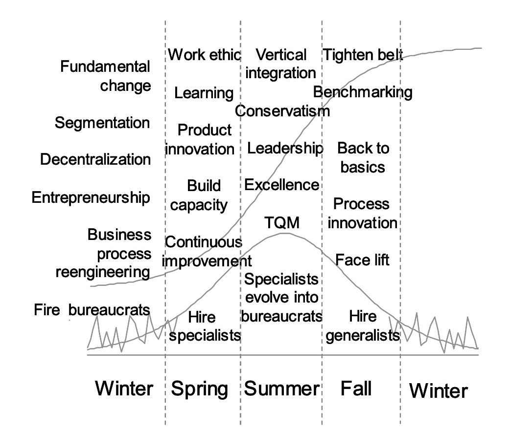
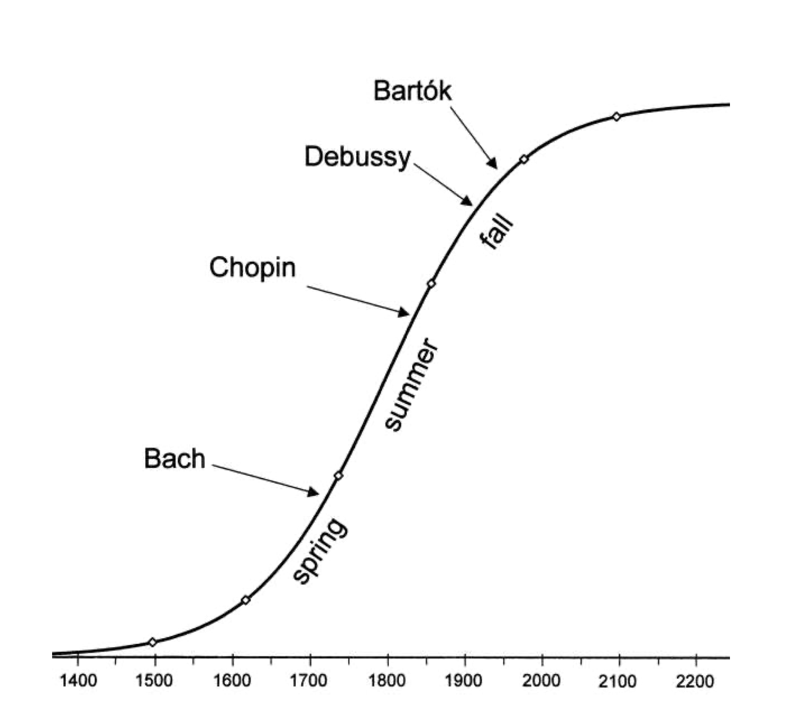
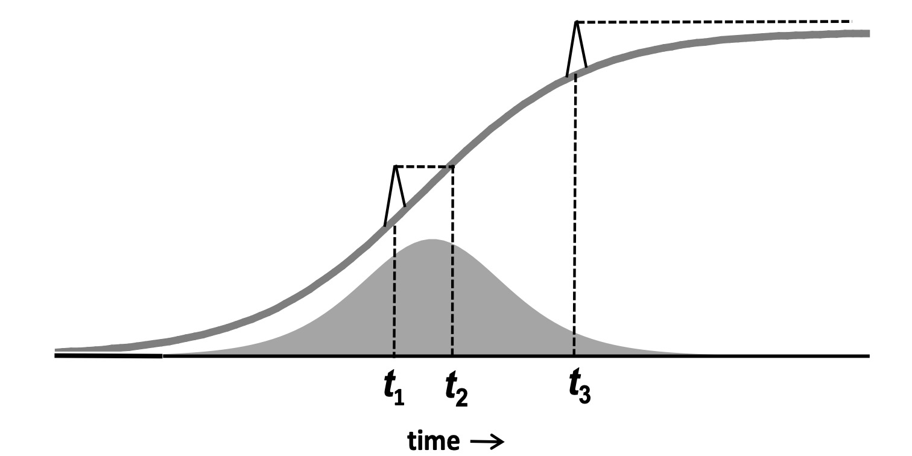
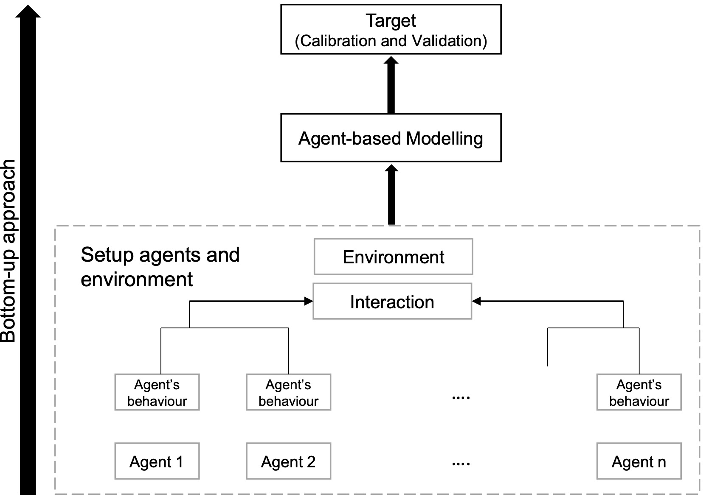

Theory {#theory}
======

Introduction to forecasting theory[^2] {#introduction_to_the_theory_of_forecasting}
--------------------------------------

The theory of forecasting is based on the premise that current and past
knowledge can be used to make predictions about the future. In
particular for time series, there is the belief that it is possible to
identify patterns in the historical values and successfully implement
them in the process of predicting future values. However, the exact
prediction of futures values is not expected. Instead, among the many
options for a forecast of a single time series at a future time period
are an expected value (known as a point forecast), a prediction
interval, a percentile and an entire prediction distribution. This set
of results collectively could be considered to be "the forecast". There
are numerous other potential outcomes of a forecasting process. The
objective may be to forecast an event, such as equipment failure, and
time series may play only a small role in the forecasting process.
Forecasting procedures are best when they relate to a problem to be
solved in practice. The theory can then be developed by understanding
the essential features of the problem. In turn, the theoretical results
can lead to improved practice.

In this introduction, it is assumed that forecasting theories are
developed as forecasting methods and models. A forecasting method is
defined here to be a predetermined sequence of steps that produces
forecasts at future time periods. Many forecasting methods, but
definitely not all, have corresponding stochastic models that produce
the same point forecasts. A stochastic model provides a data generating
process that can be used to produce prediction intervals and entire
prediction distributions in addition to point forecasts. Every
stochastic model makes assumptions about the process and the associated
probability distributions. Even when a forecasting method has an
underlying stochastic model, the model is not necessarily unique. For
example, the simple exponential smoothing method has multiple stochastic
models, including state space models that may or may not be
homoscedastic (i.e., possess constant variance). The combining of
forecasts from different methods has been shown to be a very successful
forecasting method. The combination of the corresponding stochastic
models, if they exist, is itself a model. Forecasts can be produced by a
process that incorporates new and/or existing forecasting
methods/models. Of course, these more complex processes would also be
forecasting methods/models.

Consideration of the nature of the variables and their involvement in
the forecasting process is essential. In univariate forecasting, the
forecasts are developed for a single time series by using the
information from the historical values of the time series itself. While
in multivariate forecasting, other time series variables are involved in
producing the forecasts, as in time series regression. Both univariate
and multivariate forecasting may allow for interventions (e.g., special
promotions, extreme weather). Relationships among variables and other
types of input could be linear or involve nonlinear structures (e.g.,
market penetration of a new technology). When an explicit functional
form is not available, methodologies such as simulation or artificial
neural networks might be employed. Theories from fields, such as
economics, epidemiology, and meteorology, can be an important part of
developing these relationships. Multivariate forecasting could also mean
forecasting multiple variables simultaneously (e.g., econometric
models).

The data or observed values for time series come in many different forms
that may limit or determine the choice of a forecasting method. In fact,
there may be no historical observations at all for the item of interest,
when judgmental methods must be used (e.g., time taken to complete
construction of a new airport). The nature of the data may well require
the development of a new forecasting method. The frequency of
observations can include all sorts of variations, such as every minute,
hourly, weekly, monthly, and yearly (e.g., the electricity industry
needs to forecast demand loads at hourly intervals as well as long term
demand for ten or more years ahead). The data could be composed of
everything from a single important time series to billions of time
series. Economic analysis often includes multiple variables, many of
which affect one another. Time series for businesses are likely to be
important at many different levels (e.g., stock keeping unit, common
ingredients, or common size container) and, consequently, form a
hierarchy of time series. Some or many of the values might be zero;
making the time series intermittent. The list of forms for data is
almost endless.

Prior to applying a forecasting method, the data may require
pre-processing. There are basic details, such as checking for accuracy
and missing values. Other matters might precede the application of the
forecasting method or be incorporated into the methods/models
themselves. The treatment of seasonality is such a case. Some
forecasting method/models require de-seasonalised time series, while
others address seasonality within the methods/models. Making it less
clear when seasonality is considered relative to a forecasting
method/model, some governmental statistical agencies produce forecasts
to extend time series into the future in the midst of estimating
seasonal factors (i.e., X-12 ARIMA).

Finally, it is extremely important to evaluate the effectiveness of a
forecasting method. The ultimate application of the forecasts provides
guidance in how to measure their accuracy. The focus is frequently on
the difference between the actual value and a point forecast for the
value. Many loss functions have been proposed to capture the "average"
of these differences. Prediction intervals and percentiles can be used
to judge the value of a point forecast as part of the forecast. On the
other hand, the quality of prediction intervals and prediction
distributions can themselves be evaluated by procedures and formulas
that have been developed (e.g., ones based on scoring rules). Another
assessment tool is judging the forecasts by metrics relevant to their
usage (e.g., total costs or service levels).

In the remaining subsections of section
§[2](#theory){reference-type="ref" reference="theory"},
forecasting theory encompasses both stochastic modelling and forecasting
methods along with related aspects.

Pre-processing data {#Preprocessing_time_series_data}
-------------------

### Box-Cox transformations[^3] {#BoxCox_Transformations}

A common practice in forecasting models is to transform the variable of
interest $y$ using the transformation initially proposed by
@BoxCox1964transformation_AP as $$y^{(\lambda)}=\begin{cases}
      (y^\lambda-1)/\lambda&\lambda\neq 0\\
      \log(y)&\lambda = 0
      \end{cases}\,.$$

The range of the transformation will be restricted in a way that depends
on the sign of $\lambda$, therefore @BickelDoksum1981transformation_AP
propose the following modification $$y^{(\lambda)}=\begin{cases}
      (|y|^\lambda sign(y_i)-1)/\lambda&\lambda\neq 0\\
      \log(y)&\lambda = 0
      \end{cases}\,,$$ which has a range from $(-\infty,\infty)$ for any
value of $\lambda$. For a recent review of the Box-Cox (and other
similar) transformations see
@AtkisonRianiCorbellini2021transformation_AP.

The initial motivation for the Box-Cox transformation was to ensure data
conformed to assumptions of normality and constant error variance that
are required for inference in many statistical models. The
transformation nests the log transformation when $\lambda=0$ and the
case of no transformation (up to an additive constant) when $\lambda=1$.
Additive models for $\log(y)$ correspond to multiplicative models on the
original scale of $y$. Choices of $\lambda$ between $0$ and $1$
therefore provide a natural continuum between multiplicative and
additive models. For examples of forecasting models that use either a
log or Box-Cox transformation see
§[2.3.5](#forecasting_for_multiple_seasonal_cycles){reference-type="ref"
reference="forecasting_for_multiple_seasonal_cycles"} and
§[2.3.6](#state_space_models){reference-type="ref"
reference="state_space_models"} and for applications see
§[3.2.5](#Promotional_forecasting){reference-type="ref"
reference="Promotional_forecasting"},
§[3.6.2](#Pandemics){reference-type="ref"
reference="Pandemics"}, and
§[3.8.4](#Call_arrival_forecasting){reference-type="ref"
reference="Call_arrival_forecasting"}.

The literature on choosing $\lambda$ is extensive and dates back to the
original @BoxCox1964transformation_AP paper - for a review see
@Sakia1992transformation_AP. In a forecasting context, a popular
method for finding $\lambda$ is given by
@Guerrero1993transformation_AP. The method splits the data into
blocks, computes the coefficient of variation within each block and then
computes the coefficent of variation again between these blocks. The
$\lambda$ that minimises this quantity is chosen.

Since the transformations considered here are monotonic, the forecast
quantiles of the transformed data will, when back-transformed, result in
the correct forecast quantiles in terms of the original data. As a
result finding prediction intervals in terms of the original data only
requires inverting the transformation. It should be noted though, that
prediction intervals that are symmetric in terms of the transformed data
will not be symmetric in terms of the original data. In a similar vein,
back-transformation of the forecast median of the transformed data
returns the forecast median in terms of the original data. For more on
using the median forecast see
§[2.12.2](#point_forecast_accuracy_measures){reference-type="ref"
reference="point_forecast_accuracy_measures"} and references
therein.

The convenient properties that apply to forecast quantiles, do not apply
to the forecast mean, something recognised at least since the work of
@GrangerNewbold1976transformation_AP. Back-transformation of the
forecast mean of the transformed data does not yield the forecast mean
of the original data, due to the non-linearity of the transformation.
Consequently forecasts on the original scale of the data will be biased
unless a correction is used. For some examples of bias correction
methods see
@GrangerNewbold1976transformation_AP, @Taylor1986retransformation_AP, @PankratzDudley1987transformation_AP and @Guerrero1993transformation_AP
and references therein.

The issues of choosing $\lambda$ and bias correcting are accounted for
in popular forecasting software packages. Notably, the method of
@Guerrero1993transformation_AP both for finding $\lambda$ and bias
correcting is implemented in the R packages *forecast* and *fable* (see
Appendix [B](#software){reference-type="ref" reference="software"}).

### Time series decomposition[^4] {#time_series_decomposition}

Time series decomposition is an important building block for various
forecasting approaches (see, for example,
§[2.3.3](#Theta_method_and_models){reference-type="ref"
reference="Theta_method_and_models"},
§[2.7.6](#Bagging_for_Time_Series){reference-type="ref"
reference="Bagging_for_Time_Series"}, and
§[3.8.3](#Traffic_flow_forecasting){reference-type="ref"
reference="Traffic_flow_forecasting"}) and a crucial tools for
statistical agencies. Seasonal decomposition is a way to present a time
series as a function of other time series, called components. Commonly
used decompositions are additive and multiplicative, where such
functions are summation and multiplication correspondingly. If logs can
be applied to time series, any additive decomposition method can serve
as multiplicative after applying log transformation to the data.

The simplest additive decomposition of a time series with single
seasonality comprises three components: trend, seasonal component, and
the "remainder". It is assumed that the seasonal component has a
repeating pattern (thus sub-series corresponding to every season are
smooth or even constant), the trend component describes the smooth
underlying mean and the remainder component is small and contains noise.

The first attempt to decompose time series into trend and seasonality is
dated to 1847 when @ad_buys1847changements performed decomposition
between trend and seasonality, modelling the trend by a polynomial and
the seasonality by dummy variables. Then, in 1884 @ad_Poynting1884
proposed price averaging as a tool for eliminating trend and seasonal
fluctuations. Later, his approach was extended by
@ad_hooker1901suspension, @ad_spencer1904graduation and
@ad_anderson1914nochmals. @ad_copeland1915statistical was the first who
attempted to extract the seasonal component, and @ad_macaulay1930smooth
proposed a method which is currently considered "classical".

The main idea of this method comes from the observation that averaging a
time series with window size of the time series seasonal period leaves
the trend almost intact, while effectively removes seasonal and random
components. At the next step, subtracting the estimated trend from the
data and averaging the result for every season gives the seasonal
component. The rest becomes the remainder.

Classical decomposition led to a series of more complex decomposition
methods such as X-11 [@ad_shishkin1967x], X-11-ARIMA
[@ad_dagum1988x11arima; @ad_ladiray2001seasonal], X-12-ARIMA
[@ad_findley1998new], and X-13-ARIMA-SEATS [@ad_findley2005some]; see
also
§[2.3.4](#autoregressive_integrated_moving_average_models){reference-type="ref"
reference="autoregressive_integrated_moving_average_models"}.

Seasonal trend decomposition using Loess [STL: @ad_cleveland1990stl]
takes iterative approach and uses smoothing to obtain a better estimate
of the trend and seasonal component at every iteration. Thus, starting
with an estimate of the trend component, the trend component is
subtracted from the data, the result is smoothed along sub-series
corresponding to every season to obtain a "rough" estimate of the
seasonal component. Since it might contain some trend, it is averaged to
extract this remaining trend, which is then subtracted to get a
detrended seasonal component. This detrended seasonal component is
subtracted from the data and the result is smoothed again to obtain a
better estimate of the trend. This cycle repeats a certain number of
times.

Another big set of methods use a single underlining statistical model to
perform decomposition. The model allows computation of confidence and
prediction intervals naturally, which is not common for iterative and
methods involving multiple models. The list of such methods includes
TRAMO/SEATS procedure [@ad_monsell2003toward], the BATS and TBATS models
[@de2011forecasting_DKB], various structural time series model
approaches [@Harvey1990-mt_JRTA; @ad_Commandeur2010], and the recently
developed seasonal-trend decomposition based on regression [STR:
@ad_dokumentov_2017; @ad_stR]; see also
§[2.3.2](#time_series_regression_models){reference-type="ref"
reference="time_series_regression_models"}. The last mentioned is
one of the most generic decomposition methods allowing presence of
missing values and outliers, multiple seasonal and cyclic components,
exogenous variables with constant, varying, seasonal or cyclic
influences, arbitrary complex seasonal schedules. By extending time
series with a sequence of missing values the method allows forecasting.

### Anomaly detection and time series forecasting[^5] {#Anomaly_detection_and_time_series_forecasting}

Temporal data are often subject to uncontrolled, unexpected
interventions, from which various types of anomalous observations are
produced. Owing to the complex nature of domain specific problems, it is
difficult to find a unified definition for an anomaly and mostly
application-specific [@unwin2019multivariate_PDT]. In time series and
forecasting literature, an anomaly is mostly defined with respect to a
specific context or its relation to past behaviours. The idea of a
context is induced by the structure of the input data and the problem
formulation
[@chandola2007outlier; @hand2009mining_PDT; @chandola2009anomaly].
Further, anomaly detection in forecasting literature has two main
focuses, which are conflicting in nature: one demands special attention
be paid to anomalies as they can be the main carriers of significant and
often critical information such as fraud activities, disease outbreak,
natural disasters, while the other down-grades the value of anomalies as
it reflects data quality issues such as missing values, corrupted data,
data entry errors, extremes, duplicates and unreliable values
[@talagala2020anomaly_PDT].

In the time series forecasting context, anomaly detection problems can
be identified under three major umbrella themes: detection of (*i*)
contextual anomalies (point anomalies, additive anomalies) within a
given series, (*ii*) anomalous sub-sequences within a given series, and
(*iii*) anomalous series within a collection of series
[@gupta2013outlier_PDT; @talagala2020anomalyoddstream_PDT]. According to
previous studies forecast intervals are quite sensitive to contextual
anomalies and the greatest impact on forecast are from anomalies
occurring at the forecast origin [@chen1993forecasting_PDT].

The anomaly detection methods in forecasting applications can be
categorised into two groups: (*i*) model-based approaches and (*ii*)
feature-based approaches. Model-based approaches compare the predicted
values with the original data. If the deviations are beyond a certain
threshold, the corresponding observations are treated as anomalies
[@luo2018real_PDT; @luo2018benchmarking_PDT; @sobhani2020temperature_PDT].
Contextual anomalies and anomalous sub-sequences are vastly covered by
model-based approaches. Limitations in the detectability of anomalous
events depend on the input effects of external time series. Examples of
such effects are included in SARIMAX models for polynomial approaches
(see also
§[2.3.4](#autoregressive_integrated_moving_average_models){reference-type="ref"
reference="autoregressive_integrated_moving_average_models"}). In
nonlinear contexts an example is the generalised Bass model
[@bass:94_RGuseo] for special life cycle time series with external
control processes (see
§[2.3.18](#Innovation_diffusion_models){reference-type="ref"
reference="Innovation_diffusion_models"}). SARMAX with nonlinear
perturbed mean trajectory as input variable may help separating the mean
process under control effects from anomalies in the residual process.
Feature-based approaches, on the other hand, do not rely on predictive
models. Instead, they are based on the time series features measured
using different statistical operations (see
§[2.7.4](#Feature_based_time_series_forecasting){reference-type="ref"
reference="Feature_based_time_series_forecasting"}) that
differentiate anomalous instances from typical behaviours
[@Fulcher2014_YK]. Feature-based approaches are commonly used for
detecting anomalous time series within a large collection of time
series. Under this approach, it first forecasts an anomalous threshold
for the systems typical behaviour and new observations are identified as
anomalies when they fall outside the bounds of the established anomalous
threshold [@talagala2019feature_PDT; @talagala2020anomalyoddstream_PDT].
Most of the existing algorithms involve a manual anomalous threshold. In
contrast, @burridge2006additive_PDT and
@talagala2020anomalyoddstream_PDT use extreme value theory based
data-driven anomalous thresholds. Approaches to the problem of anomaly
detection for temporal data can also be divided into two main scenarios:
(*i*) batch processing and (*ii*) data streams. The data stream scenario
poses many additional challenges, due to nonstationarity, large volume,
high velocity, noisy signals, incomplete events and online support
[@luo2018real_PDT; @talagala2020anomalyoddstream_PDT].

The performance evaluation of the anomaly detection frameworks is
typically done using confusion matrices
[@luo2018real_PDT; @sobhani2020temperature_PDT]. However, these measures
are not enough to evaluate the performance of the classifiers in the
presence of imbalanced data [@hossin2015review_PDT]. Following
@ranawana2006optimized_PDT and @talagala2019feature_PDT,
@leigh2019framework_PDT have used some additional measures such as
negative predictive value, positive predictive value and optimised
precision to evaluate the performance of their detection algorithms.

### Robust handling of outliers in time series forecasting[^6] {#Robust_handling_of_outliers}

Estimators of time series processes can be dramatically affected by the
presence of few aberrant observations which are called differently in
the time series literature: outliers, spikes, jumps, extreme
observations (see
§[2.2.3](#Anomaly_detection_and_time_series_forecasting){reference-type="ref"
reference="Anomaly_detection_and_time_series_forecasting"}). If
their presence is neglected, coefficients could be biasedly estimated.
Biased estimates of ARIMA processes will decrease the efficiency of
predictions [@Bianco2001-ma_LG]. Moreover, as the optimal predictor of
ARIMA models (see
§[2.3.4](#autoregressive_integrated_moving_average_models){reference-type="ref"
reference="autoregressive_integrated_moving_average_models"}) is a
linear combination of observed units, the largest coefficients
correspond to observations near the forecast origin and the presence of
outliers among these units can severely affect the forecasts. Proper
preliminary analysis of possible extreme observations is an unavoidable
step, which should be carried out before any time series modelling and
forecasting exercise (see
§[2.3.9](#Forecasting_with_many_variables){reference-type="ref"
reference="Forecasting_with_many_variables"}). The issue was first
raised in the seminal paper by [@Fox1972-da_LG], who suggests a
classification of outliers in time series, separating additive outliers
(AO) from innovation outliers (IO). The influence of different types of
outliers on the prediction errors in conditional mean models (ARIMA
models) is studied by @chen1993forecasting_PDT [@Chen1993-vw_LG] and @Ledolter1989-oy_LG [@Ledolter1991-er_LG], while the GARCH context (see
also §[2.3.11](#arch_garch_models){reference-type="ref"
reference="arch_garch_models"}) is explored by @Franses1999-gl_LG
and @Catalan2007-bi_LG. @Abraham1979-dh_LG propose a Bayesian model
which reflects the presence of outliers in time series and allows to
mitigate their effects on estimated parameters and, consequently,
improve the prediction ability. The main idea is to use a probabilistic
framework allowing for the presence of a small group of discrepant
units.

A procedure for the correct specification of models, accounting for the
presence of outliers, is introduced by @Tsay1986-yb_LG relying on
iterative identification-detection-removal of cycles in the observed
time series contaminated by outliers. The same issue is tackled by
@Abraham1989-nj_LG: in this work non-influential outliers are
separated from influential outliers which are observations with high
residuals affecting parameter estimation. Tsay's procedure has been
later modified @Balke1993-yb_LG to effectively detect time series
level shifts. The impulse- and step-indicator saturation approach is
used by @Marczak2016-rj_LG for detecting additive outliers and level
shifts estimating structural models in the framework of nonstationary
seasonal series. They find that timely detection of level shifts located
towards the end of the series can improve the prediction accuracy.

All these works are important because outlier and influential
observations detection is crucial for improving the forecasting
performance of models. The robust estimation of model parameters is
another way to improve predictive accuracy without correcting or
removing outliers (see
§[3.4.2](#Electricity_price_forecasting){reference-type="ref"
reference="Electricity_price_forecasting"}, for the application on
energy data). @Sakata1998-yp_LG introduce a new two-stage estimation
strategy for the conditional variance based on Hampel estimators and
S-estimators. @Park2002-qo_LG proposes a robust GARCH model, called
RGARCH exploiting the idea of least absolute deviation estimation. The
robust approach is also followed for conditional mean models by
@Gelper2009-ff_LG who introduce a robust version of the exponential
and Holt-Winters smoothing technique for prediction purposes and by
@Cheng2015-ly_LG who propose an outlier resistant algorithm developed
starting from a new synthetic loss function. Very recently,
@Beyaztas2019-qm_LG have introduced a robust forecasting procedure
based on weighted likelihood estimators to improve point and interval
forecasts in functional time series contaminated by the presence of
outliers.

### Exogenous variables and feature engineering[^7] {#Exogenous_variables_and_feature_engineering}

Exogenous variables are those included in a forecasting system because
they add value but are not being predicted themselves, and are sometimes
called 'features' (see
§[2.7.4](#Feature_based_time_series_forecasting){reference-type="ref"
reference="Feature_based_time_series_forecasting"}). For example, a
forecast of county's energy demand may be based on the recent history of
demand (an *endogenous* variable), but also weather forecasts, which are
exogenous variables. Many time series methods have extensions that
facilitate exogenous variables, such as autoregression with exogenous
variables (ARX). However, it is often necessary to prepare exogenous
data before use, for example so that it matches the temporal resolution
of the variable being forecast (hourly, daily, and so on).

Exogenous variables may be numeric or categorical, and may be numerous.
Different types of predictor present different issues depending on the
predictive model being used. For instance, models based on the
variable's absolute value can be sensitive to extreme values or
skewness, whereas models based on the variable value's rank, such as
tree-based models, are not. Exogenous variables that are correlated with
one another also poses a challenge for some models, and techniques such
as regularisation and partial leased squares have been developed to
mitigate this.

Interactions between exogenous variables my also be important when
making predictions. For example, crop yields depend on both rainfall and
sunlight: one without the other or both in excess will result in low
yields, but the right combination will result in high yields.
Interactions may be included in linear models by including product of
the two interacting exogenous as a feature in the model. This is an
example of feature engineering, the process of creating new features
based on domain knowledge or exploratory analysis of available data. In
machine learning (see
§[2.7.10](#machine_Learning){reference-type="ref"
reference="machine_Learning"}), many features may be created by
combining exogenous variables speculatively and passed to a selection
algorithm to identify those with predictive power. Combinations are not
limited to products, or only two interacting variables, and where many
exogenous variables are available, could include summary statistics
(mean, standard deviation, range, quantiles\...) of groups of variables.

Where exogenous variables are numerous dimension reduction may be
applied to reduce the number of features in a forecasting model (see
also §[2.5.3](#Variable_Selection){reference-type="ref"
reference="Variable_Selection"}). Dimension reduction transforms
multivariate data into a lower dimensional representation while
retaining meaningful information about the original data. Principal
component analysis (PCA) is a widely used method for linear dimension
reduction, and non-linear alternatives are also available. PCA is useful
when the number of candidate predictors is greater than the number of
time series observations, as is often the case in macroeconomic
forecasting [@Stock2002_JB]. It is routinely applied in applications
from weather to sales forecasting. In retail forecasting, for example,
past sales of thousands of products may be recorded but including them
all as exogenous variables in the forecasting model for an individual
product may be impractical. Dimension reduction offers an alternative to
only using a subset of the available features.

Preparation of data for forecasting tasks is increasingly important as
the volume of available data is increasing in many application areas.
Further details and practical examples can be found in @MaxKuhn2019_JB
and @Albon2018_JB among other texts in this area. For deeper technical
discussion of a range of non-linear dimension reduction algorithms,
see @Hastie2009_JB.

Statistical and econometric models {#Statistical_and_econometric_models}
----------------------------------

### Exponential smoothing models[^8] {#exponential_smoothing_models}

Exponential smoothing is one of the workhorses of business forecasting.
Despite the many advances in the field, it is always a tough benchmark
to bear in mind. The development of exponential smoothing dates back to
1944, where Robert G. Brown through a mechanical computing device
estimated key variables for fire-control on the location of submarines
[@Gardner1985-jm_JRTA]. More details about the state of the art of
exponential smoothing can be found in @Gardner2006-bv_JRTA.

The idea behind exponential smoothing relies on the weighted average of
past observations, where that weight decreases exponentially as one
moves away from the present observations. The appropriate exponential
smoothing method depends on the components that appear in the time
series. For instance, in case that no clear trend or seasonal pattern is
present, the simplest form of exponential smoothing methods known as
Simple (or Single) Exponential Smoothing (SES) is adequate, such as:
$$f_{t+1} = \alpha y_t + (1-\alpha)f_t$$

In some references, is also known as Exponentially Weighted Moving
Average [@Harvey1990-mt_JRTA]. The formula for SES can be obtained from
minimising the discounted least squares error function and expressing
the resulting equation in a recursive form [@Harvey1990-mt_JRTA]. If
observations do not have the same weight, the ordinary least squares
cannot be applied. On the other hand, the recursive form is very
well-suited for saving data storage.

In order to use SES, we need to estimate the initial forecast ($f_1$)
and the exponential smoothing parameter ($\alpha$). Traditionally, the
initialisation was done by using either ad hoc values or a heuristic
scheme [@Hyndman2008-iu_JRTA], however nowadays it is standard to
estimate both the initial forecast and the optimal smoothing parameter
by minimising the sum of squares of the one-step ahead forecast errors.
The estimation of the smoothing parameter usually is restricted to
values between 0 and 1. Once SES is defined, the method only provides
point forecasts, i.e., forecasts of the mean. Nonetheless, it is of
vital importance for many applications to provide density
(probabilistic) forecasts. To that end, @Hyndman2002-jp_JRTA extended
exponential smoothing methods under State Space models using a single
source of error (see
§[2.3.6](#state_space_models){reference-type="ref"
reference="state_space_models"}) to equip them with a statistical
framework capable of providing future probability distributions. For
example, SES can be expressed in the State Space as a local level model:
$$\begin{aligned}
\label{eq:subtasks}
y_t &=& \ell_{t-1} + \epsilon_t, \nonumber \\
\ell_t &=& \ell_{t-1} + \alpha \epsilon_t. \nonumber \end{aligned}$$

where the state is the level ($\ell$) and $\epsilon$ is the Gaussian
noise. Note the difference between traditional exponential smoothing
methods and exponential smoothing models (under the state space
approach). The former only provide point forecasts, meanwhile the latter
also offers probabilistic forecasts, which obviously includes prediction
intervals. In addition, some exponential smoothing models can be
expressed an ARIMA models (see also
§[2.3.4](#autoregressive_integrated_moving_average_models){reference-type="ref"
reference="autoregressive_integrated_moving_average_models"}).

So far, we have introduced the main exponential smoothing using SES,
however real time series can include other components as trends,
seasonal patterns, cycles, and the irregular (error) component. In this
sense, the exponential smoothing version capable of handling local
trends is commonly known as Holt's method [@Holt2004-zg originally
published in 1957] and, if it also models a seasonality component, which
can be incorporated in an additive or multiplicative fashion, it is
called Holt-Winters method [@Winters1960-sd]. Exponential smoothing
models have been also extended to handle multiple seasonal cycles; see
§[2.3.5](#forecasting_for_multiple_seasonal_cycles){reference-type="ref"
reference="forecasting_for_multiple_seasonal_cycles"}.

Fortunately, for various combinations of time series patterns (level
only, trended, seasonal, trended and seasonal) a particular exponential
smoothing can be chosen. @Pegels1969-jh_JRTA proposed a first
classification of exponential smoothing methods, later extended by
@Gardner1985-jm_JRTA and @Taylor2003-ix_JRTA. The state space
framework mentioned above, developed by @Hyndman2002-jp_JRTA, allowed
to compute the likelihood for each exponential smoothing model and,
thus, model selection criteria such as AIC could be used to
automatically identify the appropriate exponential smoothing model. Note
that the equivalent state space formulation was derived by using a
single source of error instead of a multiple source of error
[@Harvey1990-mt_JRTA]. @Hyndman2008-iu_JRTA utilised the notation
(E,T,S) to classify the exponential smoothing models, where those
letters refer to the following components: Error, Trend, and
Seasonality. This notation has gained popularity because the widely-used
*forecast* package [@Hyndman2020forecast_CB], recently updated to the
*fable* package, for R statistical software, and nowadays exponential
smoothing is frequently called ETS.

### Time-series regression models[^9] {#time_series_regression_models}

The key idea of linear regression models is that a target (or dependent,
forecast, explained, regress) variable, $y$, i.e., a time series of
interest, can be forecast through other regressor (or independent,
predictor, explanatory) variables, $x$, i.e., time series or features (see
§[2.2.5](#Exogenous_variables_and_feature_engineering){reference-type="ref"
reference="Exogenous_variables_and_feature_engineering"}), assuming
that a linear relationship exists between them, as follows

$$y_t = \beta_{0} + \beta_{1} x_{1_{t}} + \beta_{2} x_{2_{t}} + \dots + \beta_{k} x_{k_{t}} + e_t,$$

where $e_t$ is the residual error of the model at time $t$, $\beta_{0}$
is a constant, and coefficient $\beta_{i}$ is the effect of regressor
after taking into account the effects of all $k$ regressors involved in
the model. For example, daily product sales may be forecast using
information related with past sales, prices, advertising, promotions,
special days, and holidays (see also
§[3.2.4](#Retail_sales_forecasting){reference-type="ref"
reference="Retail_sales_forecasting"}).

In order to estimate the model, forecasters typically minimise the sum
of the squared errors (ordinary least squares estimation, OLS),
$\text{SSE}=\sum_{t=1}^{n} e_t^2$, using the observations available for
fitting the model to the data [@OrdWessex] and setting the gradient
$\frac{\partial \text{SSE}}{\partial \beta_{i}}$ equal to zero. If the
model is simple, consisting of a single regressor, then two coefficients
are computed, which are the slope (coefficient of the regressor) and the
intercept (constant). When more regressor variables are considered, the
model is characterised as a multiple regression one and additional
coefficients are estimated.

A common way to evaluate how well a linear regression model fits the
target series, reporting an average value of $\bar{y}$, is through the
coefficient of determination,
$R^2=\frac{\sum_{t=1}^{n} (f_t-\bar{y})^2}{\sum_{t=1}^{n} (y_t-\bar{y})^2}$,
indicating the proportion of variation in the dependent variable
explained by the model. Values close to one indicate sufficient
goodness-of-fit, while values close to zero insufficient fitting.
However, goodness-of-fit should not be confused with forecastability
[@HarrellSpringer]. When the complexity of the model is increased, i.e.,
more regressors are considered, the value of the coefficient will also
rise, even if such additions lead to overfitting (see
§[2.5.2](#Model_complexity){reference-type="ref"
reference="Model_complexity"}). Thus, regression models should be
evaluated using cross-validation approaches (see
§[2.5.5](#Cross_validation_for_time_series_data){reference-type="ref"
reference="Cross_validation_for_time_series_data"}), approximating
the post-sample accuracy of the model, or measures that account for
model complexity, such as information criteria (e.g., AIC, AICc, and
BIC) and the adjusted coefficient of determination,
$\bar{R}^2 = 1-(1-R^2)\frac{n-1}{n-k-1}$ [@JamesSpringer]. Other
diagnostics are the standard deviation of the residuals and the t-values
of the regressors. Residual standard error,
$\sigma_e = \sqrt{\frac{\sum_{t=1}^{n} (y_t-f_t)^2}{n-k-1}}$, summarises
the average error produced by the model given the number of regressors
used, thus accounting for overfitting. The t-values measure the impact
of excluding regressors from the model in terms of error, given the
variation in the data, thus highlighting the importance of the
regressors.

To make sure that the produced forecasts are reliable, the correlation
between the residuals and the observations of the regressors must be
zero, with the former displaying also insignificant autocorrelation.
Other assumptions suggest that the residuals should be normally
distributed with an average value of zero and that their variability
should be equal across time (no heteroscedasticity present).
Nevertheless, in practice, it is rarely necessary for residuals to be
normally distributed in order for the model to produce accurate results,
while the homoscedasticity assumption becomes relevant mostly when
computing prediction intervals. If these assumptions are violated, that
may mean that part of the variance of the target variable has not been
explained by the model and, therefore, that other or more regressors are
needed. In case of non-linear dependencies between the target and the
regressor variables, data power transformations (see
§[2.2.1](#BoxCox_Transformations){reference-type="ref"
reference="BoxCox_Transformations"}) or machine learning approaches
can be considered (see
§[2.7.10](#machine_Learning){reference-type="ref"
reference="machine_Learning"}).

Apart from time series regressors, regression models can also exploit
categorical (dummy or indicator) variables [@hyndman2018Forecasting_CB]
which may e.g., inform the model about promotions, special events, and
holidays (binary variables), the day of the week or month of the year
(seasonal dummy variables provided as one-hot encoded vectors), trends
and structural changes, and the number of trading/working days included
in the examined period. In cases where the target series is long and
displays complex seasonal patterns, additional regressors such as
Fourier series and lagged values of both the target and the regressor
variables may become useful. Moreover, when the number of the potential
regressor variables is significant compared to the observations
available for estimating the respective coefficients (see
§[2.7.1](#Forecasting_with_Big_Data){reference-type="ref"
reference="Forecasting_with_Big_Data"}), step-wise regression
[@JamesSpringer] or dimension reduction and shrinkage estimation methods
(see §[2.5.3](#Variable_Selection){reference-type="ref"
reference="Variable_Selection"}) can be considered to facilitate
training and avoid overfitting. Finally, mixed data sampling (MIDAS)
regression models are a way of allowing different degrees of temporal
aggregation for the regressors and predictand (see also
§[2.10.2](#temporal_aggregation){reference-type="ref"
reference="temporal_aggregation"} for further discussions on
forecasting with temporal aggregation).

### Theta method and models[^10] {#Theta_method_and_models}

In the age of vast computing power and computational intelligence, the
contribution of simple forecasting methods is possibly not *en vogue*;
the implementation of complicated forecasting systems becomes not only
expedient but possibly desirable. Nevertheless forecasting, being a
tricky business, does not always favour the complicated or the
computationally intensive. Enter the theta method. From its beginnings
20 years back in @Assimakopoulos2000-hj to recent advances in the
monograph of @Nikolopoulos2019-sp_DT, to other work in-between and
recently too, the theta method has emerged as not only a powerfully
simple but also enduring method in modern time series forecasting. The
reader will benefit by reviewing
§[2.3.1](#exponential_smoothing_models){reference-type="ref"
reference="exponential_smoothing_models"},
§[2.3.4](#autoregressive_integrated_moving_average_models){reference-type="ref"
reference="autoregressive_integrated_moving_average_models"}, and
§[2.3.9](#Forecasting_with_many_variables){reference-type="ref"
reference="Forecasting_with_many_variables"} for useful background
information.

The original idea has been now fully explained and understood and, as
@Nikolopoulos2019-sp_DT have shown, even the revered AR(1) model
forecast is indeed a theta forecast -- and it has already been shown by
@Hyndman2003-ea_DT that the theta method can represent SES (with a
drift) forecasts as well. In its simplest form the method generates a
forecast from a linear combination of the last observation and some form
of "trend" function, be that a constant, a linear trend, a
non-parametric trend or a non-linear trend. In summary, and under the
conditions outlined extensively in @Nikolopoulos2019-sp_DT, the theta
forecasts can be expressed as functions of the "theta line":
$$Q_t(\theta) = \theta y_t + (1-\theta)T_{t+1}$$

where $T_{t+1}$ is the trend function, variously defined depending on
the modelling approach and type of trend one is considering in
applications. It can be shown that the, univariate, theta forecasts can
given either as $$f_{t+1|t} = y_t + \Delta Q_t(\theta)$$

when the trend function is defined as $T_{t+1}= \mu t$ and as
$$f_{t+1|t} = Q_t(\theta) + \theta \Delta \mathbb{E}(T_{t+1})$$

when the trend function is left otherwise unspecified. The choice of the
weight parameter $\theta$ on the linear combination of the theta line,
the choice and number of trend functions and their nature and other
aspects on expanding the method have been recently researched
extensively.

The main literature has two strands. The first one details the
probabilistic background of the method and derives certain theoretical
properties, as in @Hyndman2003-ea_DT, @Thomakos2012-em_DT,  @Thomakos2015-ku_DT and a number of new
theoretical results in @Nikolopoulos2019-sp_DT. The work of Thomakos
and Nikolopoulos provided a complete analysis of the theta method under
the unit root data generating process, explained its success in the M3
competition [@Makridakis2000-ty], introduced the multivariate theta
method and related it to cointegration and provided a number of other
analytical results for different trend functions and multivariate
forecasting. The second strand of the literature expands and details
various implementation (including hybrid approaches) of the method, as
in the theta approach in supply chain planning of
@Nikolopoulos2012-zy_DT, the optimised theta models and their
relationship with state space models in @Fioruci2015-gf_DT and
@Fiorucci2016-ak_DT, hybrid approaches as in @Theodosiou2011-mf_DT
and @Spiliotis2019-cd_DT, to the very latest generalised theta method
of @Spiliotis2020-jc_DT. These are major methodological references in
the field, in addition to many others of pure application of the method.

The theta method is also part of the family of adaptive models/methods,
and a simple example illustrates the point: the AR(1) forecast or the
SES forecast are both theta forecasts but they are also both adaptive
learning forecasts, as in the definitions of the recent work by
@Kyriazi2019-md_DT. As such, the theta forecasts contain the basic
building blocks of successful forecasts: simplicity, theoretical
foundations, adaptability and performance enhancements. Further research
on the usage of the theta method within the context of adaptive learning
appears to be a natural next step. In the context of this section, see
also
§[2.3.16](#Robust_equilibrium_correction_forecasting_devices){reference-type="ref"
reference="Robust_equilibrium_correction_forecasting_devices"} on
equilibrium correcting models and forecasts.

Given the simplicity of its application, the freely available libraries
of its computation, its scalability and performance, the theta method
should be considered as a critical benchmark henceforth in the
literature -- no amount of complexity is worth its weight if it cannot
beat a single Greek letter!

### Autoregressive integrated moving average (ARIMA) models[^11] {#autoregressive_integrated_moving_average_models}

Time series models that are often used for forecasting are of the
autoregressive integrated moving average class [ARIMA --
@Box1976-af_SM]. The notation of an ARIMA($p$, $d$, $q$) model for a
time series $y_t$ is
$$(1 - \phi_1L - \dots - \phi_pL^p)(1-L)^d y_t = c + (1 + \theta_1L + \dots + \theta_qL^q)+\epsilon_t,$$

where the lag operator $L$ is defined by $L^k y_t=y_{t-k}$. The
$\epsilon_t$ is a zero-mean uncorrelated process with common variance
$\sigma_\epsilon^2$. Some exponential smoothing models (see
§[2.3.1](#exponential_smoothing_models){reference-type="ref"
reference="exponential_smoothing_models"}) can also be written in
ARIMA format, where some ETS models assume that $d=1$ or $d=2$. For
example, SES is equivalent to ARIMA(0,1,1) when $\theta_1 = \alpha - 1$.

The parameters in the ARIMA model can be estimated using Maximum
Likelihood, whereas for the ARIMA($p$, $d$, 0) Ordinary Least Squares
can be used. The iterative model-building process [@Franses2014-kl_PHF]
requires the determination of the values of $p$, $d$, and $q$. Data
features as the empirical autocorrelation function and the empirical
partial autocorrelation function can be used to identify the values of
$p$ and $q$, in case of low values of $p$ and $q$. Otherwise, in
practice one relies on the well-known information criteria like AIC and
BIC (see §[2.5.4](#Model_Selection){reference-type="ref"
reference="Model_Selection"}). The function `auto.arima` of the
*forecast* package [@Hyndman2020forecast_CB] for R statistical software
compares models using information criteria, and has been found to be
very effective and increasingly being used in ARIMA modelling.

Forecasts from ARIMA models are easy to make. And, at the same time,
prediction intervals can be easily computed. Take for example the
ARIMA(1,0,1) model:
$$y_t = c + \phi_1 y_{t-1} + \epsilon_t + \theta_1 \epsilon_{t-1}.$$ The
one-step-ahead forecast from forecast origin $n$ is
$f_{n+1 | n} = c + \phi_1 y_n + \theta_1 \epsilon_n$ as the expected
value $E(\epsilon_{n+1}) = 0$. The forecast error is
$y_{n+1} - f_{n+1 | n} = \epsilon_{n+1}$ and, hence, the forecast error
variance is $\sigma_\epsilon^2$. The two-steps-ahead forecast from $n$
is $f_{n+2 | n} = c + \phi_1 f_{n+1 | n}$ with the forecast error equal
to $\epsilon_{n+2}+\phi_1 \epsilon_{n+1}$ and the forecast error
variance $(1+\phi_1^2)\sigma_\epsilon^2$. These expressions show that
the creation of forecasts and forecast errors straightforwardly follow
from the model expressions, and hence can be automated if necessary.

An important decision when using an ARIMA model is the choice for the
value of $d$. When $d=0$, the model is created for the levels of the
time series, that is, $y_t$. When $d=1$, there is a model for
$(1-L)y_t$, and the data need to be differenced prior to fitting an ARMA
model. In some specific but rare cases, $d=2$. The decision on the value
of d is usually based on so-called tests for unit roots
[@Dickey1979-cj_PHF; @Dickey1987-nd_PHF]. Under the null hypothesis that
$d=1$, the data are non-stationary, and the test involves non-standard
statistical theory [@Phillips1987-ak_PHF]. One can also choose to make
$d=0$ as the null hypothesis
[@Kwiatkowski1992-lb_PHF; @Hobijn2004-lt_PHF]. The power of unit root
tests is not large, and in practice one often finds signals to consider
$d=1$ [@Nelson1982-hc_PHF].

For seasonal data, like quarterly and monthly time series, the ARIMA
model can be extended to Seasonal ARIMA (SARIMA) models represented by
ARIMA($p$, $d$, $q$)($P$, $D$, $Q$)$_s$, where $P$, $D$, and $Q$ are the
seasonal parameters and the $s$ is the periodicity. When $D = 1$, the
data are transformed as $(1-L^s)y_t$. It can also be that $D = 0$ and
$d = 1$, and then one can replace $c$ by
$c_1 D_{1,t} + c_2 D_{2,t} + \dots + c_s D_{s,t}$ where the $D_{i,t}$
with $i = 1, 2, \dots, s$ are seasonal dummies. The choice of $D$ is
based on tests for so-called seasonal unit roots
[@Hylleberg1990-wm_PHF; @Franses1991-sw_PHF; @Ghysels1994-dd_PHF].

Another popular extension to ARIMA models is called ARIMAX, implemented
by incorporating additional exogenous variables (regressors) that are
external to and different from the forecast variable. An alternative to
ARIMAX is the use of regression models (see
§[2.3.2](#time_series_regression_models){reference-type="ref"
reference="time_series_regression_models"}) with ARMA errors.

### Forecasting for multiple seasonal cycles[^12] {#forecasting_for_multiple_seasonal_cycles}

With the advances in digital data technologies, data is recorded more
frequently in many sectors such as energy [@wang2016electric_BRT and
§[3.4](#Energy){reference-type="ref" reference="Energy"}],
healthcare [@whitt2019forecasting_BRT and
[3.6.1](#Heathcare){reference-type="ref"
reference="Heathcare"}], transportation [@gould2008forecasting_BRT],
and telecommunication [@meade2015forecasting_BRT]. This often results in
time series that exhibit multiple seasonal cycles (MSC) of different
lengths. Forecasting problems involving such series have been
increasingly drawing the attention of both researchers and practitioners
leading to the development of several approaches.

Multiple Linear Regression (MLR) is a common approach to model series
with MSC [@kamisan2018load_BRT; @rostami2020anticipating_BRT]; for an
introduction on time-series regression models, see
§[2.3.2](#time_series_regression_models){reference-type="ref"
reference="time_series_regression_models"}. While MLR is fast,
flexible, and uses exogenous regressors, it does not allow to decompose
components and change them over time. Building on the foundation of the
regression, Facebook introduced Prophet [@taylor2018forecasting_BRT], an
automated approach that utilises the Generalised Additive Model
[@hastie1990generalized_BRT]. Although the implementation of Prophet may
be less flexible, it is easy to use, robust to missing values and
structural changes, and can handles outliers well.

Some studies have extended the classical ARIMA (see
§[2.3.4](#autoregressive_integrated_moving_average_models){reference-type="ref"
reference="autoregressive_integrated_moving_average_models"}) and
Exponential Smoothing (ETS; see
§[2.3.1](#exponential_smoothing_models){reference-type="ref"
reference="exponential_smoothing_models"}) methods to accommodate
MSC. Multiple/multiplicative Seasonal ARIMA (MSARIMA) model is an
extension of ARIMA for the case of MSC [@taylor2003short_BRT]. MSARIMA
allows for exogenous regressors and terms can evolve over time, however,
it is not flexible, and the computational time is high.
@svetunkov2020state_BRT introduced the Several Seasonalities ARIMA
(SSARIMA) model which constructs ARIMA in a state-space form with
several seasonalities. While SSARIMA is flexible and allows for
exogenous regressors, it is computationally expensive, especially for
high frequency series.

@taylor2003short_BRT introduced Double Seasonal Holt-Winters (DSHW) to
extend ETS for modelling daily and weekly seasonal cycles. Following
that, @taylor2010exponentially_DKB proposed a triple seasonal model to
consider the intraday, intraweek and intrayear seasonalities.
@gould2008forecasting_BRT and @taylor2012forecasting_BRT instead
proposed an approach that combines a parsimonious representation of the
seasonal states up to a weekly period in an innovation state space
model. With these models, components can change, and decomposition is
possible. However, the implementation is not flexible, the use of
exogenous regressors is not supported, and the computational time could
be high.

An alternative approach for forecasting series with MSC is TBATS
[@de2011forecasting_DKB, see also
§[2.2.2](#time_series_decomposition){reference-type="ref"
reference="time_series_decomposition"}]. TBATS uses a combination of
Fourier terms with an exponential smoothing state space model and a
Box-Cox transformation (see
§[2.2.1](#BoxCox_Transformations){reference-type="ref"
reference="BoxCox_Transformations"}), in an entirely automated
manner. It allows for terms to evolve over time and produce accurate
forecasts. Some drawbacks of TBATS, however, are that it is not
flexible, can be slow, and does not allow for covariates.

In response to shortcomings in current models, Forecasting with Additive
Switching of Seasonality, Trend and Exogenous Regressors (FASSTER) has
been proposed by @fasster2020_BRT. FASSTER is fast, flexible and
support the use of exogenous regressors into a state space model. It
extends state space models such as TBATS by introducing a switching
component to the measurement equation which captures groups of irregular
multiple seasonality by switching between states.

In recent years, Machine Learning (ML; see
§[2.7.10](#machine_Learning){reference-type="ref"
reference="machine_Learning"}) approaches have also been recommended
for forecasting time series with MSC. MultiLayer Perceptron [MLP:
@dudek2013forecasting_BRT; @zhang2005neural_BRT], Recurrent Neural
Networks [RNN: @lai2018modeling_BRT], Generalised Regression Neural
Network [GRNN: @dudek2015generalized_BRT], and Long Short-Term Memory
Networks [LSTM @zheng2017electric_BRT] have been applied on real data
[@bandara2020lstm_BRT; @xie2020forecasting_BRT] with promising results.
These approaches are flexible, allow for any exogenous regressor and
suitable when non-linearity exists in series, however interpretability
might be an issue for users [@MakridakisPLOS].

### State-space models[^13] {#state_space_models}

State Space (SS) systems are a very powerful and useful framework for
time series and econometric modelling and forecasting. Such systems were
initially developed by engineers, but have been widely adopted and
developed in Economics as well
[@Harvey1990-mt_JRTA; @koopman2012_Diego]. The main distinguishing
feature of SS systems is that the model is formulated in terms of
*states* ($\mathbf{\alpha}_t$), which are a set of variables usually
unobserved, but which have some meaning. Typical examples are trends,
seasonal components or time varying parameters.

A SS system is built as the combination of two sets of equations: (*i*)
*state* or *transition* equations which describe the dynamic law
governing the states between two adjacent points in time; and (*ii*)
*observation* equations which specify the relation between observed data
(both inputs and outputs) and the unobserved states. A linear version of
such a system is shown in Equation \@ref(eq:SSsystem). 
\begin{equation}
\begin{array}{cc}
    \mathbf{\alpha}_{t+1}=\mathbf{T}_t \mathbf{\alpha}_t+\mathbf{\Gamma}_t+\mathbf{R}_t \mathbf{\eta}_t, &  \mathbf{\eta}_t \sim N(0,\mathbf{Q}_t)\\
    \mathbf{y}_t=\mathbf{Z}_t \mathbf{\alpha}_t+\mathbf{D}_t+\mathbf{C}_t \mathbf{\epsilon}_t, & \mathbf{\epsilon}_t \sim N(0,\mathbf{H}_t)\\
    \mathbf{\alpha}_1 \sim N(\boldsymbol{a}_1,\mathbf{P}_1) & \\
\end{array}
(\#eq:SSsystem)
\end{equation}

In this equations $\mathbf{\eta}_t$ and $\mathbf{\epsilon}_t$ are the
state and observational vectors of zero mean Gaussian noises with
covariance $\mathbf{S}_t$. $\mathbf{T}_t$, $\mathbf{\Gamma}_t$,
$\mathbf{R}_t$, $\mathbf{Q}_t$, $\mathbf{Z}_t$, $\mathbf{D}_t$,
$\mathbf{C}_t$, $\mathbf{H}_t$ and $\mathbf{S}_t$ are the so-called
(time-varying) system matrices, and $\boldsymbol{a}_1$ and
$\mathbf{P}_1$ are the initial state and state covariance matrix,
respectively. Note that $\mathbf{D}_t$ and $\mathbf{\Gamma}_t$ may be
parameterised to include some input variables as linear or non-linear
relations to the output variables $\mathbf{y}_t$.

The model in Equation
\@ref(eq:SSsystem) is a *multiple error SS model*. A different
formulation is the *single error SS model* or the *innovations SS
model*. This latter is similar to \@ref(eq:SSsystem), but replacing $\mathbf{R}_t \mathbf{\eta}_t$
and $\mathbf{C}_t \mathbf{\epsilon}_t$ by $\mathbf{K}_t \mathbf{e}_t$
and $\mathbf{e}_t$, respectively. Then, naturally, the innovations form
may be seen as a restricted version of model \@ref(eq:SSsystem), but, conversely, under weak assumptions,
\@ref(eq:SSsystem) may also be written as an observationally
equivalent *innovations form* [see, for example, @jerez16_Diego pp.
12-17]

Once a SS system is fully specified, the core problem is to provide
optimal estimates of states and their covariance matrix over time. This
can be done in two ways, either by looking back in time using the
well-known *Kalman filter* (useful for online applications) or taking
into account the whole sample provided by smoothing algorithms (typical
of offline applications) [@Anderson_Diego].

Given any set of data and a specific model, the system is not fully
specified in most cases because it usually depends on unknown parameters
scattered throughout the system matrices that define the SS equations.
Estimation of such parameters is normally carried out by Maximum
Likelihood defined by prediction error decomposition
[@Harvey1990-mt_JRTA].

Non-linear and non-Gaussian models are also possible, but at the cost of
a higher computational burden because more sophisticated recursive
algorithms have to be applied, like the extended Kalman filters and
smoothers of different orders, particle filters [@Doucet_Diego],
Unscented Kalman filter and smoother [@Uhlmann_Diego], or simulation of
many kinds, like Monte Carlo, bootstrapping or importance sampling
[@koopman2012_Diego].

The paramount advantage of SS systems is that they are not a particular
model or family of models strictly speaking, but a container in which
many very different model families may be implemented, indeed many
treated in other sections of this paper. The following is a list of
possibilities, not at all exhaustive:

-   Univariate models with or without inputs: regression
    (§[2.3.2](#time_series_regression_models){reference-type="ref"
    reference="time_series_regression_models"}), ARIMAx
    (§[2.3.4](#autoregressive_integrated_moving_average_models){reference-type="ref"
    reference="autoregressive_integrated_moving_average_models"}),
    transfer functions, exponential smoothing
    (§[2.3.1](#exponential_smoothing_models){reference-type="ref"
    reference="exponential_smoothing_models"}), structural
    unobserved components, Hodrick-Prescott filter, spline smoothing.

-   Fully multivariate: natural extensions of the previous ones plus
    echelon-form VARIMAx, Structural VAR, VECM, Dynamic Factor models,
    panel data
    (§[2.3.9](#Forecasting_with_many_variables){reference-type="ref"
    reference="Forecasting_with_many_variables"}).

-   Non-linear and non-Gaussian: TAR, ARCH, GARCH
    (§[2.3.11](#arch_garch_models){reference-type="ref"
    reference="arch_garch_models"}), Stochastic Volatility
    [@koopman2012_Diego], Dynamic Conditional Score
    [@harvey_2013_Diego], Generalised Autoregressive Score
    [@koopman2013_Diego], multiplicative unobserved components.

-   Other: periodic cubic splines, periodic unobserved components
    models, state dependent models, Gegenbauer long memory processes
    [@Gegenbauer_Diego].

Once any researcher or practitioner becomes acquainted to a certain
degree with the SS technology, some important advanced issues in time
series forecasting may be comfortably addressed [@jerez16_Diego]. It is
the case, for example, of systems block concatenation, systems nesting
in errors or in variables, treating errors in variables, continuous time
models, time irregularly spaced data, mixed frequency models, time
varying parameters, time aggregation, hierarchical and group forecasting
[@pedregal2018_Diego] (time, longitudinal or both), homogeneity of
multivariate models (proportional covariance structure among
perturbations), etc.

All in all, the SS systems offer a framework capable of handling many
modelling and forecasting techniques available nowadays in a single
environment. Once the initial barriers are overcome, a wide panorama of
modelling opportunities opens up.

### Models for population processes[^14] {#Models_for_population_processes}

Over the past two centuries, formal demography has established its own,
discipline-specific body of methods for predicting (or
*projecting*[^15]) populations. Population sciences, since their 17^th^
century beginnings, have been traditionally very empirically focused,
with strong links with probability theory [@Courgeau2012-wh_JB]. Given
the observed regularities in population dynamics, and that populations
are somewhat better predictable than many other socio-economic
processes, with reasonable horizons possibly up to one generation ahead
[@Keyfitz1972-ux_JB; @Keyfitz1981-mk_JB], demographic forecasts have
become a bestselling product of the discipline [@Xie2000-mc_JB]. Since
the 20^th^ century, methodological developments in human demography have
been augmented by the work carried out in mathematical biology and
population ecology [@Caswell2019-ba_JB].

The theoretical strength of demography also lies almost exclusively in
the formal mathematical description of population processes
[@Burch2018-jo_JB], typically growth functions and structural changes.
Historically, such attempts started from formulating the logistic model
of population dynamics, inspired by the Malthusian theory
[@Verhulst1845-ng_JB; @Pearl1920-mz_JB]. @Lotka1907-jl_JB's
 work laid the foundations of the stable population
theory with asymptotic stability under constant vital rates,
subsequently extended to modelling of interacting populations by using
differential equations [@Lotka1925-xg; @Volterra1926-dc_JB]. By the
middle of the 20th century, the potential and limitations of demographic
forecasting methods were already well recognised in the literature
[@Hajnal1955-og_JB; @Brass1974-zf_JE].

In the state-of-the-art demographic forecasting, the core engine is
provided by matrix algebra. The most common approach relies on the
cohort-component models, which combine the assumptions on fertility,
mortality and migration, in order to produce future population by age,
sex, and other characteristics. In such models, the deterministic
mechanism of population renewal is known, and results from the following
demographic accounting identity [population balancing equation, see
@Rees1973-au_JB; @Bryant2018-hp_JB]:
$$P[x+1, t+1] = P[x, t] - D[(x, x+1), (t, t+1)] 
+ I[(x, x+1), (t, t+1)] - E[(x, x+1), (t, t+1)]$$

where $P[x, t]$ denotes population aged $x$ at time $t$,
$D[(x, x+1), (t, t+1)]$ refer to deaths between ages $x$ and $x+1$ in
the time interval $t$ to $t+1$, with $I$ and $E$ respectively denoting
immigration (and other entries) and emigration (and other exits). In
addition, for the youngest age group, births $B[(t, t+1)]$ need to be
added. The equation above can be written up in the general algebraic
form: $\mathbf{P}_{t+1} = \mathbf{G} \mathbf{P}_t$, where $\mathbf{P}_t$
is the population vector structured by age (and other characteristics),
and $\mathbf{G}$ is an appropriately chosen growth matrix (Leslie
matrix), closely linked with the life table while reflecting the
relationship above, expressed in terms of rates rather than events
[@Leslie1945-eu_JB; @Leslie1948-bw_JB; @Preston2000-ry_JB; @Caswell2019-ba_JB].

In the cohort-component approach, even though the mechanism of
population change is known, the individual components still need
forecasting. The three main drivers of population dynamics ---
fertility, mortality, and migration --- differ in terms of their
predictability [@National_Research_Council2000-td_JB]: mortality, which
is mainly a biological process moderated by medical technology, is the
most predictable; migration, which is purely a social and behavioural
process is the least; while the predictability of fertility ---
part-biological, part-behavioural -- is in the middle (for component
forecasting methods, see
§[3.6.3](#Forecasting_mortality_data){reference-type="ref"
reference="Forecasting_mortality_data"},
§[3.6.4](#Forecasting_fertility){reference-type="ref"
reference="Forecasting_fertility"}, and
§[3.6.5](#Forecasting_migration){reference-type="ref"
reference="Forecasting_migration"}). In practical applications, the
components can be either projected deterministically, following
judgment-based or expert assumptions [for example, @Lutz2017-ib_JB], or
extrapolated by using probabilistic methods, either for the components
or for past errors of prediction
[@Alho1985-xi_JB; @AS05; @De_Beer2008-zv_JB]. An impetus to the use of
stochastic methods has been given by the developments in the UN World
Population Prospects [@Gerland2014-vo_JB; @Azose2016-kt_JB]. Parallel,
theoretical advancements included a stochastic version of the stable
population theory [@Keiding1976-nq_JB], as well as coupling of
demographic uncertainty with economic models [@Alho2008-iu_JB].

Since its original formulation, the cohort-component model has been
subject to several extensions [see, for example, @Stillwell2011-iu_JB].
The multiregional model [@Rogers1975-jy_JB] describes the dynamics of
multiple regional populations at the same time, with regions linked
through migration. The multistate model [@Schoen1987-kf_JB] generalises
the multiregional analysis to any arbitrary set of states (such as
educational, marital, health, or employment statuses, and so on; see
also state-space models in
§[2.3.6](#state_space_models){reference-type="ref"
reference="state_space_models"}). The multiregional model can be in
turn generalised to include multiple geographic levels of analysis in a
coherent way [@Kupiszewski2011-ww_JB]. Recent developments include
multifocal analysis, with an algebraic description of kinship networks
[@Caswell2019-si_JB; @Caswell2020-lh_JB]. For all these extensions,
however, data requirements are very high: such models require detailed
information on transitions between regions or states in a range of
different breakdowns. For pragmatic reasons, microsimulation-based
methods offer an appealing alternative, typically including large-sample
Monte Carlo simulations of population trajectories based on available
transition rates [@Zaidi2009-dl_JB; @Belanger2017-ws_JB].

Aside of a few extensions listed above, the current methodological
developments in the forecasting of human populations are mainly
concentrated on the approaches for predicting individual demographic
components (see
§[3.6.3](#Forecasting_mortality_data){reference-type="ref"
reference="Forecasting_mortality_data"},
§[3.6.4](#Forecasting_fertility){reference-type="ref"
reference="Forecasting_fertility"}, and
§[3.6.5](#Forecasting_migration){reference-type="ref"
reference="Forecasting_migration"}), rather than the description of
the population renewal mechanism. Still, the continuing developments in
population ecology, for example on the algebraic description of
transient and asymptotic population growth [@Nicol-Harper2018-zh_JB],
bear substantial promise of further advancements in this area, which can
be additionally helped by strengthened collaboration between modellers
and forecasters working across the disciplinary boundaries on the formal
descriptions of the dynamics of human, as well as other populations.

### Forecasting count time series[^16] {#Forecasting_count_time_series}

Probabilistic forecasts based on predictive mass functions are the most
natural way of framing predictions of a variable that enumerates the
occurrences of an event over time; i.e. the most natural way of
predicting a time series of *counts*. Such forecasts are both
*coherent*, in the sense of being consistent with the discrete support
of the variable, and capture all distributional -- including tail --
information. In contrast, point forecasts based on summary measures of
central location (e.g., a (conditional) mean, median or mode), convey no
such distributional information, and potentially also lack coherence as,
for example, when the mean forecast of the integer-valued count variable
assumes non-integer values. These comments are even more pertinent for
*low count* time series, in which the number of *rare* events is
recorded, and for which the cardinality of the support is small. In this
case, point forecasts of any sort can be misleading, and continuous
(e.g., Gaussian) approximations (sometimes adopted for high count time
series) are particularly inappropriate.

These points were first elucidated in @FREELAND2004_GM, and their
subsequent acceptance in the literature is evidenced by the numerous
count data types for which discrete predictive distributions are now
produced; including counts of: insurance claims [@MCCABE2005_GM],
medical injury deaths [@BU2008_GM], website visits [@BISAGLIA2016_GM],
disease cases [@Rao2016_GM; @BISAGLIA2019_GM; @Siuli2019_GM], banking
crises [@Dungey2020_GM], company liquidations [@Homburg2020_GM],
hospital emergency admissions [@Sun2021_GM], work stoppages
[@Weib2021_GM], and the intermittent product demand described in
§[2.8](#Forecasting_for_intermittent_demands_and_count_data){reference-type="ref"
reference="Forecasting_for_intermittent_demands_and_count_data"}
[@SNYDER2012_GM; @Kolassa2016_PR; @BerryWest2020_GM].

The nature of the predictive model for the count variable, together with
the paradigm adopted (Bayesian or frequentist), determine the form of
the probabilistic forecast, including the way in which it does, or does
not, accommodate parameter and model uncertainty. As highlighted in
§[2.4.1](#Foundations_of_Bayesian_forecasting){reference-type="ref"
reference="Foundations_of_Bayesian_forecasting"} and
§[2.4.2](#Implementantion_of_Bayesian_forecasting){reference-type="ref"
reference="Implementantion_of_Bayesian_forecasting"}, the Bayesian
approach to forecasting is *automatically* probabilistic, no matter what
the data type. It also factors parameter uncertainty into the predictive
distribution, plus model uncertainty if Bayesian model averaging is
adopted, producing a distribution whose location, shape and degree of
dispersion reflect all such uncertainty as a consequence. See
@MCCABE2005_GM, @Neal2015_GM, @BISAGLIA2016_GM,
@frazier2019approximate_GM, @BerryWest2020_GM and @Lu2021_GM, for
examples of Bayesian probabilistic forecasts of counts.

In contrast, frequentist probabilistic forecasts of counts typically
adopt a 'plug-in' approach, with the predictive distribution conditioned
on estimates of the unknown parameters of a given count model. Sampling
variation in the estimated predictive (if acknowledged) is quantified in
a variety of ways. @FREELAND2004_GM, for instance, produce confidence
intervals for the true (point-wise) predictive probabilities, exploiting
the asymptotic distribution of the (MLE-based) estimates of those
probabilities. @BU2008_GM extend this idea to (correlated) estimates
of sequential probabilities, whilst @JUNG2006_GM and @Weib2021_GM
exploit bootstrap techniques to capture point-wise sampling variation in
the forecast distribution. @McCabe2011_GM, on the other hand, use
subsampling methods to capture sampling fluctuations in the *full*
predictive distribution, retaining the non-negativity and summation to
unity properties of the probabilities [see also @Harris2019_GM for
related, albeit non-count data work]. Model uncertainty is catered for
in a variety of ways: via nonparametric [@McCabe2011_GM] or
bootstrapping [@BISAGLIA2019_GM] methods; via (frequentist) model
averaging [@Sun2021_GM]; or via an informal comparison of predictive
results across alternative models [@JUNG2006_GM]. Methods designed
explicitly for calibrating predictive mass functions to observed count
data -- whether those functions be produced using frequentist *or*
Bayesian methods -- can be found in @Czado2009_GM and @Held2014_GM;
see also
§[2.12.4](#evaluating_probabilistic_forecasts){reference-type="ref"
reference="evaluating_probabilistic_forecasts"} and
§[2.12.5](#assessing_the_reliability_of_probabilistic_forecats){reference-type="ref"
reference="assessing_the_reliability_of_probabilistic_forecats"}.

Finally, whilst full probabilistic forecasts are increasingly common,
point, interval and quantile forecasts are certainly still used. The
need for such summaries to be coherent with the discrete nature of the
count variable appears to be now well-accepted, with recent work
emphasising the importance of this property [for example,
@BU2008_GM; @Homburg2019_GM; @Siuli2019_GM; @Homburg2020_GM].

### Forecasting with many variables[^17] {#Forecasting_with_many_variables}

Multivariate models -- regression models with multiple explanatory
variables -- are often based on available theories regarding the
determination of the variable to be forecast, and are often referred to
as *structural models*. In a stationary world without structural change,
then it would be anticipated that the best structural model would
provide the best forecasts, since it would provide the conditional mean
of the data process [see, for example, @Clements1998_ABM]. In a
non-stationary world of unit roots and structural breaks, however, this
need not be the case. In such situations, often simple forecast models
can outperform structural models, especially at short forecast horizons
[see, for example, @hendry01_JJR]. Multivariate forecast models require
that explanatory variables also be forecast -- or at least, scenarios be
set out for them. These may be simplistic scenarios, for example all
explanatory variables take their mean values. Such scenarios can play a
useful role in formulating policy making since they illustrate in some
sense the outcomes of different policy choices.

Since the 1980s and @sims1980_JJR, vector autoregressive (VAR) models
have become ubiquitous in macroeconomics, and common in finance [see,
for example, @hasbrouck95_JJR]. A VAR model is a set of linear
regression equations (see also
§[2.3.2](#time_series_regression_models){reference-type="ref"
reference="time_series_regression_models"}) describing the evolution
of a set of endogenous variables. Each equation casts each variable as a
function of lagged values of all the variables in the system.
Contemporaneous values of system variables are not included in VAR
models for identification purposes; some set of identifying restrictions
are required, usually based on economic theory, and when imposed the
resulting model is known as a structural VAR model. VAR models introduce
significantly greater levels of parameterisation of relationships, which
increases the level of estimation uncertainty. At the same time VAR
models afford the forecaster a straightforward way to generate forecasts
of a range of variables, a problem when forecasting with many variables.
As with autoregressive methods, VAR models can capture a significant
amount of variation in data series that are autocorrelated, and hence
VAR methods can be useful as baseline forecasting devices. VAR-based
forecasts are often used as a benchmark for complex models in
macroeconomics like DSGE models [see, for example, @del2006good_JJR].
The curse of dimensionality in VAR models is particularly important and
has led to developments in factor-augmented VAR models, with
practitioners often reducing down hundreds of variables into factors
using principal component analysis [see, for example,
@bernanke2005measuring_JRR]. Bayesian estimation is often combined with
factor-augmented VAR models.

Often, significant numbers of outliers and structural breaks require
many indicator variables to be used to model series (see also
§[2.2.3](#Anomaly_detection_and_time_series_forecasting){reference-type="ref"
reference="Anomaly_detection_and_time_series_forecasting"} and
§[2.2.4](#Robust_handling_of_outliers){reference-type="ref"
reference="Robust_handling_of_outliers"}). Indicator saturation is a
method of detecting outliers and structural breaks by saturating a model
with different types of indicator, or deterministic variables
[@johansen2009analysis_JJR; @castle2015detecting_JJR]. The flexibility
of the approach is such that it has been applied in a wide variety of
contexts, from volcanic eruptions [@pretis2016detecting_JJR] to
prediction markets and social media trends
[@vaughanwilliams2016prediction_JJR].

A particularly important and ever-expanding area of empirical analysis
involves the use of panel data sets with long time dimensions: panel
time series [@Eberhardt2012-hc]. The many variables are then extended
across many cross sectional units, and a central concern is the
dependence between these units, be they countries, firms, or
individuals. At the country level one approach to modelling this
dependence has been the Global VAR approach of, for example,
@Dees2007-nv. In more general panels, the mean groups estimator has
been proposed to account for cross-section dependence [@Pesaran1999-wo].

Outliers, structural breaks, and split trends undoubtedly also exist in
panel time series. The potential to test for common outliers and
structural changes across cross sectional units would be useful, as
would the ability to allow individual units to vary individually, e.g.,
time-varying fixed effects. @nymoen2015equilibrium_JJR is the first
application of indicator saturation methods in a panel context, looking
at equilibrium unemployment dynamics in a panel of OECD countries, but
applications into the panel context are somewhat constrained by computer
software packages designed for indicator saturation
(§[3.3.3](#Forecasting_UK_unemployment){reference-type="ref"
reference="Forecasting_UK_unemployment"} discusses further the case
of forecasting unemployment). The *gets* R package of
@gets_JJR [@pretis2018general_JJR] can be used with panel data.

### Functional time series models[^18] {#Functional_time_series_models}

Functional time series consist of random functions observed at regular
time intervals. Functional time series can be classified into two
categories depending on if the continuum is also a time variable. On the
one hand, functional time series can arise from measurements obtained by
separating an almost continuous time record into consecutive intervals
[e.g., days or years, see @HK12]. We refer to such data structure as
sliced functional time series, examples of which include daily
precipitation data [@Gromenko2017-ln_HLS]. On the other hand, when the
continuum is not a time variable, functional time series can also arise
when observations over a period are considered as finite-dimensional
realisations of an underlying continuous function [e.g., yearly
age-specific mortality rates, see @LRS20].

Thanks to recent advances in computing storage, functional time series
in the form of curves, images or shapes is common. As a result,
functional time series analysis has received increasing attention. For
instance, @Bosq00 and @BB07 proposed the functional autoregressive
of order 1 (FAR(1)) and derived one-step-ahead forecasts that are based
on a regularised Yule-Walker equations. FAR(1) was later extended to
FAR($p$), under which the order $p$ can be determined via @KR13's
 hypothesis testing. @Horvath2020-ey_HLS compared the
forecasting performance between FAR(1), FAR($p$), and functional
seasonal autoregressive models of @Chen2019-zs_HLS.

To overcome the curse of dimensionality (see also
§[2.2.5](#Exogenous_variables_and_feature_engineering){reference-type="ref"
reference="Exogenous_variables_and_feature_engineering"},
§[2.5.2](#Model_complexity){reference-type="ref"
reference="Model_complexity"} and
§[2.5.3](#Variable_Selection){reference-type="ref"
reference="Variable_Selection"}), a dimension reduction technique,
such as functional principal component analysis (FPCA), is often used.
@ANH15 showed asymptotic equivalence between a FAR and a VAR model
(for a discussion of VAR models, see
§[2.3.9](#Forecasting_with_many_variables){reference-type="ref"
reference="Forecasting_with_many_variables"}). Via an FPCA, @ANH15
proposed a forecasting method based on the VAR forecasts of principal
component scores. This approach can be viewed as an extension of
@HS09, in which principal component scores are forecast via a
univariate time series forecasting method. With the purpose of
forecasting, @Kargin2008-jz_HLS proposed to estimate the FAR(1) model
by using the method of predictive factors. @KK17 proposed a functional
moving average process and introduced an innovations algorithm to obtain
the best linear predictor. @KKW16 extended the VAR model to the vector
autoregressive moving average model and proposed the functional
autoregressive moving average model. The functional autoregressive
moving average model can be seen as an extension of autoregressive
integrated moving average model in the univariate time series literature
(see
§[2.3.4](#autoregressive_integrated_moving_average_models){reference-type="ref"
reference="autoregressive_integrated_moving_average_models"}).

Extending short-memory to long-memory functional time series analysis,
@LRS20b [@LRS20] considered local Whittle and rescale-range estimators
in a functional autoregressive fractionally integrated moving average
model. The models mentioned above require stationarity, which is often
rejected. @HKR14 proposed a functional KPSS test for stationarity. @CKP16 studied nonstationarity of the time series of state densities,
while @BSS17 considered a cointegrated linear process in Hilbert
space. @NSS19 proposed a variance ratio-type test to determine the
dimension of the nonstationary subspace in a functional time series.
@LRS20c studied the estimation of the long-memory parameter in a
functional fractionally integrated time series, covering the functional unit root.

From a nonparametric perspective, @BCS00 proposed a functional kernel
regression method to model temporal dependence via a similarity measure
characterised by semi-metric, bandwidth and kernel function. @AV08
introduced a semi-functional partial linear model that combines linear
and nonlinear covariates. Apart from conditional mean estimation,
@HHR13 considered a functional autoregressive conditional
heteroscedasticity model for estimating conditional variance.
@Rice2020-zl_HLS proposed a conditional heteroscedasticity test for
functional data. @KRS17 proposed a portmanteau test for testing
autocorrelation under a functional generalised autoregressive
conditional heteroscedasticity model.

### ARCH/GARCH models[^19] {#arch_garch_models}

Volatility has been recognised as a primary measure of risks and
uncertainties
[@Markowitz1952a_JJ; @Sharpe1964a_JJ; @Taylor2009_JJ; @Gneiting2011a_SK];
for further discussion on uncertainty estimation, see
§[2.3.21](#Estimation_and_representation_of_uncertainty){reference-type="ref"
reference="Estimation_and_representation_of_uncertainty"}.
Estimating future volatility for measuring the uncertainty of forecasts
is imperative for probabilistic forecasting. Yet, the right period in
which to estimate future volatility has been controversial as volatility
based on too long a period will make irrelevant the forecast horizon of
our interests, whereas too short a period results in too much noise
[@Engle2004_JJ]. An alternative to this issue is the dynamic volatility
estimated through the autoregressive conditional heteroscedasticity
(ARCH) proposed by @Engle1982_JJ, and the generalised autoregressive
conditional heteroscedasticity (GARCH) model proposed by
@Bollerslev1987_JJ. The ARCH model uses the weighted average of the
past squared forecast error whereas the GARCH model generalises the ARCH
model by further adopting past squared conditional volatilities. The
GARCH model is the combination of (*i*) a constant volatility, which
estimates the long-run average, (*ii*) the volatility forecast(s) in the
last steps, and (*iii*) the new information collected in the last steps.
The weightings on these components are typically estimated with maximum
likelihood. The models assume a residual distribution allowing for
producing density forecasts. One of the benefits of the GARCH model is
that it can model heteroscedasticity, the volatility clustering
characteristics of time series [@Mandelbrot1963_JJ], a phenomenon common
to many time series where uncertainties are predominant. Volatility
clustering comes about as new information tends to arrive time clustered
and a certain time interval is required for the time series to be
stabilised as the new information is initially recognised as a shock.

The GARCH model has been extended in the diverse aspects of
non-linearity, asymmetry and long memory. Among many such extensions,
the Exponential GARCH (EGARCH) model by @Nelson1991_JJ uses log
transformation to prevent negative variance; the Threshold GARCH
(TGARCH) model by @Zakoian1994_JJ allows for different responses on
positive and negative shocks. A small piece of information can have more
impact when the time series is under stress than under a stable time
series [@Engle2004_JJ]. Another pattern often observed in the volatility
time series is slowly decaying autocorrelation, also known as a long
memory pattern, which [@Baillie1996_JJ] capture using a slow hyperbolic
rate of decay for the ARCH terms in the fractionally integrated GARCH
(FIGARCH) model. Separately, in a further approach to directly
estimating long term volatility, the GARCH-MIDAS (Mixed Data Sampling)
model proposed by @Engle2013_JJ decomposes the conditional volatility
into the short-term volatility, as captured by the traditional GARCH,
and the long-term volatility represented by the realised volatilities.
The Heterogeneous Autoregressive (HAR) model by @Corsi2014 considers
the log-realised volatility as a linear function of the log-realised
volatility of yesterday, last week and last month to reflect traders'
preferences on different horizons in the past. This model is extended by
@WILMS2021484 to incorporate information about future stock market
volatility by further including option-implied volatility. A different
approach to volatility modelling, discussed in
§[2.3.14](#Low_and_high_prices_in_volatility_models){reference-type="ref"
reference="Low_and_high_prices_in_volatility_models"}, is the use of
low and high prices in the range-based volatility models.

The univariate GARCH models surveyed so far have been exended to
multivariate versions, in order to model changes in the conditional
covariance in multiple time series, resulting in such examples as the
VEC [@Bollerslev1987_JJ] and BEKK [@Engle1995_JJ], an acronym derived
from Baba, Engle, Kraft, and Kroner. The VEC model, a direct
generalisation of the univariate GARCH, requires more parameters in the
covariane matrices and provides better fitness at the expense of higher
estimation costs than the BEKK. The VEC model has to ensure the
positivity of the covariance matrix with further constraints, whereas
the BEKK model and its specific forms, e.g., factor models, avoid this
positivity issue directly at the model specification stage. In an effort
to further reduce the number of parameters to be estimated, the linear
and non-linear combinations of the univariate GARCH models, such as the
constant conditional correlation model of @Bollerslev1990_JJ and the
dynamic conditional correlation models of @Tse2002_JJ and of
@Engle2002_JJ, were investigated.

### Markov switching models[^20] {#Markov_switching_models}

Since the late 1980s, especially in macroeconomics and finance, the
applications of dynamic econometric modelling and forecasting techniques
have increasingly relied on a special class of models that accommodate
regime shifts, Markov switching (MS) models. The idea of MS is to relate
the parameters of otherwise standard dynamic econometric frameworks
(such as systems of regressions, vector autoregressions, and vector
error corrections) to one or more unobserved state variables (see
§[2.3.6](#state_space_models){reference-type="ref"
reference="state_space_models"} for a definition), say, $S_t$, that
can take $K$ values and capture the notion of systems going through
phases or "regimes", which follow a simple, discrete stochastic process
and are independent of the shocks of the model.

For instance, an otherwise standard AR(1) model can be extended to
$y_t= \phi_{0,S_t}+\phi_{1,S_t} y_{(t-1)}+\sigma_{S_t} \epsilon_t$, where
all the parameters in the conditional mean as well as the variance of
the shocks may be assumed to take different, estimable values as a
function of $S_t$. Similarly, in a $K$-regime MS VAR($p$), the vector of
intercepts and the $p$ autoregressive matrices may be assumed to depend
on $S_t$. Moreover, the covariance matrix of the system shocks may be
assumed to depend on some state variable, either the same as the mean
parameters ($S_t$) or an additional, specific one ($V_t$), which may
depend on lags of $S_t$. When a MS VAR model is extended to include
exogenous regressors, we face a MS VARX, of which MS regressions are
just a special case.

Even though multivariate MS models may suffer from issues of
over-parameterisations that must be kept in check, their power of
fitting complex non-linearities is unquestioned because, as discussed by
@Marron1992-ga_MG, mixtures of normal distributions provide a flexible
family that can be used to approximate many distributions. Moreover, MS
models are known [@Timmermann2000-hf_MG] to capture key features of many
time series. For instance, differences in conditional means across
regimes enter the higher moments such as variance, skewness, and
kurtosis; differences in means in addition to differences in variances
across regimes may generate persistence in levels and squared values of
the series.

The mainstream literature (see, e.g., @Hamilton1990-fs_MG, or the textbook treatments by @Kim1999-ef_MG, and @Guidolin2018-cj_MG
initially focused on time-homogeneous Markov chains (where the
probabilities of the state transitions are constant). However, the
finance and business cycles literatures [@Gray1996-vg_MG] has moved
towards time-heterogeneous MS models, in which the transition matrix of
the regimes may change over time, reacting to lagged values of the
endogenous variables, to lagged exogenous variables, or to the lagged
values of the state (in a self-exciting fashion).

MS models may be estimated by maximum likelihood, although other
estimation methods cannot be ruled out, like GMM [@Lux2008-nx_MG].
Typically, estimation and inference are based on the
Expectation-Maximisation algorithm proposed by @Dempster1977-eh_MG, a
filter that allows the iterative calculation of the one-step ahead
forecast of the state vector given the information set and a simplified
construction of the log-likelihood of the data. However, there is
significant evidence of considerable advantages offered by Bayesian
approaches based on Monte Carlo Markov chain techniques to estimating
multivariate MS models [see, for example, @Hahn2010-bd_MG].

Notably, MS models have been recently generalised in a number of
directions, such as including regimes in conditional variance functions,
for example of a GARCH or DCC type [see @Pelletier2006-qb_MG and
§[2.3.11](#arch_garch_models){reference-type="ref"
reference="arch_garch_models"}].

### Threshold models[^21] {#threshold_models}

It is a well-known fact that financial and economic time series often
display non-linear patterns, such as structural instability, which may
appear in the form of recurrent regimes in model parameters. In the
latter case, such instability is stochastic, it displays structure, and
as such, it can be predicted. Accordingly, modelling economic and
financial instability has become an essential goal for econometricians
since the 1970s.

One of the first and most popular models is the threshold autoregressive
(TAR) model developed by @Tong1978-md_MP. A TAR model is an
autoregressive model for the time series $y_t$ in which the parameters
are driven by a state variable $S_t$ (see
§[2.3.6](#state_space_models){reference-type="ref"
reference="state_space_models"} for a definition), which is itself a
random variable taking $K$ distinct integer values (i.e., $S_t=k$,
$k=1,\dots,K$). In turn, the value assumed by $S_t$ depends on the value
of the threshold variable $q_t$ when compared to $K-1$ threshold levels,
$q_k^*$. For instance, if only two regimes exists, it is $S_t=1$ if
$q_t \leq q_1^*$ and $S_t=2$ otherwise. The threshold variable $q_t$ can
be exogenous or can be a lagged value of $y_t$. In the latter case, we
speak of self-exciting threshold autoregressive (SETAR) models. Other
choices of $q_t$ include linear
[@Chen2003-sq_MP; @Chen2006-rz_MP; @Gerlach2006-ff_MP] or non-linear
[@Chen1995-yr_MP; @Wu2007-qz_MP] combinations of the lagged dependent
variable or of exogenous variables.

The TAR model has also been extended to account for different
specifications of the conditional mean function leading to the
development of the threshold moving average [TMA -- see, for example,
@Tong1990-jv_MP; @Gooijer1998-eh_MP; @Ling2007-ou_MP] and the threshold
autoregressive moving average [TARMA -- see, for example,
@Ling1999-ra_MP; @Amendola2006-eh_MP] models. Those models are similar
to the ones described in
§[2.3.4](#autoregressive_integrated_moving_average_models){reference-type="ref"
reference="autoregressive_integrated_moving_average_models"}, but
their parameters depend on the regime $K$.

A criticism of TAR models is that they imply a conditional moment
function that fails to be continuous. To address this issue,
@Chan1986-xi_MP proposed the smooth transition autoregressive (STAR)
model. The main difference between TAR and STAR models is that, while a
TAR imposes an abrupt shift from one regime to the others at any time
that the threshold variable crosses above (or below) a certain level, a
STAR model allows for gradual changes among regimes.

In its simplest form, a STAR is a two-regime model where the dependent
variable $y_t$ is determined as the weighted average of two
autoregressive (AR) models, i.e.,
$$y_t = \sum+{j=1}^p{\phi_{j,1} y_{t-j} P(S_t=1; g(x_t))} + \sum_{j=1}^p{\phi_{j,2} y_{t-j} P(S_t=2; g(x_t))} + \epsilon_t,$$

where $x_t$ is the transition variable and $g$ is some transformation of
the transition variable $x_t$. Regime probabilities are assigned through
the transition function $F(k; g(x_t))$, with $F$ being a cumulative
density function of choice. The transition variable $x_t$ can be the
lagged endogenous variable, $y_{t-d}$ for $d \geq 1$
[@Terasvirta1994-uw_MP], a (possibly non-linear) function of it, or an
exogenous variable. The transition variable can also be a linear time
trend ($x_t=t$), which generates a model with smoothly changing
parameters [@Lin1994-lv_MP]. Popular choices for the transition function
$F$ are the logistic function (which gives rise to the LSTAR model) and
the exponential function (ESTAR). Notably, the simple STAR model we have
described can be generalised to have multiple regimes
[@Van_Dijk1999-oo_MP].

Threshold models are also applied to modelling and forecasting
volatility; for instance, the GJR-GARCH model of @Glosten1993-ef_MP
can be interpreted as a special case of a threshold model. A few
multivariate extensions of threshold models also exist, such as vector
autoregressive threshold models, threshold error correction models
[@Balke1997-py_MP], and smooth transition vector error correction models
[@Granger1996-ae_MP].

### Low and high prices in volatility models[^22] {#Low_and_high_prices_in_volatility_models}

Volatility models of financial instruments are largely based solely on
closing prices (see
§[2.3.11](#arch_garch_models){reference-type="ref"
reference="arch_garch_models"}); meanwhile, daily low and high (LH)
prices significantly increase the amount of information about the
variation of returns during a day. LH prices were used for the
construction of highly efficient estimators of variance, so called the
range-based (RB) estimators [e.g.,
@Parkinson1980_PF; @Garman1980_PF; @Rogers1991_PF; @Yang2000_PF; @Magdon2003; @Fiszeder2013_PF].
Recently, @Riedel2021 analysed how much additional information about
LH reduces the time averaged variance in comparison to knowing only open
and close. RB variance estimators, however, have a fundamental drawback,
as they neglect the temporal dependence of returns (like conditional
heteroscedasticity) and do not allow for the calculation of multi-period
dynamic volatility forecasts.

In the last dozen or so years, numerous univariate dynamic volatility
models have been constructed based on LH prices. Some of them were
presented in the review paper of @Chou2015_PF. These models can be
divided into four groups. The first one comprises simple models, used
traditionally to describe returns, but they are based on the price range
or on the mentioned earlier RB variance estimators. They include such
models as random walk, moving average, exponentially weighted moving
average (EWMA), autoregressive (AR), autoregressive moving average
(ARMA; see
§[2.3.4](#autoregressive_integrated_moving_average_models){reference-type="ref"
reference="autoregressive_integrated_moving_average_models"}), and
heterogeneous autoregressive (HAR). The second group contains models
which describe the conditional variance (or standard deviation) of
returns. It comprises models like GARCH-PARK-R [@Mapa2003_PF], GARCH-TR
[@Fiszeder2005_PF], REGARCH [@Brandt2006_PF], RGARCH [@Molnar2016_PF].
The third group includes models which describe the conditional mean of
the price range. It means that in order to forecast variance of returns
the results have to be scaled. This group contains models like RB SV
[@Alizadeh2002_PF], CARR [@Chou2005_PF], TARR [@Chen2008_PF], CARGPR
[@Chan2012_PF], STARR [@Lin2012_PF], and MSRB [@Miao2013_PF]. The last
group is methodologically different because the estimation of model
parameters is based on the sets of three prices, i.e., low, high and
closing. This approach comprises the GARCH models
[@Lildholdt2002_PF; @Venter2005_PF; @Fiszeder2016_PF] and the SV model
[@Horst2012_PF].

The development of multivariate models with LH prices has taken place in
the last few years. They can be divided into three groups. The first one
includes models, used traditionally to describe returns or prices, but
they are based on the price range or RB variance estimators. They
comprise such models like multivariate EWMA, VAR, HVAR, and vector error
correction (VEC). It is a simple approach, however most models omit
modelling the covariance of returns. The second group is formed by the
multivariate RB volatility models like RB-DCC [@Chou2009a_PF],
DSTCC-CARR [@Chou2009_PF], RR-HGADCC [@Asai2013_PF], RB-MS-DCC
[@Su2014_PF], DCC-RGARCH [@Fiszeder2019a_PF], RB-copula
[@Chiang2011_PF; @Wu2011_PF]. The third group includes the multivariate
co-range volatility models like multivariate CARR [@Fernandes2005_PF],
BEKK-HL [@Fiszeder2018_PF] and co-range DCC [@Fiszeder2019_PF]. These
models apply LH prices directly not only for the construction of
variances of returns but also for covariances.
§[3.3.9](#Financial_time_series_forecasting_with_range_based_volatility_models){reference-type="ref"
reference="Financial_time_series_forecasting_with_range_based_volatility_models"}
discusses the use of the range-based volatility models in financial time
series forecasting.

### Forecasting with DSGE models[^23] {#Forecasting_with_DSGE_Models}

Dynamic Stochastic General Equilibrium (DSGE) models are the workhorse
of modern macroeconomics employed by monetary and fiscal authorities to
explain and forecast comovements of aggregate time series over the
business cycle and to perform quantitative policy analysis. These models
are studied in both academia and policy-making institutions [for
details, see: @MPC_Deln13; @Paccagnini17_Alessia; @CET18_Alessia]. For
example, the European Central Bank uses the New Area-Wide Model
introduced by @WCC10_Alessia and the Federal Reserve Board has created
the Estimated, Dynamic, Optimisation-based model (FRB/EDO) as discussed
in @EDO10_Alessia. For an application on forecasting GDP and
inflation, see
§[3.3.2](#Forecasting_GDP_and_Inflation){reference-type="ref"
reference="Forecasting_GDP_and_Inflation"}. Developed as a response
to [@Lucas76_Alessia] critique of structural macroeconometrics models,
DSGEs introduced microfundations to describe business cycle
fluctuations. Initially calibrated, estimated DSGEs have been employed
in shocks identification and forecasting horseraces for the last 15
years. Estimation became possible thanks to computational progress and
adoption of Bayesian techniques [for technical details, see:
@AS07_Alessia; @HS16_Alessia; @FG20_Alessia]. Bayesian estimation allows
for attributing prior distributions, instead of calibrating, and
computing the posterior distribution for selected model parameters as
well as drawing from predictive density. The @SW07_Alessia DSGE is the
most popular framework referred to in both research and policy
literature. Proposed for the US economy, this medium-scale model is a
closed economy composed of households, labor unions, a productive
sector, and a monetary policy authority that sets the short-term
interest rate according to a Taylor rule. These ingredients are
mathematically represented by a system of linear rational expectation
equations. Using a solution algorithm [for example,
@Blanchard1980-bw; @Sims02_Alessia], researchers can write the model
using the state-space representation composed by the transition equation
and the measurement equation. The latter matches the observed data (in
the Smets and Wouters: output growth rate, consumption, investment,
wages, worked hours, inflation, and short-term interest rate) with the
model latent variables. The solved model is employed for quantitative
policy analysis and to predict and explain the behavior of macroeconomic
and financial indicators.

DSGE models forecasting performance is investigated along two
dimensions: point forecast and density forecast (see
§[2.12.2](#point_forecast_accuracy_measures){reference-type="ref"
reference="point_forecast_accuracy_measures"} and
§[2.12.4](#evaluating_probabilistic_forecasts){reference-type="ref"
reference="evaluating_probabilistic_forecasts"} for discussions on
their evaluation).

The point forecast is implemented by conducting both static and dynamic
analysis, as described in @CPV19_Alessia. If the static analysis
provides a unique forecast value, the dynamic analysis describes the
evolution of the prediction along the time dimension to investigate
possible time-varying effects. Usually, point predictions are compared
using the @DM95_Alessia and the @CW06_Alessia tests that compare
predictions from two competing models The accuracy of the static
analysis is based mainly on Mean Absolute Error (MAE) and Root Mean
Square Error (RMSE). MAE and RMSE are used to provide a relative
forecasting evaluation compared to other competitors. Following
@Clements1998_ABM, @KRS12_Alessia apply the standard forecast
unbiased test to assess if DSGEs are good forecasters in the absolute
sense. The accuracy of the dynamic analysis is based on the Fluctuation
Test [for some DSGE applications, see:
@GR16_Alessia; @CPV19_Alessia; @BFMW19_Alessia]. This test is based on
the calculation of RMSEs that are assessed to investigate if the
forecasting performance can be influenced by instabilities in the model
parameters.

The density forecast is based on the uncertainty derived by the Bayesian
estimation and it is commonly evaluated using the probability integral
transform and the log predictive density scores [as main references,
@Wolters15_Alessia; @KR15_Alessia]. The statistical significance of
these predictions is evaluated using the @AG07_Alessia test that
compares log predictive density scores from two competing models.

### Robust equilibrium-correction forecasting devices[^24] {#Robust_equilibrium_correction_forecasting_devices}

The use of equilibrium-correction models is ubiquitous in forecasting.
@hendry2010_ABM notes that this class commonly includes models with
explicit equilibrium-correction mechanisms such as vector
equilibrium-correction models (VEqCM) as well as models with implicit
equilibrium-correction (or long-run mean reversion) mechanisms such as
vector auto-regressions (VARs; see
§[2.3.9](#Forecasting_with_many_variables){reference-type="ref"
reference="Forecasting_with_many_variables"}), dynamic factor models
(DFMs), dynamic stochastic general-equilibrium (DSGE) models (see
§[2.3.15](#Forecasting_with_DSGE_Models){reference-type="ref"
reference="Forecasting_with_DSGE_Models"}), most models of the
variance (see §[2.3.11](#arch_garch_models){reference-type="ref"
reference="arch_garch_models"}), and almost all regression equations
(see §[2.3.2](#time_series_regression_models){reference-type="ref"
reference="time_series_regression_models"} and
§[2.3.4](#autoregressive_integrated_moving_average_models){reference-type="ref"
reference="autoregressive_integrated_moving_average_models"}). This
class of forecast model is prevalent across most disciplines. For
example, @Pretis2020_ABM illustrates that there is an equivalence
between physical energy balance models, which are used to explain and
predict the evolution of climate systems, and VEqCMs.

Despite their wide-spread use in economic modeling and forecasting,
equilibrium-correction models often produce forecasts that exhibit large
and systematic forecast errors. @Clements1998_ABM [@Clements1999_ABM]
showed that forecasts from equilibrium-correction models are not robust
to abrupt changes in the equilibrium. These types of regime changes are
very common in macroeconomic time series [see @Hamilton2016_ABM as well
as §[2.3.12](#Markov_switching_models){reference-type="ref"
reference="Markov_switching_models"}] and can cause the forecasts
from many models to go off track. Therefore, if for example, there is a
change in the equilibrium towards the end of the estimation sample,
forecasts from this class of models will continue to converge back to
the previous equilibrium.

In general, the forecasts from equilibrium-correction models can be
robustified by estimating all model parameters over smaller or more
flexible sub-samples. Several studies have proposed general procedures
that allow for time-variation in the parameters; see, for example,
@pesaran2013_ABM, @Giraitis2013_ABM and @inoue2017_ABM. This allows for
an optimal or more adaptive selection of model estimation windows in
order generate forecasts after structural breaks have occurred.

An alternative approach for robustifying forecasts from
equilibrium-correction models is to focus on the formulation and
estimation of the equilibrium. @hendry2006_ABM shows that differencing
the equilibrium-correction mechanism can improve the forecasts by
removing aspects which are susceptible to shifts. However, differencing
the equilibrium also induces additional forecast-error variance.
@Castle2010_ABM show that it is beneficial to update the equilibrium or
to incorporate the underlying structural break process. Alternatively,
@Castle2015_ABM show that there can be large forecast gains from
smoothing over estimates of the transformed equilibrium. Building on
this, @Martinez2019_ABM show that there are many possible
transformations of the equilibrium that can improve the forecasts.
Several of these transformations imply that the equilibrium-correction
model collapses to different naive forecast devices whose forecasts are
often difficult to beat. By replacing the equilibrium with smooth
estimates of these transformations, it is possible to outperform the
naive forecasts at both short and long forecast horizons while retaining
the underlying economic theory embedded within the
equilibrium-correction model. Thus, it is possible to dramatically
improve forecasts from equilibrium-correction models using targeted
transformations of the estimated equilibrium so that it is less
susceptible to the shifts which are so damaging to the model forecasts.

### Forecasting with data subject to revision[^25] {#Forecasting_with_Data_Subject_to_Revision}

When a forecast is made today of the future value of a variable, the
forecast is necessarily 'real time' -- only information available at the
time the forecast is made can be used. The forecasting ability of a
model can be evaluated by mimicking this setup -- generating forecasts
over some past period (so outcomes known) only using data known at each
forecast origin. As noted by @MPC_MPCDFHcho, out-of-sample forecast
performance is the gold standard. Sometimes the analysis is pseudo real
time. At a given forecast origin $t$, forecasts are constructed only
using data up to the period $t$, but the data are taken from the
latest-available vintage at the time the study is undertaken. Using
revised data to estimate the forecasting model -- instead of the data
available at the time the forecast was made -- may exaggerate forecast
performance, and present a misleading picture of how well the model
might perform in real time. The improved availability of real-time
databases has facilitated proper real-time studies.[^26] At time $t$ the
data are taken from the vintage available at time $t$. Data revisions
are often important, and occur because statistical agencies strive to
provide timely estimates which are based on incomplete source data [see,
for example, @MPC_Fixl05; @MPC_Fixl08; @MPC_Zwij15].

There are a number of possible real-time approaches. The conventional
approach is to estimate the forecasting model using the latest vintage
of data available at time $t$. Suppose the vintage-$t$ contains data for
time periods up to $t-1$, denoted
$\ldots ,y_{t-3}^{t},y_{t-2}^{t},y_{t-1}^{t}$. The observation for time
$t-1$ is a first estimate, for $t-2$ a second estimate, and so on, such
that data for earlier periods will have been revised many times. Hence
the model will be estimated on data of different maturities, much of
which will have been revised many times. But the forecast will typically
be generated by feeding into the model 'lightly-revised' data for the
most recent time periods. The accuracy of the resulting forecasts can be
improved upon (in principle) by taking into account data revisions [see,
for example, @MPC_Koen03; @MPC_Kish05; @MPC_CGAR]. In the following two
paragraphs, we consider alternative real-time approaches which solve the
problem of estimating the model on mainly revised data, and feeding in
mainly unrevised forecast origin data.

@MPC_Koen03 suggest using real-time-vintage (RTV) data to estimate the
model. The idea is to use early estimates of the data to estimate the
model, so that the model is estimated on 'lightly-revised' data that
matches the maturity of the forecast-origin data that the forecast is
conditioned on.

Other approaches seek to model the data revisions process along with the
fully-revised true values of the data, as in @MPC_Kish05,
@MPC_Cunn07, and @MPC_Jaco06. Reduced form models that avoid the
necessity of estimating unobserved components have adapted the vector
autoregression (VAR; see also
§[2.3.9](#Forecasting_with_many_variables){reference-type="ref"
reference="Forecasting_with_many_variables"}) of @sims1980_JJR to
jointly model different observed vintages of data. Following
@MPC_Patt95, @MPC_Garr08 work in terms of the level of the log of
the variable, $Y_{t}^{t+1}$, and model the vector given by
$\mathbf{Z}^{t+1}=\left(Y_{t}^{t+1}-Y_{t-1}^{t},Y_{t-1}^{t+1}-Y_{t-1}^{t},Y_{t-2}^{t+1}-Y_{t-2}^{t}\right) ^{\prime }$. @MPC_CCGbay and @MPC_CGVARog [@MPC_CGVARf] minimise the effects of
benchmark revisions and re-basing by modelling 'same-vintage-growth
rates', namely $\mathbf{Z}^{t+1}=\left(
y_{t}^{t+1},y_{t-1}^{t+1},\ldots ,y_{t-q+1}^{t+1}\right) ^{\prime }$,
where $y_{t}^{t+1}=Y_{t}^{t+1}-Y_{t-1}^{t+1}$, and $q$ denotes the
greatest data maturity.

@MPC_GalvDSGE shows how forecasts of fully-revised data can be
generated for dynamic stochastic general equilibrium (DSGE;
§[2.3.15](#Forecasting_with_DSGE_Models){reference-type="ref"
reference="Forecasting_with_DSGE_Models"}) models [for example,
@MPC_Deln13], by applying the approach of @MPC_Kish05. @MPC_ClemPIRT
argues that improvements in forecast accuracy might be expected to be
greater for interval or density forecasts than point forecasts, and this
is further explored by @MPC_CGDRRT.

Surveys on data revisions and real-time analysis, including forecasting,
are provided by @MPC_CrouHB [@MPC_Crou11; @MPC_CrouOUPHB] and
@MPC_CGencyc; see also
§[3.3.1](#Macroeconomic_survey_expectations){reference-type="ref"
reference="Macroeconomic_survey_expectations"}.

### Innovation diffusion models[^27] {#Innovation_diffusion_models}

Forecasting the diffusion of innovations is a broad field of research,
and influential reviews on the topic have highlighted its importance in
many disciplines for strategic or anticipative reasons
[@mahajan:90_MG; @meade:06_MG; @peres:10_MG]. Large-scale and fast
diffusion processes of different nature, ranging from the spread of new
epidemics to the adoption of new technologies and products, from the
fast diffusion of news to the wide acceptance of new trends and social
norms, are demanding a strong effort in terms of forecasting and
control, in order to manage their impact into socio-economic,
technological and ecological systems.

The formal representation of diffusion processes is often based on
epidemic models, under the hypothesis that an innovation spreads in a
social system through communication among people just like an epidemics
does through contagion. The simplest example is represented by the
(cumulative) logistic equation that describes a pure epidemic process in
a homogeneously mixing population [@Verhulst1838]. The most famous and
employed evolution of the logistic equation is the Bass model,
[@bass:69_RGuseo], developed in the field of quantitative marketing and
soon become a major reference, due to its simple and powerful structure.

The Bass model (BM) describes the life-cycle of an innovation, depicting
its characterising phases of launch, growth/maturity, and decline, as
result of the purchase decisions of a given cohort of potential
adopters. Mathematically, the model is represented by a first order
differential equation, describing a diffusion process by means of three
parameters: the maximum market potential, $m$, assumed to be constant
along the whole diffusion process, and parameters $p$ and $q$, referring
respectively to two distinct categories of consumers, the *innovators*,
identified with parameter $p$, adopting for first, and the *imitators*,
adopting at a later stage by imitating others' behaviour and thus
responsible for *word-of-mouth* dynamics. In strategic terms, crucial
forecasts are referred to the point of maximum growth of the life cycle,
the *peak*, and the point of market saturation. For a general
description of new product forecasting please refer to
§[3.2.6](#New_product_forecasting){reference-type="ref"
reference="New_product_forecasting"}.

Innovation diffusion models may be also used for *post-hoc*
explanations, helping understand the evolution of a specific market and
its response to different external factors. Indeed, one of the most
appealing characteristics of this class of models is the possibility to
give a simple and nice interpretation to all the parameters involved. In
this perspective, a valuable generalisation of the BM was proposed in
@bass:94_RGuseo with the Generalised Bass Model (GBM). The GBM
enlarges the BM by multiplying its hazard rate by a very general
intervention function $x(t)$, assumed to be non-negative, which may
account for exogenous shocks able to change the temporal dynamics of the
diffusion process, like marketing strategies, incentive mechanisms,
change in prices and policy measures.

Another generalisation of the BM and the GBM, relaxing the assumption of
a constant market potential was proposed in @guseoguidolin:09_RGuseo
with the GGM. This model postulates a time-dependent market potential,
$m(t)$, which is function of the spread of knowledge about the
innovation, and thus assumes that a diffusion process is characterised
by two separate phases, information and adoption. The GGM allows a
significant improvement in forecasting over the simpler BM, especially
through a more efficient description of the first part of the time
series, often characterised by a slowdown pattern, as noticed by
@guseo:11_RGuseo.

Other generalisations of innovation diffusion models, considering
competition between products, are treated in
§[2.3.20](#Synchronic_and_diachronic_competition){reference-type="ref"
reference="Synchronic_and_diachronic_competition"}. Applications of
innovation diffusion models are presented in
§[3.2.6](#New_product_forecasting){reference-type="ref"
reference="New_product_forecasting"} and
§[3.4.5](#Forecasting_renewable_energy_technologies){reference-type="ref"
reference="Forecasting_renewable_energy_technologies"}.

### The natural law of growth in competition[^28] {#The_natural_law}


As early as in 1925 Alfred J. Lotka demonstrated that manmade products
diffuse in society along S-shaped patterns similar to those of the
populations of biological organisms [@Lotka1925-xg]. Since then S curve
logistic descriptions have made their appearance in a wide range of
applications from biology, epidemiology and ecology to industry,
competitive substitutions, art, personal achievement and others
[@Fisher1971-tb; @Marchetti1983-rt; @Meade1984-sl; @Modis1992-ax]. The
reader is also referred to
§[2.3.18](#Innovation_diffusion_models){reference-type="ref"
reference="Innovation_diffusion_models"} and
§[3.4.5](#Forecasting_renewable_energy_technologies){reference-type="ref"
reference="Forecasting_renewable_energy_technologies"}. In fact,
logistic growth can be detected whenever there is growth in competition,
and competition can be generalised to a high level of abstraction, e.g.
diseases competing for victims and all possible accidents competing for
the chance to be materialised.

S-curves enter as modular components in many intricate natural patterns.
One may find S curves inside S curves because logistics portray a
fractal aspect; a large S curve can be decomposed in a cascade of
smaller ones [@Modis1994-wp]. One may also find chaos by rendering the
logistic equation discrete [@Modis1992-sg]. Finally, logistics sit in
the heart of the Lotka-Volterra equations, which describe the
predator--prey relations and other forms of competition. In its full
generality, the logistic equation, in a discrete form, with cross terms
to account for all interrelations between competing species, would give
a complete picture in which growth in competition, chaos,
self-organisation, complex adaptive systems, autopoiesis, and other such
academic formulations, all ensue as special cases [@Modis1997-rf].

Each S curve has its own life cycle, undergoing good and bad "seasons"
(see Figure \@ref(fig:modistheory1). A large set of behaviours have been
tabulated, each one best suited for a particular season [@Modis1998-ci].
Becoming conservative -- seeking no change -- is appropriate in the
summer when things work well. But excellence drops in second place
during the difficult times of winter -- characterised by chaotic
fluctuations -- when fundamental change must take place. Learning and
investing are appropriate for spring, but teaching, tightening the belt,
and sowing the seeds for the next season's crop belong in the fall.

```{r modistheory1, echo=FALSE, fig.cap="Typical attributes of a growth cycle's 'seasons'. Adopted from @Modis1998-ci with the permission from the author."}

``` 


<!--  -->

Focusing on *what* to do is appropriate in spring, whereas in fall the
emphasis shifts to the *how*. For example, the evolution of classical
music followed a large-timeframe S curve beginning in the fifteenth
century and reaching a ceiling in the twentieth century; see Figure
\@ref(fig:modistheory2) [@Modis2013-to]. In Bach's time
composers were concerned with *what* to say. The value of their music is
in its architecture and as a consequence it can be interpreted by any
instrument, even by simple whistling. But two hundred years later
composers such as Debussy wrote music that depends crucially on the
interpretation, the *how*. Classical music was still "young" in Bach's
time but was getting "old" by Debussy's time. No wonder Chopin is more
popular than Bartók. Chopin composed during the "summer" of music's S
curve when public preoccupation with music grew fastest. Around that
time composers were rewarded more handsomely than today. The innovations
they made in music -- excursions above the curve -- were assimilated by
the public within a short period of time because the curve rose steeply
and would rapidly catch up with each excursion/innovation. But today the
curve has flattened and composers are given limited space. If they make
an innovation and find themselves above the curve, there won't be any
time in the future when the public will appreciate their work; see
Figure \@ref(fig:modistheory3) [@Modis2007-ur]. On the other hand, if
they don't innovate, they will not be saying anything new. In either
case today's composers will not be credited with an achievement.

S curves constructed only qualitatively can be accurate, informative,
and insightful. Practical challenges of applying S curves are discussed
in
§[3.8.12](#Dealing_with_logistic_forecasts_in_practice){reference-type="ref"
reference="Dealing_with_logistic_forecasts_in_practice"}.


```{r modistheory2, echo=FALSE, fig.cap="The evolution of classical music. The vertical axis could be something like 'importance', 'public appreciation', or 'public preoccupation with music' (always cumulative). Adopted from @Modis2013-to with the permission from the author."}

``` 

<!--  -->

```{r modistheory3, echo=FALSE, fig.cap="An upward excursion at $t_1$ reaches the same level as the logistic curve at $t_2$ and can be considered as a 'natural' deviation. The same-size excursion at time $t_3$ has no corresponding point on the curve. The grey life cycle delimits the position and size of all 'natural' deviations. Adapted from @Modis2007-ur with permission from the author."}

``` 

<!-- 
 -->

### Synchronic and diachronic competition[^29] {#Synchronic_and_diachronic_competition}

Synchronic and diachronic competition models account for critical life
cycle perturbations due to interactions, not captured by univariate
innovation diffusion models (see
§[2.3.18](#Innovation_diffusion_models){reference-type="ref"
reference="Innovation_diffusion_models"}) or other time series
models, such as ARIMA and VAR. This is important especially in medium
and long-term prediction.

Competition in a natural or socio-economic system generally refers to
the presence of antagonists that contend for the same resource. This
typically occurs in nature, where multiple species struggle with each
other to survive, or in socio-economic contexts where products,
technologies and ideas concur to be finally accepted within a market and
compete for the same market potential. These competition dynamics are
reflected in separate time series -- one for each concurrent --
characterised by a locally oscillatory behaviour with nonlinear trends,
unexpected deviations and saturating effects.

The analytic representation of competition has followed different
approaches. A first approach has been based on complex systems analysis
[@boccara:04_RGuseo], which refers to a class of agents (see also
§[2.7.3](#Agent_based_models){reference-type="ref"
reference="Agent_based_models"}) that interact, through local
transition rules, and produce competition as an emergent behaviour. This
approach may be frequently reduced to a system of differential
equations, with suitable mean field approximations. A second approach,
systems analysis, has been based on systems of ordinary differential
equations (ODE).

In this domain, competition may be a synchronic process, if competitors
are present in the environment at the same time; for example, two
products may enter the market in the same period. Instead, it is
diachronic if competitors come at a later stage; for example, one
product enters a market in a given period and just subsequently other
similar products enter the same market and start to compete. Pioneering
contributions of this competition modelling are due to @lotka:20_RGuseo
and @volterra:26_RGuseo, who independently obtained a class of
synchronic predator-prey models; see also
§[2.3.19](#The_natural_law){reference-type="ref"
reference="The_natural_law"}.
A generalised version of the Lotka-Volterra (LV) model has been provided
by @abramson:98_RGuseo.

@morris:03_RGuseo proposed an extended LV model for a duopolistic
situation, by making explicit the role of carrying capacities or market
potentials, and the inhibiting strength of the competitors in accessing
the residual resource. LV models typically do not have closed form
solutions. In such cases, a staked form of equations allows a
first-stage inference based on nonlinear least squares (NLS), with no
strong assumptions on the stochastic distributions of error component.
Short-term refining may be grounded on a Seasonal Autoregressive Moving
Average with exogenous input (SARMAX) representation. Outstanding
forecasts may be obtained including the estimated first-stage solution
as 'exogenous' input (see
§[2.2.3](#Anomaly_detection_and_time_series_forecasting){reference-type="ref"
reference="Anomaly_detection_and_time_series_forecasting"} and
§[2.2.5](#Exogenous_variables_and_feature_engineering){reference-type="ref"
reference="Exogenous_variables_and_feature_engineering"}).

A different synchronic model, termed Givon-Bass (GB) model, extending
the univariate innovation diffusion models described in
§[2.3.18](#Innovation_diffusion_models){reference-type="ref"
reference="Innovation_diffusion_models"}
[@bass:69_RGuseo; @givonmamu:95_RGuseo], has been presented in
@bonaldo:91_RGuseo, introducing parametric components of global
interaction. In this model, the residual market (or carrying capacity)
is completely accessible to all competitors, and the rate equations
introduce distributed seeding effects. The GB model has a closed form
solution that was independently published by
@krishnanbasskumar:00_RGuseo. The more general model by @savin:05_RGuseo
and related advances by @guseomortarino:10_RGuseo were extended to the
diachronic case in @guseomortarino:12_RGuseo, defining a competition and
regime change diachronic (CRCD) model with a closed form solution. A
relevant improvement of CRCD has been proposed in
@guseomortarino:14_RGuseo, by introducing within-brand and cross-brand
word-of-mouth effects, not present in standard LV models. The
unrestricted unbalanced diachronic competition (unrestricted UCRCD)
model, is defined with these new factors. The model assumes, among other
specifications, a constant market potential. In
@guseomortarino:15_RGuseo this assumption is relaxed, by introducing a
dynamic market potential [@guseoguidolin:09_RGuseo; @guseo:11_RGuseo].
Some applications are summarised in
§[3.8.8](#Competing_products){reference-type="ref"
reference="Competing_products"}.

### Estimation and representation of uncertainty[^30] {#Estimation_and_representation_of_uncertainty}

Forecasting uncertainty consists in estimating the possible range of
forecast errors (or true values) in the future and the most widely
adopted representation is a forecast interval [@Patel1989]. The forecast
interval indicates a range of values and the respective probability,
which is likely to contain the true value (which is yet to be observed)
of the response variable. Since for a specific lead-time the forecast
interval only encompasses information from a marginal distribution, it
can also be named marginal forecast interval (MFI). A MFI can be
obtained from: parametric distribution, such as a Gaussian distribution
with conditional mean and variance estimated with a Generalised ARCH
model [@Baillie1992]; non-parametric distribution, e.g., obtained with
conditional kernel density estimation [@Hyndman1996]; directly estimated
with statistical learning methods, such as quantile
regression [@Taylor1999] or bootstrapping [@Masarotto1990], or with
machine learning algorithms like quantile random
forests [@Meinshausen2006]. For a combination of density forecasts from
different models, see
§[2.6.2](#Density_forecast_combinations){reference-type="ref"
reference="Density_forecast_combinations"}.

For multi-zstep ahead forecasting problems (see also
§[2.7.7](#multi_step_ahead_forecasting){reference-type="ref"
reference="multi_step_ahead_forecasting"}), in particular when
information about forecast uncertainty is integrated in multi-period
stochastic optimisation [@Dantzig1993], information about the temporal
dependency structure of forecast errors (or uncertainty) is a
fundamental requirement. In this case, the concept of simultaneous
forecast intervals (SFI) can be found in the statistical literature
[@Chew1968]. SFI differ from MFI since take into account the temporal
interdependency of forecast errors and are constructed to have the
observed temporal trajectory of the response variable fully contained
inside the forecast intervals during all lead-times of the time horizon.
The number of works that cover SFI is lower when compared to the MFI,
but some examples are: methods based on Bonferroni- and product-type
inequalities applied time series forecasting models likes ARIMA and
Holt-Winters [@Ravishanker1991]; combination of bootstrap replications
and an heuristic optimisation procedure to find an envelope of the
temporal trajectories closest to the deterministic forecast
[@Staszewska-Bystrova2011 see also
§[2.7.5](#Forecasting_with_bootstrap){reference-type="ref"
reference="Forecasting_with_bootstrap"}]; sampling forecast errors
at different horizons and estimate the SFI with the empirical
Mahalanobis distance [@Jorda2013].

Advances in Operations Research for decision-making problems under
uncertainty imposed new requirements in forecast uncertainty estimation
and representation. On one hand, stochastic optimisation requires a
scenario representation for forecast uncertainty [@Powell2019]. This
motivated research in methods that generate uncertainty forecasts
represented by random vectors (term used in statistics) or path
forecasts (term used in econometrics), such as parametric copula
combined with MFI [@Pinson2009], parametric dynamic stochastic model
[@Li2011] or epi-spline basis functions [@Rios2015]. On the other hand,
robust optimisation does not make specific assumptions on probability
distributions and the uncertain parameters are assumed to belong to a
deterministic uncertainty set. Hence, some authors proposed new methods
to shape forecast uncertainty as polyhedral or ellipsoidal regions to
enable a direct integration of forecasts in this type of optimisation
problem [@Bertsimas2008; @Golestaneh2019].

Finally, communication of forecast uncertainty (e.g., MFI, SFI, random
vectors) to decision-makers requires further attention since it remains
as a major bottleneck for a wide adoption by industry, particularly in
uses cases with multivariate time series [@Akram2015] and adverse
weather events [@Ramos2010]. Please also see
§[3.7.5](#Communicating_forecast_uncertainty){reference-type="ref"
reference="Communicating_forecast_uncertainty"}.

### Forecasting under fat tails[^31] {#Forecasting_under_fat_tails}

A non-negative continuous random variable $X$ is fat-tailed, if its
survival function $S(x)=P(X\geq x)$ is regularly varying, that is to say
if $S(x)=L(x) x^{-\alpha}$, where $L(x)$ is a slowly varying function,
for which $\lim_{x \to \infty}\frac{L(tx)}{L(x)}=1$ for $t>0$
[@Embrechts2013-ne_PC]. The parameter $\alpha$ is known as the tail
parameter, and it governs the thickness of the tail -- the smaller
$\alpha$ the fatter the tail -- and the existence of moments, so that
$E[X^p]<\infty$ if and only if $\alpha>p$. Often $\alpha$ is
re-parametrised as $\xi=1/\alpha$.

Fat tails are omnipresent in nature, from earthquakes to floods, and
they are particularly common in human-related phenomena like financial
markets, insurance, pandemics, and wars [see, for example,
@Mandelbrot1983-eh_PC; @Taleb2020-ow_PC and references therein].

Forecasting fat-tailed random variables is therefore pivotal in many
fields of life and science. However, while a basic coverage of the topic
is available in most time series and risk management manuals [e.g.,
@Shumway2017-am_PC; @McNeil2015-lj_PC], the profound implications of fat
tails are rarely taken into consideration, and this can generate
substantial errors in forecasts.

As observed in @Taleb2020-ki_PC, any statistical forecasting activity
about the mean -- or another quantity -- of a phenomenon needs the law
of large numbers (LLN), which guarantees the convergence of the sample
mean at a given known rate, when the number of observations $n$ grows.

Fat-tailed phenomena with tail parameter $\alpha \leq 1$ are trivially
not predictable. Since their theoretical mean is not defined, the LLN
does not work, for there is nothing the sample mean can converge to.
This also applies to apparently infinite-mean phenomena, like pandemics
and wars, i.e., extremely tricky objects of study, as discussed in
@Cirillo2016-lr_PC. In similar situations, one can rely on extreme
value theory to understand tail risk properties, but should refrain from
standard forecasting.

For random variables with $1<\alpha \leq 2$, the LLN can be extremely
slow, and an often unavailable number of observations is needed to
produce reliable forecasts. Even for a well-behaved and non-erratic
phenomenon, we all agree that a claim about the fitness or non-fitness
of a forecasting approach, just on the basis of one single observation
($n=1$), would be considered unscientific. The fact is that with
fat-tailed variables that "$n=1$" problem can be made with $n=10^6$
observations [@Embrechts2013-ne_PC; @Taleb2020-ow_PC]. In the case of
events like operational losses, even a larger $n\to \infty$ can still be
just anecdotal [@Cirillo2016-lr_PC].

According to @Taleb2020-ow_PC, owing to preasymptotics, a conservative
heuristic is to manage variables with $\alpha\leq 2.5$ as practically
unpredictable (for example, see
§[3.6.2](#Pandemics){reference-type="ref" reference="Pandemics"}
and
§[3.6.6](#Forecasting_risk_for_violence_and_wars){reference-type="ref"
reference="Forecasting_risk_for_violence_and_wars"}). Their sample
average is indeed too unstable and needs too many observations for
forecasts to be reliable in a reasonable period of time. For
$\alpha >2.5$, conversely, forecasting can take place, and the higher
$\alpha$ the better. In any case, more research is strongly needed and
desirable (see also §[4](#conclusions){reference-type="ref"
reference="conclusions"}).

Observe that even discussing the optimality of any alarm system [see,
for example, @Turkman1990-uz_PC; @Svensson1996-cw_PC] based on average
forecasts would prove meaningless under extremely fat tails
($\alpha \leq 2$), when the LLN works very slowly or does not work. In
fact, even when the expected value is well-defined (i.e., $1<\alpha<2$),
the non-existence of the variance would affect all the relevant
quantities for the verification of optimality [@De_Mare1980-mn_PC], like
for instance the chance of undetected events. For all these quantities,
the simple sample estimates commonly used would indeed be misleading.

Bayesian forecasting {#bayesian_forecasting}
--------------------

### Foundations of Bayesian forecasting[^32] {#Foundations_of_Bayesian_forecasting}

The Bayesian approach to forecasting produces, by default, a
probabilistic forecast (see also
§[2.6.2](#Density_forecast_combinations){reference-type="ref"
reference="Density_forecast_combinations"} and
§[2.12.4](#evaluating_probabilistic_forecasts){reference-type="ref"
reference="evaluating_probabilistic_forecasts"}) describing the
uncertainty about future values of the phenomenon of interest,
conditional on all *known quantities*; and with uncertainty regarding
all *unknown quantities* having been integrated out. In order to produce
such forecasts, the Bayesian approach requires (*i*) a predictive model
for the future value of the relevant phenomenon, conditional on the
observed data and all model unknowns; (*ii*) a model for the observed
data; and (*iii*) a distribution describing the (subjective or
objective) prior beliefs regarding the model unknowns. Using these
quantities, the standard calculus of probability distributions, and
Bayes' theorem, then yield the Bayesian predictive (equivalently,
forecast) density function (where density is used without loss of
generality).

Stated more formally, given observed data up to time $n$,
$\mathbf{y}=(y_{1},\dots,y_{n})'$, and denoting the model unknowns by
$\theta$, Bayesian forecasting describes the behaviour of the future
random variable $Y_{n+1}$ via the predictive density:
\begin{equation}
p(y_{n+1}|\mathbf{y})=\int p(y_{n+1}|\theta,\mathbf{y})p(\theta|\mathbf{y})d\theta\mathbf{,}   (\#eq:exact)
\end{equation}

where $y_{n+1}$ denotes a value in the support of $Y_{n+1}$ and
$p(y_{n+1}|\theta,\mathbf{y})$ is the predictive model for $Y_{n+1}$
conditional on $\mathbf{y}$ and the model unknowns $\theta$. Critically,
and in contrast with frequentist approaches to forecasting, parameter
uncertainty has been factored into $p(y_{n+1}|\mathbf{y})$ via the
process of integration with respect to the posterior probability density
function (pdf) for $\theta$, $p(\theta|\mathbf{y})$. The posterior pdf
is given, by Bayes' theorem, as
$p(\theta|\mathbf{y})\propto p(\mathbf{y}|\theta)\times p(\theta),$
where $p(\mathbf{y}|\theta)$ defines the assumed model for $\mathbf{y}$
(equivalently, the likelihood function), and the prior pdf $p(\theta)$
captures prior beliefs about $\theta.$ Moreover, uncertainty about the
assumed predictive model itself can be easily accommodated using
Bayesian model averaging, which involves taking a weighted average of
*model-specific* predictives, with posterior model probabilities (also
obtained via by Bayes' theorem) serving as the weights. See
@koop2003bayesian_GM, @ohagan2004_GM and @greenberg2008_GM for
textbook illustrations of all of these steps.

No matter what the data type, the form of predictive model, or the
dimension of the unknowns, the basic manner in which all Bayesian
forecast problems are framed is the same. What differs however, from
problem to problem, is the way in which the forecasting problem is
*solved*. To understand why, it is sufficient to recognise that in order
to obtain the predictive density $p(y_{T+1}|\mathbf{y})$ we must be able
to (somehow) perform the integration that defines this quantity. In
almost any practical setting, this integration is infeasible
analytically and we must rely on *computational methods* to access the
predictive density. Therefore, the evolution of the practice of Bayesian
forecasting has gone hand in hand with developments in Bayesian
computation [@martin2020computing_GM]. Through the lens of computation,
in
§[2.4.2](#Implementantion_of_Bayesian_forecasting){reference-type="ref"
reference="Implementantion_of_Bayesian_forecasting"} we briefly
describe the methods of implementing Bayesian forecasting.

### Implementation of Bayesian forecasting[^33] {#Implementantion_of_Bayesian_forecasting}

If the posterior is accessible via methods of *exact simulation* --
e.g., Monte Carlo simulation, importance sampling, Markov chain Monte
Carlo (MCMC) sampling, pseudo-marginal MCMC
[@andrieu:roberts:2009_GM; @andrieu:doucet:holenstein:2010_GM] -- an
estimate of the predictive density $p(y_{n+1}|\mathbf{y})$ in Equation \@ref(eq:exact)
can be produced using draws of the unknown $\theta$ from the posterior
pdf, $p(\theta|\mathbf{y})$. In most cases, this simulation-based
estimate of $p(y_{n+1}|\mathbf{y})$ can be rendered arbitrarily accurate
by choosing a very large number of posterior draws; hence the use of the
term 'exact predictive' to reference this estimate. See
@gewekewhiteman2006_GM for an early review of Bayesian forecasting
implemented using exact simulation,
§[2.3.15](#Forecasting_with_DSGE_Models){reference-type="ref"
reference="Forecasting_with_DSGE_Models"},
§[2.4.3](#bayesian_forecasting_with_copulas){reference-type="ref"
reference="bayesian_forecasting_with_copulas"},
§[2.5.3](#Variable_Selection){reference-type="ref"
reference="Variable_Selection"},
§[3.3.2](#Forecasting_GDP_and_Inflation){reference-type="ref"
reference="Forecasting_GDP_and_Inflation"}, and
§[3.3.10](#Copula_forecasting_with_dependent_financial_times_series){reference-type="ref"
reference="Copula_forecasting_with_dependent_financial_times_series"}
for further discussions and a range of relevant applications, and
Chapters 3, 7, and 9 in @geweke2011handbook_GM for applications in
(general) state space, macroeconometric and finance settings
respectively. In addition, a 2008 special issue of *International
Journal of Forecasting* on Bayesian Forecasting in Economics provides
coverage of forecasting applications (and methods of computation) that
exploit exact simulation methods, as do selected chapters in
@ohagan2010handbook_GM and @brooks:etal:2011_GM.

In cases where the posterior is not readily accessible, due to either
the intractability of the likelihood function or the high dimension of
the model unknowns, or both, methods of *approximation* are required.
@frazier2019approximate_GM, for instance, produce an 'approximate
predictive' by replacing the exact posterior in Equation \@ref(eq:exact),
$p(\theta|\mathbf{y})$, with an 'approximate posterior' constructed
using *approximate Bayesian computation* [ABC --
@sisson2018handbook_GM]. In large samples, this approximate predictive
is shown to be equivalent to the exact predictive. The approximate and
exact predictives are also shown to be numerically indistinguishable in
finite samples, in the cases investigated; see also @canale2016_GM,
and @konkamking2019_GM. Related work produces an approximate
predictive by exploiting *variational Bayes* [@blei2017variational_GM]
approximations of the posterior
[@tran2017variational_GM; @quiroz2018gaussian_GM; @koop2018variational_GM; @chan2020fast_GM; @loaiza2020fast_GM].
The flavour of this work is broadly similar to that of
@frazier2019approximate_GM; that is, computing the predictive
$p(y_{n+1}|\mathbf{y})$ via an approximation to the posterior does not
*significantly* reduce predictive accuracy.

The Bayesian paradigm thus provides a very natural and coherent approach
to prediction that can be implemented successfully via one of any number
of computational methods. Inherent to the approach, however, is the
assumption that the model we are using to make predictions is an
accurate description of the data generating process (DGP) that has
generated the observed data; or if we are averaging across models using
Bayesian model averaging, we must assume that this average contains the
DGP for the observed data. In response to this limitation, allied with
the desire to drive prediction by user-specified measures of predictive
loss, new approaches to Bayesian prediction have recently been proposed,
and we briefly discuss two such classes of methods.

First are methods for combining predictives in which the weights are not
equated to the posterior model probabilities (as in standard Bayesian
model averaging) but, rather, are updated via problem-specific
predictive criteria, or via predictive calibration
[@Dawid1982_GM; @Dawid1985_GM; @Gneiting&2007_TT]; see
@BILLIO2013213_AY, @casarin2015_GM, @Pett2016_GM,
@Bassetti2018_GM, @BASTURK2019_GM, @MCALINN2019155_AY, and
@McAlinn2020_GM, for a selection of approaches, and
§[2.6.2](#Density_forecast_combinations){reference-type="ref"
reference="Density_forecast_combinations"} for related discussion.
Importantly, these methods do not assume the true model is spanned by
the constituent model set. Second are methods in which the standard
Bayesian posterior, which is itself based on a potentially misspecified
model, is replaced by a generalised version that is designed for the
specific predictive task at hand (e.g., accurate prediction of extreme
values); with the overall goal then being to produce predictions that
are accurate according to the particular measure of interest. See
@syring2020gibbs_GM, @loaiza2019focused_GM, and @frazierloss_GM
for specific examples of this methodology, as well as proofs of its
theoretical validity.

### Bayesian forecasting with copulas[^34] {#bayesian_forecasting_with_copulas}

Copulas provide intrinsic multivariate distribution structure that
allows for modelling multivariate dependence with marginal distributions
as the input, making it possible to forecast dependent time series and
time series dependence. This review focuses on the Bayesian approach for
copula forecasting. For rigorous topics on copula introduction
[@nelsen2006introduction_Feng; @trivedi2007copula_Feng; @joe1997multivariate_Feng],
copula modelling techniques [@durante2015principles_Feng], vine copulas
[@joe2014dependence_Feng], review on frequentist approaches for
copula-based forecasting [@patton2013copula_Feng], see the
aforementioned references and the references therein.

The advantages of the Bayesian copula approach compared to the
frequentist treatments are (*i*) the Bayesian approach allows for
jointly modelling the marginal models and the copula parameters, which
improves the forecasting efficiency
[@joe2005asymptotic_Feng; @li2018improving_Feng], (*ii*) probabilistic
forecasting is naturally implied with the Bayesian predictive density,
and (*iii*) experts information can be seamlessly integrated into
forecasting via the priors' setting.

Forecasting with copulas involves selecting between a different class of
copulas. Common approaches include Bayesian hypothesis testing (see
§[2.4.1](#Foundations_of_Bayesian_forecasting){reference-type="ref"
reference="Foundations_of_Bayesian_forecasting"}) where copula
parameters are treated as nuisance variables [@huard2006bayesian_Feng],
or parsimonious modelling of covariance structures using Bayesian
selection and model averaging
[@pitt2006efficient_Feng; @smith2010modeling_Feng; @min2011bayesian_Feng].

One particular interest in copulas is to forecast the dynamic
dependencies between multivariate time series. Time-varying copula
construction is possible via (*i*) an autoregressive or GARCH form (see
§[2.3.11](#arch_garch_models){reference-type="ref"
reference="arch_garch_models"}) of dependence parameters
[@patton2006modelling_Feng; @lucas2014conditional_Feng], (*ii*) factor
copula construction [@oh2018time_Feng; @tan2019bayesian_Feng] that
simplifies the computation, (*iii*) the stochastic copula autoregressive
model [@almeida2012efficient_Feng] that dependence is modelled by a
real-valued latent variable, and (*iv*) covariate-dependent copulas
approach by parameterising the dependence as a function of possible
time-dependent covariates [@li2018improving_Feng] that also improves the
forecasting interpretability. ARMA-like and GARCH-like dependences in
the tail can be considered as special cases of [@li2018improving_Feng].

In multivariate time series forecasting (see also
§[2.3.9](#Forecasting_with_many_variables){reference-type="ref"
reference="Forecasting_with_many_variables"}), unequal length of
data is a common issue. One possible approach is to partition the copula
parameters into elements relating only to the marginal distributions and
elements only relating to the copula [@patton2006estimation_Feng]. For
mixed frequency data, it is possible to decompose the copula dependence
structure into linear and nonlinear components. Then the high and low
frequency data is used to model the linear and nonlinear dependencies,
respectively [@oh2016high_Feng]. Bayesian data augmentation is also used
to forecast multivariate time series with mixed discrete and continuous
margins [@smith2012estimation_Feng]. For other treatments for discrete
and continuous time series [see, for example,
@panagiotelis2012pair_Feng; @panagiotelis2017model_Feng].

Bayesian approach for lower dimensional copula forecasting ($d < 10$) is
straightforward with traditional Gaussian copulas, Student's-$t$
copulas, Archimedean copulas, or pair copula combinations. In higher
dimensional settings, special considerations are required to save the
computational burden, such as low rank approximation of covariates
matrix [@salinas2019high_Feng] or factor copula models with stochastic
loadings [@creal2015high_Feng].

In the Bayesian setup, forecasting model performance is typically
evaluated based on a $K$-fold out-of-sample log predictive score [LPS:
@geweke2010comparing_Feng], and out-of-sample Value-at-Risk (VaR) or
Expected Shortfall (ES) are particularly used in financial applications.
The LPS is an overall forecasting evaluation tool based on predictive
densities, serving out-of-sample probabilistic forecasting. LPS is ideal
for decision makers
[@geweke2001bayesian_Feng; @geweke2010comparing_Feng]. The VaR gives the
percentile of the conditional distribution, and the corresponding ES is
the expected value of response variable conditional on it lying below
its VaR.

Variable and model selection {#Variable_and_model_selection}
----------------------------

### Leading indicators and Granger causality[^35] {#Leading_indicators_and_Granger_causality}

Leading (economic) indicators are variables that try to capture changes
in the development of economic activity before those changes
materialise. Typically, market participants, policy makers, the general
public, etc. are interested in which direction the economy of a country
is developing ahead of the publication date of the respective quarterly
GDP figures (see also
§[3.3.2](#Forecasting_GDP_and_Inflation){reference-type="ref"
reference="Forecasting_GDP_and_Inflation"}), for which these leading
indicators play a crucial role. This is of particular relevance for
short-term forecasting and nowcasting of such a (low-frequency) variable
characterised by a publication lag.

For some leading indicators, single variables are combined into a
composite index such as The Conference Board Leading Economic Index
published by The Conference Board for the United States. It consists of
averages of ten variables, including average weekly hours in
manufacturing, manufacturers' new orders, private housing building
permits, and average consumer expectations
[@The_Conference_Board2020-yi_Ulrich]. Other leading indicators consist
of one variable only and are purely survey-based, such as the monthly
ifo Business Climate Index published by the ifo Institute for Germany,
which covers the appraisal of current and future expected business of
executives of approximately 9,000 German firms across industries
[@Ifo_Institute2020-df_Ulrich].

If a specific leading indicator is able to capture certain economic
changes before they happen, such a leading indicator $x_t$ is said to
Granger-cause (or predictively cause) a forecast variable $y_t$
[@Granger1969-uk_UG], implying that a "cause" cannot happen after an
effect. In (theoretical) econometric terms and following the notation of
@Lutkepohl2005-xj_UG, $y_t$ is Granger-caused by $x_t$ if for at least
one forecast horizon $h=1, 2, \dots$ the following inequality holds:
$$\sum_{y}(h \mid \Omega_i) < \sum_{y}(h \mid \Omega_i \setminus \{x_t \mid t \leq i \}).$$

In other words, the mean square error of the optimal $h$-step-ahead
predictor of the forecast variable, which includes the information
contained in the leading indicator in the set of all relevant
information to the forecaster available at the forecast origin
$\sum_{y}(h \mid \Omega_i)$, must be smaller than the mean square error
of that $h$-step-ahead predictor of the forecast variable without the
information contained in said leading indicator
$\sum_{y}(h \mid \Omega_i \setminus \{x_t \mid t \leq i \})$
[@Lutkepohl2005-xj_UG].

Nonetheless, the concept of Granger causality also has its limitations.
The notion that a "cause" cannot happen after an effect is only a
necessary, yet not a sufficient condition for causality, hence the
reason why "cause" has been written with quotation marks in this
section. If one ignored this fact and equated causality with Granger
causality, they would commit an informal logical fallacy called Post hoc
ergo propter hoc [i.e., after this, therefore because of this;
@Walton2008-uv_Ulrich]. A bold example of this fallacy would be,
"Because the birds migrate, winter is coming". This is a fallacy, as
winter would come at about the same time every year, no matter if there
were migrating birds or not. Moreover, hardly any economic activity is
monocausal.

There are also different types of formal statistical Granger causality
tests available for different data structures that are implemented in
typical statistics/econometrics software packages. For the simple case
of two variables (Granger, 1969), say the forecast variable and the
leading indicator, the null hypothesis of a bivariate Granger causality
test is that the leading indicator does not Granger-cause the forecast
variable. Under this null hypothesis, the $F$-test statistic on the
joint impact of the coefficients of the past realisations of the leading
indicator employed as explanatory variables in a multiple linear
regression with the forecast variable as dependent variable and its past
realisations as additional explanatory variables will not be
statistically significantly different from zero. The maximum lag for
past realisations would be optimally determined, for instance, by some
information criterion (e.g., AIC, BIC; see also
§[2.5.4](#Model_Selection){reference-type="ref"
reference="Model_Selection"}). Practical applications of Granger
causality and leading indicators in tourism demand forecasting can be
found, for instance, in
§[3.8.1](#Tourism_demand_forecasting){reference-type="ref"
reference="Tourism_demand_forecasting"}.

### Model complexity[^36] {#Model_complexity}

A simple model must be easily understood by decision-makers. On the
contrary, relationships in a complex model are opaque for its users (see
also §[3.7.4](#Trust_in_forecasts){reference-type="ref"
reference="Trust_in_forecasts"}). In this context, complexity is not
measured solely by the number of parameters, but also by the functional
form of the relationships among variables.

Complex models are commonly believed to deliver better forecasts, as
they well describe sophisticated economic structures and offer good fit
the data. Consequently, they are favoured by researchers,
decision-makers and academic journals. However, empirical studies
provide little evidence about their forecasting superiority over simple
models. This can be explained using the bias-variance trade-off
framework, in which the mean squared error can be decomposed into
$$MSE = noise + variance + bias^2.$$ Noise is driven by the random term
in the model. It cannot be avoided, even if we know the true DGP.
Variance is caused by the need to estimate the model parameters, hence
its value increases with model complexity and declines with the sample
size. Bias is predominantly related to model mis-specification, which is
most likely to occur for simple methods. The implications of the above
framework are twofold: (*i*) the relationship between model complexity
and MSE is U-shaped and (*ii*) the optimal model complexity increases
with the sample size.

The illustration of the bias-variance trade-off for a simple
autoregressive model (see
§[2.3.4](#autoregressive_integrated_moving_average_models){reference-type="ref"
reference="autoregressive_integrated_moving_average_models"}) is
provided by @CaZorziEtAl:2016OER_MR. They present analytical proof
that for any persistent DGP of the form $y_t=c+\phi y_{t-1}+\epsilon_t$
characterised by half-life of over two years, the accuracy of forecasts
from the random walk or the AR(1) model with parameter $\phi$ fixed at
an arbitrary value consistent with half-life of five years tend to be
higher than that from the estimated AR(1) model. This result explains
why in numerous studies the random walk is a tough benchmark as well as
why a simple, calibrated AR(1) model can be successful in forecasting
inflation [@FaustWright:2013HEF_MR], exchange rates
[@CaZorziEtAl:2017JIE_MR] or oil prices [@Rubaszek:2020IJF_MR] compared
to a number of complex competitors.

Wide support to the view that model simplicity improves forecasting
performance is presented by @GreenArmstrong:2015JBR_SI_MR, in an
introductory article to the special issue of Journal of Business
Research "Simple versus complex forecasting", as well as the results of
M1 and M2 competitions [@Makridakis1982-co; @Makridakis1993-bw].
@StockWatson:1998_MR also show that for most US monthly series complex
non-linear autoregressive models deliver less accurate forecasts than
their linear counterparts. On the contrary, the results of M4
competition tend to favour more complex models [@Makridakis2020-mm and
§[2.12.7](#Forecasting_competitions){reference-type="ref"
reference="Forecasting_competitions"}].

Why are then complex models preferred to simple ones, if the latter
deliver more accurate forecasts? @BrightonGigerenzer:2015JBR_SI_MR claim
that there is a tendency to overemphasize the bias component and
downplay the role of variance. This behaviour is leading to an implicit
preference towards more complex forecasting methods, which is called by
the authors as "bias bias". To avoid it, one can follow the golden rules
of forecasting, which says: be conservative in the choice of
over-ambitious models and be wary of the difficulty to forecast with
complex methods [@ArmstrongEtAl:2015JBR_GoldenRule_MR]. The alternative
is to use methods, which explicitly account for the bias-variance
trade-off, e.g. machine learning (see
§[2.7.10](#machine_Learning){reference-type="ref"
reference="machine_Learning"}).

### Variable selection[^37] {#Variable_Selection}

References to 'big data' have become somewhat ubiquitous both in the
media and in academic literature in recent years (see
§[2.7.1](#Forecasting_with_Big_Data){reference-type="ref"
reference="Forecasting_with_Big_Data"} but also
§[2.2.5](#Exogenous_variables_and_feature_engineering){reference-type="ref"
reference="Exogenous_variables_and_feature_engineering"}). Whilst in
some disciplines (for example Finance) it has become possible to observe
time series data at ever higher frequency, it is in the cross section
that the amount of data available to analysts has seen exponential
growth.

Ordinary Least Squares (OLS) is the standard tool for data analysis and
prediction, but is well known to perform poorly when there many
potential explanatory variables; @Bishop2006_HR sets out clearly why
this is so. In situations where there is no obvious underlying model to
suggest which of a potentially large set of candidate variables to focus
on, the researcher needs to add new tools to the tool kit.

There are two principal sets of approaches to this problem. The first
seeks to reduce the model dimensions by summarising the predictors in to
a much smaller number of aggregated indices or factors. The second is to
employ a regularisation strategy to reduce the effective dimension of
the problem by shrinking the size of the regression coefficients. Some
strategies reduce a subset of these coefficients to zero, removing some
variables from the model entirely and these can hence be described as
variable selection procedures.

Such procedures may be applicable either when a problem is believed to
be truly sparse, with only a small number of variables having an effect,
or alternatively when a sparse model can provide effective forecasts,
even though the underling system is in fact more complex (see also
§[2.5.2](#Model_complexity){reference-type="ref"
reference="Model_complexity"}).

In the frequentist framework, the Least Absolute Shrinkage and Selection
Operator (LASSO) procedure of @JLC_Tibshir96 has proven effective in
many applications. The LASSO requires choice of an additional
regularisation parameter (usually selected by some statistical criteria
or via a cross validation process). Various refinements to the original
LASSO procedure have been developed, see in particular @Rapach2018_HR
for a recent forecasting application. An alternative frequentist
approach to variable selection and shrinkage is the Complete Subset
Regression (CSR) model of @Elliott2015_HR, where separate OLS
regressions are run on all possible combinations of potential
regressors, with forecasts generated by averaging across the entire set
of models. @Kotchoni2019_HR combine CSR with LASSO in a comprehensive
empirical economic forecasting exercise.

Where the underlying process is not properly sparse [see
@Giannone2017_HR for a discussion], it is perhaps more natural to work
in a Bayesian framework where samples can be drawn from the variable
selection part of model reflecting the estimated probability of
inclusion of each variable. The appropriate degree of regularisation can
also be selected in a similar way. Forecasts are then constructed as
weighted averages over several sparse models. This approach has proven
to be very effective in practice, for example in fitting Bayesian Vector
Auto Regressions to forecast economic time series. Early examples
include @George1993_HR and @Mitchell1988_HR, which use binary
indicators to select variables in to the model. More recent approaches
use continuous random variables to achieve a similar effect, making
computation more tractable. Examples include the Horeshoe Prior
[@Carvalho2010_HR; @Piironen2017_HR] and the LN-CASS prior of
@Thomson2019_HR. @Cross2020_HR is a recent example of an economic
forecasting exercise using several such models.

### Model selection[^38] {#Model_Selection}

Taxonomies of all possible sources of forecast errors from estimated
models that do not coincide with their data generating process (DGP)
have revealed that two mistakes determine forecast failures (i.e.,
systematic departures between forecasts and later outcomes), namely
mis-measured forecast origins and unanticipated location shifts
[@Clements1999_ABM; @DFH_HendMizOpen11]. The former can be addressed by
nowcasting designed to handle breaks
[@CastleJoF09; @ReichOxHB11; @NowCast18]. It is crucial to capture the
latter as failure to do so will distort estimation and forecasts, so
must be a focus when selecting models for forecasting facing an unknown
number of in-sample contaminating outliers and multiple breaks at
unknown times.

Consequently, selection must be jointly over both observations and
variables, requiring computer learning methods
[@JLC_HendryDoornikModelDiscovery; @DFH_CDHRobustSel20 see also
§[3.6.2](#Pandemics){reference-type="ref"
reference="Pandemics"}]. *Autometrics*, a multiple-path block-search
algorithm (see @JLC_Door07Auto), uses impulse (IIS: @JLC_HendJoha07
and @johansen2009analysis_JJR) and step (SIS: @JLC_CDHPSIS15)
indicator saturation for discovering outliers and breaks, as well as
selecting over other variables. Although knowing the in-sample DGP need
not suffice for successful forecasting after out-of-sample shifts, like
financial crises and pandemics, 'robust variants' of selected models can
then avoid systematic mis-forecasts [see, for example,
@Martinez2019_ABM; @JLC_DoornikCastleHendry20 and
§[3.3.4](#Forecasting_productivity){reference-type="ref"
reference="Forecasting_productivity"}].

Saturation estimation has approximately $K=k+2n$ candidates for $k$
regressors, with $2^K$ possible models, requiring selection with more
candidate variables, $K$, than observations, $n$ (also see
§[2.7](#data_driven_approaches){reference-type="ref"
reference="data_driven_approaches"} and
§[2.3.9](#Forecasting_with_many_variables){reference-type="ref"
reference="Forecasting_with_many_variables"}). Selection criteria
like AIC [@Akaike1973-hg_ASJBZB], BIC [@Schwarz1978_DR], and HQ
[@DFH_Hann79q] are insufficient in this setting. For saturation
estimation, we select at a tight significance level, $\alpha=1/K$,
retaining subject-theory variables and other regressors. When
forecasting is the aim, analyses and simulations suggest loose
significance for then selecting other regressors, close to the 10% to
16% implied significance level of AIC, regardless of location shifts at
or near the forecast origin [@DFH_CastDoorHend18]. At loose levels,
*Autometrics* can find multiple undominated terminal models across
paths, and averaging over these, a univariate method and a robust
forecasting device can be beneficial, matching commonly found empirical
outcomes. The approach applies to systems, whence selection significance
of both indicators and variables is judged at the system level.
Capturing in-sample location shifts remains essential
[@Doornik2020-es_KN].

There are costs and benefits of selection for forecasting (also see
§[2.5.3](#Variable_Selection){reference-type="ref"
reference="Variable_Selection"} and
§[2.11.3](#judgmental_model_selection){reference-type="ref"
reference="judgmental_model_selection"}). Selection at a loose
significance level implies excluding fewer relevant variables that
contribute to forecast accuracy, but retaining more irrelevant variables
that are adventitiously significant, although fewer than by simply
averaging over all sub-models [@DFH_HoetBMA99]. Retaining irrelevant
variables that are subject to location shifts worsens forecast
performance, but their coefficient estimates are driven towards zero
when updating estimates as the forecast origin moves forward. Lacking
omniscience about future values of regressors that then need to be
forecast, not knowing the DGP need not be costly relative to selecting
from a general model that nests it [@DFH_CastDoorHend18]. Overall, the
costs of model selection for forecasting are small compared to the more
fundamental benefit of finding location shifts that would otherwise
induce systematic forecast failure.

### Cross-validation for time-series data[^39] {#Cross_validation_for_time_series_data}

When building a predictive model, its purpose is usually not to predict
well the already known samples, but to obtain a model that will
generalise well to new, unseen data. To assess the out-of-sample
performance of a predictive model we use a test set that consists of
data not used to estimate the model (for a discussion of different error
measures used in this context see
§[2.12.2](#point_forecast_accuracy_measures){reference-type="ref"
reference="point_forecast_accuracy_measures"}). However, as we are
now using only parts of the data for model building, and other parts of
the data for model evaluation, we are not making the best possible use
of our data set, which is a problem especially if the amount of data
available is limited. Cross-validation (CV), first introduced by
@Stone1974Cross_CB, is a widely used standard technique to overcome
this problem [@Hastie2009_JB] by using all available data points for
both model building and testing, therewith enabling a more precise
estimation of the generalisation error and allowing for better model
selection. The main idea of ($k$-fold) cross-validation is to partition
the data set randomly into $k$ subsets, and then use each of the $k$
subsets to evaluate a model that has been estimated on the remaining
subsets. An excellent overview of different cross-validation techniques
is given by @Arlot2010survey_CB.

Despite its popularity in many fields, the use of CV in time series
forecasting is not straightforward. Time series are often non-stationary
and have serial dependencies (see also
§[2.3.4](#autoregressive_integrated_moving_average_models){reference-type="ref"
reference="autoregressive_integrated_moving_average_models"}). Also,
many forecasting techniques iterate through the time series and
therewith have difficulties dealing with missing values (withheld for
testing). Finally, using future values to predict data from the past is
not in accordance with the normal use case and therewith seems
intuitively problematic. Thus, practitioners often resort to
out-of-sample evaluation, using a subset from the very end of a series
exclusively for evaluation, and therewith falling back to a situation
where the data are not used optimally.

To overcome these problems, the so-called time-series cross-validation
[@hyndman2018Forecasting_CB] extends the out-of-sample approach from a
fixed origin to a rolling origin evaluation [@tashman2000out_CB]. Data
is subsequently moved from the out-of-sample block from the end of the
series to the training set. Then, the model can be used (with or without
parameter re-estimation) with the newly available data. The model
re-estimation can be done on sliding windows with fixed window sizes or
on expanding windows that always start at the beginning of the series
[@Bell2018Forecasting_CB].

However, these approaches extending the out-of-sample procedure make
again not optimal use of the data and may not be applicable when only
small amounts of data are available. Adapting the original CV procedure,
to overcome problems with serial correlations, blocked CV approaches
have been proposed in the literature, where the folds are chosen in
blocks [@Racine2000Consistent_CB; @Bergmeir2012use_CB] and/or data
around the points used for testing are omitted
[@Racine2000Consistent_CB; @Burman1994Cross_CB]. Finally, it has been
shown that with purely autoregressive models, CV can be used without
modifications, i.e., with randomly choosing the folds
[@Bergmeir2018note_CB]. Here, CV estimates the generalisation error
accurately, as long as the model errors from the in-sample fit are
uncorrelated. This especially holds when models are overfitting.
Underfitting can be easily detected by checking the residuals for serial
correlation, e.g., with a Ljung-Box test [@Ljung1978measure_CB]. This
procedure is implemented in the *forecast* package
[@Hyndman2020forecast_CB] in R [@RCT2020R_CB], in the function `CVar`.

Combining forecasts {#combining_forecasts}
-------------------

### Forecast combination: a brief review of statistical approaches[^40] {#Forecast_combination_a_brief_review_of_statistical_approaches}

Given $N$ forecasts of the same event, forecast combination involves
estimation of so called combination weights assigned to each forecast,
such that the accuracy of the combined forecast generally outperforms
the accuracy of the forecasts included. Early statistical approaches
adopted a range of strategies to estimate combination weights including
(*i*) minimising in-sample forecast error variance among forecast
candidates
[@BatesGranger1969_DR; @newbold1974experience_DKB; @min1993bayesian_DKB],
(*ii*) formulation and estimation via ordinary least squares regression
[@granger1984improved_DKB; @macdonald1994combining_DKB], (*iii*) use of
approaches based on Bayesian probability theory
[@bunn1975bayesian_DKB; @bordley1982combination_DKB; @clemen1986combining_DKB; @diebold1990use_DKB; @Raftery1993-wj_ET
and §[2.4](#bayesian_forecasting){reference-type="ref"
reference="bayesian_forecasting"}], (*iv*) and the use of regime
switching and time varying weights recognising that weights can change
over time
[@diebold1987structural_DKB; @elliott2005estimation_DKB; @lutkepohl2011forecasting_DKB; @tian2014forecast_DKB
and §[2.3.12](#Markov_switching_models){reference-type="ref"
reference="Markov_switching_models"}].
@barrow2016distributions_DKB contains a very good documentation and
empirical evaluation of a range of these early approaches, while
@de2000review_DKB and @armstrong2001principles_DKB contain
guidelines on their use.

Recent statistical approaches use a variety of techniques to generate
forecasts and/or derive weights. @kolassa2011combining_DKB apply so
called Akaike weights based on Akaike Information Criterion
[@sakamoto1986akaike_DKB], while bootstrapping has been used to generate
and combine forecast from exponential smoothing
[@cordeiro2009forecasting_CC; @barrow2020automatic_DKB; @Bergmeir2016-su
but also §[2.7.5](#Forecasting_with_bootstrap){reference-type="ref"
reference="Forecasting_with_bootstrap"} and
§[2.7.6](#Bagging_for_Time_Series){reference-type="ref"
reference="Bagging_for_Time_Series"}], artificial neural networks
[@barrow2016comparison_DKB; @barrow2016cross_DKB and
§[2.7.8](#neural_networks){reference-type="ref"
reference="neural_networks"}], and other forecast methods
[@athanasopoulos2018bagging_DKB; @hillebrand2010benefits_DKB; @inoue2008useful_DKB].
@barrow2016cross_DKB developed cross-validation and aggregating
(Crogging) using cross-validation to generate and average multiple
forecasts, while more recently, combinations of forecasts generated from
multiple temporal levels has become popular
[@Kourentzes2014-jq; @Athanasopoulos2017-ta; @kourentzes2019cross_DKB
and §[2.10.2](#temporal_aggregation){reference-type="ref"
reference="temporal_aggregation"}]. These newer approaches recognise
the importance of forecast generation in terms of uncertainty reduction
[@Petropoulos2018-cl], the creation of diverse forecasts
[@brown2005diversity_DKB; @lemke2010meta_DKB], and the pooling of
forecasts [@kourentzes2019another_DKB; @lichtendahl2020some_DKB].

Now nearly 50 years on from the seminal work of [@BatesGranger1969_DR],
the evidence that statistical combinations of forecasts improves
forecasting accuracy is near unanimous, including evidence from
competitions [@Makridakis1982-co; @Makridakis2000-ty; @Makridakis2020-mm
and §[2.12.7](#Forecasting_competitions){reference-type="ref"
reference="Forecasting_competitions"}], and empirical studies
[@elliott2005estimation_DKB; @jose2008simple_DKB; @Andrawis2011-bo; @kourentzes2019another_DKB].
Still, researchers have tried to understand why and when combinations
improve forecast accuracy
[@palm1992combine_DKB; @Petropoulos2018-cl; @Timmermann2006_DR; @ATIYA2020197],
and the popularity of the simple average
[@chan2018some_DKB; @smith2009simple_DKB; @claeskens2016forecast_DKB].
Others have investigated properties of the distribution of the forecast
error beyond accuracy considering issues such as normality, variance,
and in out-of-sample performance of relevance to decision making
[@makridakis1989sampling_DKB; @chan1999value_DKB; @barrow2016distributions_DKB].

Looking forward, evidence suggests that the future lies in the
combination of statistical and machine learning generated forecasts
[@Makridakis2020-mm], and in the inclusion of human judgment
[@gupta1994managerial_DKB; @wang2016select_DKB; @Petropoulos2018-mt but
also §[2.11.1](#judgmental_forecasting){reference-type="ref"
reference="judgmental_forecasting"}]. Additionally, there is need to
investigate such issues as decomposing combination accuracy gains,
constructing prediction intervals
[@koenker2005quantile_TJ; @grushka2020combining_DKB], and generating
combined probability forecasts
[@Raftery1997-em_ET; @ranjan2010combining_DKB; @HALL20071_AY; @clements2011combining_DKB
and §[2.6.2](#Density_forecast_combinations){reference-type="ref"
reference="Density_forecast_combinations"}]. Finally, there is need
for the results of combined forecasts to be more interpretable and
suitable for decision making
[@bordignon2013combining_DKB; @graefe2014combining_DKB; @barrow2016distributions_DKB; @Todini2018-dj_ET].

### Density forecast combinations[^41] {#Density_forecast_combinations}

Density forecasts provide an estimate of the future probability
distribution of a random variable of interest. Unlike point forecasts
(and point forecasts supplemented by prediction intervals) density
forecasts provide a complete measure of forecast uncertainty. This is
particularly important as it allows decision makers to have full
information about the risks of relying on the forecasts of a specific
model. Policy makers like the Bank of England, the European Central Bank
and Federal Reserve Banks in the US routinely publish density forecasts
of different macroeconomic variables such as inflation, unemployment
rate, and GDP. In finance, density forecasts find application, in
particular, in the areas of financial risk management and forecasting of
stock returns [see, for example,
@TayWallis_2000_AY; @Berkowitz_2001_AY; @GUIDOLIN2006285_AY; @SHACKLETON20102678_AY
*inter alia*]. The reader is referred to
§[3.3](#Economics_and_finance){reference-type="ref"
reference="Economics_and_finance"} for a discussion of relevant
applications.

Initial work on forecast combination focused on the combination of point
forecasts (see
§[2.6.1](#Forecast_combination_a_brief_review_of_statistical_approaches){reference-type="ref"
reference="Forecast_combination_a_brief_review_of_statistical_approaches"}).
In recent years attention has shifted towards evaluation, comparison and
combination of density forecasts with empirical applications that are
mostly encountered in the areas of macroeconomics and finance. The
improved performance of combined density forecasts stems from the fact
that pooling of forecasts allows to mitigate potential misspecifications
of the individual densities when the true population density is
non-normal. Combining normal densities yields a flexible mixture of
normals density which can accommodate heavier tails (and hence skewness
and kurtosis), as well as approximate non-linear specifications
[@HALL20071_AY; @Jore_2010_AY].

The predictive density combination schemes vary across studies and range
from simple averaging of individual density forecasts to complex
approaches that allow for time-variation in the weights of prediction
models, also called experts [see @AastveitMitchellRavazzolo_2019_AY for
a comprehensive survey of density forecast combination methods]. A
popular approach is to combine density forecasts using a convex
combination of experts' predictions, so called 'linear opinion pools'
[see, for example, @HALL20071_AY; @Kascha_2010_AY; @GEWEKE2011130_AY].
In order to determine the optimal combination weights this method relies
on minimising Kullback-Leibler divergence of the true density from the
combined density forecast. These linear approaches have been extended by
@GneitingRanjan2013_TT to allow non-linear transformations of the
aggregation scheme and by @KAPETANIOS2015150_AY, whose 'generalised
pools' allow the combination weights to depend on the (forecast) value
of the variable of interest.

@BILLIO2013213_AY developed a combination scheme that allows the weights
associated with each predictive density to be time-varying, and propose
a general state space representation of predictive densities and
combination schemes. The constraint that the combination weights must be
non-negative and sum to unity implies that linear and Gaussian
state-space models cannot be used for inference and instead Sequential
Monte Carlo methods (particle filters) are required. More recently,
@MCALINN2019155_AY developed a formal Bayesian framework for forecast
combination (Bayesian predictive synthesis) which generalises existing
methods. Specifying a dynamic linear model for the synthesis function,
they develop a time-varying (non-convex/nonlinear) synthesis of
predictive densities, which forms a dynamic latent (agent) factor model.

For a discussion on methods for evaluating probabilistic forecasts, see
§[2.12.4](#evaluating_probabilistic_forecasts){reference-type="ref"
reference="evaluating_probabilistic_forecasts"} and
§[2.12.5](#assessing_the_reliability_of_probabilistic_forecats){reference-type="ref"
reference="assessing_the_reliability_of_probabilistic_forecats"}.

### Ensembles and predictive probability post processors[^42] {#Ensembles_and_predictive}

Improved rational decisions are the final objective of modelling and
forecasting. Relatively easy decisions among a number of alternatives
with predefined and known outcomes become hard when they are conditioned
by future unknown events. This is why one resorts to modelling and
forecasting, but this is insufficient. To be successful, one must
account for the future conditioning event uncertainty to be incorporated
into the decision-making process using appropriate Bayesian approaches
(see also §[2.4](#bayesian_forecasting){reference-type="ref"
reference="bayesian_forecasting"}), as described by the decision
theory literature
[@Berger1985-sm_ET; @Bernardo1994-is_ET; @DeGroot2004-xh_ET]. The reason
is that taking a decision purely based on model forecasts is equivalent
to assuming the future event (very unlikely, as we know) to equal the
forecasted value. Therefore, the estimation of the predictive
probability density is the essential prerequisite to estimating the
expected value of benefits (or of losses) to be compared and traded-off
in the decision-making process [@Draper2013-tx_ET]. This highly
increases the expected advantages together with the likelihood of
success and the robustness of the decision
[@Todini2017-jm_ET; @Todini2018-dj_ET].

In the past, the assessment of the prediction uncertainty was limited to
the evaluation of the confidence limits meant to describe the quality of
the forecast. This was done using continuous predictive densities, as in
the case of the linear regression, or more frequently in the form of
predictive ensembles. These probabilistic predictions, describing the
uncertainty of the model forecasts given (knowing) the observations can
be used within the historical period to assess the quality of the models
[@Todini2016-lv_ET]. When predicting into the future, observations are
no more available and what we look for (known as predictive probability)
is the probability of occurrence of the unknown "future observations"
given (knowing) the model forecasts. This can be obtained via Bayesian
inversion, which is the basis of several uncertainty post-processors
used in economy [@Diebold1998-ti_ET and
§[3.3](#Economics_and_finance){reference-type="ref"
reference="Economics_and_finance"}], hydrology
[@Krzysztofowicz1999-rm_ET; @Todini1999-xc_ET; @Todini2008-zr_ET; @Schwanenberg2015-eu_ET
and
§[3.5.4](#Forecasting_and_decision_making_for_floods){reference-type="ref"
reference="Forecasting_and_decision_making_for_floods"}],
meteorology
[@Granger2000-oe_ET; @Katz2011-ee_ET; @Economou2016-ax_ET; @Reggiani2019-ik_ET
see also §[3.5.2](#Weather_Forecasting){reference-type="ref"
reference="Weather_Forecasting"}], etc. Accordingly, one can derive
a predictive probability from a single model forecast to estimate the
expected value of a decision by integrating over the entire domain of
existence all the possible future outcomes and theirs effects, weighted
with their appropriate probability of occurrence.

When several forecasts are available to a decision maker, the problem of
deciding on which of them one should rely upon becomes significant. It
is generally hard to choose among several forecasts because one model
could be best under certain circumstances but rather poor under others.
Accordingly, to improve the available knowledge on a future unknown
event, predictive densities are extended to multiple forecasts to
provide decision makers with a single predictive probability,
conditional upon several model's forecasts
[@Raftery1997-em_ET; @Coccia2011-oy_ET see also
§[2.6.1](#Forecast_combination_a_brief_review_of_statistical_approaches){reference-type="ref"
reference="Forecast_combination_a_brief_review_of_statistical_approaches"}
and §[2.6.2](#Density_forecast_combinations){reference-type="ref"
reference="Density_forecast_combinations"}].

A number of available uncertainty post processors can cope with
multi-model approaches, such as Bayesian model averaging
[@Raftery1993-wj_ET; @Raftery1997-em_ET], model output statistics
[@Glahn1972-cc_ET; @Wilkd2005-ez_ET], ensemble model output statistics
[@Gneiting2005-zr_ET], and model conditional processor
[@Todini2008-zr_ET; @Coccia2011-oy_ET].

Finally, important questions such as: (*i*) "what is the probability
that an event will happen within the next $x$ hours?" and (*ii*) "at
which time interval it will most likely occur?" can be answered using a
multi-temporal approach [@Krzysztofowicz2014-hv_ET; @Coccia2011-fx_ET
see also §[2.10.2](#temporal_aggregation){reference-type="ref"
reference="temporal_aggregation"}] and results of its applications
were presented in @Coccia2011-fx_ET, @Todini2017-jm_ET, and
@Barbetta2017-sd_ET.

### The wisdom of crowds[^43] {#Wisdom_of_crowds}

Multiple experts' forecasts are collected in a wide variety of
situations: medical diagnostics, weather prediction, forecasting the
path of a hurricane, predicting the outcome of an election,
macroeconomic forecasting, and more. One of the central findings from
the forecasting literature is that there is tremendous power in
combining such experts' forecasts into a single forecast. The simple
average, or what Surowiecki refers to as 'the wisdom of crowds'
[@Surowiecki2005-ty_YGC], has been shown to be a surprisingly robust
combined forecast in the case of point forecasting
[@clemen1986combining_DKB; @Clemen1989-fo_YGC; @Scott_Armstrong2001-bl_YGC
and
§[2.6.1](#Forecast_combination_a_brief_review_of_statistical_approaches){reference-type="ref"
reference="Forecast_combination_a_brief_review_of_statistical_approaches"}].
The average forecast is more accurate than choosing a forecast from the
crowd at random and is sometimes even more accurate than nearly all
individuals [@Mannes2012-gw_YGC]. The average point forecast also often
outperforms more complicated point aggregation schemes, such as weighted
combinations [@Smith2009-lm_YGC; @Soule2020-kg_YGC].

@Mannes2012-gw_YGC highlight two crucial factors that influence the
quality of the average point forecast: individual expertise and the
crowd's diversity. Of the two: "The benefits of diversity are so strong
that one can combine the judgments from individuals who differ a great
deal in their individual accuracy and still gain from averaging"
[@Mannes2012-gw_YGC page 234].

@Larrick2006-rc_YGC define the idea of 'bracketing': In the case of
averaging, two experts can either bracket the realisation (the truth) or
not. When their estimates bracket, the forecast generated by taking
their average performs better than choosing one of the two experts at
random; when the estimates do not bracket, averaging performs equally as
well as the average expert. Thus, averaging can do no worse than the
average expert, and with some bracketing, it can do much better. Modern
machine learning algorithms such as the random forest exploit this
property by averaging forecasts from hundreds of diverse experts [here,
each "expert" is a regression tree; @Grushka-Cockayne2017-cy_YGC].

Only when the crowd of forecasts being combined has a high degree of
dispersion in expertise, some individuals in the crowd might stand out,
and in such cases, there could be some benefits to chasing a single
expert forecaster instead of relying on the entire crowd.
@Mannes2014-yn_YGC suggest that combining a small crowd can be
especially powerful in practice, offering some diversity among a subset
of forecasters with an minimum level of expertise.

When working with probabilistic forecasting (see also
§[2.6.2](#Density_forecast_combinations){reference-type="ref"
reference="Density_forecast_combinations"},
§[2.6.3](#Ensembles_and_predictive){reference-type="ref"
reference="Ensembles_and_predictive"},
and
§[2.12.4](#evaluating_probabilistic_forecasts){reference-type="ref"
reference="evaluating_probabilistic_forecasts"}), averaging
probabilities is the most widely used probability combination method
[@Cooke1991-en_YGC; @Hora2004-dv_YGC; @Clemen2008-te_YGC].
@Stone1961-it_YGC labelled such an average the linear opinion pool.
@OHagan2006-hl_YGC claimed that the linear opinion pool is: "hard to
beat in practice".

Although diversity benefits the average point forecast, it can
negatively impact the average probability forecast. As the crowd's
diversity increases, the average probability forecast becomes more
spread out, or more underconfident
[@Dawid1995-zz_YGC; @Hora2004-dv_YGC; @ranjan2010combining_DKB].
Averaging quantiles, instead of probabilities, can offer sharper and
better calibrated forecasts [@Lichtendahl2013-ci_YGC]. Trimmed opinion
pools can be applied to probability forecasts, also resulting in better
calibrated forecasts [@Jose2014-gm_YGC see also
§[2.12.5](#assessing_the_reliability_of_probabilistic_forecats){reference-type="ref"
reference="assessing_the_reliability_of_probabilistic_forecats"}].

The ubiquity of data and the increased sophistication of forecasting
methods results in more use of probabilistic forecasts. While
probabilities are more complex to elicit, evaluate, and aggregate
compared to point estimates, they do contain richer information about
the uncertainty of interest. The wisdom of combining probabilities,
however, utilises diversity and expertise differently than combining
point forecasts. When relying on a crowd, eliciting point forecasts
versus eliciting probabilities can significantly influence the type of
aggregation one might choose to use.

Data-driven methods {#data_driven_approaches}
-------------------

### Forecasting with big data[^44] {#Forecasting_with_Big_Data}

The last two decades have seen a proliferation of literature on
forecasting using big data
[@JLC_Varian14; @JLC_SwanXiong18; @JLC_HassaniSilva15] but the evidence
is still uncertain as to whether the promised improvements in forecast
accuracy can systematically be realised for macroeconomic phenomena. In
this section we question whether big data will significantly increase
the forecast accuracy of macroeconomic forecasts. @JLC_NBERc14009
argues that machine learning methods are seen as an efficient approach
to dealing with big data sets, and we present these methods before
questioning their success at handling non-stationary macroeconomic data
that are subject to shifts.
§[2.7.2](#Forecasting_on_distributed_systems){reference-type="ref"
reference="Forecasting_on_distributed_systems"} discusses big data
in the context of distributed systems, and
§[2.7.11](#machine_Learning_with_very_noisy_data){reference-type="ref"
reference="machine_Learning_with_very_noisy_data"} evaluates a range
of machine learning methods frequently applied to big data.

The tools used to analyse big data focus on regularization techniques to
achieve dimension reduction, see @JLC_KimSwanson14 for a summary of
the literature. This can be achieved through selection [such as
*Autometrics*, @JLC_Door07Auto but also see
§[2.5.3](#Variable_Selection){reference-type="ref"
reference="Variable_Selection"} and
§[2.5.4](#Model_Selection){reference-type="ref"
reference="Model_Selection"}], shrinkage (including Ridge
Regression, LASSO, and Elastic Nets, see
§[2.7.11](#machine_Learning_with_very_noisy_data){reference-type="ref"
reference="machine_Learning_with_very_noisy_data"} but also
§[3.3.13](#Forecasting_stock_returns){reference-type="ref"
reference="Forecasting_stock_returns"} for an applied example),
variable combination (such as Principal Components Analysis and Partial
Least Squares), and machine learning methods (including Artificial
Neural Networks, see §[2.7.8](#neural_networks){reference-type="ref"
reference="neural_networks"}). Many of these methods are 'black
boxes' where the algorithms are not easily interpretable, and so they
are mostly used for forecasting rather than for policy analysis.

Big data has been effectively used in nowcasting, where improved
estimates of the forecast origin lead to better forecasts, absent any
later shifts. Nowcasting can benefit from large data sets as the events
have happened and the information is available, see @NowCast18 for a
nowcasting application, and
§[2.5.1](#Leading_indicators_and_Granger_causality){reference-type="ref"
reference="Leading_indicators_and_Granger_causality"} on leading
indicators. However, the benefits of big data are not as evident in a
forecasting context where the future values of all added variables also
need to be forecast and are as uncertain as the variable(s) of interest.

Macroeconomic time series data are highly non-stationary, with
stochastic trends and structural breaks. The methods of cross-validation
and hold-back, frequently used to handle bid data, often assume that the
data generating process does not change over time. Forecasting models
that assume the data are drawn from a stationary distribution (even
after differencing) do not forecast well *ex ante*. So while there seems
to be lots of mileage in improving forecasts using big data, as they
allow for more flexible models that nest wider information sets, more
general dynamics and many forms of non-linearity, the statistical
problems facing 'small' data forecasting models do not disappear
[@JLC_Harford14; @JLC_DoornikHendry15]. @JLC_CastleDoornikHendry20 do
not find improvements in forecasting from big data sets over small
models. It is essential to keep in mind the classical statistical
problems of mistaking correlation for causation, ignoring sampling
biases, finding excess numbers of false positives and not handling
structural breaks and non-constancies both in- and out-of-sample, in
order to guard against these issues in a data abundant environment.

### Forecasting on distributed systems[^45] {#Forecasting_on_distributed_systems}

Big data is normally accompanied by the nature that observations are
indexed by timestamps, giving rise to big data time series characterised
by high frequency and long-time span. Processing big data time series is
obstructed by a wide variety of complications, such as significant
storage requirements, algorithms' complexity and high computational cost
[@l2017machine_XW; @wang2018novel_XW; @galicia2018novel_XW; @wang2020distributed_XW].
These limitations accelerate the great demand for scalable algorithms.
Nowadays, increasing attention has been paid to developing data mining
techniques on distributed systems for handling big data time series,
including but not limited to processing [@mirko2013hadoop_XW],
decomposition [@bendre2019time_XW], clustering [@ding2015yading_XW],
classification [@triguero2015mrpr_XW], and forecasting
[@galicia2018novel_XW]. For forecasting problems based on big data sets
and/or large sets of predictors, please refer to
§[2.7.1](#Forecasting_with_Big_Data){reference-type="ref"
reference="Forecasting_with_Big_Data"} and
§[3.3.13](#Forecasting_stock_returns){reference-type="ref"
reference="Forecasting_stock_returns"}.

Distributed systems, initially designed for independent jobs, do not
support to deal with dependencies among observations, which is a
critical obstacle in time series processing
[@li2014rolling_XW; @wang2020distributed_XW]. Various databases (e.g.,
InfluxDB[^46], OpenTSDB[^47], RRDtool[^48], and Timely[^49]) can
function as storage platforms for time series data. However, none of
these databases supports advanced analysis, such as modelling, machine
learning algorithms and forecasting. Additional considerations are
therefore required in further processing time series on distributed
systems. @mirko2013hadoop_XW developed the Hadoop.TS library for
processing large-scale time series by creating a time series bucket.
@li2014rolling_XW designed an index pool serving as a data structure for
assigning index keys to time series entries, allowing time series data
to be sequentially stored on HDFS [Hadoop Distributed File System:
@shvachko2010hadoop_XW] for MapReduce [@dean2008mapreduce_XW] jobs.
@chen2019periodicity_XW proposed a data compression and abstraction
method for large-scale time series to facilitate the periodicity-based
time series prediction in a parallel manner.

The evolution of the algorithms for efficiently forecasting big data
time series on distributed systems is largely motivated by a wide range
of applications including meteorology, energy, finance, transportation
and farming
[@galicia2018novel_XW; @chen2019periodicity_XW; @hong2019energy_XW; @sommer2020online_XW].
Researchers have made several attempts to make machine learning
techniques available for big data time series forecasting on distributed
systems
[@li2014rolling_XW; @talavera2016nearest_XW; @galicia2019multi_XW; @xu2020distributed_XW].
@talavera2016nearest_XW presented a nearest neighbours-based algorithm
implemented for Apache Spark [@zaharia2016apache_XW] and achieved
satisfactory forecasting performance. @galicia2018novel_XW proposed a
scalable methodology which enables Spark's MLlib [@meng2016mllib_XW]
library to conduct multi-step forecasting by splitting the multi-step
forecasting problem into $h$ sub-problems ($h$ is the forecast horizon).

Another strand of the literature on forecasting big data time series is
to improve time-consuming estimation methods using a MapReduce
framework. @sheng2013extended_XW learned the parameters of echo state
networks for time series forecasting by designing a parallelised
extended Kalman filter involving two MapReduce procedures. Recently,
@sommer2020online_XW accurately estimated coefficients of a
high-dimensional ARX model by designing two online distributed learning
algorithms. @wang2020distributed_XW resolved challenges associated with
forecasting ultra-long time series from a new perspective that global
estimators are approximated by combining the local estimators obtained
from subseries by minimising a global loss function. Besides, inspired
by the *no-free-lunch* theorem [@wolpert1997no_XW], model selection (see
§[2.5.4](#Model_Selection){reference-type="ref"
reference="Model_Selection"}) and model combination (see
§[2.6](#combining_forecasts){reference-type="ref"
reference="combining_forecasts"}) are involved in finalisation of
algorithms for forecasting on distributed systems [e.g.,
@li2014rolling_XW; @galicia2019multi_XW; @bendre2019time_XW; @xu2020distributed_XW].

### Agent-based models[^50] {#Agent_based_models}

Time series forecasting involves use of historical data to predict
values for a specific period time in future. This approach assumes that
recent and historical patterns in the data will continue in the future.
This assumption is overly ingenuous. However, this is not reliable in
some situations. For example, (*i*) forecasting COVID-19 cases (see also
§[3.6.2](#Pandemics){reference-type="ref"
reference="Pandemics"}) where, due to interventions and control
measures taken by the governments and due to the change in personal
behaviour, the disease transmission pattern changes rapidly, and
(*ii*) forecasting sales of a new product (see also
§[3.2.6](#New_product_forecasting){reference-type="ref"
reference="New_product_forecasting"}): external factors such as
advertisement, promotions (see
§[3.2.5](#Promotional_forecasting){reference-type="ref"
reference="Promotional_forecasting"}), social learning, and
imitation of other individuals change the system behaviour.

In such circumstances to make reliable forecasts it is important to take
into account all information that might influence the variable that is
being forecast. This information includes a variety of
environmental-level and individual-level factors. An agent-based
modelling is a powerful tool to explore such complex systems.
Agent-based modelling approach is useful when, (*i*) data availability
is limited, (*ii*) uncertainty of various interventions in place and a
rapidly changing social environment, and (*iii*) limited understanding
of the dynamics of the variable of interest.

Agent-based modelling disaggregates systems into individual level and
explores the aggregate impact of individual behavioural changes on the
system as a whole. In other words, the key feature of agent-based
modelling is the bottom-up approach to understand how a system's
complexity arises, starting with individual level (see also
§[2.10.1](#Cross_sectional_hierarchical_forecasting){reference-type="ref"
reference="Cross_sectional_hierarchical_forecasting"}). As opposed
to this, the conventional time series forecasting approaches are
considered top-down approaches.

Agent-based models have two main components: (*i*) Agents, and
(*ii*) Rules, sometimes referred as procedures and interactions. Agents
are individuals with autonomous behaviour. Agents are heterogeneous.
Each agent individually assesses on the basis of a set of rules. An
agent-based modelling approach simulates how heterogeneous agents
interact and behave to assess the role of different activities on the
target variable. According to @farmer2009economy, "An agent-based
model is a computerised simulation of a number of decision-makers
(agents) and institutions, which interact through prescribed rules".
Their paper highlights the importance of adopting agent-based models as
a better way to help guide financial policies.

A general framework for Agent-based modelling involves three main stages
(See Figure \@ref(fig:ABMThiyanga)): (*i*) setup environments and agents,
(*ii*) agent-based modelling, and (*iii*) calibration and validation.
The first two steps are self-explanatory. The final step involves
calibration of the model with empirical data and then evaluates whether
the agent-based model mirrors the real-world system/target. The
validation step involves testing the significance of the difference
between agent-based model results and real data collected about the
target. One of the main challenges in designing an agent-based model is
finding a balance between model simplicity and model realism (see also
§[2.5.2](#Model_complexity){reference-type="ref"
reference="Model_complexity"}). The KISS principle (keep it simple,
stupid), introduced by @axelrod1997advancing_Thiyanga is often cited
as an effective strategy in agent-based modelling. A high level of
expertise in the area of the subject is necessary when developing an
agent-based model.


<!-- 
 -->

```{r ABMThiyanga, echo=FALSE, fig.cap="Framework for Agent-based modelling."}

``` 


Despite these limitations and challenges, agent-based modelling has been
used extensively to model infectious disease transmission and
forecasting
[@tracy2018agent_Thiyanga; @venkatramanan2018using_Thiyanga].
Agent-based modelling approaches have been widely used in early phases
of the COVID-19 outbreak, to assess the impact of different
interventions on disease spread and forecasts
[@wallentin2020covid_Thiyanga]. In a review paper,
@weron2014electricity_FZ states some applications of agent-based
models for electricity demand forecasting.
@xiao2016forecasting_Thiyanga use agent-based models to forecast new
product diffusion. Furthermore, thinking the other way around,
@hassan2013asking_Thiyanga explain how forecasting principles can be
applied in agent-based modelling.

### Feature-based time series forecasting[^51] {#Feature_based_time_series_forecasting}

A time series *feature* can be any statistical representation of time
series characteristics. A vast majority of time series mining tasks are
based on similarity quantification using their feature representations,
including but not limited to time series clustering
[@Wang2006_YK; @Kang2014-ik_YK; @Kang2015-yj_YK and
§[2.7.12](#clustering_based_forecasting){reference-type="ref"
reference="clustering_based_forecasting"}], classification
[@Nanopoulos2001-ky_YK; @Fulcher2013_YK], anomaly detection
[@Yanfei_Kang2012-sr_YK; @talagala2020anomaly_PDT and
§[2.2.3](#Anomaly_detection_and_time_series_forecasting){reference-type="ref"
reference="Anomaly_detection_and_time_series_forecasting"}], and
forecasting [@Kang2017_YK; @Montero-Manso2020-et see also
§[2.2.5](#Exogenous_variables_and_feature_engineering){reference-type="ref"
reference="Exogenous_variables_and_feature_engineering"}]. The
choice of features depends on the nature of the data and the application
context. The state-of-the-art time series feature representation methods
quantify a wide range of time series characteristics, including simple
summary statistics, stationarity [@Montero-Manso2020-et; @Wang2020_YK],
model fits [@Fulcher2014_YK; @Christ2018_YK], time series imaging
[@Li2020_YK], and others. In the forecasting community, two lines of
forecasting approaches have been developed using time series features,
namely feature-based model selection and feature-based model
combination. The motivation behind them is no single model always
performs the best for all time series. Instead of choosing one model for
all the data, features can be used to obtain the most appropriate model
or the optimal combination of candidate models, per series.

As early as in 1972, @Reid1972_YK argues that time series
characteristics provide valuable information in forecast model
selection, which is further echoed by @makridakis1979accuracy_YK. One
way to forecast an extensive collection of time series is to select the
most appropriate method per series according to its features. Pioneer
studies focus on rule-based methods [for example,
@Arinze1994_YK; @Wang2009_YK] to recommend the "best" forecasting model
per series based on its features. Another line of approaches apply
regression to study how useful features are in predicting which
forecasting method performs best [for example,
@Meade2000_YK; @Petropoulos2014_YK]. With the advancement of machine
learning (see also §[2.7.10](#machine_Learning){reference-type="ref"
reference="machine_Learning"}), more recent literature uses
"meta-learning" to describe the process of automatically acquiring
knowledge for forecast model selection. The first such study is by
@prudencio2004meta_YK, who apply decision trees for forecast model
selection. @lemke2010meta_DKB compare different meta-learning approaches
to investigate which model works best in which situation. @Kang2017_YK
propose using feature spaces to visualise the strengths and weaknesses
of different forecasting methods. Other algorithms such as neural
networks (see also §[2.7.8](#neural_networks){reference-type="ref"
reference="neural_networks"}) and random forecasts are also applied
to forecast model selection [@kuck2016meta_YK; @Talagala2018_YK].

One of the pioneering studies in feature-based forecast combination is
the rule-based approach by @Collopy1992_YK, who develop 99 rules for
forecast combination based on 18 features. Recently, @Kang2020a_YK use
26 features to predict the performances of nine forecasting methods with
nonlinear regression models, and obtain the combination weights as a
tailored softmax function of the predicted forecasting errors. The
feature-based forecast model averaging (FFORMA) framework proposed by
@Montero-Manso2020-et employ 42 features to estimate the optimal
combination weights of nine forecasting methods based on extreme
gradient boosting [XGBoost, @Chen2016_YK]. @Li2020_YK first transform
time series into images, and use features extracted from images to
estimate the optimal combination weights. For feature-based interval
forecasting, @Wang2020_YK investigate how time series features affect
the relative performances of prediction intervals from different
methods, and propose a general feature-based interval forecasting
framework to provide reliable forecasts and their uncertainty
estimation.

### Forecasting with bootstrap[^52] {#Forecasting_with_bootstrap}

The bootstrap methodology has been widely applied in many areas of
research, including time series analysis. The bootstrap procedure
@Efron1979-mr is a very popular methodology for independent data
because of its simplicity and nice properties. It is a
computer-intensive method that presents solutions in situations where
the traditional methods fail or are very difficult to apply. However,
Efron's bootstrap (iid bootstrap) has revealed itself inefficient in the
context of dependent data, such as in the case of time series, where the
dependence structure arrangement has to be kept during the resampling
scheme.

Most of the resampling for dependent data consider segments of the data
to define blocks, such that the dependence structure within each block
can be kept. Different versions of blocking differ in the way as blocks
are constructed: the nonoverlapping block bootstrap
[@carlstein1990resampling_CC], the moving block bootstrap
[@kunsch1989jackknife_CC], the circular block bootstrap
[@politis1992circular_CC], and the stationary block bootstrap
[@politis1994stationary_CC]. But, if the time series process is driven
from iid innovations, another way of resampling can be used.

The iid Bootstrap can then be easily extended to a dependent setup. That
was the spirit of sieve bootstrap proposed by [@buhlmann1997sieve_CC].
This method is based on the idea of fitting parametric models first and
resampling from the residuals. Such models include, for example, the
linear regression [@freedman1981bootstrapping_CC] and autoregressive
time series [@efron1986bootstrap_CC]. This approach is different from
the previous bootstrap methods for dependent data; the sample bootstrap
is (conditionally) stationary and does not present a structure of
dependence. Another different feature is that the sieve bootstrap sample
is not a subsample from the original data, as in the previous methods.
Observe that even if the sieve bootstrap is based on a parametric model,
it is nonparametric in its spirit. The AR model (see
§[2.3.4](#autoregressive_integrated_moving_average_models){reference-type="ref"
reference="autoregressive_integrated_moving_average_models"}) here
is just used to filter the residuals series.

A few years ago, the sieve bootstrap was used for estimating forecast
intervals [@zagdanski2001prediction_CC; @andre2002forecasting_CC].
Motivated by these works,
@cordeiro2006bootstrap_CC [@cordeiro2009forecasting_CC; @cordeiro2010boot_CC]
developed a procedure to estimate point forecasts. The idea of these
authors was to fit an exponential smoothing model (see
§[2.3.1](#exponential_smoothing_models){reference-type="ref"
reference="exponential_smoothing_models"}) to the time series,
extract the residuals and then apply the sieve bootstrap to the
residuals. Further developments of this procedure include the estimation
of forecast intervals [@cordeiro2014forecast_CC] and also the detection,
estimation and imputation of missing data [@cordeiro2013predicting_CC].
In a recent work [@Bergmeir2016-su] a similar approach was also
consider, the residuals were extracted and resampled using moving block
bootstrap (see
§[2.7.6](#Bagging_for_Time_Series){reference-type="ref"
reference="Bagging_for_Time_Series"} for further discussion).

@bickel1981some_CC and later in @angus1992asymptotic_CC showed that
in extreme value theory, the bootstrap version for the maximum (or
minimum) does not converge to the extremal limit laws.
@zelterman1993semiparametric_CC pointed out that "to resample the data
for approximating the distribution of the $k$ largest observations would
not work because the 'pseudo-samples' would never have values greater
than $X_{n:n}$"[^53]. A method considering to resample a smaller size
than the original sample was proposed in @hall1990using_CC. Recently,
@neves2020modelling_CC used this idea and developed a preliminary work
in modelling and forecasting extremes in time series.

### Bagging for time series forecasting[^54] {#Bagging_for_Time_Series}

The term *bagging* was proposed by @Breiman1996-mg to describe the
generation of several versions of a predictor, via Bootstrap procedures
(introduced in
§[2.7.5](#Forecasting_with_bootstrap){reference-type="ref"
reference="Forecasting_with_bootstrap"}), with a final aggregation
stage. Thus, "**b**ootstrap **agg**regat**ing**" was established as
bagging. The main idea is to improve predictors' accuracy once the data
sets, draw randomly with replacement, will approximating the original
distribution. The author argues that bagging works for unstable
procedures, but it was not tested for time series. Years after,
@Kilian2004-he suggested the first attempts for temporal dependent
data. For data-driven methods, to forecasting and simulation time series
and deal with predictors ensembles, bagging has shown as a powerful
tool.

A general framework for ensemble forecasting methods involves four main
stages: (*i*) data treatment, (*ii*) resampling, (*iii*) forecasting,
and (*iv*) aggregation. However, for time series, bootstrap should be
done carefully, as the serial dependence and non-stationarity must be
considered.

As mentioned in
§[2.7.5](#Forecasting_with_bootstrap){reference-type="ref"
reference="Forecasting_with_bootstrap"}, this led @Bergmeir2016-su
to propose a bagging version for exponential smoothing, the Bagged ETS.
As pre-treatment, after a Box-Cox transformation, the series is
decomposed into trend, seasonal, and remainder components via STL
decomposition [@ad_cleveland1990stl]. The resampling stage uses moving
block bootstrap [MBB: @Lahiri2003-ne], applied to the remainder. There
are several discussions in the literature about this procedure, mainly
regarding the size of the blocks. MBB resampling the collection of
overlapping (consecutive) blocks of observations. The idea is to keep
the structure still present in the remainder. The forecasts are obtained
via ETS methods (see
§[2.3.1](#exponential_smoothing_models){reference-type="ref"
reference="exponential_smoothing_models"}) and, for the final
aggregation, the authors adopted the median. Their method is evaluated
on the M3 data set and outperformed the original benchmarks. The work of
@Bergmeir2016-su inspired many others: @Dantas2017-su applied the
idea for air transport demand data and @De_Oliveira2018-bg for energy
consumption, proposing the so-called remainder sieve bootstrap (RSB).

@Dantas2018-lv proposed an extension to the Bagged ETS where bagging
and exponential smoothing are combined with clustering methods
(clustering-based forecasting methods are discussed in
§[2.7.12](#clustering_based_forecasting){reference-type="ref"
reference="clustering_based_forecasting"}). The approach aims to
consider and reduce the covariance effects among the ensemble time
series, creating clusters of similar forecasts -- since it could impact
the variance of the group. A variety of forecasts are selected from each
cluster, producing groups with reduced variance.

In light of the aforementioned, there are several possibilities for each
stage of the mentioned framework. In this context, to investigate the
reasons why bagging works well for time series forecasting,
@Petropoulos2018-cl explored three sources of uncertainty: model form,
data, and parameter. While arguably bagging can handle all of them,
@Petropoulos2018-cl showed that simply tackling model uncertainty is
enough for achieving a superior performance, leading to the proposal of
a Bootstrap Model Combination (BMC) approach, where different model
forms are identified in the ensemble and fitted to the original data.

Finally, @De_Oliveira2020 proposed "treating and pruning" strategies
to improve the performance of prediction intervals for both model
selection and forecast combinations. Testing over a large set of real
time series from the M forecasting competitions (see also
§[2.12.7](#Forecasting_competitions){reference-type="ref"
reference="Forecasting_competitions"}), their results highlighted
the importance of analysing the prediction intervals of the ensemble
series before the final aggregation.

### Multi-step ahead forecasting[^55] {#multi_step_ahead_forecasting}

Given a univariate time series comprising $n$ observations,
$y_1, y_2,\dots, y_n$, multi-step ahead point forecasting involves
producing point estimates of the $H$ future values
$y_{n+1}, y_{n+2},\dots, y_{n+H}$, where $H > 1$, is the forecast
horizon [@Ben_Taieb2014-kb_SBT].

The (naive) recursive strategy estimates a one-step-ahead autoregressive
model to predict $y_{t+1}$ from $y_t, y_{t-1}, \dots$, by minimising the
one-step-ahead forecast errors. Each forecast is then obtained
dynamically by iterating the model $H$ times, and by plugging in the
missing lagged values with their respective forecasts. The direct
strategy builds separate $h$-step-ahead models to predict $y_{t+h}$ from
$y_t, y_{t-1}, ...$ for $h = 1, 2, \dots, H$, by minimising
$h$-step-ahead forecast errors, and forecasts are computed directly by
the estimated models.

In theory, with linear models, model misspecification plays an important
role in the relative performance between the recursive and direct
strategy [@Chevillon2007-dr_SBT]. If the model is correctly specified,
the recursive strategy benefits from more efficient parameter estimates,
while the direct strategy is more robust to model misspecification. With
nonlinear models, recursive forecasts are known to be asymptotically
biased [@Lin1994-td_SBT; @Fan2005-hs_SBT; @Terasvirta2010-ea_SBT], and
the direct strategy is often preferred over the recursive strategy since
it avoids the accumulation of forecast errors. In practice, the results
are mixed
[@Atiya1999-vg_SBT; @Kline2004-ms_SBT; @Marcellino2006-bf_SBT; @Sorjamaa2007-ry_SBT; @Pesaran2011-px_SBT],
and depend on many interacting factors including the model complexity
(see also §[2.5.2](#Model_complexity){reference-type="ref"
reference="Model_complexity"}), the (unknown) underlying data
generating process, the number of observations, and the forecast horizon
(see also
§[2.7.4](#Feature_based_time_series_forecasting){reference-type="ref"
reference="Feature_based_time_series_forecasting"}).

Hybrids and variants of both recursive and direct strategies have been
proposed in the literature. For example, one of the hybrid strategies
[@Zhang1994-ie_SBT; @Sorjamaa2006-cc_SBT; @Zhang2013-zx_SBT] first
produce recursive forecasts, then adjust these forecasts by modelling
the multi-step forecast errors using a direct strategy
[@Ben_Taieb2014-vl_SBT]. Variants of the recursive strategy match the
model estimation and forecasting loss functions by minimising the
implied $h$-step-ahead recursive forecast errors
[@McNames1998-ih_SBT; @Bontempi1999-li_SBT; @Bhansali2002-fy_SBT].
Variants of the direct strategy exploit the fact that the errors of
different models are serially correlated
[@Lee2003-xa_SBT; @Chen2004-cg_SBT; @Franses2009-yc_SBT; @Pesaran2011-px_SBT].
The idea is to reduce the forecast variance of independently selected
models by exploiting the relatedness between the forecasting tasks, as
in multi-task learning [@Caruana1997-tg_SBT]. For example, a
multi-horizon strategy will measure forecast accuracy (see
§[2.12.2](#point_forecast_accuracy_measures){reference-type="ref"
reference="point_forecast_accuracy_measures"}) by averaging the
forecast errors over multiple forecast horizons
[@Kline2004-ms_SBT; @Bontempi2011-lb_SBT]. Different multi-horizon
strategies can be specified, with different formulation of the objective
function [@Ben_Taieb2010-jh_SBT]. One particular case is the
multi-output strategy which estimates a single model for all horizons by
minimising the average forecast error over the entire forecast horizon
[@Bontempi2011-lb_SBT].

Forecasting strategies are often model-dependent, especially with
machine learning models (see
§[2.7.10](#machine_Learning){reference-type="ref"
reference="machine_Learning"}). Furthermore, model architecture and
parameters are often trained by taking into account the chosen
forecasting strategy. For example, we can naturally implement and train
recursive forecasting models using recurrent neural networks (see also
§[2.7.8](#neural_networks){reference-type="ref"
reference="neural_networks"}). Also, different specifications of the
decoder in sequence-to-sequence models will induce different forecasting
strategies, including variants of direct and multi-horizon strategies.
For more details, we refer the reader to @Hewamalage2019Recurrent_CB
and Section 4.2 in @Benidis2020-tn_SBT.

Which forecasting strategy is best is an empirical question since it
involves a tradeoff between forecast bias and variance
[@Ben_Taieb2015-fm_SBT; @Ben_Taieb2012-aq_SBT]. Therefore, the
forecasting strategy should be part of the design choices and the model
selection procedure of any multi-step-ahead forecasting model.

### Neural networks[^56] {#neural_networks}

Neural Networks (NNs) or Artificial Neural Networks (ANNs) are
mathematical formulations inspired by the work and functioning of
biological neurons. They are characterized by their ability to model
non-stationary, nonlinear and high complex datasets. This property along
with the increased computational power have put NNs in the frontline of
research in most fields of science
[@Gooijer2006-hl_GS; @Zhang1998-bv_GS].

A typical NN topology is consisted by three types of layers (input,
hidden and output) and each layer is consisted by nodes. The first layer
in every NN, is the input layer and the number of its nodes corresponds
to the number of explanatory variables (inputs). The last layer is the
output layer and the number of nodes corresponds to the number of
response variables (forecasts). Between the input and the output layer,
there is one or more hidden layers where the nodes define the amount of
complexity the model is capable of fitting. Most NN topologies in the
input and the first hidden layer contain an extra node, called the bias
node. The bias node has a fixed value of one and serves a function
similar to the intercept in traditional regression models. Each node in
one layer has connections (weights) with all or a subset (for example,
for the convolutional neural network topology) of the nodes of the next
layer.

NNs process the information as follows: the input nodes contain the
explanatory variables. These variables are weighted by the connections
between the input and the first hidden nodes, and the information
reaches to the hidden nodes as a weighted sum of the inputs. In the
hidden nodes, there is usually a non-linear function (such as the
sigmoid or the RelU) which transform the information received. This
process is repeated until the information reaches the output layer as
forecasts. NNs are trained by adjusting the weights that connect the
nodes in a way that the network maps the input value of the training
data to the corresponding output value. This mapping is based on a loss
function, the choice of which depends on the nature of the forecasting
problem. The most common NN procedure, is the back-propagation of errors
(for additional details on training, see
§[2.7.11](#machine_Learning_with_very_noisy_data){reference-type="ref"
reference="machine_Learning_with_very_noisy_data"}).

The simpler and most common NN topology, is the Multilayer Forward
Perceptron (MLP). In MLP, the hidden nodes contain the sigmoid function
and the information moves in forward direction (from the inputs to the
output nodes). An another NN topology where the information moves also
only in a forward direction is the Radial Basis Function NN (RBF). Now
the hidden neurons compute the Euclidean distance of the test case from
the neuron's centre point and then applies the Gaussian function to this
distance using the spread values. Recurrent Neural Networks (RNNs) are
NN topologies that allow previous outputs to be used as inputs while
having hidden states. The information moves both forwards and backwards.
RNNs have short-term memory and inputs are taken potentially from all
previous values. MLPs, RBFs and RNNs are universal function
approximators [@Hornik1991-ju_GS; @Schafer2006-wc_GS; @Park1991-uv_GS].
However, the amount of NN complexity in terms of hidden layers and nodes
to reach this property, might make the NN topology computationally
unfeasible to train (see also the discussion in
§[2.7.11](#machine_Learning_with_very_noisy_data){reference-type="ref"
reference="machine_Learning_with_very_noisy_data"}). For the
interaction of NNs with the probability theory, we refer the reader to
last part of
§[2.7.9](#Deep_Probabilistic_Forecasting_models){reference-type="ref"
reference="Deep_Probabilistic_Forecasting_models"}.

### Deep probabilistic forecasting models[^57] {#Deep_Probabilistic_Forecasting_models}

Neural networks (§[2.7.8](#neural_networks){reference-type="ref"
reference="neural_networks"}) can be equipped to provide not only a
single-valued forecast, but rather the entire range of values possible
in a number of ways (see also
§[2.6.2](#Density_forecast_combinations){reference-type="ref"
reference="Density_forecast_combinations"} and
§[2.6.3](#Ensembles_and_predictive){reference-type="ref"
reference="Ensembles_and_predictive"}).
We will discuss three selected approaches in the following, but remark
that this is a subjective selection and is by far not
comprehensive.[^58]

1.  Analogously to linear regression and Generalised Linear Models,
    obtaining probabilistic forecasts can be achieved by the neural
    network outputting not the forecasted value itself but rather
    parameters of probability distribution or density [@Bishop2006_HR].
    In forecasting, a prominent example is the DeepAR model
    [@flunkert2017deepar_TJ], which uses a recurrent neural network
    architecture and assumes the probability distribution to be from a
    standard probability density function (e.g., negative binomial or
    Student's $t$). Variations are possible, with either non-standard
    output distributions in forecasting such as the multinomial
    distribution [@rabanser2020effectiveness_TJ] or via representing the
    probability density as cumulative distribution function
    [@salinas2019high_Feng] or the quantile function
    [@gasthaus2019probabilistic_TJ].

2.  An alternative approach is to apply concepts for quantile regression
    [@koenker2005quantile_TJ] to neural networks, e.g., by making the
    neural network produce values for selected quantiles directly
    [@wen2017multi_TJ].

3.  It is possible to combine neural networks with existing
    probabilistic models. For example, neural networks can parametrise
    state space models [@koopman2012_Diego] as an example for another
    class of approaches [@rangapuram2018deep_TJ], dynamic factor models
    [@geweke1977dynamic_TJ] with neural networks
    [@wang2019deepfactors_TJ] or deep temporal point processes
    [@turkmen19_TJ].

The appeals of using neural networks for point forecasts carry over to
probabilistic forecasts, so we will only comment on the elegance of
modern neural network programming frameworks. To the forecasting model
builder, the availability of auto gradient computation, the integration
with highly-tuned optimisation algorithms and scalability considerations
built into the frameworks, means that the time from model idea to
experimental evaluation has never been shorter. In the examples above,
we brushed over the need to have loss functions with which we estimate
the parameters of the neural networks. Standard negative log-likelihood
based approaches are easily expressible in code as are approaches based
on non-standard losses such as the continuous ranked probability score
[@Gneiting&2007_TT and
§[2.12.4](#evaluating_probabilistic_forecasts){reference-type="ref"
reference="evaluating_probabilistic_forecasts"}]. With open source
proliferating in the deep learning community, most of the above examples
for obtaining probabilistic forecasts can readily be test-driven [see,
for example, @alexandrov2019gluonts_TJ].

For the future, we see a number of open challenges. Most of the
approaches mentioned above are univariate, in the following sense. If we
are interested in forecasting values for all time series in a panel, we
may be interested in modelling the relationship among these time series.
The aforementioned approaches mostly assume independence of the time
series. In recent years, a number of multivariate probabilistic
forecasting models have been proposed
[@salinas2019high_Feng; @rangapuram2020nkf_TJ], but much work remains to
obtain a better understanding. Another counter-intuitive challenge for
neural networks is to scale them down. Neural networks are highly
parametrised, so in order to estimate parameters correctly, panels with
lots of time series are needed. However, a large part of the forecasting
problem landscape [@janusch18_TJ] consists of forecasting problems with
only a few time series. Obtaining good uncertainty estimates with neural
networks in these settings is an open problem.

### Machine learning[^59] {#machine_Learning}

Categorising forecasting methods into statistical and machine learning
(ML) is not trivial, as various criteria can be considered for
performing this task [@januschowski2020criteria_CB]. Nevertheless, more
often than not, forecasting methods are categorised as ML when they do
not prescribe the data-generating process, e.g., through a set of
equations, thus allowing for data relationships to be automatically
learned [@BARKER2020150]. In this respect, methods that build on
unstructured, non-linear regression algorithms (see also
§[2.3.2](#time_series_regression_models){reference-type="ref"
reference="time_series_regression_models"}), such as Neural Networks
(NN), Decision Trees, Support Vector Machines (SVM), and Gaussian
Processes, are considered as ML [@MakridakisPLOS].

Since ML methods are data-driven, they are more generic and easier to be
adapted to forecast series of different characteristics
[@SPILIOTIS202037]. However, ML methods also display some limitations.
First, in order for ML methods to take full advantage of their capacity,
sufficient data are required. Thus, when series are relatively short and
display complex patterns, such as seasonality and trend, ML methods are
expected to provide sub-optimal forecasts if the data are not properly
pre-processed [@Zhang1998-bv_GS; @MakridakisPLOS]. On the other hand,
when dealing with long, high-frequency series, typically found in energy
[@CHAE2016184 but also §[3.4](#Energy){reference-type="ref"
reference="Energy"}], stock market [@MOGHADDAM201689 and
§[3.3](#Economics_and_finance){reference-type="ref"
reference="Economics_and_finance"}], and demand [@CARMO2004137 but
also
§[3.2](#Operations_and_Supply_Chain_Management){reference-type="ref"
reference="Operations_and_Supply_Chain_Management"}] related
applications, ML methods can be applied with success. Second,
computational intensity may become relevant [@Makridakis2020-mm],
especially when forecasting numerous series at the weekly and daily
frequency [@SEAMAN2018822] or long-term accuracy improvements over
traditional methods are insignificant [@NIKOLOPOULOS2018322]. Third,
given that the effective implementation of ML methods strongly depends
on optimally determining the values of several hyper-parameters, related
both with the forecasting method itself and the training process,
considerable complexity is introduced, significant resources are
required to set up the methods, and high experience and a strong
background in other fields than forecasting, such as programming and
optimisation, are needed.

In order to deal with these limitations, ML methods can be applied in a
cross-learning (CL) fashion instead of a series-by-series one
[@Makridakis2020-mm], i.e., allow the methods to learn from multiple
series how to accurately forecast the individual ones (see also
§[2.12.7](#Forecasting_competitions){reference-type="ref"
reference="Forecasting_competitions"}). The key principle behind CL
is that, although series may differ, common patterns may occur among
them, especially when data are structured in a hierarchical way and
additional information, such as categorical attributes and
exogenous/explanatory variables (see
§[2.2.5](#Exogenous_variables_and_feature_engineering){reference-type="ref"
reference="Exogenous_variables_and_feature_engineering"}), is
provided as input [@FRY2020156]. The CL approach has several advantages.
First, computational time can be significantly reduced as a single model
can be used to forecast multiple series simultaneously
[@SEMENOGLOU20211072]. Second, methods trained in a particular dataset
can be effectively used to provide forecasts for series of different
datasets that display similar characteristics (transfer-learning), thus
allowing the development of generalised forecasting methods
[@Oreshkin2020MetalearningFW]. Third, data limitations are mitigated and
valuable information can be exploited at global level, thus allowing for
patterns shared among the series, such as seasonal cycles
[@DEKKER2004151] and special events [@HUBER2020], to be effectively
captured.

Based on the above, CL is currently considered the most effective way of
applying ML for batch time series forecasting. Some state-of-the-art
implementations of CL include long short-term memory NNs [@Smyl2020-dv],
deep NNs based on backward and forward residual links
[@Oreshkin2020NBEATSNB], feature-based XGBoost [@Montero-Manso2020-et],
and gradient boosted decision trees [@Bojer2020-yk].

### Machine learning with (very) noisy data[^60] {#machine_Learning_with_very_noisy_data}

With the advent of big data, machine learning now plays a leading role
in forecasting.[^61] There are two primary reasons for this. First,
conventional ordinary least squares (OLS) estimation is highly
susceptible to *overfitting* in the presence of a large number of
regressors (or features); see also
§[2.5.2](#Model_complexity){reference-type="ref"
reference="Model_complexity"} and
§[2.5.3](#Variable_Selection){reference-type="ref"
reference="Variable_Selection"}. OLS maximises the fit of the model
over the estimation (or training) sample, which can lead to poor
out-of-sample performance; in essence, OLS over-responds to *noise* in
the data, and the problem becomes magnified as the number of features
grows. A class of machine-learning techniques, which includes the
popular least absolute shrinkage and selection operator [LASSO,
@JLC_Tibshir96] and elastic net [ENet, @JLC_ZouHastie2005], employs
*penalised regression* to improve out-of-sample performance with large
numbers of features. The LASSO and ENet guard against overfitting by
*shrinking* the parameter estimates toward zero.

Very noisy data -- data with a very low signal-to-noise ratio --
exacerbate the overfitting problem. In such an environment, it is vital
to induce adequate shrinkage to guard against overfitting and more
reliably uncover the predictive signal amidst all the noise. For LASSO
and ENet estimation, a promising strategy is to employ a stringent
information criterion, such as the Bayesian information criterion [BIC,
@Schwarz1978_DR], to select (or tune) the regularisation parameter
governing the degree of shrinkage (often denoted by $\lambda$).
@WangLiLeng2009_DR and @FanTang2013_DR modify the BIC penalty to
account for a diverging number of features, while
@HuiWartonFoster2015_DR refine the BIC penalty to include the value of
$\lambda$. These BIC variants induce a greater degree of shrinkage by
strengthening the BIC's penalty term, making them useful for
implementing the LASSO and ENet in noisy data environments; see
@FilippouRapachTaylorZhou2020_DR for a recent empirical application.

A second reason for the popularity of machine learning in the era of big
data is the existence of powerful tools for accommodating complex
predictive relationships. In many contexts, a linear specification
appears overly restrictive, as it may neglect important nonlinearities
in the data that can potentially be exploited to improve forecasting
performance. Neural networks (NNs; see
§[2.7.8](#neural_networks){reference-type="ref"
reference="neural_networks"}) are perhaps the most popular
machine-learning device for modelling nonlinear predictive relationships
with a large number of features. Under a reasonable set of assumptions,
a sufficiently complex NN can approximate any smooth function [for
example,
@Cybenko1989_DR; @Funahashi1989_DR; @HornikStinchcombeWhite1989_DR; @Barron1994_DR].

By design, NNs are extremely flexible, and this flexibility means that a
large number of parameters (or weights) need to be estimated, which
again raises concerns about overfitting, especially with very noisy
data. The weights of a NN are typically estimated via a stochastic
gradient descent (SGD) algorithm, such as *Adam* [@KingmaBa2015_DR]. The
SGD algorithm itself has some regularising properties, which can be
strengthened by adjusting the algorithm's hyperparameters. We can
further guard against overfitting by shrinking the weights via LASSO or
ENet penalty terms, as well as imposing a dropout rate
[@HintonSrivastavaKrizhevskySutskeverSalakhutdinov2012_DR; @SrivastavaHintonKrizhevskySutskeverSalakhutdinov2014_DR].

Perhaps the quintessential example of a noisy data environment is
forecasting asset returns, especially at short horizons (e.g., monthly).
Because many asset markets are reasonably efficient, most of the
fluctuations in returns are inherently unpredictable -- they reflect the
arrival of new information, which, by definition, is unpredictable. This
does not mean that we should not bother trying to forecast returns, as
even a seemingly small degree of return predictability can be
economically significant [e.g., @CampbellThompson2008_DR]. Instead, it
means that we need to be particularly mindful of overfitting when
forecasting returns in the era of big data.
§[3.3.13](#Forecasting_stock_returns){reference-type="ref"
reference="Forecasting_stock_returns"} discusses applications of
machine-learning techniques for stock return forecasting.

### Clustering-based forecasting[^62] {#clustering_based_forecasting}

The robustness of the forecasting process depends mainly on the
characteristics of the target variable. In cases of high nonlinear and
volatile time series, a forecasting model may not be able to fully
capture and simulate the special characteristics, a fact that may lead
to poor forecasting accuracy [@Pradeepkumar2017-ek_IP]. Contemporary
research has proposed some approaches to increase the forecasting
performance [@Sardinha-Lourenco2018-no_IP]. Clustering-based forecasting
refers to the application of unsupervised machine learning in
forecasting tasks. The scope is to increase the performance by employing
the information of data structure and of the existing similarities among
the data entries [@Goia2010-jp_IP]; see also
§[2.7.4](#Feature_based_time_series_forecasting){reference-type="ref"
reference="Feature_based_time_series_forecasting"} and
§[2.7.10](#machine_Learning){reference-type="ref"
reference="machine_Learning"}. Clustering is a proven method in
pattern recognition and data science for deriving the level of
similarity of data points within a set. The outputs of a clustering
algorithm are the centroids of the clusters and the cluster labels,
i.e., integer numbers that denote the number of cluster that a specific
data entry belongs to @Xu2005-yr_IP.

There are two approaches in clustering-based forecasting: (*i*)
Combination of clustering and supervised machine learning, and (*ii*)
solely application of clustering. In the first case, a clustering
algorithm is used to split the training set into smaller sub-training
sets. These sets contain patterns with high similarity. Then for each
cluster a dedicated forecaster is applied
[@Chaouch2014-ek_IP; @Fan2008-rh_IP]. Thus, the number of forecasting
algorithms is equal to the number of clusters. This approach enables to
train forecasters with more similar patterns and eventually achieve
better training process. The forecasting systems that involve clustering
are reported to result in lower errors
[@Fan2006-dv_IP; @Mori2001-vf_IP]. The combination of clustering and
forecasting has been presented in the literature earlier than the sole
application of clustering. One of the first articles in the literature
on combining clustering and forecasting sets up the respective
theoretical framework [@Kehagias1997].

In the second case, a clustering algorithm is used to both cluster the
load data set and perform the forecasting [@Lopez2012-sv_IP]. In the
sole clustering applications, either the centroids of the clusters can
be utilised or the labels. Pattern sequence-based forecasting is an
approach that employs the cluster labels. In this approach, a clustering
of all days prior to the test day is held and this results in sequences
of labels of a certain length. Next, the similarity of the predicted day
sequence with the historical data sequences is examined. The load curve
of the predicted day is the average of the curves of the days following
the same sequences [@Martinez_Alvarez2011-jh_IP; @Kang2020-xq].

There is variety of clustering algorithms that have been proposed in
forecasting such as the $k$-means, fuzzy C-means (FCM), self-organising
map (SOM), deterministic annealing (DA), ant colony clustering ACC, and
others. Apart from the clustering effectiveness, a selection criterion
for an algorithm is the complexity. $k$-means and FCM are less complex
compared to the SOM that needs a large number of variables to be
calibrated prior to its application. Meta-heuristics algorithms, such as
ACC, strongly depend on the initialisation conditions and the swarm
size. Therefore, a comparison of clustering algorithms should take place
to define the most suitable one for the problem under study
[@Mori2001-vf_IP; @Li2008-ka_IP; @Elangasinghe2014-nu_IP; @Wang2015-wy_IP].

The assessment of clustering-based forecasting is held via common
evaluation metrics for forecasting tasks (see also
§[2.12](#evaluation_and_validation){reference-type="ref"
reference="evaluation_and_validation"}). The optimal number of
clusters, which is a crucial parameter of a clustering application, is
selected via trial-and-error, i.e., the optimal number corresponds to
the lowest forecasting error [@Nagi2011-eh_IP].

### Hybrid methods[^63] {#Hybrid_methods}

Hybrid approaches combine two or more of the above-mentioned advanced
methods. In general, when methods based on AI-based techniques,
physical, and statistical approaches are combined together, the result
is often improved forecasting accuracy as a benefit from the inherent
integration of the single methods. The idea is to mix diverse methods
with unique features to address the limitations of individual
techniques, thus enhancing the forecast performance
[@Nespoli2019-vg_SL; @Mandal2012-ll_SL see also
§[2.6](#combining_forecasts){reference-type="ref"
reference="combining_forecasts"}]. The performance of the hybrid
methods depends on the performance of the single methods, and these
single methods should be specifically selected for the problem that has
to be addressed.

Hybrid methods can be categorised based on the constituent methods, but
also considering that these base methods may not necessarily act only on
the forecasting stage but also on data treatment and parameters
identification stages. In data pre-processing combining approaches (see
also §[2.2](#Preprocessing_time_series_data){reference-type="ref"
reference="Preprocessing_time_series_data"}), different methods can
be used for decomposing the time series into subseries [@Son2019-yj_SL]
or the signal into different frequencies [@Zang2018-aj_SL], and for
classifying the historical data [@Huang2015-vy_SL]. An advantage of such
hybrid methods is robustness against sudden changes in the values of the
main parameters. However, they require additional knowledge and
understanding of the base methods, and have the disadvantage of slow
response time to new data.

The purpose of the parameter selection stage is to optimise the
parameters of the model, in terms of extracting nonlinear features and
invariant structures [@Behera2018-co_SL; @Ogliari2018-pz_SL] but also in
terms of estimation of the parameter adopted for the prediction; for
example, meteorological factors such as temperature, humidity,
precipitation, snowfall, cloud, sunshine, wind speed, and wind direction
[@Qu_Xiaoyun2016-mx_SL]. Hybrid methods feature straightforward
determination of the parameters with relatively basic structures.
However, the implementation is sometimes challenging, and depends on the
knowledge and expertise of the designer.

Finally, the data post-processing hybrid approaches forecast the
residual errors resulted from the forecasting model. Since these hybrid
methods consider residual errors from the model, they aim in further
improving the predictions of the base methods by applying corrections in
the forecasts. However, a disadvantage of these hybrid methods is the
increased calculation time, as the residual errors must also be
estimated. Also, such hybrid methods are not general and will depend on
the field of application. In many cases, hybrids approaches outperform
other (single) approaches such as $k$NN, NN, and ARIMA-based models
[@Mellit2020-eb_SL]. A great example is the hybrid method by
@Smyl2020-dv, which achieved the best performance in the M4
forecasting competition (see also
§[2.12.7](#Forecasting_competitions){reference-type="ref"
reference="Forecasting_competitions"}). In particular, in energy
applications (see §[3.4](#Energy){reference-type="ref"
reference="Energy"}), a combination of physical and AI-based
techniques can lead to improved forecasting performance. Furthermore,
machine learning methods (see
§[2.7.10](#machine_Learning){reference-type="ref"
reference="machine_Learning"}) based on historical data of
meteorological variables combined with an optimal learning algorithm and
weather classification can further improve the forecasting accuracy of
single methods. However, in general, the weak point of such hybrid
approaches is that they underperform when meteorological conditions are
unstable [@Chicco2015-ig_SL].

Methods for intermittent demand {#Forecasting_for_intermittent_demands_and_count_data}
-------------------------------

### Parametric methods for intermittent demand forecasting[^64] {#Parametric_methods_for_intermittent_demand_forecasting}

Demand forecasting is the basis for most planning and control activities
in any organisation. Demand will typically be accumulated in some
pre-defined 'time buckets' (periods), such as a day, a week or a month.
On many occasions, demand may be observed in every time period,
resulting in what is sometimes referred to as 'non-intermittent demand'.
Alternatively, demand may appear sporadically, with no demand at all in
some periods, leading to an intermittent appearance of demand
occurrences. Intermittent demand items monopolise the stock bases in the
after sales industry and are prevalent in many other industries,
including the automotive, IT, and electronics sectors. Their inventory
implications are dramatic and forecasting their requirements is a very
challenging task.

Methods to forecast intermittent demand may broadly be classified as
parametric and non-parametric. The former suppose that future demand can
be well represented by a statistical distribution (say Poisson or
Negative Binomial) which has parameters that are unknown but may be
forecasted using past data. These methods are discussed in this
sub-section. In the latter, the data are not assumed to follow any
standard probability distribution. Instead, direct methods are used to
assess the distributions required for inventory management (see also
§[3.2.3](#Forecasting_for_inventories){reference-type="ref"
reference="Forecasting_for_inventories"}). Such methods are
discussed in
§[2.8.2](#non_parametric_intermittent_demand_methods){reference-type="ref"
reference="non_parametric_intermittent_demand_methods"}.

Simple Exponential Smoothing (SES; see
§[2.3.1](#exponential_smoothing_models){reference-type="ref"
reference="exponential_smoothing_models"}) is often used in practice
to forecast intermittent demand series. However, SES fails to recognise
that intermittent demand is built from two constituent elements: (*i*)
the inter-demand intervals, which relate to the probability of demand
occurring, and (*ii*) the demand sizes, when demand occurs. The former
indicates the degree of intermittence, whereas the latter relates to the
behaviour of the positive demands. @Croston1972-zw_ASJBZB showed that
this inherent limitation leads to SES being (positively) biased after a
demand occurring period; this is sometimes referred to as an 'issue
point' bias. Subsequently, he proposed a method that forecasts
separately the sizes of demand, when demand occurs, and the inter-demand
intervals. Both forecasts are produced using SES, and the ratio of the
former over the latter gives a forecast of the mean demand per period.
Croston's method was shown by @Syntetos2001-ih_ASJBZB to suffer from
another type of bias (inversion bias) and the same researchers
@Syntetos2005-ic_ASJBZB proposed a modification to his method that
leads to approximately unbiased estimates. This method is known in the
literature as the Syntetos-Boylan Approximation (SBA). It has been found
repeatedly to account for considerable empirical inventory forecasting
improvements
[@Eaves2004-ce_ASJBZB; @Gutierrez2008-iy_ASJBZB; @Van_Wingerden2014-hy_ASJBZB; @Nikolopoulos2016-wd_ASJBZB]
and, at the time of writing, it constitutes the benchmark against which
other (new) proposed methodologies in the area of intermittent demand
forecasting are assessed.

Croston's method is based upon the assumption of a Bernoulli demand
arrival process. Alternatively, demand may be assumed to arrive
according to a Poisson process. It is also possible to adapt Croston's
method so that sizes and intervals are updated based on a simple moving
average (SMA) procedure instead of SES. @Boylan2003-xz_ASJBZB,
@Shale2006-lt_ASJBZB, and @Syntetos2015-ic_ASJBZB presented
correction factors to overcome the bias associated with Croston's
approach under a Poisson demand arrival process and/or estimation of
demand sizes and intervals using an SMA.

For a detailed review of developments in intermittent demand forecasting
interested readers are referred to @Boylan2021-fo_ASJBZB.

### Non-parametric intermittent demand methods[^65] {#non_parametric_intermittent_demand_methods}

Two main non-parametric forecasting approaches have dominated the
intermittent demand literature: the bootstrapping approach and the
Overlapping/Non-Overlapping aggregation Blocks approach
[@Boylan2021-fo_ASJBZB].

The bootstrapping approach relies upon a resampling (with or without
replacement) of the historical demand data to build the empirical
distribution of the demand over a specified interval. As discussed in
§[2.7.5](#Forecasting_with_bootstrap){reference-type="ref"
reference="Forecasting_with_bootstrap"}, this approach was initially
introduced by @Efron1979-mr. Since then, it has been developed by
@Willemain2004-cc_ASJBZB and @Zhou2011-sr_ASJBZB to deal with
intermittent demand items [@Babai2020-mz_ASJBZB].
@Willemain2004-cc_ASJBZB have proposed a method that resamples demand
data by using a Markov chain to switch between no demand and demand
periods. The empirical outperformance of this method has been shown when
compared to Simple Exponential Smoothing (SES) and Croston's method (see
also
§[2.8.1](#Parametric_methods_for_intermittent_demand_forecasting){reference-type="ref"
reference="Parametric_methods_for_intermittent_demand_forecasting"}).
However, the findings of @Willemain2004-cc_ASJBZB's work have been
challenged by @Gardner2005-xw_ASJBZB and some limitations have been
addressed by @Syntetos2015-my_ASJBZB. @Zhou2011-sr_ASJBZB have
developed an alternative bootstrapping method. Their method samples
separately demand intervals and demand sizes and it has been shown to be
associated with a good performance for long lead-times.
@Teunter2009-lx_ASJBZB and @Hasni2019-cv_ASJBZB have developed
adjustments of the bootstrapping methods, where the lead-time demand
forecast is adjusted by assuming that the first period in the lead-time
bucket corresponds to a non-zero demand. They have demonstrated the
outperformance of the adjusted bootstrapping methods in a periodic
order-up-to-level inventory control system. A review of the
bootstrapping methods in the context of intermittent demand is provided
by @Hasni2019-dg_ASJBZB.

@Porras2008-rk_ASJBZB were the first to consider aggregation with
overlapping and non-overlapping blocks (OB and NOB) approach in
forecasting the demand of spare parts. In the NOB approach, a demand
series is divided into consecutive non-overlapping blocks of time,
whereas in OB, at each period the oldest observation is dropped and the
newest is included [@Rostami-Tabar2013-nf_ASJBZB].
@Boylan2016-er_ASJBZB have compared the statistical and inventory
performance of the OB and NOB methods. They found that, unless the
demand history is short, there is a clear advantage of using OB instead
of NOB. More recently, based on extreme value theory (EVT),
@Zhu2017-ax_ASJBZB have proposed an improvement of the OB method that
models better the tail of lead-time demand. They have shown that the
empirical-EVT method leads to higher achieved target cycle service
levels when compared to the original method proposed by
@Porras2008-rk_ASJBZB. Temporal aggregation is further discussed in
§[2.10.2](#temporal_aggregation){reference-type="ref"
reference="temporal_aggregation"}.

### Classification methods[^66] {#classification_methods}

In many application areas, forecasts are required across a wide
collection of products, services or locations. In this situation, it is
convenient to introduce classification rules that allow subsets of time
series to be forecasted using the same approaches and methods.
Categorisation rules, such as the ABC inventory classification, serve
the forecasting function only coincidentally. They do not necessarily
align to the selection of the best forecasting method.

Within certain modelling frameworks, classification of time series is
well established. For example, within an ARIMA framework [@Box2008-mh
and
§[2.3.4](#autoregressive_integrated_moving_average_models){reference-type="ref"
reference="autoregressive_integrated_moving_average_models"}], or
within a state-space framework for exponential smoothing
[@Hyndman2002-jp_JRTA and
§[2.3.1](#exponential_smoothing_models){reference-type="ref"
reference="exponential_smoothing_models"}], series may be
classified, for example based on the AIC [@Akaike1973-hg_ASJBZB]. It is
more challenging to classify series according to their recommended
forecasting method if some of the candidate methods, such as Croston's
method (see
§[2.8.1](#Parametric_methods_for_intermittent_demand_forecasting){reference-type="ref"
reference="Parametric_methods_for_intermittent_demand_forecasting"}),
lack a fully satisfactory model base. In the field of intermittent
demand forecasting, @Syntetos2005-qb_ASJBZB proposed the SBC
classification scheme, enabling time series to be classified according
to their length of average demand interval and coefficient of variation
of demand sizes (when demand occurs). These rules were based on
assumptions of independent and identically distributed (iid) demand, and
a comparison of expected mean square error between methods. The scheme
has been extended by @Kostenko2006-py_ASJBZB and by
@Petropoulos2015-vq. In an empirical case-study, @Boylan2008-tq
examined series not necessarily conforming to iid assumptions and found
the rules to be robust to inexact specification of cut-off values.
@Moon2013-kc_ASJBZB used logistic regression to classify time series
of demand for spare parts in the South Korean Navy. The classification
was designed to identify superior performance (accuracy and inventory
costs) of direct and hierarchical forecasting methods, based on the
serial correlation of demands, the coefficient of variation of demand
volume of spare parts (see also
§[3.2.7](#Spare_parts_forecasting){reference-type="ref"
reference="Spare_parts_forecasting"}), and the functionality of the
naval equipment.

@Bartezzaghi1999-xb_ASJBZB identified five factors that contribute
towards intermittence and 'lumpiness' (intermittence with highly
variable demand sizes): number of potential customers, frequency of
customers' requests, heterogeneity of customers, variety of individual
customer's requests, and correlations between customers' requests. These
may contribute towards useful classifications, for example by the number
of customers for an item. When this number is low and some of the
customers are large, then direct communication with the customers can
inform judgmental forecasts. Similarly, if a customer's requests are
highly variable, then 'advance demand information' from customers can
help to improve judgmental estimates. These strategies can be very
useful in a business-to-business environment, where such strategies are
feasible.

An alternative approach to classification is combination of forecasts
(see §[2.6](#combining_forecasts){reference-type="ref"
reference="combining_forecasts"} for a review, and
§[2.6.1](#Forecast_combination_a_brief_review_of_statistical_approaches){reference-type="ref"
reference="Forecast_combination_a_brief_review_of_statistical_approaches"}
in particular). @Petropoulos2015-vq investigated combining standard
forecasting methods for intermittent demand (e.g., SES, Croston,
Syntetos-Boylan Approximation; see also
§[2.8.1](#Parametric_methods_for_intermittent_demand_forecasting){reference-type="ref"
reference="Parametric_methods_for_intermittent_demand_forecasting"}).
They did not find this to improve accuracy directly, but obtained good
results from the use of combinations of forecasts at different temporal
frequencies, using methods selected from the extended SBC classification
scheme.

### Peak over the threshold[^67] {#peak_over_the_threshold_POT}

In the forecasting literature, @Nikolopoulos2020_YK argues that great
attention has been given to modelling fast-moving time series with or
without cues of information available [@Nikolopoulos2007-fx_KN]. Less
attention has been given to intermittent/count series (see
§[2.8.1](#Parametric_methods_for_intermittent_demand_forecasting){reference-type="ref"
reference="Parametric_methods_for_intermittent_demand_forecasting"},
§[2.8.2](#non_parametric_intermittent_demand_methods){reference-type="ref"
reference="non_parametric_intermittent_demand_methods"}, and
§[2.3.8](#Forecasting_count_time_series){reference-type="ref"
reference="Forecasting_count_time_series"}), which are more
difficult to forecast given the presence of two sources of uncertainty:
demand volume, and timing.

Historically there have been few forecasting methods developed
specifically for such data [@Syntetos2015-my_ASJBZB]. We believe that
through a time series decomposition approach á la
[@Leadbetter1991-xv_KN] we can isolate 'peaks over threshold' (POT) data
points, and create new intermittent series from any time series of
interest. The derived series present almost identical characteristics
with the series that @Croston1972-zw_ASJBZB analysed. In essence one
could use such decomposition forecasting techniques to tackle much more
difficult phenomena and problems coming from finance, politics,
healthcare, humanitarian logistics, business, economics, and social
sciences.

Any time series can be decomposed into two sub-series: one containing
the baseline (*white swans*) and one containing the extreme values over
an arbitrary-set or rule-based-set threshold (*grey* and *black swans*)
as proposed by @Taleb2008-jd_PG; see also
§[2.3.22](#Forecasting_under_fat_tails){reference-type="ref"
reference="Forecasting_under_fat_tails"}. Unfortunately, major
decision-related risks and most of the underlying uncertainty lay with
these extremes. So, it is very important to be able to effectively model
and forecast them.

It is unlikely that any forecasting approach will accurately give the
exact timing of the forthcoming extreme event, but it will instead
provide a satisfactory cumulative forecast over a long period of time.
The question still stands what can one do with this forecast? For
earthquake data, although even if we know that a major earthquake is
going to hit a region, it is almost impossible to decide to evacuate
cities, but still we can influence and legislate the way structures are
built and increase the awareness, training, preparedness and readiness
of the public; and also ensure enough capital on hold to cope with the
aftermath of the major event. For epidemics/pandemics (see
§[3.6.2](#Pandemics){reference-type="ref"
reference="Pandemics"}) there are clear implications, as we have
evidenced with COVID-19, on how proactively we can source and secure
human resources, medical supplies, etc.

What is the current doctrine when forecasting in such a context:
advanced probabilistic models. These methods typically require a lot of
data and reconstruct the distributions of the underlying phenomena.
These come with common successes and a plethora of constraints: *big
data sets* needed for training the models, high mathematical
*complexity*, and invisibility to practitioners how these methods do
actually work and thus *less acceptance in practice*. Yet again,
forecasting accuracy is the name of the game and thus these forecasting
methods are serious contenders for the task in hand.

Extreme Value Theory (EVT) analyses extreme deviations from statistical
measures of central location to estimate the probability of events that
are more extreme than anything observed in the time series. This is
usually done in the following two ways [@Nikolopoulos2020_YK]: (*i*)
deriving maxima and/or minima series as a first step and then having the
Generalised Extreme Value Distribution fitted (often the number of
extreme events is limited), and (*ii*) isolating the values that exceed
a threshold (point over threshold) that can also lead to only a few
instances extracted -- so a very intermittent series in nature. The
analysis involves fitting a Poisson distribution for the number of
events in a basic time period and a second distribution -- usually a
Generalised Pareto Distribution -- for the size of the resulting POT
values.

Reasoning and mining {#Reasining_and_mining}
--------------------

### Fuzzy logic[^68] {#Fuzzy_logic}

The "classical" Boolean logic is not able to handle for uncertainties
and/or vagueness that are necessary when dealing with many real world
problems. This is in part due to the fact that the Boolean logic is
based on only two values (i.e., a statement can only be true or false).
Fuzzy logic tries to overcome this issue by admitting that a
statement/variable could be partially true or partially false.
Mathematically, the fuzzy logic framework is based on the work of
[@ZADEH1965338_CC] who introduced the theory of *fuzzy sets*. The main
point of this theory is the definition of two kinds of sets:

1.  *Crisp sets* are the "classical" sets in the Boolean logic. An
    element can belong (or not) to a certain set.

2.  *Fuzzy sets*, where an element can belong to the sets with a certain
    *membership grade*, with a value that varies in the interval
    $[0,1]$.

The definition of the fuzzy sets allows the framework to take into
account the uncertainty and vagueness of information. An extension of
this approach is related to the fact that a certain variable can assume
a crisp value (classical theory) or can belong to different fuzzy sets
with different membership grade. For example, in a system implemented to
forecast the daily pollutant concentration in atmosphere, one of the
inputs could relate to the weather conditions, such as the wind speed.
In the classical approach, the system must have as an input the value of
the wind speed at a certain day. In the fuzzy approach, the input of the
system could be the membership grade of the input variable to three
different fuzzy sets: (*i*) "Not windy", (*ii*) "average windy", and
(*iii*) "strong windy". On the other hand, the user of the forecasting
system may be only interested in a classification of the output variable
instead of the crisp value. In this case, the fuzzy approach is applied
to the pollutant concentration which could belong with a certain degree
to the fuzzy sets (*i*) "not polluted day", (*ii*) "medium polluted
day", (*iii*) "high polluted day", and (*iv*) "critical polluted day".

In fuzzy theory, each fuzzy set is characterised by a (generally
nonlinear) function, called the *membership function*, linking crisp
values to the membership of the different sets. The association of a
crisp value to its membership for a set is called *fuzzyfication*, while
the inverse operation (from a membership value to a crisp value) is
called *defuzzification*. As with the logic theory, the *inference
system* assumes a key role in the fuzzy theory. A Fuzzy Inference System
(FIS) allows the interpretation of the membership grades of the input
variable(s) and, given some sets of fuzzy rules, assigns the
corresponding values to the output variable(s). In the literature, two
main fuzzy inference systems are presented:

1.  Mamdani system [@MAMDANI1975_CC], where both the input and output of
    the inference system are membership functions.

2.  Sugeno system [@SUGENO1985_CC], where the output of the inference
    system is a crisp value, usually obtained by applying a linear
    function to the defuzzified value of the input.

### Association rule mining[^69] {#Association_rule_mining}

Association rule mining is an exploratory data-driven approach which is
able to automatically and exhaustively extract all existing correlations
in a data set of categorical features. It is a powerful but
computationally intensive technique, successfully applied in different
forecasting contexts
[@acquaviva2015enhancing_DA; @ap2020correlating_DA; @di2018metatech_DA].
Its results are in a human-readable form.

The data set must be in the form of transactions, i.e., a collection of
events, each described by categorical features. If the phenomena under
analysis are modelled by continuous-valued variables, discretisation can
be applied to obtain a suitable data set.

Association rule mining core task is the frequent itemset extraction,
which consists in finding frequently-occurring relationships among items
in a data set [@han2011data_DA]. Given a data set of records
characterised by several attributes, an item refers to a pair of
(attribute $=$ value), while a set of items is called itemset. The
support count of an itemset is the number of records $r$ containing that
itemset. The support of an itemset is the percentage of records
containing it with respect to the total number of records in the data
set. An itemset is frequent when its support is greater than or equal to
a minimum support threshold.

An association rule is an implication in the form $A \rightarrow B$,
where $A$ and $B$ are disjoint itemsets (i.e., $A \cap B = \emptyset$)
[@KumarDMBook_DA]. $A$ is called rule body or antecedent and $B$ rule
head or consequent.

To evaluate the quality of an association rule, the support, confidence,
and lift metrics are commonly exploited [@han2011data_DA]. *Rule
support* is the fraction of records containing both $A$ and $B$,
indicating the probability that a record contains every item in these
itemsets. The support of the rule is computed as the support of the
union of $A$ and $B$.

*Rule confidence* represents the strength of the implication, and is the
conditional probability that a transaction containing $A$ also contains
$B$, $P(B|A)$, i.e., the proportion of records that contain $A$ with
respect to those that also contain $B$.

Finally, the *lift* of a rule measures the correlation between
antecedent and consequent. It is defined as the ratio between the rule
$A \rightarrow B$ confidence and the support of $B$. A lift ratio equal
to 1.0 implies that itemsets $A$ and $B$ are not correlated. A lift
higher than 1.0 indicates a positive correlation, meaning that the
occurrence of $A$ likely leads to the occurrence of $B$ with the given
confidence. The greater the lift, the stronger the association. Finally,
a lift lower than 1.0 indicates a negative correlation between $A$ and
$B$.

The problem of association rule mining consists in the extraction of all
the association rules having rule support and confidence greater than
the respective support and confidence thresholds, $MinConf$ and
$MinSup$, defined as parameters of the mining process [@KumarDMBook_DA].
These thresholds allow to control the statistical relevance of the
extracted rules.

The process of rule mining consists of two steps. The first step is the
computation of frequent itemsets, i.e., itemsets with support greater or
equal to $MinSup$. The second step is the extraction of association
rules from frequent itemsets. Let be $F$ a frequent itemset, hence
having a support higher than $MinSup$, pairs $A$ and $B=F-A$ are derived
so that the confidence of $A \rightarrow B$ is higher than $MinConf$.
The first step of the process is the most computationally expensive.
Thus, several algorithms have been proposed to solve the problem of
frequent itemset extraction [@zaki2000scalable_DA], some specifically
addressing high-dimensionality issues
[@ap2017parallel_DA; @ap2015pampa_DA]. Despite being computationally
demanding, association rule mining is an exhaustive approach, i.e., all
and only statistically relevant correlations are extracted.
§[3.8.11](#Forecasting_food_beverage){reference-type="ref"
reference="Forecasting_food_beverage"} offers an example of applying
association rule mining to forecast the quality of beverages.

### Forecasting with text information[^70] {#Text_based_forecasting}

Text data, such as social media posts, scholar articles and company
reports, often contains valuable information that can be used as
predictors in forecasting models [@aggarwal2012mining_XG]. Before
extracting useful features from the data, a text document needs to be
cleaned and normalised for further processing. The first step of
preparing the data is to filter out *stop words* -- the words that do
not add much meaning to a sentence, e.g., "a", "is", and "me". For
grammatical reasons, it is necessary for documents to use different
forms of words. Stemming and lemmatisation can be applied to reduce
inflectional forms or relate different forms of a word to a common base
form. Stemming often chops off the end of a word, while lemmatisation
uses vocabularies and morphological analysis to return the base form (or
the *lemma*) of a word
[@lovins1968development_XG; @manning2008introduction_XG]. For example,
the word "industries\" will be turned into "industri" or "industry" if
stemming or lemmatisation is applied.

To model and analyse text data, we need to transform it into numerical
representations so the forecasting models can process them as
predictors. One way of transforming the data is through sentiment
analysis. Sentiment analysis is often applied to detect polarity within
customer materials such as reviews and social media posts
[@das2007yahoo_XG; @archak2011deriving_XG]. An easy way to obtain the
sentiment score of a word is to look it up in a happiness dictionary
[for example, the hedonometer dictionary, @hedonometer2020_XG]. Another
common way of representing the sentiment is to use a vector of numeric
values that denote the word's positivity, negativity and neutrality
based on existing lexical databases such as the *WordNet*
[@godbole2007large_XG; @baccianella2010sentiwordnet_XG]. Once the
sentiment of each word is calculated, we can apply an aggregation
algorithm (e.g., simple average) to measure the sentiment of an entire
sentence or paragraph.

In scholar articles and company reports, context features might be more
important than sentiments. The bag-of-words model and word embeddings
are often applied to generate numeric representations of such text. A
bag-of-words model simply returns a matrix that describes the occurrence
of words within a document [@goldberg2017neural_XG]. When we use this
matrix as input to a forecasting model, each word count can be
considered as a feature. The Word2Vec method is a widely used embedding
method that is built based on the context of a word. Specifically, it
trains a two-layer neural network that takes each word as an input to
predict its surrounding words (see
§[2.7.8](#neural_networks){reference-type="ref"
reference="neural_networks"} for a discussion of neural networks for
forecasting). The weights from the input layer to the hidden layer are
then utilised as the numerical representation for the input word
[@le2014distributed_XG]. Once the text is turned into numeric
representations, they can be used as predictors in any forecasting
models. The most challenging part in this process is to find the right
technique to extract features from the text.

In terms of software implementation, the Natural Language Toolkit (NLTK)
and SpaCy library in Python can be applied to remove stop words and stem
or lemmatise text [@loper2002nltk_XG; @honnibal2015spacy_XG]. The
bag-of-words technique is also available in NLTK. A particular
implementation of the Word2Vec model is available on
@googlecode2013_XG. Moreover, a public data set of movie reviews that
is commonly studied in literature is available from the
@standordgroup2013_XG.

Forecasting by aggregation {#forecasting_by_aggregation}
--------------------------

### Cross-sectional hierarchical forecasting[^71] {#Cross_sectional_hierarchical_forecasting}

In many applications time series can be aggregated at several levels of
aggregation based on geographic or logical reasons to form hierarchical
structures. These are called hierarchical time series. In the retail
industry (see also
§[3.2.4](#Retail_sales_forecasting){reference-type="ref"
reference="Retail_sales_forecasting"}), for example, individual
sales of products at the bottom-level of the hierarchy can be grouped in
categories and families of related products at increasing aggregation
levels, with the total sales of the shop or distribution centre at the
top level [@Pennings17_PR; @Oliveira2019_PR; @pedregal2018_Diego].
Similarly, cross-sectional hierarchies can be used for spatial
aggregation to help model housing prices or traffic in transportation
networks, or otherwise formed geographical demarcations [for example,
@Athanasopoulos09_PR; @kourentzes2019cross_DKB]. The forecasts of
hierarchical time series produced independently of the hierarchical
structure generally will not add up according to the aggregation
constrains of the hierarchy, i.e., they are not coherent. Therefore,
hierarchical forecasting methods that generate coherent forecasts should
be considered to allow appropriate decision-making at the different
levels. Actually, by taking advantage of the relationships between the
series across all levels these methods have shown to improve forecast
accuracy [@Athanasopoulos09_PR; @Shang2017_PR; @Yagli2019_PR]. One of
the main reasons behind this improved performance is that forecast
reconciliation is effectively a special case of forecast combinations
[@Hollyman2021-wj]; see also
§[2.6](#combining_forecasts){reference-type="ref"
reference="combining_forecasts"}.

The most common approaches to hierarchical forecasting are bottom-up and
top-down. In the bottom-up approach forecasts for each time series at
the bottom-level are first produced and then these are added up to
obtain forecasts for all other series at the hierarchy [@Dunn76_PR].
Since forecasts are obtained at the bottom-level no information is lost
due to aggregation. In the top-down approach forecasts for the top-level
series are first generated and then these are disaggregated generally
using historical proportions to obtain forecasts for the bottom-level
series, which are then aggregated [@Gross90_PR]. @Hyndman11_PR claim
that this approach introduces bias to the forecasts, however
@Hollyman2021-wj showed that it is possible to calculate unbiased
top-down forecasts.

Recent research on hierarchical forecasting tackles the problem using a
two-stage approach. Forecasts for the series at all levels of the
hierarchy are first obtained independently without considering any
aggregation constrains (we refer to these as base forecasts). Then, base
forecasts are adjusted so that they become coherent (we refer to these
as reconciled forecasts). This adjustment is achieved by a matrix that
maps the base forecasts into new bottom-level forecasts which are then
added up [@Hyndman11_PR].

@Wickramasuriya2019_PR found the optimal solution for this matrix,
which minimises the trace of the covariance matrix of the reconciled
forecast errors (hence MinT reconciliation). This optimal solution is
based on the covariance matrix of the base forecast errors which
incorporates the correlation structure of the hierarchy.
@Wickramasuriya2019_PR presented several alternative estimators for
this covariance matrix: (*i*) proportional to the identity which is
optimal only when base forecast errors are uncorrelated and equivariant
(referred to as OLS), (*ii*) proportional to the sample covariance
estimator of the in-sample one-step-ahead base forecast errors with
off-diagonal elements null accounts for the differences in scale between
the levels of the hierarchy (referred to as WLS), (*iii*) proportional
to the previous estimator unrestricted also accounts for the
relationships between the series (referred to as MinT-Sample), and
(*iv*) proportional to a shrinkage estimator based on the two previous
estimators, parameterising the shrinkage in terms of variances and
correlations, accounts for the correlation across levels (referred as
MinT-Shrink). Other researchers focus on simple (equal-weighted)
combinations of the forecasts produced at different hierarchical levels
[@Abouarghoub2018-wz; @Hollyman2021-wj]. @PRITULARGA2021108221 showed
that more complex reconciliation schemes result in more variability in
the forecasts, due to the estimation of the elements in the covariance
matrix, or the implicit combination weights. They provide approximations
for the covariance matrix that balance this estimation uncertainty with
the benefits of more finely tuned weights.

More recently these techniques were extended to probabilistic
forecasting [@Taieb2020_PR]. When base forecasts are probabilistic
forecasts characterised by elliptical distributions,
@Panagiotelis2020_PR showed that reconciled probabilistic forecasts
also elliptical can be obtained analytically. When it is not reasonable
to assume elliptical distributions, a non-parametric approach based on
bootstrapping in-sample errors can be used.

### Temporal aggregation[^72] {#temporal_aggregation}

Temporal aggregation is the transformation of a time series from one
frequency to another of lower frequency. As an example, a time series of
length $n$ that is originally sampled at a monthly frequency can be
transformed to a quarterly series of length $n/3$ by using equally-sized
time buckets of three periods each. It is usually applied in an
non-overlapping manner, but overlapping aggregation can also be
considered. The latter is preferred in the case when the original series
is short, but has the disadvantage of applying lower weights on the few
first and last observations of the series and introducing
autocorrelations [@Boylan2016-er_ASJBZB and
§[2.8.2](#non_parametric_intermittent_demand_methods){reference-type="ref"
reference="non_parametric_intermittent_demand_methods"}].

Temporal aggregation is appealing as it allows to investigate the
original series through different lenses. By changing the original
frequency of the data, the apparent series characteristics also change.
In the case of slow-moving series, temporal aggregation leads to
decrease of intermittence [@Nikolopoulos2011-bt see also
§[2.8](#Forecasting_for_intermittent_demands_and_count_data){reference-type="ref"
reference="Forecasting_for_intermittent_demands_and_count_data"}].
In the case of fast-moving series, higher levels of aggregation (i.e.,
lower frequencies) allow for better modelling of trend patterns, while
lower aggregation levels (i.e., higher frequencies) are more suitable
for capturing seasonal patterns
[@Spithourakis2014-vf; @Kourentzes2014-jq].

Research has found evidence of improved forecasting performance with
temporal aggregation for both slow [@Nikolopoulos2011-bt] and fast
[@Spithourakis2011-df] moving time series. This led to characterise
temporal aggregation as a "self-improving mechanism". The good
performance of temporal aggregation was reconfirmed by @Babai2012-ye,
who focused on its utility performance rather than the forecast error.
However, one challenge with single levels of aggregation is the choice
of a suitable aggregation level for each series [@Kourentzes2017-vi].

Instead of focusing on a single aggregation level, @Andrawis2011-bo,
@Kourentzes2014-jq, @Petropoulos2014-ad, and @Petropoulos2015-vq
suggested the use of multiple levels of aggregation, usually abbreviated
as MTA (multiple temporal aggregation). This not only tackles the need
to select a single aggregation level, but also partly addresses the
issue of model uncertainty, instead of relying on model selection and
parametrisation at a single aggregation level. Using this property,
@Kourentzes2017-vi showed that MTA will typically lead to more
accurate forecasts, even if in theory suboptimal. Different frequencies
allow for better identification of different series patterns, so it is
intuitive to consider multiple temporal levels and benefit from the
subsequent forecast combination across frequencies. @Kourentzes2016-bf
showed how multiple temporal aggregation can be extended to incorporate
exogenous variables (see also
§[2.2.5](#Exogenous_variables_and_feature_engineering){reference-type="ref"
reference="Exogenous_variables_and_feature_engineering"}). However,
forecasting at a single level of aggregation can still result in better
performance when the seasonal pattern is strong
[@Spiliotis2019-hg; @Spiliotis2020-hj].

@Athanasopoulos2017-ta expressed multiple temporal aggregation within
the hierarchical forecasting framework (see
§[2.10.1](#Cross_sectional_hierarchical_forecasting){reference-type="ref"
reference="Cross_sectional_hierarchical_forecasting"}) using the
term "temporal hierarchies". Temporal hierarchies allow for the
application of established hierarchical reconciliation approaches
directly to the temporal dimension. @Jeon2019-xo show how temporal
hierarchies can be used to obtain reconciled probabilistic forecasts,
while @Spiliotis2019-hg explored empirical bias-adjustment strategies
and a strategy to avoid excessive seasonal shrinkage. @Nystrup2020-vz
proposed estimators for temporal hierarchies suitable to account for
autocorrelation in the data. Finally, @Kourentzes2020-mc applied
temporal hierarchies on intermittent data, and showed that higher
aggregation levels may offer structural information which can improve
the quality of the forecasts.

### Cross-temporal hierarchies[^73] {#crosstemporal_hierarchies}

In the last two subsections
(§[2.10.1](#Cross_sectional_hierarchical_forecasting){reference-type="ref"
reference="Cross_sectional_hierarchical_forecasting"} and
§[2.10.2](#temporal_aggregation){reference-type="ref"
reference="temporal_aggregation"}), we saw two complimentary
hierarchical structures, cross-sectional and temporal. Although the
machinery behind both approaches is similar, often relying on the
hierarchical framework by @Hyndman11_PR and @Athanasopoulos09_PR,
and work that followed from these [particularly @Wickramasuriya2019_PR],
they address different forecasting problems. Cross-sectional hierarchies
change the unit of analysis but are fixed in the period of analysis. For
example, a manufacturer may operate using a hierarchy across products.
The different nodes in the hierarchy will correspond to different
products, product groups, super-groups, and so on, but will all refer to
the same period, for example, a specific week. Temporal hierarchies do
the opposite, where the unit of analysis is fixed, but the period is
not. For example, we may look at the sales of a specific Stock Keeping
Unit (SKU) at a daily, weekly, monthly, quarterly and annual levels.
However, one can argue that having annual forecasts at the SKU level may
not be useful. Similarly, having aggregate sales across an organisation
at a weekly frequency is also of little value.

In connecting these to organisational decisions, we can observe that
there is only a minority of problems that either cross-sectional or
temporal hierarchies are natural, as typically decisions can differ
across both the unit and the period (planning horizon) of analysis. In
the latter case, both hierarchical approaches are more akin to
statistical devices that can improve forecast accuracy through the use
of forecast combinations, rather than satisfy the motivating argument
behind hierarchical forecasting that is to provide coherent predictions
for decisions at different levels of the hierarchy.

Cross-temporal hierarchies attempt to overcome this limitation,
providing coherent forecasts across all units and periods of analysis,
and therefore a common outlook for the future across decision-makers at
different functions and levels within an organisation. The literature
remains sparse on how to construct cross-temporal forecasts, as the size
of the hierarchy can easily become problematic.
@kourentzes2019cross_DKB propose a heuristic approach to overcome the
ensuing estimation issues. The approach works by compartmentalising the
estimation. First, they obtain estimates of the cross-sectional
reconciliation weights for each temporal level of the hierarchy. Then,
these are combined across temporal levels, to a unique set that
satisfies all coherency constraints. Using these combined weights, they
obtain the reconciled bottom level forecasts, which can be aggregated as
needed. Although they recognise that their approach can result in
suboptimal results in terms of reconciliation errors, it guarantees
coherent forecasts. Cross-temporal forecasts are more accurate than
either temporal or cross-sectional hierarchical forecasts and provide a
holistic view of the future across all planning levels and demarcations.
@Spiliotis2020-hj also identify the problem, however, they do not
focus on the coherency of forecasts and propose a sequential
reconciliation across the two dimensions. This is shown to again be
beneficial, but it does not achieve coherency. Arguably one can adapt
the iterative correction algorithm by @Kourentzes2020-mc to enforce
coherency in this approach as well.

### Ecological inference forecasting[^74] {#ecological_inference_forecasting}

Ecological inference forecasting (EIF) aims to predict the inner-cells
values of a set of contingency tables when only the margins are known.
It defines a fundamental problem in disciplines such as political
science, sociology and epidemiology [@Salway2004-yp_JMP].
@Cleave1995-eg_JMP, @Greiner2007-tz_JMP and @Pavia2009-ic_JMP describe
other areas of application. The fundamental difficulty of EIF lies in
the fact that this is a problem with more unknowns than observations,
giving rise to concerns over identifiability and indeterminacy: many
sets of substantively different internal cell counts are consistent with
a given marginal table. To overcome this issue, a similarity hypothesis
(and, sometimes, the use of covariates) is routinely assumed. The basic
hypothesis considers that either conditional row (underlying)
probabilities or fractions are similar (related) among contingency
tables [@Greiner2010-eg_JMP]. The covariations among row and column
margins of the different tables are then used to learn about the
internal cells.

The above hypothesis is not a cure-all to the main drawback of this
approach. EIF is exposed to the so-called ecological fallacy
[@Robinson1950-sz_JMP]: the presence of inconsistencies in correlations
and association measures across different levels of aggregation. This is
closely related to the well-known Simpson's Paradox
[@Simpson1951-xf_JMP]. In this setting, the ecological fallacy is
manifested through aggregation bias [@Wakefield2004-br_JMP] due to
contextual effects and/or spatial autocorrelation [@Achen1995-ht_JMP].
This has led many authors to disqualify ecological inference forecasts
[see, for example,
@Freedman1998-og_JMP; @Tam_Cho1998-tf_JMP; @Anselin2002-ea_JMP; @Herron2004-uj_JMP]
and many others to study under which circumstances ecological inference
predictions would be reliable
[@Firebaugh1978-va_JMP; @Gelman2001-ev_JMP; @Forcina2019-kz_JMP; @Guseo2010-ym].
Despite the criticisms, many algorithms for solving the EIF problem can
be found in the literature, mainly from the ecological regression and
mathematical programming frameworks (some of them available in functions
of the R statistical software).

The ecological regression literature has been prolific since the seminal
papers of @Goodman1953-lp_JMP [@Goodman1959-gl_JMP] and
@Duncan1953-ip_JMP and is undergoing a renaissance after
@King1997-ju_JMP: new methods generalised from $2 \times 2$ tables to
$R \times C$ tables have been proposed
[@King1999-nt_JMP; @Rosen2001-ec_JMP], the geographical dimension of the
data is being explicitly considered
[@Calvo2003-lb_JMP; @Puig2015-sm_JMP], and new procedures combining
aggregated and individual level data, including exit polls (see also
§[3.8.5](#Elections_forecasting){reference-type="ref"
reference="Elections_forecasting"}), are introduced
[@Glynn2010-se_JMP; @Greiner2010-eg_JMP; @Klima2019-gm_JMP]. See
@King2004-rj_JMP for a wide survey and @Klima2016-pg_JMP and
@Plescia2018-lh_JMP for an extensive evaluation of procedures. In
mathematical programming exact and inequality constraints for the
inner-cell values are incorporated in a natural way. Hence, this
approach has shown itself to be a proper framework for generating
ecological inference forecasts. The proposals from this approach can be
traced back to @Hawkes1969-gt_JMP and @Irwin1969-hn_JMP. After them,
some key references include @McCarthy1977-jx_JMP, @Tziafetas1986-qt_JMP,
@Corominas2015-lu_JMP, @Romero2020-no_JMP, and @PaviaRomero2021.
Solutions based on other strategies, for instance, entropy maximization,
have been also suggested [see, for example,
@Johnston2000-mg_JMP; @Bernardini_Papalia2020-ra_JMP].


Forecasting with judgment {#forecasting_with_judgment}
-------------------------

### Judgmental forecasting[^75] {#judgmental_forecasting}

People may use judgment alone to make forecasts or they may use it in
combination with statistical methods. Here the focus is on pure
judgmental forecasting (for judgmental adjustments, see
§[2.11.2](#judgmental_adjustments_of_computer_based_forecasts){reference-type="ref"
reference="judgmental_adjustments_of_computer_based_forecasts"}).
Different types of judgment heuristic (mental 'rules of thumb') can be
used to make forecasts. The heuristic used depends on the nature of the
information available to the forecaster [@Harvey2007-xo_NG].

Consider cases where the only relevant information is held in the
forecaster's memory. For example, someone might be asked whether
Manchester United or Burnley will win next week's match. Here one
memory-based heuristic that might be applicable is the recognition
heuristic: if one recognises one object but not the other, then one
should infer that the recognised object has higher value
[@Goldstein2002-jm_NG]. In the above example, most people who recognise
just one of the teams would be likely to make a correct forecast that
Manchester United will win [@Ayton2011-k_NGt]. The availability
heuristic is another memory-based heuristic that may be applicable:
objects that are most easily brought to mind are those which are more
likely. Thus, if we are asked which team is likely to come top of the
premier league, we would say Manchester United if that is the one that
most easily comes to mind. The availability heuristic is often effective
because more likely events are encountered more often and more recently
and are hence better remembered. However, it can be disrupted by, for
example, greater media coverage of more unlikely (and hence more
interesting) events.

Consider next cases in which forecasters possess information about
values of one or more variables correlated with the variable to be
forecast. For example, teachers may wish to forecast the grades of their
students in a final examination on the basis of past records of various
other measures. @Kahneman1973-fx_NG suggested that people use the
representativeness heuristic to deal with this type of situation.
Forecasters first select a variable that they think is able to represent
the one that must be predicted. For example, a teacher may consider that
frequency in attending voluntary revision classes represents a student's
ability in the final examination. Thus, if a student attended 15 of the
20 revision classes, they are likely to obtain 75% in the final
examination.

Finally, consider situations in which people forecast future values of a
variable on the basis of a record of previous values of that variable.
There is some evidence that, when forecasting from time series, people
use anchor-and-adjustment heuristics
[@Hogarth1981-ft_NG; @Lawrence1992-vo_NG]. For example, (*i*) when
forecasting from an upward trended series, they anchor on the last data
point and then make an upward adjustment to take the trend into account
and (*ii*) when forecasting from an untrended series containing
autocorrelation, they anchor on the last data point and make an
adjustment towards the mean to take the autocorrelation into account.

@Kahneman_2011_NG and others have divided cognitive processes into
those which are intuitive (System 1) and those which are deliberative
(System 2). We have discussed only intuitive processes underlying
judgmental forecasting [@Gigerenzer2007-cd_NG]. However, they can be
supplemented by deliberative (System 2) processes
[@Theocharis2019-tn_NG] in some circumstances.

### Judgmental adjustments of computer-based forecasts[^76] {#judgmental_adjustments_of_computer_based_forecasts}

Judgmental adjustments to algorithmic computer-based forecasts can
enhance accuracy by incorporating important extra information into
forecasts [@McNees1990-zr_PG; @Fahimnia2020-zj_PG; @Perera2019-xi_PG].
However, cognitive factors (see, for example,
§[2.11.1](#judgmental_forecasting){reference-type="ref"
reference="judgmental_forecasting"}), and motivational biases (see
§[3.2.2](#Forecasting_in_the_supply_chain){reference-type="ref"
reference="Forecasting_in_the_supply_chain"}), can lead to the
inefficient use of information [@Fildes2019-uj_PG], unwarranted
adjustments and reductions in accuracy
[@Fildes2009-tc; @Franses2009-ar_PG].

People may 'egocentrically discount' a computer's forecasts when its
rationale is less clear than their own reasoning [@Bonaccio2006-vy_PG].
They can also be less tolerant of errors made by algorithms than those
made by humans [@Onkal2009-nm; @Dietvorst2015-fy and
§[3.7.4](#Trust_in_forecasts){reference-type="ref"
reference="Trust_in_forecasts"}]. The random errors associated with
algorithmic forecasts, and the salience of rare large errors, can
therefore lead to an unjustified loss of trust in computer forecasts.
Adjustments may also give forecasters a sense of ownership of forecasts
or be used to justify their role [@Onkal2005-nr_PG].

Computer-based forecasts are designed to filter randomness from
time-series. In contrast, humans tend to perceive non-existent
systematic patterns in random movements
[@OConnor1993-mq_PG; @Reimers2011-qn_NG and
§[3.7.3](#Judgmental_forecasting_in_practice){reference-type="ref"
reference="Judgmental_forecasting_in_practice"}] and apply
adjustments to reflect them. This can be exacerbated by the narrative
fallacy [@Taleb2008-jd_PG], where people invent stories to explain these
random movements, and hindsight bias [@Fischhoff2007-cg_PG], where they
believe, in retrospect, that these movements were predictable. Recent
random movements, and events, are particularly likely to attract undue
attention, so long-run patterns identified by the computer are given
insufficient weight [@Bolger1993-zl_PG]. Damaging interventions are also
probable when they result from political interference [@Oliva2009-nz_PG]
or optimism bias [@Fildes2009-tc], or when they reflect information
already factored into the computer's forecast, leading to double
counting [@Van_den_Broeke2019-os_PG].

How can interventions be limited to occasions when they are likely to
improve accuracy? Requiring people to document reasons justifying
adjustments can reduce gratuitous interventions [@Goodwin2000-xp].
Explaining the rationale underlying statistical forecasts also improved
adjustment behaviour when series had a simple underlying pattern in a
study by @Goodwin1999-my_PG. However, providing guidance on when to
adjust was ineffective in an experiment conducted by @Goodwin2011-mx, as
was a restriction preventing people from making small adjustments.

When determining the size of adjustments required, decomposing the
judgment into a set of easier tasks improved accuracy in a study by
@Webby2005-rb_PG. Providing a database of past outcomes that occurred in
circumstances analogous to those expected in the forecast period also
improved adjustments in a study by @Lee2007-wm_PG. Outcome feedback,
where the forecaster is informed of the most recent outcome is unlikely
to be useful since it contains noise and exacerbates the tendency to
over-focus on recent events
[@Goodwin1999-my_PG; @Petropoulos2016-uk_PG]. However, feedback on
biases in adjustments over several recent periods may improve judgments
[@Petropoulos2017-dj_PG]. Feedback will be less useful where
interventions are rare so there is insufficient data to assess
performance.

The evidence for this section is largely based on laboratory-based
studies of adjustment behaviour.
§[3.7.3](#Judgmental_forecasting_in_practice){reference-type="ref"
reference="Judgmental_forecasting_in_practice"} gives details of
research into forecast adjustment in practice and discusses the role of
forecasting support systems in improving the effectiveness of judgmental
adjustments.

### Judgmental model selection[^77] {#judgmental_model_selection}

Forecasters -- practitioners and researchers alike -- use Forecast
Support Systems (FSS) in order to perform their forecasting tasks.
Usually, such an FSS allows the forecaster to load their historical data
and they can then apply many different types of forecasting techniques
to the selected data. The idea is that the forecaster selects the method
which leads to highest forecast accuracy. Yet, there is no universally
'best' method, as it depends on the data that is being forecasted (see
also §[2.5.4](#Model_Selection){reference-type="ref"
reference="Model_Selection"}). Thus, selection is important in
achieving high accuracy. But how does this selection occur?

Research on judgmental selection of statistical forecasts is limited in
quantity. @Lawrence2002-wv found that participants were not very adept
at selecting good forecasting algorithms from a range offered to them by
an FSS and had higher error than those who were presented with the
optimal algorithm by an FSS. @Petropoulos2018-mt compared judgmental
selection of forecasting algorithms with automatic selection based on
predetermined information criteria. They found that judgmental selection
was better than automatic selection at avoiding the 'worst' models, but
that automatic selection was superior at choosing the 'best' ones. In
the end, overall accuracy of judgmental selection was better than that
of algorithmic selection. If their experiment had included more
variation of the data (trends, fractals, different autoregressive
factors) and variation of proposed models, this could possibly have led
to better algorithmic than judgmental performance
[@Harvey2019foresight]. Time series that are more complex will place a
higher cognitive load on judgmental selection. This was confirmed in a
study by @Han2019-ln, who used an electroencephalogram (EEG) for the
comparison of judgmental forecast selection versus (judgmental) pattern
identification. They found that pattern identification outperformed
forecast selection, as the latter required a higher cognitive load,
which in turn led to a lower forecasting accuracy.

It is likely that, in practice, judgmental selection is much more common
than automatic selection. This preference for human judgment over advice
from an algorithm has been shown in an experiment by @Onkal2009-nm. But
how apt are forecasters in distinguishing 'good' models from 'bad'
models? This was investigated by @De_Baets2020-du in an experiment.
People were asked to select the best performing model out of a choice of
two different qualities (accuracies) of models (different combinations
of good versus medium versus bad). People's choice outperformed
forecasts made by averaging the model outputs, lending credence to the
views of @Fific2014-zk. The performance of the participants improved
with a larger difference in quality between models and a lower level of
noise in the data series. In a second experiment, @De_Baets2020-du found
that participants adjusted more towards the advice of what they
perceived to be a good quality model than a medium or bad quality one.

Importantly, in selecting an algorithm and seeing it err, people are
quick to abandon it. This phenomenon is known as 'algorithm aversion'
[@Dietvorst2015-fy see also
§[2.11.6](#Trusting_model_and_expert_forecasts){reference-type="ref"
reference="Trusting_model_and_expert_forecasts"}] and is due to a
'perfection schema' we have in our heads where algorithms are concerned
[@Madhavan2007-hj]. We do not expect them to 'fail' and thus react
strongly when they do. While a model may not perform as it should for a
particular dataset and may thus elicit algorithm aversion for that
particular method, one should not abandon it for all datasets and future
forecasts.

### Panels of experts[^78] {#panels_of_experts}

Panels of experts are often used in practice to produce judgmental
forecasts (see, for example,
§[3.2.6](#New_product_forecasting){reference-type="ref"
reference="New_product_forecasting"} and
§[3.8.5](#Elections_forecasting){reference-type="ref"
reference="Elections_forecasting"}). This is especially true in
cases with limited available quantitative data and with the level of
uncertainty being very high. In this section, three methods for
eliciting judgmental forecasts from panels of experts are presented: the
Delphi method, interaction groups (IG), and structured analogies (SA).

The Delphi method is centred around organising and structuring group
communication [@Rao2010-kd_Litsiou], which aims to achieve a convergence
of opinion on a specific real-world issue. It is a multiple-round survey
in which experts participate anonymously to provide their forecasts and
feedback [@Rowe2001-jg_Litsiou]. At the end of each round, the
facilitator collects and prepares statistical summaries of the panel of
experts' forecasts. These summaries are presented as feedback to the
group, and may be used towards revising their forecasts. This loop
continues until a consensus is reached, or the experts in the panel are
not willing to revise their forecasts further. In some implementations
of the Delphi method, justification of extreme positions (forecasts) is
also part of the (anonymous) feedback process. The Delphi method results
in a more accurate outcome in the decision-making process
[@Dalkey1969-dp_Litsiou; @Steurer2011-yz_Litsiou]. @Rowe2001-jg_Litsiou
mentioned that, by adopting the Delphi method, groups of individuals can
produce more accurate forecasts than simply using unstructured methods.
A drawback of the Delphi method is the additional cost associated with
the need to run multiple rounds, extending the forecasting process as
well as increasing the potential drop-out rates. On the other hand, the
anonymity in the Delphi method eliminates issues such as groupthink and
the 'dominant personalities' effects [@Van_de_Ven1971-vd_Litsiou].

The IG method suggests that the members of the panel of experts actively
interact and debate their points to the extent they have to reach an
agreement on a common forecast [@Litsiou2019-gy_Litsiou].
@Sniezek1989-gc_Litsiou found that members of interacting groups provide
more accurate judgments compared to individuals. However, there is mixed
evidence about the forecasting potential of IG
[@Scott_Armstrong2006-cp_Litsiou; @Boje1982-qk_Litsiou; @Graefe2011-ha_Litsiou].
Besides, the need for arranging and facilitating meetings for the IG
makes it a less attractive option.

Another popular approach to judgmental forecasting using panels of
experts is SA, which refers to the recollection of past experiences and
the use analogies [@Green2007-ts_Litsiou]. In the SA method, the
facilitator assembles a panel of experts. The experts are asked to
recall and provide descriptions, forecasts, and similarities/differences
for cases analogous to the target situation, as well as a similarity
ranking for each of these analogous cases. The facilitator gathers the
lists of the analogies provided by the experts, and prepares summaries,
usually using weighted averages of the recalled cases based on their
similarity to the target situation (see also
§[2.6.4](#Wisdom_of_crowds){reference-type="ref"
reference="Wisdom_of_crowds"}). Semi-structured analogies (sSA) have
also been proposed in the literature, where the experts are asked to
provide a final forecasts based on the analogous cases they recalled,
which essentially reduces the load for the facilitator
[@Nikolopoulos2015-mz_Litsiou]. @Nikolopoulos2015-mz_Litsiou supported
that the use of SA and IG could result to forecasts that are 50% more
accurate compared to unstructured methods (such as unaided judgment).
One common caveat of using panels of experts is the difficulty to
identify who a real expert is. Engaging experts with high level of
experience, and encouraging the interaction of experts are also
supported by @Armstrong2018-cf_Litsiou.

### Scenarios and judgmental forecasting[^79] {#scenarios_forecasting}

Scenarios provide exhilarating narratives about conceivable futures that
are likely to occur. Through such depictions they broaden the
perspectives of decision makers and act as mental stimulants to think
about alternatives. Scenarios enhance information sharing and provide
capable tools for communication within organisations. By virtue of these
merits, they have been widely used in corporate planning and strategy
setting since 1960's
[@Godet1982-sw_SG; @Schoemaker1991-su_SG; @Wright1999-zd_SG; @Wright2009-ro_SG; @Goodwin2010-ma_SG].
Even though utilisation of scenarios as decision advice to judgmental
forecasting has been proposed earlier
[@Schnaars1987-py_SG; @Bunn1993-wq_SG], the research within this domain
remained limited until recently when the interest in the subject has
rekindled [@Onkal2013-ek_DILEK; @Goodwin2019-ak_SG; @Wicke2019-tq_SG].

The recent research has used behavioural experimentation to examine
various features of scenarios and their interactions with judgmental
adjustments (see
§[2.11.2](#judgmental_adjustments_of_computer_based_forecasts){reference-type="ref"
reference="judgmental_adjustments_of_computer_based_forecasts"}) of
model-based forecasts. @Onkal2013-ek_DILEK explored the 'content'
effects of scenarios where through the narration either a bleak/negative
future (a pessimistic scenario) or a bright/positive future (an
optimistic scenario) was portrayed. On a demand forecasting context for
mobile phones, the participants first received time-series data,
model-based forecasts and then asked to generate point and interval
forecasts as well as provide a confidence measure. With respect to the
existence of scenarios, there were four conditions where the
participants may receive: (*i*) no scenarios, (*ii*) optimistic
scenarios, (*iii*) pessimistic scenarios, and (*iv*) both scenarios.
Findings indicate that decision makers respond differently to optimistic
and pessimistic scenarios. Receiving optimistic scenarios resulted in
making larger adjustments to the model-based forecasts. At the same
time, led to an increased confidence of the participants in their
predictions. On the other hand, participants who received negative
scenarios tend to lower their predictions the most among the four
groups. An intriguing finding was the balancing effect of scenarios on
the interval forecast symmetry. The lower interval bounds were adjusted
upwards the most towards the centre-point of the interval (i.e.,
model-based predictions) when optimistic scenarios were received.
Similarly, the upper bounds were adjusted downwards the most towards the
centre-point of the interval in the presence of pessimistic scenarios.

The prospects of receiving a single scenario versus multiple scenarios
were further explored in @Goodwin2019-ak_SG. The researchers
investigated whether assimilation or contrast effects will occur when
decision makers see optimistic (pessimistic) forecasts followed by
pessimistic (optimistic) ones compared against receiving a single
scenario in solitude. In case of assimilation, a scenario presenting an
opposing world view with the initial one would cause adjustments in the
opposite direction creating an offset effect. On the other hand, in case
of contrast, the forecasts generated after the initial scenarios would
be adjusted to more extremes when an opposing scenario is seen. In two
experiments conducted in different contexts the researchers found
resilient evidence for contrast effects taking place. Interestingly,
seeing an opposing scenario also increased the confidence of the
forecasters in their initial predictions.

In terms of the effects of scenario presence on the forecasting
performance, however, the experimental evidence indicates the benefits
are only circumstantial. @Goodwin2019-qh_SG found that providing
scenarios worsened forecast accuracy and shifted the resultant
production order decisions further away from optimality. Despite this
performance controversy, the decision makers express their fondness in
receiving scenarios and belief in their merits
[@Onkal2013-ek_DILEK; @Goodwin2019-ak_SG]. Therefore, we need more
tailored research on scenarios and judgmental forecasting to reveal the
conditions when scenarios can provide significant improvements to the
forecasting accuracy.

### Trusting model and expert forecasts[^80] {#Trusting_model_and_expert_forecasts}

Defined as "firm belief in the reliability, truth, and ability of
someone/something" (Oxford English Dictionary), trust entails accepting
vulnerability and risk [@Rousseau1998-ix_DILEK]. Given that forecasts
are altered or even discarded when distrusted by users, examining trust
is a central theme for both forecasting theory and practice.

Studies examining individual's trust in model versus expert forecasts
show that individuals often distrust algorithms
[@Meehl2013-is_DILEK; @Burton2020-nr_DILEK] and place higher trust on
human advice [@Diab2011-ab_DILEK; @Eastwood2012-cg_DILEK but also
§[2.11.2](#judgmental_adjustments_of_computer_based_forecasts){reference-type="ref"
reference="judgmental_adjustments_of_computer_based_forecasts"},
§[2.11.3](#judgmental_model_selection){reference-type="ref"
reference="judgmental_model_selection"}, and
§[3.7.4](#Trust_in_forecasts){reference-type="ref"
reference="Trust_in_forecasts"}]. We live in an era where we are
bombarded with news about how algorithms get it wrong, ranging from
COVID-19 forecasts affecting lockdown decisions to algorithmic grade
predictions affecting university admissions. Individuals appear to
prefer forecasts from humans over those from statistical algorithms even
when those forecasts are identical [@Onkal2009-nm]. Furthermore, they
lose trust in algorithms quicker when they see forecast errors
[@Dietvorst2015-fy; @Prahl2017-ry_DILEK]. Such 'algorithm aversion' and
error intolerance is reduced when users have opportunity to adjust the
forecasting outcome, irrespective of the extent of modification allowed
[@Dietvorst2018-no_DILEK]. Feedback appears to improve trust, with
individuals placing higher trust in algorithms if they can understand
them [@Seong2008-ac_DILEK]. Overuse of technical language may reduce
understanding of the forecast/advice, in turn affecting perceptions of
expertise and trustworthiness [@Joiner2002-ij_DILEK]. Explanations can
be helpful [@Goodwin2013-na_DILEK], with their packaging affecting
judgments of trustworthiness [@Elsbach2000-cm_DILEK]. Algorithmic
appreciation appears to easily fade with forecasting expertise
[@Logg2019-zd_DILEK], emphasising the importance of debiasing against
overconfidence and anchoring on one's own predictions.

Trusting experts also presents challenges
[@Hendriks2015-vh_DILEK; @Hertzum2014-fm_DILEK; @Maister2012-qb_DILEK].
Expert forecasts are typically seen as predisposed to group-based
preconceptions [@Brennan2020-od_DILEK; @Vermue2018-ab_DILEK], along with
contextual and motivational biases [@Burgman2016-of_DILEK]. Misinformed
expectations, distorted exposures to 'forecast failures', and
over-reliance on one's own judgments may all contribute to distrusting
experts as well as algorithms.

Credibility of forecast source is an important determinant in gaining
trust [@Onkal2019-uq_DILEK]. Studies show that the perceived credibility
of system forecasts affects expert forecasters' behaviours and trust
[@Alvarado-Valencia2014-eb_DILEK], while providing information on
limitations of such algorithmic forecasts may reduce biases
[@Alvarado-Valencia2017-ix_DILEK]. Previous experience with the source
appears to be key to assessing credibility [@Hertzum2002-es_DILEK] and
trust [@Cross2004-uf_DILEK]. Such 'experienced' credibility appears to
be more influential on users' acceptance of given forecasts as opposed
to 'presumed' credibility [@Onkal2017-wd_DILEK]. Source credibility can
be revised when forecast (in)accuracy is encountered repetitively
[@Jiang1996-ow_DILEK], with forecaster and user confidence playing key
roles [@Sah2013-lm_DILEK].

Trust is critical for forecasting efforts to be translated into sound
decisions [@Choi2020-rr_DILEK; @Ozer2011-jx_DILEK]. Further work on
fostering trust in individual/collaborative forecasting will benefit
from how trusted experts and models are selected and combined to enhance
decision-making.

Evaluation, validation, and calibration {#evaluation_and_validation}
---------------------------------------

### Benchmarking[^81] {#benchmarking}

When a new forecasting model or methodology is proposed, it is common
for its performance to be benchmarked according to some measure of
forecast accuracy against other forecasting methods using a sub-sample
of some particular time series. In this process, there is the risk that
either the measures of accuracy, competing forecasting methods or test
data, are chosen in a way that exaggerates the benefits of a new method.
This possibility is only exacerbated by the phenomenon of publication
bias [@Dickersin1990Benchmark].

A rigorous approach to benchmarking new forecasting methods should
follow the following principles:

1.  New methods should always be compared to a larger number of suitable
    benchmark methods. These should at a minimum include naïve methods
    such as a random walk and also popular general purpose forecasting
    algorithms such as ARIMA models, Exponential Smoothing, Holt Winters
    and the Theta method (see
    §[2.3](#Statistical_and_econometric_models){reference-type="ref"
    reference="Statistical_and_econometric_models"} and references
    therein).

2.  Forecasts should be evaluated using a diverse set of error metrics
    for point, interval and probabilistic forecasts (see
    §[2.12.2](#point_forecast_accuracy_measures){reference-type="ref"
    reference="point_forecast_accuracy_measures"}). Where the
    forecasting problem at hand should be tailored to a specific
    problem, then appropriate measures of forecast accuracy must be
    used. As an example, the literature on Value at Risk forecasting has
    developed a number of backtesting measures for evaluating the
    quality of quantile forecasts [see @YangNadarajah2018Benchmark and
    references therein].

3.  Testing should be carried out to discern whether differences between
    forecasting methods are statistically significant. For discussion
    see
    §[2.12.6](#Statistical_tests_of_forecast_performance){reference-type="ref"
    reference="Statistical_tests_of_forecast_performance"}. However,
    there should also be a greater awareness of the debate around the
    use of hypothesis testing both in forecasting
    [@Armstrong2007Benchmark] and more generally in statistics
    [@WassersteinLazar2016Benchmark].

4.  Sample sizes for rolling windows should be chosen with reference to
    the latest literature on rolling window choice [see @inoue2017_ABM
    and references therein].

5.  All code used to implement and benchmark new forecasting methods
    should, where possible, be written in open source programming
    languages (such as C, Python and R). This is to ensure replicability
    of results [for more on the replicablity crisis in research see
    @Peng2015Benchmark and references therein]

6.  Methods should be applied to appropriate benchmark datasets.

Regarding the last of these points there are some examples in specific
fields, of datasets that already play a de facto role as benchmarks. In
macroeconomic forecasting, the U.S. dataset of [@JLC_StockWatson12 see
§[2.7.1](#Forecasting_with_Big_Data){reference-type="ref"
reference="Forecasting_with_Big_Data"}] is often used to evaluate
forecasting methods that exploit a large number of predictors, with
@ForniEtAl2003Benchmark and @PanagiotelisEtAl2019Benchmark having
constructed similar datasets for the EU and Australia respectively. In
the field of energy, the GEFCom data [@hong2016probabilistic_FZ]
discussed in §[3.4.3](#Load_forecasting){reference-type="ref"
reference="Load_forecasting"} and the IEEE 118 Bus Test Case data
[@PenaEtAl2018Benchmark] are often used as benchmarks. Finally, the
success of the M Forecasting competitions [@Makridakis2020-mm] provide a
benchmark dataset for general forecasting methodologies (see
§[2.12.7](#Forecasting_competitions){reference-type="ref"
reference="Forecasting_competitions"} and references therein).

A recent trend that has great future potential is the publication of
websites that demonstrate the efficacy of different forecasting methods
on real data. The Covid-19 Forecast Hub[^82] and the Business Forecast
Lab[^83] provide notable examples in the fields of epidemiology and
macroeconomics and business respectively.

### Point, interval, and pHDR forecast error measures[^84] {#point_forecast_accuracy_measures}

*Point forecasts* are single number forecasts for an unknown future
quantity also given by a single number. *Interval forecasts* take the
form of two point forecasts, an upper and a lower limit. Finally, a less
common type of forecast would be a *predictive Highest Density Region*
(pHDR), i.e., an HDR [@Hyndman1996_SK] for the conditional density of
the future observable. pHDRs would be interesting for multimodal
(possibly implicit) predictive densities, e.g., in scenario planning.
Once we have observed the corresponding realisation, we can evaluate our
point, interval and pHDR forecasts.

There are many common point forecast error measures (PFEMs), e.g., the
mean squared error (MSE), mean absolute error (MAE), mean absolute
scaled error (MASE), mean absolute percentage error (MAPE), symmetric Mean Absolute Percentage Error (sMAPE), the quantile score or pinball loss, or many
others [see section 3.4 in @hyndman2018Forecasting_CB] or [sections 5.8 and 5.9 in @HyndmanAthanasopoulos2021-09-27].

Assuming $n$ historical periods with observations $y_1, \dots, y_n$ and
a forecasting horizon $H$ with observations $y_{n+1}, \dots, y_{n+H}$
and point forecasts $f_{n+1}, \dots, f_{n+H}$, we have:
$$\begin{gathered}
    \text{MSE} = \sum_{t=n+1}^{n+H}(y_t-f_t)^2, \quad
    \text{MAE} = \sum_{t=n+1}^{n+H}|y_t-f_t|, \quad
    \text{MASE} = \frac{\sum_{t=n+1}^{n+H}|y_t-f_t|}{\sum_{t=2}^n|y_t-y_{t-1}|} \\
    \text{MAPE} = \sum_{t=n+1}^{n+H}\frac{|y_t-f_t|}{y_t}, \quad
    \text{sMAPE} = \sum_{t=n+1}^{n+H}\frac{|y_t-f_t|}{\frac{1}{2}(y_t+f_t)} \\
    Q_p = \sum_{t=n+1}^{n+H}(1-p)(f_t-y_t)1_{y_t<f_t} + p(y_t-f_t)1_{y_t \geq f_t}.\end{gathered}$$

Which one is most appropriate for our situation, or should we even use multiple different PFEMs?
Let us take a step back. Assume we have a full density forecast and wish
to "condense" it to a point forecast that will minimise some PFEM in
expectation. The key observation is that *different PFEMs will be
minimised by different point forecasts derived from the same density
forecast* [@Kolassa2020_SK].

-   The MSE is minimised by the expectation.

-   The MAE and MASE are minimised by the median
    [@HanleyJosephPlattEtAl2001_SK].

-   The MAPE is minimised by the $(-1)$-median [@Gneiting2011a_SK p. 752
    with $\beta=-1$].

-   The sMAPE is minimised by an unnamed functional that would need to
    be minimised numerically [@Goncalves2015].

-   The hinge/tick/pinball $Q_p$ loss is minimised by the appropriate
    $p$-quantile [@Gneiting2011_SK].

-   In general, there is no lossthe quantile score or pinball lo function that is minimised by the mode
    [@Heinrich2014_SK].

We note that intermittent demand [see
§[2.8](#Forecasting_for_intermittent_demands_and_count_data){reference-type="ref"
reference="Forecasting_for_intermittent_demands_and_count_data"} and @Boylan2021-fo_ASJBZB]
poses specific challenges. On the one hand, the MAPE is undefined if
there are zeros in the actuals. On the other hand, the point forecasts
minimising different PFEMs will be very different. For instance, the
conditional median (minimising the MAE) may well be a flat zero, while
the conditional mean (minimising the MSE) will usually be nonzero. Our
forecasting algorithm may not output an explicit density forecast. It is
nevertheless imperative to think about which functional of the implicit
density we want to elicit [@Gneiting2011a_SK], and tailor our error
measure -- and forecasting algorithm! -- to it. It usually makes no
sense to evaluate a point forecast with *multiple* PFEMs
[@Kolassa2020_SK].

Interval forecasts can be specified in multiple ways. We can start with
a probability coverage and require two appropriate quantiles -- e.g., we
could require a 2.5% and a 97.5% quantile forecast, yielding a symmetric
or equal-tailed 95% interval forecast. Interval forecasts ($\ell_t,u_t$)
of this form can be evaluated by the interval score
[@Winkler1972_SK; @BrehmerGneiting2020_SK], a proper scoring rule
[section 6.2 in @GneitingRaftery2007_SK]:
$$\text{IS}_\alpha = \sum_{t=n+1}^{n+H} (u_t-\ell_t) + \frac{2}{\alpha}(\ell_t-y_t)1_{y_t<\ell_t} +
        \frac{2}{\alpha}(y_t-u_t)1_{y_t>u_t}.$$

We can also use the hinge loss to evaluate the quantile forecasts
separately.

Alternatively, we can require a shortest interval subject to a specified
coverage. This interval is not elicitable relative to practically
relevant classes of distributions
[@BrehmerGneiting2020_SK; @FisslerFrongilloHlavinovaEtAl2020].

Yet another possibility is to maximise the interval forecast's
probability coverage, subject to a maximum length $\ell$. This modal
interval forecast $(f_t,f_t+\ell)$ is elicitable by an appropriate
$\ell$-zero-one-loss [@BrehmerGneiting2020_SK]
$$L_\ell = \sum_{t=n+1}^{n+H}1_{f_t<y_t<f_t+\ell} =
    \#\big\{t\in n+1, \dots, n+H\,\big|\,f_t<y_t<f_t+\ell\big\}.$$

The pHDR is not elicitable even for unimodal densities
[@BrehmerGneiting2020_SK]. In the multimodal case, the analysis is
likely difficult. Nevertheless, a variation of the Winkler score has
been proposed to evaluate pHDRs on an ad hoc basis [@Hyndman2020a_SK].
One could also compare the achieved to the nominal coverage, e.g., using
a binomial test -- which disregards the volume of the pHDR
[@Kolassa2020a_SK].

In conclusion, there is a bewildering array of PFEMs, which require more
thought in choosing among than is obvious at first glance. The
difficulties involved in evaluating interval and pHDR forecasts motivate
a stronger emphasis on full density forecasts [cf.
@AskanaziDieboldSchorfheideEtAl2018_SK and
§[2.12.4](#evaluating_probabilistic_forecasts){reference-type="ref"
reference="evaluating_probabilistic_forecasts"}].

### Scoring expert forecasts[^85] {#Scoring_expert_forecasts_for_decision_making}

Evaluating forecasting capabilities can be a difficult task. One
prominent way to evaluate an expert's forecast is to score the forecast
once the realisation of the uncertainty is known. Scoring forecasts
using the outcome's realisations over multiple forecasts offers insights
into an individual's expertise. Experts can also use scoring information
to identify ways to improve future forecasts. In addition, scoring rules
and evaluation measures can be designed to match decision-making
problems, incentivising forecasts that are most useful in a specific
situation [@Winkler2019-yi_YGC].

Scoring rules were first suggested for evaluate meteorological forecasts
in work by @Brier1950-ps_YGC. Scoring rules have since been used in a
wide variety of settings, such as business and other applications. When
forecasting a discrete uncertainty with only two possible outcomes
(e.g., a loan with be defaulted on or not, a customer will click on an
ad or not), the Brier score assigns a score of $-(1-p)^2$, where $p$ is
the probability forecast reported that the event will occurs. The
greater the probability reported for an event that occurs, the higher
the score the forecast receives. Over multiple forecasts, better
forecasters will tend to have higher average Brier scores. For discrete
events with more than two outcomes, a logarithmic scoring rule can be
used.

The scoring rules are attractive to managers in practice since they are
considered proper. Proper scoring rules (see also
§[2.12.4](#evaluating_probabilistic_forecasts){reference-type="ref"
reference="evaluating_probabilistic_forecasts"}) incentivise honest
forecasts from the experts, even prior to knowing the realisation of an
uncertainty, since ex ante the expected score is maximised only when
reported probabilities equals true beliefs
[@Winkler1996-tk_YGC; @OHagan2006-hl_YGC; @Bickel2007-uv_YGC; @GneitingRaftery2007_SK; @Merkle2013-up_YGC].
Examples of a scoring rule that is not proper yet still commonly used
are the linear score, which simply equals the reported probability or
density for the actual outcome, or the skill score, which is the
percentage improvement of the Brier score for the forecast relative to
the Brier score of some base line naive forecast [@Winkler2019-yi_YGC].

For forecasting continuous quantities, forecasts could be elicited by
asking for an expert's quantile (or fractile) forecast rather than a
probability forecast. For instance, the 0.05, 0.25, 0.50, 0.75 and 0.95
quantiles are often elicited in practice, and in some cases every 0.01
quantile, between 0-1 are elicited [e.g., the 2014 Global Energy
Forecasting Competition, @hong2016probabilistic_FZ]. Proper scoring
rules for quantiles are developed in @Jose2009-ju_YGC.

When forecasts are used for decision-making, it is beneficial if the
scoring rule used relates in some manner to the decision problem itself.
In certain settings, the connection of the scoring rule to the decision
context is straight forward. For example, @Jose2008-jk_YGC develop
scoring rules that can be mapped to decision problems based on the
decision maker's utility function. @Johnstone2011-ta_YGC develop
tailored scoring rules aligning the interest of the forecaster and the
decision maker. @Grushka-Cockayne2017-za_YGC link quantile scoring rules
to business profit-sharing situations.

### Evaluating probabilistic forecasts[^86] {#evaluating_probabilistic_forecasts}

Probabilistic forecasting is a term that is not strictly defined, but
usually refers to everything beyond point forecasting
[@Gneiting2011a_SK]. However, in this section we consider only the
evaluation of full predictive distributions or equivalent
characterisations. For the evaluation of prediction of quantiles,
intervals and related objects, see
§[2.12.2](#point_forecast_accuracy_measures){reference-type="ref"
reference="point_forecast_accuracy_measures"}.

One crucial point for evaluating probabilistic forecasts is the
reporting, which is highly influenced from meteorologic communities.
From the theoretical point of view, we should always report the
predicted cumulative distribution function $\widehat{F}$ of our
prediction target $F$. Alternatively for continuous data, reporting the
probability density function is a popular choice. For univariate
prediction problems a common alternative is to report quantile forecast
on a dense grid of probabilities, as it approximates the full
distribution [@hong2016probabilistic_FZ]. For multivariate forecasts, it
seems to become standard to report a large ensemble (a set of simulated
trajectories/paths) of the full predictive distribution. The reason is
that the reporting of a multivariate distribution (or an equivalent
characterisation) of sophisticated prediction models is often not
feasible or practicable, especially for non-parametric or copula-based
forecasting methods.

In general, suitable tools for forecasting evaluation are proper scoring
rules as they address calibration and sharpness simultaneously
[@GneitingRaftery2007_SK; @gneiting2014_VRRJ]. Preferably, we consider
strictly proper scoring rules which can identify the true predicted
distribution among a set of forecast candidates that contains the true
model.

In the univariate case the theory is pretty much settled and there is
quite some consensus about the evaluation of probabilistic forecasts
[@gneiting2014_VRRJ]. The continuous ranked probability score (CRPS) and
logarithmic scores (log-score) are popular strictly proper scoring
rules, while the quadratic and pseudospherical score remain strictly
proper alternatives. The CRPS can be well approximated by averaging
across quantile forecasts on an equidistant grid of probabilities
[@nowotarski2018recent_FZ].

For multivariate forecast evaluation the situation is more complicated
and many questions remain open
[@GneitingRaftery2007_SK; @meng2020scoring_FZ]. The multivariate version
of the log-score is a strictly proper scoring rule, but it requires the
availability of a multivariate density forecast. This makes it
impracticable for many applications. @GneitingRaftery2007_SK discuss the
energy score, a multivariate generalisation of the CRPS, that is
strictly proper. Still, it took the energy score more than a decade to
increase its popularity in forecasting. A potential reason is the
limited simulation study of @pinson2013discrimination_FZ that concludes
that the energy score can not discriminate well differences in the
dependency structure. In consequence other scoring rules were proposed
in literature, e.g., the variogram score [@scheuerer2015variogram_FZ]
which is not strictly proper. @ziel2019multivariate_FZ consider a
strictly proper scoring method for continuous variables using copula
techniques. In contrast to @pinson2013discrimination_FZ, recent studies
[@ziel2019multivariate_FZ; @lerch2020simulation_FZ] show that the energy
score discriminates well when used together with significance tests like
the Diebold-Mariano (DM) test. In general, we recommended scoring be
applied with reliability evaluation (see
§[2.12.5](#assessing_the_reliability_of_probabilistic_forecats){reference-type="ref"
reference="assessing_the_reliability_of_probabilistic_forecats"})
and significance tests (see
§[2.12.6](#Statistical_tests_of_forecast_performance){reference-type="ref"
reference="Statistical_tests_of_forecast_performance"}).
Additionally, if we want to learn about the performance of our forecasts
it is highly recommended to consider multiple scoring rules and evaluate
on lower-dimensional subspaces. For multivariate problems, this holds
particularly for the evaluation of univariate and bivariate marginal
distributions.

### Assessing the reliability of probabilistic forecasts[^87] {#assessing_the_reliability_of_probabilistic_forecats}

Probabilistic forecasts in the form of predictive distributions are
central in risk-based decision making where reliability, or calibration,
is a necessary condition for the optimal use and value of the forecast.
A probabilistic forecast is calibrated if the observation cannot be
distinguished from a random draw from the predictive distribution or, in
the case of ensemble forecasts, if the observation and the ensemble
members look like random draws from the same distribution. Additionally,
to ensure their utility in decision making, forecasts should be sharp,
or specific, see
§[2.12.2](#point_forecast_accuracy_measures){reference-type="ref"
reference="point_forecast_accuracy_measures"} and
§[2.12.4](#evaluating_probabilistic_forecasts){reference-type="ref"
reference="evaluating_probabilistic_forecasts"} as well as
@Gneiting&2007_TT.

In the univariate setting, several alternative notions of calibration
exist for both a single forecast [@Gneiting&2007_TT; @Tsyplakov2013_TT]
and a group of forecasts [@StraehlZiegel2017_TT]. The notion most
commonly used in applications is probabilistic calibration
[@Dawid1984_TT]; the forecast system is probabilistically calibrated if
the probability integral transform (PIT) of a random observation, that
is, the value of the predictive cumulative distribution function in the
observation, is uniformly distributed. If the predictive distribution
has a discrete component, a randomised version of the PIT should be used
[@GneitingRanjan2013_TT].

Probabilistic calibration is assessed visually by plotting the histogram
of the PIT values over a test set. A calibrated forecast system will
return a uniform histogram, a $\cap$-shape indicates overdispersion and
a $\cup$-shape indicates underdispersion, while a systematic bias
results in a biased histogram [e.g. @ThorarinsdottirSchuhen2018_TT]. The
discrete equivalent of the PIT histogram, which applies to ensemble
forecasts, is the verification rank histogram
[@Anderson1996_TT; @HamillColucci1997_TT]. It shows the distribution of
the ranks of the observations within the corresponding ensembles and has
the same interpretation as the PIT histogram.

For small test sets, the bin number of a PIT/rank histogram must be
chosen with care. With very few bins, the plot may obscure
miscalibration while with many bins, even perfectly calibrated forecasts
can yield non-uniformly appearing histograms
[@ThorarinsdottirSchuhen2018_TT; @Heinrich2020_TT]. The bin number
should be chosen based on the size of the test set, with the bin number
increasing linearly with the size of the test set [@Heinrich2020_TT].
More specifically, the uniformity of PIT/rank values can be assessed
with statistical tests
[@DelleMonache&2006_TT; @Taillardat&2016_TT; @Wilks2019_TT], where the
test statistics can be interpreted as a distance between the observed
and a flat histogram [@Wilks2019_TT; @Heinrich2020_TT]. Testing
predictive performance is further discussed in
§[2.12.6](#Statistical_tests_of_forecast_performance){reference-type="ref"
reference="Statistical_tests_of_forecast_performance"}.

Calibration assessment of multivariate forecasts is complicated by the
lack of a unique ordering in higher dimensions and the many ways in
which the forecasts can be miscalibrated [@Wilks2019_TT].
@Gneiting&2008_TT propose a general two-step approach where an ensemble
forecast and the corresponding observation are first mapped to a single
value by a pre-rank function. Subsequently, the pre-rank function values
are ranked in a standard manner. The challenge here is to find a
pre-rank function that yields informative and discriminative ranking
[@Wilks2004_TT; @Gneiting&2008_TT; @Thorarinsdottir&2016_TT], see
@Thorarinsdottir&2016_TT and @Wilks2019_TT for comparative studies.
Alternatively, @ZiegelGneiting2014_TT propose a direct multivariate
extension of the univariate setting based on copulas.

### Statistical tests of forecast performance[^88] {#Statistical_tests_of_forecast_performance}

A natural consequence of growth in forecasting methodologies was the
development of statistical tests for predictive ability in the last
thirty years. These tests provided forecasters some formal reassurance
that the predictive superiority of a leading forecast is statistically
significant and is not merely due to random chance.

One of the early papers that undoubtedly sparked growth in this field
was Diebold and Mariano ([-@DM95_Alessia], DM hereafter). In their
seminal paper, DM provided a simple yet general approach for testing
equal predictive ability, i.e., if two forecasting sources ($f_{1,t}$
and $f_{2,t}$, $t = 1,\ldots,h$) are equally accurate on average.
Mathematically, if we denote the error $e_{i,t} =  y_t - f_{i,t}$ for
$i = 1$, $2$ and $t = 1,\ldots,h$, the hypotheses for this DM test is
$H_0$: $E[L(-e_{1,t}) - L(-e_{2,t})] = 0$ for all $t$ versus $H_1$:
$E[L(-e_{1,t}) - L(-e_{2,t})] \neq 0$ under a loss function $L$. Their
population-level predictive ability test has very few assumptions (e.g.,
covariance stationary loss differential) and is applicable to a wide
range of loss functions, multi-period settings, and wide class of
forecast errors (e.g., non-Gaussian, serially and/or contemporaneously
correlated). This test though not originally intended for models has
been widely used by others to test forecasting models' accuracy
[@diebold2015_VRRJ].

Modifications were later introduced by @harvey1998_VRRJ to improve small
sample properties of the test. Generalisations and extensions have
emerged to address issues that DM tests encountered in practice such as
nested models [@clark2001_VRRJ; @clark2009_VRRJ], parameter estimation
error [@west1996_VRRJ], cointegrated variables [@corradi2001_VRRJ], high
persistence [@rossi2005_VRRJ], and panel data [@timmermann2019_VRRJ].
Finite-sample predictive ability tests also emerged from the observation
that models may have equal predictive ability in finite samples, which
generated a class called conditional predictive accuracy tests
[@giacomini2006_VRRJ; @clark2013_VRRJ].

An alternative approach to comparing forecast accuracy is through the
notion of forecast encompassing, which examines if a forecast
encompasses all useful information from another with respect to
predictions [@chong1986_VRRJ; @harvey1998_VRRJ; @clark2001_VRRJ]. Though
it has a few more assumptions, forecast encompassing tests in certain
contexts might be preferable to the mean square prediction error tests à
la Diebold-Mariano [@busetti2013_VRRJ].

Another stream of available statistical tests looks at multiple
forecasts simultaneously instead of pairs. Addressing a need for a
reality check on "data snooping", @white2000_VRRJ later modified by
@hansen2005_VRRJ developed a multiple model test that uses a null
hypothesis of "superior predictive ability" instead of the equal
predictive ability used in DM tests. These have also been generalised to
deal with issues such as cointegrated variables [@corradi2001_VRRJ] and
multi-horizon forecasts [@quaedvlieg2019_VRRJ]. Recently, @li2020_VRRJ
proposed a conditional superior predictive ability test similar to
@giacomini2006_VRRJ's innovation to the DM test. A different approach
for studying performance of multiple forecasting models is through the
use of multiple comparison tests such as multiple comparison with a
control and multiple comparison with the best
[@hsu1981_VRRJ; @edwards1983_VRRJ; @horrace2000_VRRJ]. These tests often
are based on jointly estimated confidence intervals that measure the
difference between two parameters of interest such as the forecast
accuracies of a model and a benchmark. @koning2005_VRRJ illustrates how
they can be ex post used to analyse forecasting performance in the M3
forecasting competition [@Makridakis2000-ty] using model ranking instead
of forecast accuracy scores as its primitives. The multiple comparison
of the best was used in the analysis of the subsequent M4 and M5
Competitions [@Makridakis2020-mm; @Makridakis2020-wq and
§[2.12.7](#Forecasting_competitions){reference-type="ref"
reference="Forecasting_competitions"}].

### Forecasting competitions[^89] {#Forecasting_competitions}

Forecasting competitions provide a "playground" for academics, data
scientists, students, practitioners, and software developers to compare
the forecasting performance of their methods and approaches against
others. Organisers of forecasting competitions test the performance of
the participants' submissions against some hidden data, usually the last
window of observations for each series. The benefits from forecasting
competitions are multifold. Forecasting competitions (*i*) motivate the
development of innovative forecasting solutions, (*ii*) provide a deeper
understanding of the conditions that some methods work and others fail,
(*iii*) promote knowledge dissemination, (*iv*) provide a much-needed,
explicit link between theory and practice, and (*v*) leave as a legacy
usable and well-defined data sets. Participation in forecasting
competitions is sometimes incentivised by monetary prizes. However, the
stakes are usually much higher, including reputational benefits.

The most famous forecasting competitions are the ones organised by
Spyros Makridakis. Initially, the research question focused on the
relative performance of simple versus complex forecast. M and M3
competitions [@Makridakis1982-co; @Makridakis2000-ty] empirically showed
that simple methods (such as exponential smoothing; see
§[2.3.1](#exponential_smoothing_models){reference-type="ref"
reference="exponential_smoothing_models"}) are equally good compared
to other more complex methods and models (such as ARIMA and neural
networks; see
§[2.3.4](#autoregressive_integrated_moving_average_models){reference-type="ref"
reference="autoregressive_integrated_moving_average_models"} and
§[2.7.8](#neural_networks){reference-type="ref"
reference="neural_networks"} respectively) in point-forecast
accuracy -- if not better. Moreover, the early Makridakis competitions
showed the importance of forecast combinations in increasing predictive
accuracy. For example, the winner of the M3 competition was the Theta
method (see §[2.3.3](#Theta_method_and_models){reference-type="ref"
reference="Theta_method_and_models"}), a simple statistical method
that involved the combination of linear regression and simple
exponential smoothing forecasts [@Assimakopoulos2000-hj].

The M4 competition [@Makridakis2020-mm] challenged researchers and
practitioners alike with a task of producing point forecasts and
prediction intervals for 100 thousand time series of varied frequencies.
This time, the main hypothesis focused on the ability of machine
learning and neural network approaches in the task of time series
forecasting. Machine learning approaches (see
§[2.7.10](#machine_Learning){reference-type="ref"
reference="machine_Learning"}) that focused on each series
independently performed poorly against statistical benchmarks, such as
Theta, Damped exponential smoothing or simple averages of exponential
smoothing models. However, the best two performing submissions in the M4
competition [@Smyl2020-dv; @Montero-Manso2020-et] used neural network
and machine learning algorithms towards utilising cross-learning. So,
the main learning outcome from the M4 competition is that, if utilised
properly, machine learning can increase the forecasting performance.
Similarly to previous competitions, M4 demonstrated again the usefulness
of combining across forecasts, with five out of the top six submissions
offering a different implementation of forecast combinations.

Several other forecasting competitions focused on specific contexts and
applications. For example, M2 competition [@Makridakis1993-bw] suggested
that the benefits from additional information (domain expertise) are
limited; see also §[2.11.4](#panels_of_experts){reference-type="ref"
reference="panels_of_experts"}. The tourism forecasting competition
[@Athanasopoulos2011-lw] also showed that exogenous variables do not add
value, while naive forecasts perform very well on a yearly frequency
(for a discussion on tourism forecasting applications, see
§[3.8.1](#Tourism_demand_forecasting){reference-type="ref"
reference="Tourism_demand_forecasting"}). The NN3 competition
[@Crone2011-si] confirmed the superior performance of statistical
methods, but noted that neural network approaches are closing the
distance. Tao Hong's series of energy competitions
[@Hong2014-sz; @hong2016probabilistic_FZ; @Hong2019] demonstrated best
practices for load, price, solar, and wind forecasting, with extensions
to probabilistic and hierarchical forecasts (for energy forecasting
applications, see §[3.4](#Energy){reference-type="ref"
reference="Energy"}). Finally, many companies have hosted
forecasting challenges through the Kaggle platform. @Bojer2020-yk
reviewed the Kaggle competitions over the last five years, and concluded
that access to hierarchical information, cross-learning, feature
engineering, and combinations (ensembles) can lead to increased
forecasting performance, outperforming traditional statistical methods.
These insights were a forerunner to the results of the M5 competition,
which focused on hierarchically organised retail data
[@Makridakis2020-wq; @Makridakis2020-bj].

@Makridakis2021-xa provide a list of design attributes for forecasting
competitions and propose principles for future competitions.

The future of forecasting theory[^90] {#the_theory_of_forecasting_the_future}
-------------------------------------

The theory of forecasting appears mature today, based on dedicated
developments at the interface among a number of disciplines, e.g.,
mathematics and statistics, computer sciences, psychology, etc. A wealth
of these theoretical developments have originated from specific needs
and challenges in different application areas, e.g., in economics,
meteorology and climate sciences, as well as management science among
others. In this section, many aspects of the theory of forecasting were
covered, with aspects related to data, modelling and reasoning, forecast
verification. Now, the fact that forecasting is mature does not mean
that all has been done -- we aim here at giving a few pointers at
current and future challenges.

First of all, it is of utmost importance to remember that forecasting is
a process that involves both quantitative aspects (based on data and
models) and humans, at various levels, i.e., from the generation of
forecasts to their use in decision-making. A first consequence is that
we always need to find, depending on the problem at hand, an optimal
trade-off between data-driven approaches and the use of expert judgment.
In parallel, forecasting is to be thought of in a probabilistic
framework in a systematic manner [@gneiting2014_VRRJ]. This allows us to
naturally convey uncertainty about the future, while providing the right
basis to make optimal decisions in view of the characteristics of the
decision problem, as well as the loss (or utility) function and risk
aversion of the decision maker. Another consequence is that using
forecasts as input to decision-making often affects the outcome to be
predicted itself -- a problem known as self-negating forecasts (possibly
also self-fulfilling) or the prophet dilemma. With advances in the
science of dynamic systems and game theory, we should invest in
modelling those systems as a whole (i.e., forecasting and
decision-making) in order to predict the full range of possible
outcomes, based on the decisions that could be made.

In parallel, it is clear that today, the amount of data being collected
and possibly available for forecasting is growing at an astounding pace.
This requires re-thinking our approaches to forecasting towards
high-dimensional models, online learning, etc. Importantly, the data
being collected is distributed in terms of ownership. And, due to
privacy concerns and competitive interests, some may not be ready to
share their data. Novel frameworks to learning and forecasting ought to
be developed with that context in mind, for instance focusing on
distributed and privacy-preserving learning -- an example among many
others is that of Google pushing forward federated learning
[@Abadi2016_PP], an approach to deep learning where the learning process
is distributed and with a privacy layer. Eventually the access and use
of data, as well as the contribution to distributed learning (and
collaborative analytics, more generally), may be monetised, bringing a
mechanism design component to the future theory of forecasting. A simple
and pragmatic example is that of forecast reconciliation: if asking
various agents to modify their forecasts to make them coherent within a
hierarchy, such modifications could be monetised to compensate for
accuracy loss.

A large part of today's modelling and forecasting approaches uses a
wealth of data to identify and fit models, to be eventually used to
forecast based on new data and under new conditions. Different
approaches have been proposed to maximise the generalisation ability of
those models, to somewhat maximise chances to do well out-of-sample. At
the root of this problem is the effort to go beyond correlation only,
and to identify causality (see, e.g., @Pearl2009_PP for a recent
extensive coverage). While causality has been a key topic of interest to
forecasters for a long time already, new approaches and concepts are
being pushed forward for identification of and inference in causal
models [@Peters2017_PP], which may have a significant impact on the
theory of forecasting.

Eventually, the key question of *what a good forecast is* will continue
to steer new developments in the theory of forecasting in the
foreseeable future. The nature of goodness of forecasts (seen from the
meteorological application angle) was theorised a few decades ago
already [@Murphy1993_PP], based on consistency, quality and value. We
still see the need to work further on that question -- possibly
considering these 3 pillars, but possibly also finding other ways to
define desirable properties of forecasts. This will, in all cases,
translates to further developing frameworks for forecast verification,
focusing on the interplay between forecast quality and value, but also
better linking to psychology and behavioural economics. In terms of
forecast verification, some of the most pressing areas most likely
relate to (multivariate) probabilistic forecasting and to the
forecasting of extreme events. When it comes to forecast quality and
value, we need to go beyond the simple plugging of forecasts into
decision problems to assess whether this yields better decisions, or
not. Instead, we ought to propose suitable theoretical frameworks that
allow assessing whether certain forecasts are fundamentally better (than
others) for given classes of decision problems. Finally, the link to
psychology and behavioural economics should ensure a better appraisal of
how forecasts are to be communicated, how they are perceived and acted
upon.

Most of the advances in the science of forecasting have come from the
complementarity between theoretical developments and applications. We
can then only be optimistic for the future since more and more
application areas are relying heavily on forecasting. Their specific
needs and challenges will continue fuelling upcoming developments in the
theory of forecasting.
