Practice {#practice}
========

Introduction to forecasting practice[^91] {#introduction_to_the_practice_of_forecasting}
-----------------------------------------

The purpose of forecasting is to improve decision making in the face of
uncertainty. To achieve this, forecasts should provide an unbiased guess
at what is most likely to happen (the point forecast), along with a
measure of uncertainty, such as a prediction interval (PI). Such
information will facilitate appropriate decisions and actions.

Forecasting should be an objective, dispassionate exercise, one that is
built upon facts, sound reasoning, and sound methods. But since
forecasts are created in social settings, they are influenced by
organisational politics and personal agendas. As a consequence,
forecasts will often reflect aspirations rather than unbiased
projections.

In organisations, forecasts are created through processes that can
involve multiple steps and participants. The process can be as simple as
executive fiat (also known as evangelical forecasting), unencumbered by
what the data show. More commonly, the process begins with a statistical
forecast (generated by forecasting software), which is then subject to
review and adjustment, as illustrated in Figure
[5](#fig:figMGprocess){reference-type="ref"
reference="fig:figMGprocess"}.

<!--  -->

```{r figMGprocess, echo=FALSE, fig.cap="Multi-stage forecasting process."}
knitr::include_graphics("figures/mg_process.png")
``` 

In concept, such an elaborate multi-stage process allows "management
intelligence" to improve forecast quality, incorporating information not
accounted for in the statistical model. In reality, however, benefits
are not assured. @Lawrence2006-ey_SG reviewed more than 200 studies,
concluding that human judgment can be of significant benefit but is also
subject to significant biases. Among the many papers on this subject,
there is general agreement on the need to track and review overrides,
and the need to better understand the psychological issues around
judgmental adjustments.

The underlying problem is that each human touch point subjects the
forecast to the interests of the reviewers -- and these interests may
not align with creating an accurate, unbiased forecast. To identify
where such problems are occurring, Forecast Value Added (FVA) analysis
is an increasingly popular approach among practitioners.

FVA is defined as the change in a forecasting performance metric that
can be attributed to a particular step or participant in the forecasting
process [@Gilliland2002-qx_MG]. Any activity that fails to deliver
positive FVA (i.e., fails to improve forecast quality) is considered
process waste.

Starting with a naive forecast, FVA analysis seeks to determine whether
each subsequent step in the process improves upon the prior steps. The
"stairstep report" of Table [1](#tab:FVA){reference-type="ref"
reference="tab:FVA"} is a familiar way of summarising results, as in
this example from Newell Rubbermaid [@Schubert2011-ie_MG].

::: {#tab:FVA}
  ---------------------- ----------------------- ------------------- -------------------------
     **Process Step**     **Forecast accuracy**   **FVA vs. Naive**   **FVA vs. Statistical**
                              (100%$-$MAPE)                          
      Naive forecast               60%                               
   Statistical forecast            65%                   5%          
    Adjusted forecast              62%                   2%                     -3%
  ---------------------- ----------------------- ------------------- -------------------------

  : Table 1: Stairstep report showing FVA results.
:::

Here, averaged across all products, naive (random walk) achieved
forecast accuracy of 60%. The company's statistical forecast delivered
five percentage points of improvement, but management review and
adjustment delivered negative value. Such findings -- not uncommon --
urge further investigation into causes and possible process corrections
(such as training reviewers or limiting adjustments). Alternatively, the
management review step could be eliminated, providing the dual benefits
of freeing up management time spent on forecasting and, on average, more
accurate forecasts.

@Morlidge2014-yd_MG expanded upon FVA analysis to present a strategy for
prioritising judgmental adjustments, finding the greatest opportunity
for error reduction in products with high volume and high relative
absolute error. @Chase2021-tn_MG described a machine learning (ML)
method to guide forecast review, identifying which forecasts are most
likely to benefit from adjustment along with a suggested adjustment
range. @Baker2021-gi_MG used ML classification models to identify
characteristics of non-value adding overrides, proposing the behavioural
economics notion of a "nudge" to prompt desired forecaster behaviour.
Further, @Goodwin2017-io_MG derived upper bounds for FVA relative to
naive forecasts. And @De_Kok2017-pw_MG created a Stochastic Value Added
(SVA) metric to assess the difference between actual and forecasted
distributions, knowledge of which is valuable for inventory management.

Including an indication of uncertainty around the point forecast remains
an uncommon practice. Prediction intervals in software generally
underestimate uncertainty, often dramatically, leading to unrealistic
confidence in the forecast. And even when provided, PIs largely go
unused by practitioners. @Goodwin2014-jv_MG summarised the psychological
issues, noting that the generally poor calibration of the PIs may not
explain the reluctance to utilise them. Rather, "an interval forecast
may accurately reflect the uncertainty, but it is likely to be spurned
by decision makers if it is too wide and judged to be uninformative"
[@Goodwin2014-jv_MG page 5].

It has long been recognised [@Chatfield1986-zf_MG; @Lawrence2000-os_MG]
that the practice of forecasting falls well short of the potential
exhibited in academic research, and revealed by the M forecasting
competitions. In the M4, a simple benchmark combination method (the
average of Single, Holt, and Damped exponential smoothing) reduced the
overall weighted average (OWA) error by 17.9% compared to naive. The top
six performing methods in M4 further reduced OWA by over 5% compared to
the combination benchmark [@Makridakis2020-mm]. But in forecasting
practice, just bettering the accuracy of naive has proven to be a
surprising challenge. @Morlidge2014-kd_MG's 
study of eight consumer and industrial businesses found 52% of their
forecasts failed to do so. And, as shown, Newel Rubbermaid beat naive by
just two percentage points after management adjustments.

Ultimately, forecast accuracy is limited by the nature of the behaviour
being forecast. But even a highly accurate forecast is of little
consequence if overridden by management and not used to enhance decision
making and improve organisational performance.

Practitioners need to recognise limits to forecastability and be willing
to consider alternative (non-forecasting) approaches when the desired
level of accuracy is not achievable [@Gilliland2010-iw_MG]. Alternatives
include supply chain re-engineering -- to better react to unforeseen
variations in demand, and demand smoothing -- leveraging pricing and
promotional practices to shape more favourable demand patterns.

Despite measurable advances in our statistical forecasting capabilities
[@Makridakis2020-eu_MG], it is questionable whether forecasting practice
has similarly progressed. The solution, perhaps, is what
@Morlidge2014-qs_MG (page 39) suggests that
"users should focus less on trying to optimise their forecasting process
than on detecting where their process is severely suboptimal and taking
measures to redress the problem". This is where FVA can help.

For now, the challenge for researchers remains: To prompt practitioners
to adopt sound methods based on the objective assessment of available
information, and avoid the "worst practices" that squander resources and
fail to improve the forecast.

Operations and supply chain management {#Operations_and_Supply_Chain_Management}
--------------------------------------

### Demand management[^92] {#Demand_management}

Demand management is one of the dominant components of supply chain
management [@Fildes2006-km]. Accurate demand estimate of the present and
future is a first vital step for almost all aspects of supply chain
optimisation, such as inventory management, vehicle scheduling,
workforce planning, and distribution and marketing strategies
[@kolassa2016demand_YK]. Simply speaking, better demand forecasts can
yield significantly better supply chain management, including improved
inventory management and increased service levels. Classic demand
forecasts mainly rely on qualitative techniques, based on expert
judgment and past experience [e.g., @weaver1971delphi_YK], and
quantitative techniques, based on statistical and machine learning
modelling [e.g., @taylor2003short_BRT; @Bacha1992_YK]. A combination of
qualitative and quantitative methods is also popular and proven to be
beneficial in practice by, e.g., judgmental adjustments
[@turner1990role_YK; @Onkal2005-nr_PG; @syntetos2016effects_YK and
§[2.11.2](#judgmental_adjustments_of_computer_based_forecasts){reference-type="ref"
reference="judgmental_adjustments_of_computer_based_forecasts"}],
judgmental forecast model selection [@Petropoulos2018-mt; @Han2019-ln
and §[2.11.3](#judgmental_model_selection){reference-type="ref"
reference="judgmental_model_selection"}], and other advanced
forecasting support systems [@Baecke2017-wj; @Arvan2019-xy_SG see also
§[3.7.1](#Suport_systems){reference-type="ref"
reference="Suport_systems"}].

The key challenges that demand forecasting faces vary from domain to
domain. They include:

1.  The existence of intermittent demands, e.g., irregular demand
    patterns of fashion products. According to @Nikolopoulos2020_YK,
    limited literature has focused on intermittent demand. The seminal
    work by @Croston1972-zw_ASJBZB was followed by other representative
    methods such as the SBA method by @Syntetos2001-ih_ASJBZB, the
    aggregate--disaggregate intermittent demand approach (ADIDA) by
    @Nikolopoulos2011-bt, the multiple temporal aggregation by
    @Petropoulos2015-vq, and the $k$ nearest neighbour ($k$NN) based
    approach by @Nikolopoulos2016-wd_ASJBZB. See
    §[2.8](#Forecasting_for_intermittent_demands_and_count_data){reference-type="ref"
    reference="Forecasting_for_intermittent_demands_and_count_data"}
    for more details on intermittent demand forecasting and
    §[2.10.2](#temporal_aggregation){reference-type="ref"
    reference="temporal_aggregation"} for a discussion on temporal
    aggregation.

2.  The emergence of new products. Recent studies on new product demand
    forecasting are based on finding analogies
    [@Wright2015_YK; @Hu2019_YK], leveraging comparable products
    [@baardman2018leveraging_YK], and using external information like
    web search trends [@Kulkarni2012_YK]. See
    §[3.2.6](#New_product_forecasting){reference-type="ref"
    reference="New_product_forecasting"} for more details on new
    product demand forecasting.

3.  The existence of short-life-cycle products, e.g., smartphone demand
    [e.g.,
    @szozda2010analogous_YK; @chung2012sales_YK; @shi2020block_YK].

4.  The hierarchical structure of the data such as the electricity
    demand mapped to a geographical hierarchy [e.g.,
    @Athanasopoulos09_PR; @Hyndman11_PR; @Hong2019 but also
    §[2.10.1](#Cross_sectional_hierarchical_forecasting){reference-type="ref"
    reference="Cross_sectional_hierarchical_forecasting"}].

With the advent of the big data era, a couple of coexisting new
challenges have drawn the attention of researchers and practitioners in
the forecasting community: the need to forecast a large volume of
related time series [e.g., thousands or millions of products from one
large retailer: @salinas2019high_Feng], and the increasing number of
external variables that have significant influence on future demand
(e.g., massive amounts of keyword search indices that could impact
future tourism demand [@law2019tourism_YK]). Recently, to deal with
these new challenges, numerous empirical studies have identified the
potentials of deep learning based global models, in both point and
probabilistic demand forecasting [e.g.,
@wen2017multi_TJ; @rangapuram2018deep_TJ; @salinas2019high_Feng; @Bandara2020_YK].
With the merits of cross-learning, global models have been shown to be
able to learn long memory patterns and related effects
[@montero2020principles_YK], latent correlation across multiple series
[@Smyl2020-dv], handle complex real-world forecasting situations such as
data sparsity and cold-starts [@Chen2020_YK], include exogenous
covariates such as promotional information and keyword search indices
[@law2019tourism_YK], and allow for different choices of distributional
assumptions [@salinas2019high_Feng].

### Forecasting in the supply chain[^93] {#Forecasting_in_the_supply_chain}

A supply chain is 'a network of stakeholders (e.g., retailers,
manufacturers, suppliers) who collaborate to satisfy customer demand'
[@Perera2019-xi_PG]. Forecasts inform many supply chain decisions,
including those relating to inventory control, production planning, cash
flow management, logistics and human resources (also see
§[3.2.1](#Demand_management){reference-type="ref"
reference="Demand_management"}). Typically, forecasts are based on
an amalgam of statistical methods and management judgment
[@Fildes2007-od_PG]. @Hofmann2018-iz_PG have investigated the
potential for using big data analytics in supply chain forecasting but
indicate more research is needed to establish its usefulness.

In many organisations forecasts are a crucial element of Sales and
Operations Planning (S&OP), a tool that brings together different
business plans, such as those relating to sales, marketing,
manufacturing and finance, into one integrated set of plans
[@Thome2012-gs_PG]. The purposes of S&OP are to balance supply and
demand and to link an organisation's operational and strategic plans.
This requires collaboration between individuals and functional areas at
different levels because it involves data sharing and achieving a
consensus on forecasts and common objectives [@Mello2010-la_PG].
Successful implementations of S&OP are therefore associated with
forecasts that are both aligned with an organisation's needs and able to
draw on information from across the organisation. This can be contrasted
with the 'silo culture' identified in a survey of companies by
@Moon2003-tm_PG where separate forecasts were prepared by different
departments in 'islands of analysis'. Methods for reconciling forecasts
at different levels in both cross-sectional hierarchies (e.g., national,
regional and local forecasts) and temporal hierarchies (e.g., annual,
monthly and daily forecasts) are also emerging as an approach to break
through information silos in organisations (see
§[2.10.1](#Cross_sectional_hierarchical_forecasting){reference-type="ref"
reference="Cross_sectional_hierarchical_forecasting"},
§[2.10.2](#temporal_aggregation){reference-type="ref"
reference="temporal_aggregation"}, and
§[2.10.3](#crosstemporal_hierarchies){reference-type="ref"
reference="crosstemporal_hierarchies"}). Cross-temporal
reconciliation provides a data-driven approach that allows information
to be drawn from different sources and levels of the hierarchy and
enables this to be blended into coherent forecasts
[@kourentzes2019cross_DKB].

In some supply chains, companies have agreed to share data and jointly
manage planning processes in an initiative known as Collaborative
Planning, Forecasting, and Replenishment (CPFR) [@Seifert2003-db_PG also
see §[3.2.3](#Forecasting_for_inventories){reference-type="ref"
reference="Forecasting_for_inventories"}]. CPFR involves pooling
information on inventory levels and on forthcoming events, like sales
promotions. Demand forecasts can be shared, in real time via the
Internet, and discrepancies between them reconciled. In theory,
information sharing should reduce forecast errors. This should mitigate
the 'bullwhip effect' where forecast errors at the retail-end of supply
chains cause upstream suppliers to experience increasingly volatile
demand, forcing them to hold high safety stock levels [@Lee2007-wm_PG].
Much research demonstrating the benefits of collaboration has involved
simulated supply chains [@Fildes2017-os_PG]. Studies of real companies
have also found improved performance through collaboration [e.g.,
@Boone2008-eq_PG; @Hill2018-rm_PG; @Eksoz2019-mh_PG], but case study
evidence is still scarce [@Syntetos2016-wd_PG]. The implementation of
collaborative schemes has been slow with many not progressing beyond the
pilot stage [@Panahifar2015-zy_PG; @Galbreth2015-ge_PG]. Barriers to
successful implementation include a lack of trust between organisations,
reward systems that foster a silo mentality, fragmented forecasting
systems within companies, incompatible systems, a lack of relevant
training and the absence of top management support
[@Fliedner2003-ha_PG; @Thome2014-lb_PG].

Initiatives to improve supply chain forecasting can be undermined by
political manipulation of forecasts and gaming. Examples include
'enforcing': requiring inflated forecasts to align them with sales or
financial goals, 'sandbagging': underestimating sales so staff are
rewarded for exceeding forecasts, and 'spinning': manipulating forecasts
to garner favourable reactions from colleagues [@Mello2009-sv_PG].
@Pennings2019-uw_PG discuss schemes for correcting such intentional
biases.

For a discussion of the forecasting of returned items in supply chains,
see §[3.2.9](#Reverse_logistics){reference-type="ref"
reference="Reverse_logistics"}, while
§[3.9](#The_practice_of_forecasting_the_future){reference-type="ref"
reference="The_practice_of_forecasting_the_future"} offers a
discussion of possible future developments in supply chain forecasting.

### Forecasting for inventories[^94] {#Forecasting_for_inventories}

Three aspects of the interaction between forecasting and inventory
management have been studied in some depth and are the subject of this
review: the bullwhip effect, forecast aggregation, and performance
measurement.

The 'bullwhip effect' occurs whenever there is amplification of demand
variability through the supply chain [@Lee2004-iv_PG], leading to excess
inventories. This can be addressed by supply chain members sharing
downstream demand information, at stock keeping unit level, to take
advantage of less noisy data. Analytical results on the translation of
ARIMA (see
§[2.3.4](#autoregressive_integrated_moving_average_models){reference-type="ref"
reference="autoregressive_integrated_moving_average_models"}) demand
processes have been established for order-up-to inventory systems
[@Gilbert2005-ey_ASJBZB]. There would be no value in information sharing
if the wholesaler can use such relationships to deduce the retailer's
demand process from their orders [see, for example,
@Graves1999-jq_ASJBZB]. Such deductions assume that the retailer's
demand process and demand parameters are common knowledge to supply
chain members. @Ali2011-ti_ASJBZB showed that, if such common
knowledge is lacking, there is value in sharing the demand data itself
and @Ali2012-pt_ASJBZB established relationships between accuracy
gains and inventory savings. Analytical research has tended to assume
that demand parameters are known. @Pastore2020-er_ASJBZB investigated
the impact of demand parameter uncertainty, showing how it exacerbates
the bullwhip effect.

Forecasting approaches have been developed that are particularly
suitable in an inventory context, even if not originally proposed to
support inventory decisions. For example, @Nikolopoulos2011-bt proposed
that forecasts could be improved by aggregating higher frequency data
into lower frequency data (see also
§[2.10.2](#temporal_aggregation){reference-type="ref"
reference="temporal_aggregation"}; other approaches are reviewed in
§[3.2.1](#Demand_management){reference-type="ref"
reference="Demand_management"}). Following this approach, Forecasts
are generated at the lower frequency level and then disaggregated, if
required, to the higher frequency level. For inventory replenishment
decisions, the level of aggregation may conveniently be chosen to be the
lead time, thereby taking advantage of the greater stability of data at
the lower frequency level, with no need for disaggregation.

The variance of forecast errors over lead time is required to determine
safety stock requirements for continuous review systems. The
conventional approach is to take the variance of one-step-ahead errors
and multiply it by the lead time. However, this estimator is unsound,
even if demand is independent and identically distributed, as explained
by @Prak2017-vl. A more direct approach is to smooth the mean square
errors over the lead time [@Syntetos2006-gi_ASJBZB].

@Strijbosch2005-ou showed that unbiased forecasts will not necessarily
lead to achievement, on average, of target cycle service levels or fill
rates. @Wallstrom2010-ss proposed a 'Periods in Stock' measure, which
may be interpreted, based on a 'fictitious stock', as the number of
periods a unit of the forecasted item has been in stock or out of stock.
Such measures may be complemented by a detailed examination of
error-implication metrics [@Boylan2006-rz_ASJBZB]. For inventory
management, these metrics will typically include inventory holdings and
service level implications (e.g., cycle service level, fill rate).
Comparisons may be based on total costs or via 'exchange curves',
showing the trade-offs between service and inventory holding costs.
Comparisons such as these are now regarded as standard in the literature
on forecasting for inventories and align well with practice in industry.

### Forecasting in retail[^95] {#Retail_sales_forecasting}

Retail companies depend crucially on accurate demand forecasting to
manage their supply chain and make decisions concerning planning,
marketing, purchasing, distribution and labour force. Inaccurate
forecasts lead to unnecessary costs and poor customer satisfaction.
Inventories should be neither too high (to avoid waste and extra costs
of storage and labour force), nor too low (to prevent stock-outs and
lost sales, [@Ma2017_PR]).

Forecasting retail demand happens in a three-dimensional space
[@Syntetos2016-wd_PG]: the position in the supply chain hierarchy
(store, distribution centre, or chain), the level in the product
hierarchy (SKU, brand, category, or total) and the time granularity
(day, week, month, quarter, or year). In general, the higher is the
position in the supply chain, the lower is the time granularity
required, e.g., retailers need daily forecasts for store replenishment
and weekly forecasts for DC distribution/logistics activities at the SKU
level [@FildesMaKolassa2019_SK]. Hierarchical forecasting (see
§[2.10.1](#Cross_sectional_hierarchical_forecasting){reference-type="ref"
reference="Cross_sectional_hierarchical_forecasting"}) is a
promising tool to generate coherent demand forecasts on multiple levels
over different dimensions [@Oliveira2019_PR].

Several factors affect retail sales, which often increase substantially
during holidays, festivals, and other special events. Price reductions
and promotions on own and competitors' products, as well as weather
conditions or pandemics, can also change sales considerably
[@Huang2019_PR].

Zero sales due to stock-outs or low demand occur very often at the
SKU $\times$ store level, both at weekly and daily granularity. The most
appropriate forecasting approaches for intermittent demand are Croston's
method [@Croston1972-zw_ASJBZB], the Syntetos-Boylan approximation [SBA;
@Syntetos2005-ic_ASJBZB], and the TSB method [@Teunter2011-dy_ASJBZB],
all introduced in
§[2.8.1](#Parametric_methods_for_intermittent_demand_forecasting){reference-type="ref"
reference="Parametric_methods_for_intermittent_demand_forecasting"}.
These methods have been used to forecast sales of spare parts in
automotive and aerospace industries but have not yet been evaluated in
the retail context.

Univariate forecasting models are the most basic methods retailers may
use to forecast demand. They range from simple methods such as simple
moving averages or exponential smoothing to ARIMA and ETS models
(discussed in
§[2.3](#Statistical_and_econometric_models){reference-type="ref"
reference="Statistical_and_econometric_models"}). These are
particularly appropriate to forecast demand at higher aggregation levels
[@Ramos15_PR; @Ramos16_PR]. The main advantage of linear causal methods
such as multiple linear regression is to allow the inclusion of external
effects discussed above. There is no clear evidence yet that nonlinear
models and novel machine learning methods can improve forecast accuracy
[@FildesMaKolassa2019_SK].

To be effective, point estimates should be combined with quantile
predictions or prediction intervals for determining safety stock amounts
needed for replenishment. However, to the best of our knowledge this is
an under-investigated aspect of retail forecasting
[@Taylor2007_PR; @Kolassa2016_PR].

The online channel accounts for an ever-increasing proportion of retail
sales and poses unique challenges to forecasting, beyond the
characteristics of brick and mortar (B&M) retail stores. First, there
are multiple *drivers or predictors* of demand that could be leveraged
in online retail, but not in B&M:

-   Online retailers can fine-tune customer interactions, e.g., through
    the landing page, product recommendations, or personalised
    promotions, leveraging the customer's purchasing, browsing or
    returns history, current shopping cart contents, or the retailer's
    stock position, in order to tailor the message to one specific
    customer in a way that is impossible in B&M.

-   Conversely, product reviews are a type of interaction between the
    customer and the retailer and other customers which drives future
    demand.

Next, there are differences in forecast *use*:

-   Forecast use strongly depends on the retailer's omnichannel strategy
    [@Armstrong2017_SK; @SopadjievaDholakiaBenjamin2017_SK; @MelaciniPerottiRasiniEtAl2018_SK]:
    e.g., for "order online, pick up in store" or "ship from store"
    fulfillment, we need separate but related forecasts for both total
    online demand and for the demand fulfilled at each separate store.

-   Online retailers, especially in fashion, have a much bigger problem
    with product returns. They may need to forecast how many products
    are returned overall [e.g., @ShangMcKieFergusonEtAl2020_SK], or
    whether a *specific* customer will return a *specific* product.

Finally, there are differences in the forecasting *process*:

-   B&M retailers decouple pricing/promotion decisions and optimisation
    from the customer interaction, and therefore from forecasting.
    Online, this is not possible, because the customer has total
    transparency to competitors' offerings. Thus, online pricing needs
    to react much more quickly to competitive pressures -- faster than
    the forecasting cycle.

-   Thus, the specific value of predictors is often not known at the
    time of forecasting: we don't know yet which customer will log on,
    so we don't know yet how many people will see a particular product
    displayed on their personalised landing page. (Nor do we know today
    what remaining stock will be displayed.) Thus, changes in drivers
    need to be "baked into" the forecasting algorithm.

-   Feedback loops between forecasting and other processes are thus even
    more important online: yesterday's forecasts drive today's stock
    position, driving today's personalised recommendations, driving
    demand, driving today's forecasts for tomorrow. Overall, online
    retail forecasting needs to be more agile and responsive to the
    latest interactional decisions taken in the web store, and more
    tightly integrated into the retailer's interactional tactics and
    omnichannel strategy.

Systematic research on demand forecasting in an online or omnnichannel
context is only starting to appear [e.g. @OmarKlibiBabaiEtAlmanuscript
who use basket data from online sales to improve omnichannel retail
forecasts].

### Promotional forecasting[^96] {#Promotional_forecasting}

Promotional forecasting is central for retailing (see
§[3.2.4](#Retail_sales_forecasting){reference-type="ref"
reference="Retail_sales_forecasting"}), but also relevant for many
manufacturers, particularly of Fast Moving Consumer Goods (FMCG). In
principle, the objective is to forecast sales, as in most business
forecasting cases. However, what sets promotional forecasting apart is
that we also make use of information about promotional plans, pricing,
and sales of complementary and substitute products
[@bandyopadhyay2009dynamic_NK; @zhang2008joint_NK]. Other relevant
variables may include store location and format, variables that capture
the presentation and location of a product in a store, proxies that
characterise the competition, and so on
[@van2002promotions_NK; @andrews2008estimating_NK].

Three modelling considerations guide us in the choice of models. First,
promotional (and associated effects) are proportional. For instance, we
do not want to model the increase in sales as an absolute number of
units, but instead, as a percentage uplift. We do this to not only make
the model applicable to both smaller and larger applications, for
example, small and large stores in a retailing chain, but also to gain a
clearer insight into the behaviour of our customers. Second, it is
common that there are synergy effects. For example, a promotion for a
product may be offset by promotions for substitute products. Both these
considerations are easily resolved if we use multiplicative regression
models. However, instead of working with the multiplicative models, we
rely on the logarithmic transformation of the data (see
§[2.2.1](#BoxCox_Transformations){reference-type="ref"
reference="BoxCox_Transformations"}) and proceed to construct the
promotional model using the less cumbersome additive formulation (see
§[2.3.2](#time_series_regression_models){reference-type="ref"
reference="time_series_regression_models"}). Third, the objective of
promotional models does not end with providing accurate predictions. We
are also interested in the effect of the various predictors: their
elasticity. This can in turn provide the users with valuable information
about the customers, but also be an input for constructing optimal
promotional and pricing strategies [@zhang2008joint_NK].

Promotional models have been widely used on brand-level data [for
example, @divakar2005practice_NK]. However, they are increasingly used
on Stock Keeping Unit (SKU) level data
[@trapero2015identification_NK; @ma2016demand_NK], given advances in
modelling techniques. Especially at that level, limited sales history
and potentially non-existing examples of past promotions can be a
challenge. @trapero2015identification_NK consider this problem and
propose using a promotional model that has two parts that are jointly
estimated. The first part focuses on the time series dynamics and is
modelled locally for each SKU. The second part tackles the promotional
part, which pools examples of promotions across SKUs to enable providing
reasonable estimates of uplifts even for new SKUs. To ensure the
expected heterogeneity in the promotional effects, the model is provided
with product group information. Another recent innovation is looking at
modelling promotional effects both at the aggregate brand or total sales
level, and disaggregate SKU level, relying on temporal aggregation
[@Kourentzes2016-bf and
§[2.10.2](#temporal_aggregation){reference-type="ref"
reference="temporal_aggregation"}]. @ma2016demand_NK concern
themselves with the intra-and inter-category promotional information.
The challenge now is the number of variables to be considered for the
promotional model, which they address by using sequential LASSO (see
also §[2.5.3](#Variable_Selection){reference-type="ref"
reference="Variable_Selection"}). Although the aforementioned models
have shown very promising results, one has to recognise that in practice
promotions are often forecasted using judgmental adjustments, with
inconsistent performance [@trapero2013analysis_NK]; see also
§[2.11.2](#judgmental_adjustments_of_computer_based_forecasts){reference-type="ref"
reference="judgmental_adjustments_of_computer_based_forecasts"} and
§[3.7.3](#Judgmental_forecasting_in_practice){reference-type="ref"
reference="Judgmental_forecasting_in_practice"}.

### New product forecasting[^97] {#New_product_forecasting}

Forecasting the demand for a new product accurately has even more
consequence with regards to well-being of the companies than that for a
product already in the market. However, this task is one of the most
difficult tasks managers must deal with simply because of
non-availability of past data [@Wind1981-sh_SM]. Much work has been
going on for the last five decades in this field. Despite his Herculean
attempt to collate the methods reported, @Assmus1984-yg_SM could not
list all even at that time. The methods used before and since could be
categorised into three broad approaches [@Goodwin2013-ih_SM] namely
management judgment, consumer judgment and diffusion/formal mathematical
models. In general, the hybrid methods combining different approaches
have been found to be more useful
[@hyndman2018Forecasting_CB; @peres:10_MG]. Most of the attempts in New
product Forecasting (NPF) have been about forecasting 'adoption' (i.e.,
enumerating the customers who bought at least one time) rather than
'sales', which accounts for repeat purchases also. In general, these
attempts dealt with point forecast although there have been some
attempts in interval and density forecasting [@Meade2001-hp_SM].

Out of the three approaches in NPF, management judgment is the most used
approach [@Kahn2002-fg_SM; @Gartner1993-vz_SM; @Lynn1999-kq_SM] which is
reported to have been carried out by either individual managers or group
of them. @Ozer2011-xj_SM and @Surowiecki2005-ty_YGC articulated their
contrasting benefits and deficits. The Delphi method (see
§[2.11.4](#panels_of_experts){reference-type="ref"
reference="panels_of_experts"}) has combined the benefits of these
two modes of operation [@Rowe1999-vs_SM] which has been effective in
NPF. Prediction markets in the recent past offered an alternative way to
aggregate forecasts from a group of Managers
[@Wolfers2004-mq_JMP; @Meeran_undated-wk_SM] and some successful
application of prediction markets for NPF have been reported by
@Plott2002-es_SM and @Karniouchina2011-ed_SM.

In the second category, customer surveys, among other methods, are used
to directly ask the customers the likelihood of them purchasing the
product. Such surveys are found to be not very reliable
[@Morwitz1997-va_SM]. An alternative method to avoid implicit bias
associated with such surveys in extracting inherent customer preference
is conjoint analysis, which makes implicit trade off customers make
between features explicit by analysing the customers' preference for
different variants of the product. One analysis technique that attempts
to mirror real life experience more is Choice Based Conjoint analysis
(CBC) in which customers choose the most preferred product among
available choices. Such CBC models used together with the analysis tools
such as Logit [@McFadden1977-tx_SM] have been successful in different
NPF applications [@Meeran2017-iw_SM].

In the third approach, mathematical/formal models known as growth or
diffusion curves (see
§[2.3.18](#Innovation_diffusion_models){reference-type="ref"
reference="Innovation_diffusion_models"} and
§[2.3.19](#The_natural_law){reference-type="ref"
reference="The_natural_law of growth_in_competition_Logistic_growth"})
have been used successfully to do NPF [@Hu2019_YK]. The non-availability
of past data is mitigated by growth curves by capturing the generic
pattern of the demand growth of a class of products, which could be
defined by a limited number of parameters such as saturation level,
inflexion point, etc. For a new product a growth curve can be
constituted from well-estimated parameters using analogous products,
market intelligence or regression methods. Most extensively used family
of growth curves for NPF has started with Bass model [@bass:69_RGuseo]
that has been extended extensively
[@Easingwood1983-ii_SM; @Simon1987-ig_SM; @Bass2001-uz_SM; @Islam2000-mt_SM; @peres:10_MG].
A recent applications of NPF focused on consumer electronic goods using
analogous products [@Goodwin2013-ih_SM].

### Spare parts forecasting[^98] {#Spare_parts_forecasting}

Spare parts are ubiquitous in modern societies. Their demand arises
whenever a component fails or requires replacement. Demand for spare
parts is typically intermittent, which means that it can be forecasted
using the plethora of parametric and non-parametric methods presented in
§[2.8](#Forecasting_for_intermittent_demands_and_count_data){reference-type="ref"
reference="Forecasting_for_intermittent_demands_and_count_data"}. In
addition to the intermittence of demand, spare parts have two additional
characteristics that make them different from Work-In-Progress and final
products, namely: (*i*) they are generated by maintenance policies and
part breakdowns, and (*ii*) they are subject to obsolescence
[@Bacchetti2012-zk_ASJBZB; @Kennedy2002-lj_ASJBZB].

The majority of forecasting methods do not link the demand to the
generating factors, which are often related to maintenance activities.
The demand for spare parts originates from the replacement of parts in
the installed base of machines (i.e., the location and number of
products in use), either preventively or upon breakdown of the part
[@Kim2017-gf_ASJBZB]. @Fortuin1984-rj_ASJBZB claims that using installed
base information to forecast the spare part demand can lead to stock
reductions of up to 25%. An overview of the literature that deals with
spare parts forecasting with installed base information is given by
@Van_der_Auweraer2019-lq_JRTA. Spare parts demand can be driven by the
result of maintenance inspections and, in this case, a maintenance-based
forecasting model should then be considered to deal with this issue.
Such forecasting models include the Delay Time (DT) model analysed in
@Wang2011-mo_ASJBZB. Using the fitted values of the distribution
parameters of a data set related to a hospital pumps,
@Wang2011-mo_ASJBZB have shown that when the failure and fault arriving
characteristics of the items can be captured, it is recommended to use
the DT model to forecast the spare part demand with a higher forecast
accuracy. However, when such information is not available, then time
series forecasting methods, such as those presented in
§[2.8.1](#Parametric_methods_for_intermittent_demand_forecasting){reference-type="ref"
reference="Parametric_methods_for_intermittent_demand_forecasting"},
are recommended. The maintenance based forecasting is further discussed
in §[3.2.8](#Predictive_maintenance){reference-type="ref"
reference="Predictive_maintenance"}.

Given the life cycle of products, spare parts are associated with a risk
of obsolescence. @Molenaers2012-fz_ASJBZB discussed a case study where
54% of the parts stocked at a large petrochemical company had seen no
demand for the last 5 years. @Hinton1999-lm_ASJBZB reported that the US
Department of Defence was holding 60% excess of spare parts, with 18% of
the parts (with a total value of \$1.5 billion) having no demand at all.
To take into account the issue of obsolescence in spare parts demand
forecasting, @Teunter2011-dy_ASJBZB have proposed the TSB method, which
deals with linearly decreasing demand and sudden obsolescence cases. By
means of an empirical investigation based on the individual demand
histories of 8000 spare parts SKUs from the automotive industry and the
Royal Air Force (RAF, UK), @Babai2014-pg have demonstrated the high
forecast accuracy and inventory performance of the TSB method. Other
variants of the Croston's method developed to deal with the risk of
obsolescence in forecasting spare parts demand include the
Hyperbolic-Exponential Smoothing method proposed by @Prestwich2014-ed
and the modified Croston's method developed by @Babai2019-np_ASJBZB.

### Predictive maintenance[^99] {#Predictive_maintenance}

A common classification of industrial maintenance includes three types
of maintenance [@Montero_Jimenez2020-wf_JRTA]. Corrective maintenance
refers to maintenance actions that occur after the failure of a
component. Preventive maintenance consists of maintenance actions that
are triggered after a scheduled number of units as cycles, kilometers,
flights, etc. To schedule the fixed time between two preventive
maintenance actions, the Weibull distribution is commonly used
[@Baptista2018-lv_JRTA]. The drawbacks of preventive maintenance are
related to the replacement of components that still have a remaining
useful life; therefore, early interventions imply a waste of resources
and too late actions could imply catastrophic failures. Additionally,
the preventive intervention itself could be a source of failures too.
Finally, predictive maintenance (PdM) complements the previous ones and,
essentially, uses predictive tools to determine when actions are
necessary [@Carvalho2019-nt_JRTA]. Within this predictive maintenance
group, other terms are usually found in the literature as
Condition-Based Maintenance and Prognostic and Health Management,
[@Montero_Jimenez2020-wf_JRTA].

The role of forecasting in industrial maintenance is of paramount
importance. One application is to forecast spare parts (see
§[3.2.7](#Spare_parts_forecasting){reference-type="ref"
reference="Spare_parts_forecasting"}), whose demands are typically
intermittent, usually required to carry out corrective and preventive
maintenances [@Wang2011-mo_ASJBZB; @Van_der_Auweraer2019-lq_JRTA]. On
the other hand, it is crucial for PdM the forecast of the remaining
useful time, which is the useful life left on an asset at a particular
time of operation [@Si2011-ow_JRTA]. This work will be focused on the
latter, which is usually found under the prognostic stage
[@Jardine2006-qf_JRTA].

The typology of forecasting techniques employed is very ample.
@Montero_Jimenez2020-wf_JRTA classify them in three groups:
physics-based models, knowledge-based models, and data-driven models.
Physics-based models require high skills on the underlying physics of
the application. Knowledge-based models are based on facts or cases
collected over the years of operation and maintenance. Although, they
are useful for diagnostics and provide explicative results, its
performance on prognostics is more limited. In this sense, data-driven
models are gaining popularity for the development of computational
power, data acquisition, and big data platforms. In this case, data
coming from vibration analysis, lubricant analysis, thermography,
ultrasound, etc. are usually employed. Here, well-known forecasting
models as VARIMAX/GARCH (see also
§[2.3](#Statistical_and_econometric_models){reference-type="ref"
reference="Statistical_and_econometric_models"}) are successfully
used
[@Garcia2010-uz_JRTA; @Cheng2012-ck_JRTA; @Gomez_Munoz2014-ok_JRTA; @Baptista2018-lv_JRTA].
State Space models based on the Kalman Filter are also employed
[@Pedregal2006-tj_JRTA; @Pedregal2009-bx_JRTA and
§[2.3.6](#state_space_models){reference-type="ref"
reference="state_space_models"}]. Recently, given the irruption of
the Industry 4.0, physical and digital systems are getting more
integrated and Machine Learning/Artificial Intelligence are drawing the
attention of practitioners and academics alike [@Carvalho2019-nt_JRTA].
In that same reference, it is found that the most frequently used
Machine Learning methods in PdM applications were Random Forest,
Artificial Neural Networks, Support Vector Machines and K-means.

### Reverse logistics[^100] {#Reverse_logistics}

As logistics and supply chain operations rely upon accurate demand
forecasts (see also
§[3.2.2](#Forecasting_in_the_supply_chain){reference-type="ref"
reference="Forecasting_in_the_supply_chain"}), reverse logistics and
closed loop supply chain operations rely upon accurate forecasts of
returned items. Such items (usually referred as cores) can be anything
from reusable shipping or product containers to used laptops, mobile
phones or car engines. If some (re)manufacturing activity is involved in
supply chains, it is both demand and returned items forecasts that are
needed since it is net demand requirements (demand -- returns) that
drive remanufacturing operations.

Forecasting methods that are known to work well when applied to demand
forecasting, such as SES for example (see
§[2.3.1](#exponential_smoothing_models){reference-type="ref"
reference="exponential_smoothing_models"}), do not perform well when
applied to time-series of returns because they assume returns to be a
process independent of sales. There are some cases when this
independence might hold, such as when a recycler receives items sold by
various companies and supply chains [@Goltsos2020-oj_ASJBZB]. In these
cases, simple methods like SES applied on the time series of returns
might prove sufficient. Typically though, returns are strongly
correlated with past sales and the installed base (number of products
with customers). After all, there cannot be a product return if a
product has not first been sold. This lagged relationship between sales
and returns is key to the effective characterisation of the returns
process.

Despite the increasing importance of circular economy and research on
closed loop supply chains, returns forecasting has not received
sufficient attention in the academic literature [notable contributions
in this area include
@Goh1986-qp_ASJBZB; @Toktay2000-iy_ASJBZB; @Toktay2003-fu_ASJBZB; @De_Brito2009-ix_ASJBZB; @Clottey2012-dh_ASJBZB].
The seminal work by @Kelle1989-ey_ASJBZB offers a useful framework to
forecasting that is based on the degree of available information about
the relationship between demand and returns. Product level (PL)
information consists of the time series of sales and returns, alongside
information on the time each product spends with a customer. The
question then is how to derive this time to return distribution. This
can be done through managerial experience, by investigating the
correlation of the demand and the returns time series, or by serialising
and tracking a subset (sample) of items. Past sales can then be used in
conjunction with this distribution to create forecasts of returns.
Serial number level (SL) information, is more detailed and consists of
the time matching of an individual unit item's issues and returns and
thus exactly the time each individual unit, on a serial number basis,
spent with the customer. Serialisation allows for a complete
characterisation of the time to return distribution. Very importantly,
it also enables tracking exactly how many items previously sold remain
with customers, providing time series of unreturned past sales.
Unreturned past sales can then be extrapolated --- along with a time to
return distribution --- to create forecasts of returns.

@Goltsos2019-gb_ASJBZB offered empirical evidence in the area of returns
forecasting by analysing a serialised data set from a remanufacturing
company in North Wales. They found the Beta probability distribution to
best fit times-to-return. Their research suggests that serialisation is
something worthwhile pursuing for low volume products, especially if
they are expensive. This makes a lot of sense from an investment
perspective, since the relevant serial numbers are very few. However,
they also provided evidence that such benefits expand in the case of
high volume items. Importantly, the benefits of serialisation not only
enable the implementation of the more complex SL method, but also the
accurate characterisation of the returns process, thus also benefiting
the PL method (which has been shown to be very robust).

Economics and finance {#Economics_and_finance}
---------------------

### Macroeconomic survey expectations[^101] {#Macroeconomic_survey_expectations}

Macroeconomic survey expectations allow tests of theories of how agents
form their expectations. Expectations play a central role in modern
macroeconomic research [@MPC_Gali08]. Survey expectations have been used
to test theories of expectations formation for the last 50 years.
Initially the Livingston survey data on inflationary expectations was
used to test extrapolative or adaptive hypothesis, but the focus soon
turned to testing whether expectations are formed rationally (see
@MPC_Turn72, for an early contribution). According to
@MPC_Muth61 p.316, rational expectations is the hypothesis that:
'expectations, since they are informed predictions of future events, are
essentially the same as the predictions of the relevant economic
theory.' This assumes all agents have access to all relevant
information. Instead, one can test whether agents make efficient use of
the information they possess. This is the notion of forecast efficiency
[@MPC_Minc69b], and can be tested by regressing the outturns on a
constant and the forecasts of those outturns. Under forecast efficiency,
the constant should be zero and the coefficient on the forecasts should
be one. When the slope coefficient is not equal to one, the forecast
errors will be systematically related to information available at the
forecast origin, namely, the forecasts, and cannot be optimal. The
exchange between @MPC_Figl81 [@MPC_Figl83] and @MPC_Kimb83 clarifies the
role of partial information in testing forecast efficiency (that is,
full information is not necessary), and shows that the use of the
aggregate or consensus forecast in the individual realisation-forecast
regression outlined above will give rise to a slope parameter less than
one when forecasters are efficient but possess partial information.
@MPC_Zarn85, @MPC_Kean90 and @MPC_Bonh01 consider pooling across
individuals in the realisation-forecast regression, and the role of
correlated shocks across individuals.

Recently, researchers considered why forecasters might not possess
full-information, stressing informational rigidities: sticky information
[see, *inter alia*, @MPC_MankReis; @MPC_MRW03], and noisy information
[see, *inter alia*, @MPC_Wood01; @MPC_Sims03]. @MPC_Coib08 [@MPC_Coib15]
test these models using aggregate quantities, such as mean errors and
revisions.

Forecaster behaviour can be characterised by the response to new
information (see also
§[2.11.1](#judgmental_forecasting){reference-type="ref"
reference="judgmental_forecasting"}). Over or under-reaction would
constitute inefficiency. @MPC_Broe18 and @MPC_Bord18 find that agents
over-react, generating a negative correlation between their forecast
revision and error. The forecast is revised by more than is warranted by
the new information (over-confidence regarding the value of the new
information). @MPC_Bord18 explain the over-reaction with a model of
'diagnostic' expectations, whereas @MPC_Fuhr18 finds 'intrinsic
inflation persistence': individuals under-react to new information,
smoothing their responses to news.

The empirical evidence is often equivocal, and might reflect: the
vintage of data assumed for the outturns; whether allowance is made for
'instabilities' such as alternating over- and under-prediction
[@MPC_Ross16] and the assumption of squared-error loss [see, for
example, @MPC_Patt_Timm06; @MPC_ClemIAS].

Research has also focused on the histogram forecasts produced by a
number of macro-surveys. Density forecast evaluation techniques such as
the probability integral transform[^102] have been applied to histogram
forecasts, and survey histograms have been compared to benchmark
forecasts [see, for example, @MPC_Bao07; @MPC_HallMitc; @MPC_ClemUNINF].
Research has also considered uncertainty measures based on the
histograms @MPC_ClemEAEP.
§[2.12.4](#evaluating_probabilistic_forecasts){reference-type="ref"
reference="evaluating_probabilistic_forecasts"} and
§[2.12.5](#assessing_the_reliability_of_probabilistic_forecats){reference-type="ref"
reference="assessing_the_reliability_of_probabilistic_forecats"}
also discuss the evaluation and reliability of probabilistic forecasts.

@MPC_Mansk06 and @MPC_ClemCONSIST [@MPC_ClemEXPL] considered the
consistency between the point predictions and histogram forecasts.
Reporting practices such as 'rounding' have also been considered
[@MPC_Bind17; @MPC_ManskMolin; @MPC_ClemRound].

@MPC_ClemPal19 reviews macroeconomic survey expectations.

### Forecasting GDP and inflation[^103] {#Forecasting_GDP_and_Inflation}

As soon as Bayesian estimation of DSGEs became popular, these models
have been employed in forecasting horseraces to predict the key macro
variables, for example, Gross Domestic Product (GDP) and inflation, as
discussed in @MPC_Deln13. The forecasting performance is evaluated using
rolling or recursive (expanded) prediction windows [for a discussion,
see @CPV15_Alessia]. DSGEs are usually estimated using revised data, but
several studies propose better results estimating the models using
real-time data [see, for example,
@MPC_Deln13; @Wolters15_Alessia; @KR15a_Alessia; @CPV19_Alessia].

The current DSGE model forecasting compares DSGE models to competitors
(see §[2.3.15](#Forecasting_with_DSGE_Models){reference-type="ref"
reference="Forecasting_with_DSGE_Models"} for an introduction to
DSGE models). Among them, we can include the Random Walk (the naive
model which assumes a stochastic trend), the Bayesian VAR models
(Minnesota Prior à la @DLS84_Alessia; and Large
Bayesian VAR à la @BGR10_Alessia), the Hybrid-Models
(the DSGE-VAR à la @DNS04_Alessia; and the
DSGE-Factor Augmented VAR à la @CFP09_Alessia), and
the institutional forecasts (Greenbook, Survey Professional Forecasts,
and the Blue Chip, as illustrated in @RG10_Alessia).

Table [2](#tab:References_alessia){reference-type="ref"
reference="tab:References_alessia"} summarises the current DSGE
forecasting literature mainly for the US and Euro Area and provided by
estimating medium-scale models. As general findings, DSGEs can
outperform other competitors, with the exception for the Hybrid-Models,
in the medium and long-run to forecast GDP and inflation. In particular,
@SW07_Alessia was the first empirical evidence of how DSGEs can be
competitive with forecasts from Bayesian VARs, convincing researchers
and policymakers in adopting DSGEs for prediction evaluations. As
discussed in @MPC_Deln13, the accuracy of DSGE forecasts depends on how
the model is able to capture low-frequency trends in the data. To
explain the macro-finance linkages during the Great Recession, the Smets
and Wouters model was also compared to other DSGE specifications
including the financial sector. For example, @MPC_Deln13, @KR15_Alessia,
@GGKP16_Alessia, and @CPV19_Alessia provide forecasting performance for
DSGEs with financial frictions. This strand of the literature shows how
this feature can improve the baseline Smets and Wouters predictions for
the business cycle, in particular during the recent Great Recession.

However, the Hybrid-Models always outperform the DSGEs thanks to the
combination of the theory-based model (DSGE) and the statistical
representation (VAR or Factor Augmented VAR), as illustrated by
@DNS04_Alessia and @CFP09_Alessia.

Moreover, several studies discuss how prediction performance could
depend on the parameters' estimation. @KR15a_Alessia suggest that
updating DSGE model parameters only once a year is enough to have
accurate and efficient predictions about the main macro variables.

::: {#tab:References_alessia}
  **Competitor**                          **Reference**
  --------------------------------------- -----------------------------------------------------------------------------------------------------------------------------------------------
  Hybrid Models                           US: [@DNS04_Alessia], [@CFP09_Alessia]
  Random Walk                             US: [@GKR13_Alessia], Euro Area: [@WCC10_Alessia], [@SWW14_Alessia]
  Bayesian VAR                            US: [@SW07_Alessia], [@GKR13_Alessia], [@Wolters15_Alessia], [@BP14_Alessia], [@BP15a_Alessia], [@BP15b_Alessia], Euro Area: [@WCC10_Alessia]
  Time-Varying VAR and Markov-Switching   US: [@BCPV16_Alessia], Euro Area: [@BP16_Alessia]
  Institutional Forecasts                 US: [@RG10_Alessia], [@KRS12_Alessia], [@MPC_Deln13], [@Wolters15_Alessia]

  : Table 2: Alternative competitors to DSGE models.
:::

### Forecasting unemployment[^104] {#Forecasting_UK_unemployment}

Unemployment has significant implications at both the micro and macro
levels, influencing individual living standards, health and well-being,
as well as imposing direct costs on the economy. Given its importance,
policy-makers put unemployment at the heart of their economic plans, and
as such require accurate forecasts to feed into economic policy
decisions. Unemployment is described as a lagging indicator of the
economy, with characteristics including business cycles and persistence.
Despite this, forecasting the unemployment rate is difficult, because
the data are highly non-stationary with abrupt distributional shifts,
but persistence within regimes. In this section we focus on methods used
to forecast the aggregate unemployment rate.

Unemployment is the outcome of supply and demand for labour, aggregated
across all prospective workers, with labour demand derived from demand
for goods and services. This implies a highly complex data generating
process. Empirical forecasting models tend to simplify this
relationship, with two approaches dominating the literature. The first
is based on the @JLC_Phillips58 curve capturing a non-linear
relationship between nominal wage inflation and the unemployment rate,
or the relation between unemployment and output described as Okun's
[-@JLC_Okun62] Law. The second uses the time-series properties of the
data to produce statistical forecasts, such as univariate linear models
(for example, ARIMA or unobserved component models; see
§[2.3.4](#autoregressive_integrated_moving_average_models){reference-type="ref"
reference="autoregressive_integrated_moving_average_models"} and
§[2.3.6](#state_space_models){reference-type="ref"
reference="state_space_models"}), multivariate linear models (for
example, VARMA or CVAR; see
§[2.3.9](#Forecasting_with_many_variables){reference-type="ref"
reference="Forecasting_with_many_variables"}), various threshold
autoregressive models (see
§[2.3.13](#threshold_models){reference-type="ref"
reference="threshold_models"}), Markov Switching models (see
§[2.3.12](#Markov_switching_models){reference-type="ref"
reference="Markov_switching_models"}) and Artificial Neural Networks
(see §[2.7.8](#neural_networks){reference-type="ref"
reference="neural_networks"}).

The empirical literature is inconclusive as to the 'best' forecasting
models for unemployment, which varies by country, time period and
forecast horizon. There is some evidence that non-linear statistical
models tend to outperform within business cycle contractions or
expansions, but perform worse across business cycles [see, for example,
@JLC_MontZarnTsayTiao98; @JLC_Rothman98; @JLC_KoopPotter99], whereas
@JLC_Proietti03 finds that linear models characterised by higher
persistence perform significantly better. Evidence of non-linearities is
found by @JLC_PeelSpeight00, @JLC_MilasRothman08 and @JLC_Johnes99, and
@JLC_GilAlana01 finds evidence of long-memory. @JLC_BarnichonGarda16
applies a flow approach to unemployment forecasting and finds
improvements, as does @JLC_SmithJ11.

One approach that does yield accurate forecasts is to use a measure of
profitability as the explanatory variable, assuming that unemployment
will fall when hiring is profitable. @JLC_HendUkinf01 proxies
profitability ($\pi$) by the gap between the real interest rate
(reflecting costs) and the real growth rate (reflecting the demand
side), such that the unemployment rate rises when the real interest rate
exceeds the real growth rate, and vice versa:
$$\pi_{t} = \left(R_{L}-\Delta p -\Delta y\right)_{t}$$ where $R_{L}$ is
the long-term interest rate, $\Delta p$ is a measure of inflation and
$\Delta y$ is a measure of output growth. This is then embedded within a
dynamic equilibrium correction model, using impulse indicator saturation
[IIS: @DFH_HendJoha07; @johansen2009analysis_JJR] and step indicator
saturation [SIS: @castle2015detecting_JJR] to capture outliers, breaks
and regime shifts, as well as allowing for any non-linearities using
Taylor expansions for the regressors. The resulting forecasts perform
well over the business cycle relative to alternative statistical models
(also see [@JLC_HendryIntroMacroMetrics15], and
[@JLC_CastleHendryMartinezVoxEU20]).

Forecasts from models of unemployment could be improved with either
better economic theories of aggregate unemployment,[^105] or more
general empirical models that tackle stochastic trends, breaks,
dynamics, non-linearities and interdependence,[^106] or better still,
both. The COVID-19 pandemic and subsequent lockdown policies highlight
just how important forecasts of unemployment are [@JLC_Castle2021].

### Forecasting productivity[^107] {#Forecasting_productivity}

The growth of labour productivity, measured by the percent change in
output per hours worked, has varied dramatically over the last 260
years. In the UK it ranged from -5.8% at the onset of the 1920
Depression to just over 7% in 1971; see panel A in Figure
[6](#fig:ProdFig1ABM){reference-type="ref"
reference="fig:ProdFig1ABM"}. Productivity growth is very volatile and
has undergone large historical shifts with productivity growth averaging
around 1% between 1800-1950 followed by an increase in the average
annual growth to 3% between 1950-1975. Since the mid-1970's productivity
growth has gradually declined in many developed economies; see panel B
of Figure [6](#fig:ProdFig1ABM){reference-type="ref"
reference="fig:ProdFig1ABM"}. In the decade since 2009, 2% annual
productivity growth was an upper bound for most G7 countries.

<!--  -->

```{r ProdFig1ABM, echo=FALSE, fig.cap="Productivity growth (output per total hours worked). Sources: Bank of England and Penn World Table Version 10.0."}
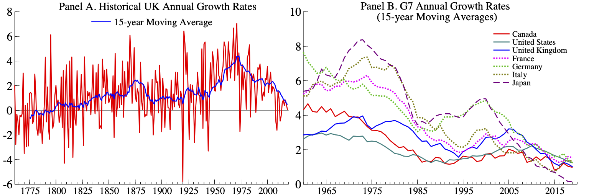
``` 

The most common approach for forecasting productivity is to estimate the
trend growth in productivity using aggregate data. For example,
@gordon2003_ABM considers three separate approaches for calculating
trend labor productivity in the United States based on (*i*) average
historical growth rates outside of the business cycle, (*ii*) filtering
the data using the HP filter [@hodrick1997_ABM], and (*iii*) filtering
the data using the Kalman filter [see @Kalman1960_ABM]. The Office for
Budget Responsibility (OBR) in the UK and the Congressional Budget
Office (CBO) in the US follow similar approaches for generating its
forecasts of productivity based on average historical growth rates as
well as judgments about factors that may cause productivity to deviate
from its historical trend in the short-term.[^108] Alternative
approaches include forecasting aggregate productivity using
disaggregated firm-level data [see
@bartelsman2011_ABM; @bartelsman2014_ABM and
§[2.10.1](#Cross_sectional_hierarchical_forecasting){reference-type="ref"
reference="Cross_sectional_hierarchical_forecasting"}] and using
time-series models [see @vzmuk2018_ABM and
§[2.3.4](#autoregressive_integrated_moving_average_models){reference-type="ref"
reference="autoregressive_integrated_moving_average_models"}].

In the last few decades there have been several attempts to test for
time-varying trends in productivity and to allow for them. However, the
focus of these approaches has been primarily on the United States
[@hansen2001_ABM; @roberts2001_ABM], which saw a sharp rise in
productivity growth in the 1990's that was not mirrored in other
countries [@basu2003_ABM]. Test for shifts in productivity growth rates
in other advanced economies did not find evidence of a changes in
productivity growth until well after the financial crisis in 2007
[@benati2007_ABM; @turner2011_ABM; @glocker2018_ABM].

A more recent approach by @Martinez2019_ABM allows for a time-varying
long-run trend in UK productivity. They show that are able to broadly
replicate the OBR's forecasts using a quasi-transformed autoregressive
model with one lag, a constant, and a trend. The estimated long-run
trend is just over 2% per year through 2007 Q4 which is consistent with
the OBR's assumptions about the long-run growth rate of productivity
[@obr2019_ABM]. However, it is possible to dramatically improve upon
OBR's forecasts in real-time by allowing for the long-term trend
forecast to adjust based on more recent historical patterns. By taking a
local average of the last four years of growth rates, @Martinez2019_ABM
generate productivity forecasts whose RMSE is on average more than 75%
smaller than OBR's forecasts extending five-years-ahead and is 84%
smaller at the longest forecast horizon.

### Fiscal forecasting for government budget surveillance[^109] {#Fiscal_forecasting_for_government_budget_surveillance}

Recent economic recessions have led to a renewed interest in fiscal
forecasting, mainly for deficit and debt surveillance. This was
certainly true in the case of the 2008 recession, and looks to become
even more important in the current economic crisis brought on by the
COVID-19 pandemic. This is particularly important in Europe, where
countries are subject to strong fiscal monitoring mechanisms. Two main
themes can be detected in the fiscal forecasting literature
[@Leal_Diego]. First, investigate the properties of forecasts in terms
of bias, efficiency and accuracy. Second, check the adequacy of
forecasting procedures.

The first topic has its own interest for long, mainly restricted to
international institutions [@Artis_Diego]. Part of the literature,
however, argue that fiscal forecasts are politically biased, mainly
because there is usually no clear distinction between political targets
and rigorous forecasts [@Strauch_Diego; @Frankel_Diego]. In this sense,
the availability of forecasts from independent sources is of great value
[@Jonung_Diego]. But it is not as easy as saying that independent
forecasters would improve forecasts due to the absence of political
bias, because forecasting accuracy is compromised by complexities of
data, country-specific factors, outliers, changes in the definition of
fiscal variables, etc. Very often some of these issues are known by the
staff of organisations in charge of making the official statistics and
forecasts long before the general public, and some information never
leaves such institutions. So this insider information is actually a
valuable asset to improve forecasting accuracy [@Leal_Diego].

As for the second issue, namely the accuracy of forecasting methods, the
literature can be divided into two parts, one based on macroeconomic
models with specific fiscal modules that allows to analyse the effects
of fiscal policy on macro variables and vice versa (see @Favero_Diego
and references therein), and the other based on pure forecasting methods
and comparisons among them. This last stream of research basically
resembles closely what is seen in other forecasting areas: (*i*) there
is no single method outperforming the rest generally, (*ii*) judgmental
forecasting is especially important due to data problems (see
§[2.11](#forecasting_with_judgment){reference-type="ref"
reference="forecasting_with_judgment"}), and (*iii*) combination of
methods tends to outperform individual ones, see @Leal_Diego and
§[2.6](#combining_forecasts){reference-type="ref"
reference="combining_forecasts"}.

Part of the recent literature focused on the generation of very
short-term public finance monitoring systems using models that combine
annual information with intra-annual fiscal data [@PEDREGAL2010_Diego]
by time aggregation techniques (see
§[2.10.2](#temporal_aggregation){reference-type="ref"
reference="temporal_aggregation"}), often set up in a SS framework
(see §[2.3.6](#state_space_models){reference-type="ref"
reference="state_space_models"}). The idea is to produce global
annual end-of-year forecasts of budgetary variables based on the most
frequently available fiscal indicators, so that changes throughout the
year in the indicators can be used as early warnings to infer the
changes in the annual forecasts and deviations from fiscal targets
[@Antonio_Diego].

The level of disaggregation of the indicator variables are established
according to the information available and the particular objectives.
The simplest options are the accrual National Accounts annual or
quarterly fiscal balances running on their cash monthly counterparts. A
somewhat more complex version is the previous one with all the variables
broken down into revenues and expenditures. Other disaggregation schemes
have been applied, namely by region, by administrative level (regional,
municipal, social security, etc.), or by items within revenue and/or
expenditure [VAT, income taxes, etc.
@PAREDES2014_Diego; @paredes2020_Diego].

Unfortunately, what is missing is a comprehensive and transparent
forecasting system, independent of Member States, capable of producing
consistent forecasts over time and across countries. This is certainly a
challenge that no one has yet dared to take up.

### Interest rate prediction[^110] {#Interest_rate_prediction}

The (spot) rate on a (riskless) bond represents the ex-ante return
(yield) to maturity which equates its market price to a theoretical
valuation. Modelling and predicting default-free, short-term interest
rates are crucial tasks in asset pricing and risk management. Indeed,
the value of interest rate--sensitive securities depends on the value of
the riskless rate. Besides, the short interest rate is a fundamental
ingredient in the formulation and transmission of the monetary policy
(see, for example,
§[2.3.15](#Forecasting_with_DSGE_Models){reference-type="ref"
reference="Forecasting_with_DSGE_Models"}). However, many popular
models of the short rate (for instance, continuous time, diffusion
models) fail to deliver accurate out-of-sample forecasts. Their poor
predictive performance may depend on the fact that the stochastic
behaviour of short interest rates may be time-varying (for instance, it
may depend on the business cycle and on the stance of monetary policy).

Notably, the presence of nonlinearities in the conditional mean and
variance of the short-term yield influences the behaviour of the entire
term structure of spot rates implicit in riskless bond prices. For
instance, the level of the short-term rate directly affects the slope of
the yield curve. More generally, nonlinear rate dynamics imply a
nonlinear equilibrium relationship between short and long-term yields.
Accordingly, recent research has reported that dynamic econometric
models with regime shifts in parameters, such as Markov switching (MS;
see §[2.3.12](#Markov_switching_models){reference-type="ref"
reference="Markov_switching_models"}) and threshold models (see
§[2.3.13](#threshold_models){reference-type="ref"
reference="threshold_models"}), are useful at forecasting rates.

The usefulness of MS VAR models with term structure data had been
established since @Hamilton1988-pl_MG and @Garcia1996-kc_MG:
single-state, VARMA models are overwhelmingly rejected in favour of
multi-state models. Subsequently, a literature has emerged that has
documented that MS models are required to successfully forecast the
yield curve. @Lanne2003-wq_MG showed that a mixture of autoregressions
with two regimes improves the predictions of US T-bill rates.
@Ang2002-px_MG found support for MS dynamics in the short-term rates for
the US, the UK, and Germany. @Cai1994-nc_MG developed a MS ARCH model to
examine volatility persistence, reflecting a concern that it may be
inflated by regimes. @Gray1996-vg_MG generalised this attempt to MS
GARCH and reported improvements in pseudo out-of-sample predictions.
Further advances in the methods and applications of MS GARCH are in
@Haas2004-qz_MG and @Smith2002-hi_MG. A number of papers have also
investigated the presence of regimes in the typical factors (level,
slope, and convexity) that characterise the no-arbitrage dynamics of the
term structure, showing the predictive benefits of incorporating MS
[see, for example, @Guidolin2019-jg_MG; @Hevia2015-yf_MG].

Alternatively, a few studies have tried to capture the time-varying,
nonlinear dynamics of interest rates using threshold models. As
discussed by @Pai1999-or_MP, threshold models have an advantage compared
to MS ones: the regimes are not determined by an unobserved latent
variable, thus fostering interpretability. In most of the applications
to interest rates, the regimes are determined by the lagged level of the
short rate itself, in a self-exciting fashion. For instance,
@Pfann1996-xy_MP explored nonlinear dynamics of the US short-term
interest rate using a (self-exciting) threshold autoregressive model
augmented by conditional heteroskedasticity (namely, a TAR-GARCH model)
and found strong evidence of the presence of two regimes. More recently,
also @Gospodinov2005-jj_MP used a TAR-GARCH to predict the short-term
rate and showed that this model can capture some well-documented
features of the data, such as high persistence and conditional
heteroskedasticity.

Another advantage of nonlinear models is that they can reproduce the
empirical puzzles that plague the expectations hypothesis of interest
rates (EH), according to which it is a weighted average of short-term
rates to drive longer-term rates [see, for example,
@Bansal2004-id_MG; @Dai2007-ab_MG]. For instance, while
@Bekaert2001-zk_MG show single-state VARs cannot generate distributions
consistent with the EH, @guidolin2009forecasts_DKB find that the optimal
combinations of lagged short and forward rates depend on regimes so that
the EH holds only in some states.

As widely documented [see, for instance, @Guidolin2018-od_MG], the
predictable component in mean rates is hardly significant. As a result,
the random walk remains a hard benchmark to outperform as far as the
prediction of the mean is concerned. However, density forecasts reflect
all moments and the models that capture the dynamics of higher-order
moments tend to perform best. MS models appear at the forefront of a
class of non-linear models that produce accurate density predictions
[see, for example, @Hong2004-np_MG; @Maheu2016-ta_MG]. Alternatively,
@Pfann1996-xy_MP and more recently @Dellaportas2007-rs_MP estimated TAR
models to also forecast conditional higher order moments and all report
reasonable accuracy.

Finally, a literature has strived to fit rates not only under the
physical measure, i.e., in time series, but to predict rates when MS
enters the pricing kernel, the fundamental pricing operator. A few
papers have assumed that regimes represent a new risk factor [see, for
instance, @Dai2003-mv_MG]. This literature reports that MS models lead
to a range of shapes for nominal and real term structures [see, for
instance, @Veronesi1999-ws_MG]. Often the model specifications that are
not rejected by formal tests include regimes
[@Ang2008-lo_MG; @Bansal2002-je_MG].

To conclude, it is worthwhile noting that, while threshold models are
more interpretable, MS remain a more popular alternative for the
prediction of interest rates. This is mainly due to the fact that
statistical inference for threshold regime switching models poses some
challenges, because the likelihood function is discontinuous with
respect to the threshold parameters.


### House price forecasting[^111] {#House_Price_Forecasting}

The boom and bust in housing markets in the early and mid 2000s and its
decisive role in the Great Recession has generated a vast interest in
the dynamics of house prices and emphasised the importance of accurately
forecasting property price movements during turbulent times.
International organisations, central banks and research institutes have
become increasingly engaged in monitoring the property price
developments across the world.[^112] At the same time, a substantial
empirical literature has developed that deals with predicting future
house price movements [for a comprehensive survey see @GHYSELS20135_AY].
Although this literature concentrates almost entirely on the US [see,
for example, @RapachStrauss_2009_AY; @BorkMoller_2015_AY], there are
many other countries, such as the UK, where house price forecastability
is of prime importance. Similarly to the US, in the UK, housing
activities account for a large fraction of GDP and of households'
expenditures; real estate property comprises a significant component of
private wealth and mortgage debt constitutes a main liability of
households [@ONS_2019_AY].

The appropriate forecasting model has to reflect the dynamics of the
specific real estate market and take into account its particular
characteristics. In the UK, for instance, there is a substantial
empirical literature that documents the existence of strong spatial
linkages between regional markets, whereby the house price shocks
emanating from southern regions of the country, and in particular
Greater London, have a tendency to spread out and affect neighbouring
regions with a time lag [see, for example,
@CookThomas_2003_AY; @Holly_2010_AY; @Antonakakis_CFG2018_AY *inter
alia*]; see also
§[2.3.10](#Functional_time_series_models){reference-type="ref"
reference="Functional_time_series_models"} on forecasting functional
data.

Recent evidence also suggests that the relationship between real estate
valuations and conditioning macro and financial variables displayed a
complex of time-varying patterns over the previous decades
[@Aizenman_2013_AY]. Hence, predictive methods that do not allow for
time-variation in both predictors and their marginal effects may not be
able to capture the complex house price dynamics in the UK [see
@yusupova2019adaptive_AY for a comparison of forecasting accuracy of a
battery of static and dynamic econometric methods].

An important recent trend is to attempt to incorporate information from
novel data sources (such as newspaper articles, social media, etc.) in
forecasting models as a measure of expectations and perceptions of
economic agents (see also
§[2.9.3](#Text_based_forecasting){reference-type="ref"
reference="Text_based_forecasting"}). It has been shown that changes
in uncertainty about house prices impact on housing investment and real
estate construction
decisions [@Cunningham2006_AY; @BanksBOS2015_AY; @OhY2019_AY], and thus
incorporating a measure of uncertainty in the forecasting model can
improve the forecastability of real estate prices. For instance in the
UK, the House Price Uncertainty (HPU) index [@HPU_AY], constructed using
the methodology outlined in @BakerScott_2016_AY,[^113] was found to be
important in predicting property price inflation ahead of the house
price collapse of the third quarter of 2008 and during the bust phase
[@yusupova2019adaptive_AY]. Along with capturing the two recent
recessions (in the early 1990s and middle 2000s) this index also
reflects the uncertainly related to the EU Referendum, Brexit
negotiations and COVID-19 pandemic.

### Exchange rate forecasting[^114] {#Exchange_rate_forecasting}

Exchange rates have long fascinated and puzzled researchers in
international finance. The reason is that following the seminal paper of
@MeeseRogoff:1983JIE_MR, the common wisdom is that macroeconomic
models cannot outperform the random walk in exchange rate forecasting
[see @Rossi:2013JEL_MR for a survey]. This view is difficult to
reconcile with the strong belief that exchange rates are driven by
fundamentals, such as relative productivity, external imbalances, terms
of trade, fiscal policy or interest rate disparity
[@MacDonald:1998JIFMIM_MR; @LeeEtAl:2013JMCB_MR; @CouhardeEtAl:2017IE_MR].
These two contradicting assertions by the academic literature is
referred to as "exchange rate disconnect puzzle".

The literature provides several explanations for this puzzle. First, it
can be related to the forecast estimation error (see
§[2.5.2](#Model_complexity){reference-type="ref"
reference="Model_complexity"}). The studies in which models are
estimated with a large panels of data
[@MarkSul:2001JIE_MR; @EngelEtAl:2008NBER_MR; @Ince:2014JIMF_MR], long
time series [@LothianTaylor:1996JPE_MR] or calibrated
[@CaZorziRubaszek:2020JIMF_MR] deliver positive results on exchange rate
forecastability. Second, there is ample evidence that the adjustment of
exchange rates to equilibrium is non-linear
[@TaylorPeel:2000JIMF_MR; @CurranVelic:2019JIMF_MR], which might
diminish the out-of-sample performance of macroeconomic models
[@KilianTaylor:2003JIE_MR; @LopezSuarez:2011JIMF_MR]. Third, few
economists argue that the role of macroeconomic fundamentals may be
varying over time and this should be accounted for in a forecasting
setting [@ByrneEtAl:2016JIMF_MR; @BeckmanSchuster:2016JIMF_MR].

The dominant part of the exchange rate forecasting literature
investigates which macroeconomic model performs best out-of-sample. The
initial studies explored the role of monetary fundamentals to find that
these models deliver inaccurate short-term and not so bad long-term
predictions in comparison to the random walk
[@MeeseRogoff:1983JIE_MR; @Mark:1995AER_MR]. In a comprehensive study
from mid-2000s, @CheungEtAl:2005JIMF_MR showed that neither monetary,
uncovered interest parity (UIP) nor behavioural equilibrium exchange
rate (BEER) model are able to outperform the no-change forecast. A step
forward was made by @MolodtsovaPapell:2009JIE_MR, who proposed a model
combining the UIP and Taylor rule equations and showed that it delivers
competitive exchange rate forecasts. This result, however, has not been
confirmed by more recent studies
[@CheungEtAl:2019JIMF_MR; @EngelEtAl:2019JIMF_MR]. In turn,
@CaZorziRubaszek:2020JIMF_MR argue that a simple method assuming gradual
adjustment of the exchange rate towards the level implied by the
Purchasing Power Parity (PPP) performs well over shorter as well as
longer horizon. This result is consistent with the results of
@CaZorziEtAl:2017JIE_MR and @EichenbaumEtAl:2017NBER_MR, who showed that
exchange rates are predictable within a general equilibrium DSGE
framework (see
§[2.3.15](#Forecasting_with_DSGE_Models){reference-type="ref"
reference="Forecasting_with_DSGE_Models"}), which encompasses an
adjustment of the exchange rate to a PPP equilibrium. Finally,
@CapEtAl:2019ECB_MR discuss how extending the PPP framework for other
fundamentals within the BEER framework is not helping in exchange rate
forecasting. Overall, at the current juncture it might be claimed that
"exchange rate disconnect puzzle" is still puzzling, with some evidence
that methods based on PPP and controlling the estimation forecast error
can deliver more accurate forecast than the random walk benchmark. A way
forward to account for macroeconomic variables in exchange rate
forecasting could be to use variable selection methods that allow to
control for the estimation error (see
§[2.5.3](#Variable_Selection){reference-type="ref"
reference="Variable_Selection"}).

### Financial time series forecasting with range-based volatility models[^115] {#Financial_time_series_forecasting_with_range_based_volatility_models}

The range-based (RB) volatility models is a general term for the models
constructed with high and low prices, and most often with their
difference i.e., the price range. A short review and classification of
such models is contained in
§[2.3.14](#Low_and_high_prices_in_volatility_models){reference-type="ref"
reference="Low_and_high_prices_in_volatility_models"}. From
practical point of view, it is important that low and high prices are
almost always available with daily closing prices for financial series.
The price range (or its logarithm) is a significantly more efficient
estimator of volatility than the estimator based on closing prices
[@Alizadeh2002_PF]. Similarly the co-range (the covariance based on
price ranges) is a significantly more efficient estimator of the
covariance of returns than the estimator based on closing prices
[@Brunetti2002_PF]. For these reasons models based on the price range
and the co-range better describe variances and covariances of financial
returns than the ones based on closing prices.

Forecasts of volatility from simple models like moving average, EWMA,
AR, ARMA based on the RB variance estimators are more accurate than the
forecasts from the same models based on squared returns of closing
prices [@Vipul2007_PF; @Rajvanshi2015_PF]. Forecasts of volatility from
the AR model based on the Parkinson estimator are more precise even than
the forecasts from the standard GARCH models (see
§[2.3.11](#arch_garch_models){reference-type="ref"
reference="arch_garch_models"}) based on closing prices
[@Li2011_PF].

In plenty of studies it was shown that forecasts of volatility of
financial returns from the univariate RB models are more accurate than
the forecasts from standard GARCH models based on closing prices (see,
for example, @Mapa2003_PF for the GARCH-PARK-R model;
@Chou2005_PF for the CARR model; @Fiszeder2005_PF for the GARCH-TR model; @Brandt2006_PF for the REGARCH model; @Chen2008_PF
for the TARR model; @Lin2012_PF for the STARR model;
@Fiszeder2016_PF for the GARCH model estimated with
low, high and closing prices during crisis periods; @Molnar2016_PF for the RGARCH model).

The use of daily low and high prices in the multivariate volatility
models leads to more accurate forecasts of covariance or covariance
matrix of financial returns than the forecasts from the models based on
closing prices (see, for example, @Chou2009a_PF for
the RB DCC model; @Harris2010_PF for the hybrid EWMA
model; @Fiszeder2018_PF for the BEKK-HL model;
@Fiszeder2019_PF for the co-range DCC model;
@Fiszeder2019a_PF for the DCC-RGARCH model).

The RB models were used in many financial applications. They lead for
example to more precise forecasts of value-at-risk measures in
comparison to the application of only closing prices (see, for example,
@Chen2012_PF for the threshold CAViaR model;
@Asai2013a_PF for the HVAR model; @Fiszeder2019a_PF for the DCC-RGARCH model; @Meng2020_PF for scoring functions). The application of the
multivariate RB models provides also the increase in the efficiency of
hedging strategies (see, for example, @Chou2009a_PF
for the RB DCC model; @Harris2010_PF for the hybrid
EWMA model; @Su2014_PF for the RB-MS-DCC model).
Moreover, the RB volatility models have more significant economic value
than the return-based ones in the portfolio construction (@Chou2010_PF for the RB DCC model; @Wu2011_PF for the
RB-copula model). Some studies show that based on the forecasts from the
volatility models with low and high prices it is possible to construct
profitable investment strategies (@He2010_PF for the VECM
model; @Kumar2015_PF for the CARRS model).

### Copula forecasting with multivariate dependent financial time series[^116] {#Copula_forecasting_with_dependent_financial_times_series}

In this section, we focus on the practical advances on jointly
forecasting multivariate financial time series with copulas. In the
copula framework (see
§[2.4.3](#bayesian_forecasting_with_copulas){reference-type="ref"
reference="bayesian_forecasting_with_copulas"}), because marginal
models and copula models are separable, point forecasts are
straightforward with marginal models, but dependence information is
ignored. A joint probabilistic forecast with copulas involves both
estimations of the copula distribution and marginal models.

In financial time series, an emerging interest is to model and forecast
the asymmetric dependence. A typical asymmetric dependence phenomenon is
that two stock returns exhibit greater correlation during market
downturns than market upturns. @patton2006modelling_Feng employs the
asymmetric dependence between exchange rates with a time-varying copula
construction with AR and GARCH margins. A similar study for measuring
financial contagion with copulas allows the parameters of the copula to
change with the states of the variance to identify shifts in the
dependence structure in times of crisis [@rodriguez2007measuring_Feng].

In stock forecasting, @almeida2012efficient_Feng employ a stochastic
copula autoregressive model to model DJI and Nasdaq, and the dependence
at the time is modelled by a real-valued latent variable, which
corresponds to the Fisher transformation of Kendall's $\tau$.
@li2018improving_Feng use a covariate-dependent copula framework to
forecast the time varying dependence that improves both the
probabilistic forecasting performance and the forecasting
interpretability. Liquidity risk is another focus in finance.
@weiss2013forecasting_Feng forecast three types of liquidity-adjusted
intraday Value-at-Risk (L-IVaR) with a vine copula structure. The
liquidity-adjusted intraday VaR is based on simulated portfolio values,
and the results are compared with the realised portfolio profits and
losses.

In macroeconomic forecasting, most existing reduced-form models for
multivariate time series produce symmetric forecast densities. Gaussian
copulas with skew Student's-*t* margins depict asymmetries in the
predictive distributions of GDP growth and inflation
[@smith2016asymmetric_Feng]. Real-time macroeconomic variables are
forecasted with heteroscedastic inversion copulas
[@smith2018inversion_Feng] that allow for asymmetry in the density
forecasts, and both serial and cross-sectional dependence could be
captured by the copula function [@loaiza2020real_Feng].

Copulas are also widely used to detect and forecast default correlation,
which is a random variable called *time-until-default* to denote the
survival time of each defaultable entity or financial instrument
[@li2000default_Feng]. Then copulas are used in modelling the dependent
defaults [@li2000default_Feng], forecasting credit risk
[@bielecki2013credit_Feng], and credit derivatives market forecasting
[@schonbucher2003credit_Feng]. A much large volume of literature is
available for this specific area. See the aforementioned references
therein. For particular applications in credit default swap (CDS) and
default risk forecasting, see @oh2018time_Feng and
@li2019credit_Feng respectively.

In energy economics, @aloui2013time_Feng employ the time-varying copula
approach, where the marginal models are from ARMA($p$,$q$)--GARCH(1,1)
to investigate the conditional dependence between the Brent crude oil
price and stock markets in the Central and Eastern European transition
economies. @bessa2012time_Feng propose a time-adaptive quantile-copula
where the copula density is estimated with a kernel density forecast
method. The method is applied to wind power probabilistic forecasting
(see also §[3.4.6](#Wind_Power_orecasting){reference-type="ref"
reference="Wind_Power_orecasting"}) and shows its advantages for
both system operators and wind power producers. Vine copula models are
also used to forecast wind power farms' uncertainty in power system
operation scheduling. @wang2017probabilistic_Feng shows vine copulas
have advantages of providing reliable and sharp forecast intervals,
especially in the case with limited observations available.

### Financial forecasting with neural networks[^117] {#Financial_forecasting_with_neural_networks}

Neural Networks (NNs; see
§[2.7.8](#neural_networks){reference-type="ref"
reference="neural_networks"}) are capable of successfully modelling
non-stationary and non-linear series. This property has made them one of
the most popular (if not the most) non-linear specification used by
practitioners and academics in Finance. For example, 89% of European
banks use NNs to their operations [@European_Banking_Federation2019-sn]
while 25.4% of the NNs applications in total is in Finance
[@Wong1995-zr_GS].

The first applications of NNs in Finance and currently the most
widespread, is in financial trading. In the mid-80s when computational
power became cheaper and more accessible, hedge fund managers started to
experiment with NNs in trading. Their initial success led to even more
practitioners to apply NNs and nowadays 67% of hedge fund managers use
NNs to generate trading ideas [@BarclayHedge2018-jx_GS]. A broad measure
of the success of NNs in financial trading is provided by the
Eurekahedge AI Hedge Fund Index[^118] where it is noteworthy the 13.02%
annualised return of the selected AI hedge funds over the last 10 years.

In academia, financial trading with NNs is the focus of numerous papers.
Notable applications of NNs in trading financial series were provided by
@Kaastra1996-sm_GS, @Tenti1996-wc_GS, @Panda2007-ts_GS,
@Zhang2008-kk_GS, and @Dunis2010-rx_GS. The aim of these studies is to
forecast the sign or the return of financial trading series and based on
these forecasts to generate profitable trading strategies. These studies
are closely related to the ones presented in
§[3.3.13](#Forecasting_stock_returns){reference-type="ref"
reference="Forecasting_stock_returns"} but the focus is now in
profitability. The second major field of applications of NNs in Finance
is in derivatives pricing and financial risk management. The growth of
the financial industry and the provided financial services have made NNs
and other machine learning algorithms a necessity for tasks such as
fraud detection, information extraction and credit risk assessment
[@Buchanan2019-ij_GS]. In derivatives pricing, NNs try to fill the
limitations of the Black-Scholes model and are being used in options
pricing and hedging. In academia notable applications of NNs in risk
management are provided by @Locarek-Junge1998-mz_GS and @Liu2005-lz_GS
and in derivatives by @Bennell2004-vn_GS and @Psaradellis2016-ac_GS.

As discussed before, financial series due to their non-linear nature and
their wide applications in practice seems the perfect forecasting data
set for researchers that want to test their NN topologies. As a result,
there are thousands of forecasting papers in the field of NNs in
financial forecasting. However, caution is needed in interpretation of
their results. NNs are sensitive to the choice of their hyperparameters.
For a simple MLP, a practitioner needs to set (among others) the number
and type of inputs, the number of hidden nodes, the momentum, the
learning rate, the number of epochs and the batch size. This complexity
in NN modelling leads inadvertently to the data snooping bias (see also
§[2.12.6](#Statistical_tests_of_forecast_performance){reference-type="ref"
reference="Statistical_tests_of_forecast_performance"}). In other
words, a researcher that experiments long enough with the parameters of
a NN topology can have excellent in-sample and out-of-sample results for
a series. However, this does not mean that the results of his NN can be
generalised. This issue has led the related literature to be stained by
studies cannot be extended in different samples.


### Forecasting returns to investment style[^119] {#Forecasting_returns_to_investment_style}

Investment style or factor portfolios are constructed from constituent
securities on the basis of a variety of a-priori observable
characteristics, thought to affect future returns. For example a
'Momentum' portfolio might be constructed with positive ('long')
exposures to stocks with positive trailing 12-month returns, and
negative ('short') exposure to stocks with negative trailing 12-month
returns [for full background and context, see, for example
@Bernstein1995_RH; @Haugen2010_RH].[^120] Explanations as to why such
characteristics seem to predict returns fall in to two main camps:
firstly that the returns represent a risk premium, earned by the
investor in return for taking on some kind of (undiversifiable) risk,
and secondly that such returns are the result of behavioural biases on
the part of investors. In practice, both explanations are likely to
drive style returns to a greater or lesser extent. Several such
strategies have generated reasonably consistent positive risk-adjusted
returns over many decades, but as with many financial return series,
return volatility is large relative to the mean, and there can be
periods of months or even years when returns deviate significantly from
their long-run averages. The idea of timing exposure to styles is
therefore at least superficially attractive, although the feasibility of
doing so is a matter of some debate
[@Arnott2016_RH; @Asness2016_RH; @Bender2018_RH]. Overconfidence in
timing ability has a direct cost in terms of trading frictions and
opportunity cost in terms of potential expected returns and
diversification forgone.

A number of authors write on the general topic of style timing [recent
examples include @Hodges2017_RH; @Dichtl2019_RH], and several
forecasting methodologies have been suggested, falling in to three main
camps:

1.  Serial Correlation: Perhaps the most promising approach is
    exploiting serial correlation in style returns. @Tarun2019_RH and
    @Babu2020_RH outline two such approaches and @Ehsani2020 explore the
    relationship between momentum in factor portfolios and momentum in
    underlying stock returns. As with valuation spreads mentioned below,
    there is a risk that using momentum signals to time exposure to
    momentum factor portfolios risks unwittingly compounding exposure. A
    related strand of research relates (own) factor volatility to future
    returns, in particular for momentum factors
    [@Barroso2015_RH; @Daniel2016_RH].

2.  Valuation Spreads: Using value signals (aggregated from individual
    stock value exposures) to time exposure to various fundamental-based
    strategies is a popular and intuitively appealing approach
    [@Asness2016_RH]; however evidence of value added from doing so is
    mixed, and the technique seems to compound risk exposure to value
    factors.

3.  Economic & Financial Conditions: @Polk2020_RH explore how economic
    and financial conditions affect style returns (an idea that dates
    back at least to @Bernstein1995_RH and references therein).

Style returns exhibit distinctly non-normal distributions. On a
univariate basis, most styles display returns which are highly
negatively skewed and demonstrate significant kurtosis. The long-run low
correlation between investment styles is often put forward as a benefit
of style-based strategies, but more careful analysis reveals that
non-normality extends to the co-movements of investment style returns;
factors exhibit significant tail dependence. @Christoffersen2013_RH
explores this issue, also giving details of the skew and kurtosis of
weekly style returns. These features of the data mean that focusing
solely on forecasting the mean may not be sufficient, and building
distributional forecasts becomes important for proper risk management.
@Jondeau2007_RH writes extensively on modelling non-gaussian
distributions.

### Forecasting stock returns[^121] {#Forecasting_stock_returns}

Theory and intuition suggest a plethora of potentially relevant
predictors of stock returns. Financial statement data [e.g.,
@Chan2001_RAPACH; @Yan2017_RAPACH] provide a wealth of information, and
variables relating to liquidity, price trends, and sentiment, among
numerous other concepts, have been used extensively by academics and
practitioners alike to predict stock returns. The era of big data
further increases the data available for forecasting returns. When
forecasting with large numbers of predictors, conventional ordinary
least squares (OLS) estimation is highly susceptible to overfitting,
which is exacerbated by the substantial noise in stock return data
(reflecting the intrinsically large unpredictable component in returns);
see
§[2.7.11](#machine_Learning_with_very_noisy_data){reference-type="ref"
reference="machine_Learning_with_very_noisy_data"}.

Over the last decade or so, researchers have explored methods for
forecasting returns with large numbers of predictors. Principal
component regression extracts the first few principal components (or
factors) from the set of predictors; the factors then serve as
predictors in a low-dimensional predictive regression, which is
estimated via OLS (see
§[2.7.1](#Forecasting_with_Big_Data){reference-type="ref"
reference="Forecasting_with_Big_Data"}). Intuitively, the factors
combine the information in the individual predictors to reduce the
dimension of the regression, which helps to guard against overfitting.
@LudvigsonNg2007_DR find that a few factors extracted from hundreds of
macroeconomic and financial variables improve out-of-sample forecasts of
the US market return. @KellyPruitt2013_DR and @HuangJiangTuZhou2015_DR
use partial least squares [@Wold1966_DR] to construct target-relevant
factors from a cross section of valuation ratios and a variety of
sentiment measures, respectively, to improve market return forecasts.

Since @BatesGranger1969_DR, it has been known that combinations of
individual forecasts often perform better than the individual forecasts
themselves [@Timmermann2006_DR and
§[2.6.1](#Forecast_combination_a_brief_review_of_statistical_approaches){reference-type="ref"
reference="Forecast_combination_a_brief_review_of_statistical_approaches"}].
@RapachStraussZhou2010_DR show that forecast combination can
significantly improve out-of-sample market return forecasts. They first
construct return forecasts via individual univariate predictive
regressions based on numerous popular predictors from the literature
[@GoyalWelch2008_DR]. They then compute a simple combination forecast by
taking the average of the individual forecasts.
@RapachStraussZhou2010_DR demonstrate that forecast combination exerts a
strong shrinkage effect, thereby helping to guard against overfitting.

An emerging literature uses machine-learning techniques to construct
forecasts of stock returns based on large sets of predictors. In an
investigation of lead-lag relationships among developed equity markets,
@RapachStraussZhou2013_DR appear to be the first to employ
machine-learning tools to predict market returns. They use the elastic
net [ENet, @JLC_ZouHastie2005], a generalisation of the popular least
absolute shrinkage and selection operator [LASSO, @JLC_Tibshir96]. The
LASSO and ENet employ penalised regression to guard against overfitting
in high-dimensional settings by shrinking the parameter estimates toward
zero. @ChincoClark-JosephYe2019_DR use the LASSO to forecast
high-frequency (one-minute-ahead) individual stock returns and report
improvements in out-of-sample fit, while @Rapach2018_HR use the LASSO to
improve monthly forecasts of industry returns.

Incorporating insights from @DieboldShin2019_DR, @HanHeRapachZhou2020_DR
use the LASSO to form combination forecasts of cross-sectional stock
returns based on a large number of firm characteristics from the
cross-sectional literature [e.g.,
@HarveyLiuZhu2016_DR; @McLeanPontiff2016_DR; @HouXueZhang2020_DR],
extending the conventional OLS approach of @HaugenBaker1996_DR,
@Lewellen2015_DR, and @GreenHandZhang2017_DR. @RapachZhou2020_DR and
@DongLiRapachZhou2020_DR use the ENet to compute combination forecasts
of the market return based on popular predictors from the time-series
literature and numerous anomalies from the cross-sectional literature,
respectively. Forecasting individual stock returns on the basis of firm
characteristics in a panel framework, @FreybergerNeuhierlWeber2020_DR
and @GuKellyXiu2020_DR employ machine-learning techniques -- such as the
nonparametric additive LASSO [@HuangHorowitzWei2010_DR], random forests
[@Breiman2001_DR], and artificial neural networks -- that allow for
nonlinear predictive relationships.

### Forecasting crashes in stock markets[^122] {#Forecasting_crashes_in_stock_markets}

Time series data on financial asset returns have special features.
Returns themselves are hard to forecast, while it seems that volatility
of returns can be predicted. Empirical distributions of asset returns
show occasional clusters of large positive and large negative returns.
Large negative returns, that is, crashes seem to occur more frequently
than large positive returns. Forecasting upcoming increases or decreases
in volatility can be achieved by using variants of the Autoregressive
Conditional Heteroskedasticity (ARCH) model
[@Engle1982_JJ; @Bollerslev1986-zs_PHF and
§[2.3.11](#arch_garch_models){reference-type="ref"
reference="arch_garch_models"}] or realized volatility models
[@Taylor1986-ir_PHF]. These models take (functions of) past volatility
and past returns as volatility predictors, although also other
explanatory variables can be incorporated in the regression.

An important challenge that remains is to predict crashes.
@Sornette2003-cf summarises potential causes for crashes and these are
computer trading, increased trading in derivatives, illiquidity, trade
and budget deficits, and especially, herding behaviour of investors.
Yet, forecasting the exact timing of crashes may seem impossible, but on
the other hand, it may be possible to forecast the probability that a
crash may occur within a foreseeable future. Given the herding
behaviour, any model to use for prediction should include some
self-exciting behaviour. For that purpose, @Ait-Sahalia2015-nn_PHF
propose mutually exciting jump processes, where jumps can excite new
jumps, also across assets or markets [see also
@Chavez-Demoulin2005-td_PHF]. Another successful approach is the
Autoregressive Conditional Duration (ACD) model
[@Engle1997-jd_PHF; @Engle1998-js_PHF], which refers to a time series
model for durations between (negative) events.

An alternative view on returns' volatility and the potential occurrence
of crashes draws upon the earthquake literature
[@Ogata1978-fm_PHF; @Ogata1988-lq_PHF]. The idea is that tensions in and
across tectonic plates build up, until an eruption, and after that,
tension starts to build up again until the next eruption. By modelling
the tension-building-up process using so-called Hawkes processes
[@Hawkes1971-wl_PHF; @Hawkes2018-na_PHF; @Hawkes1974-ri_PHF; @Ozaki1979-qr_PHF],
one can exploit the similarities between earthquakes and financial
crashes (see also
§[2.8.4](#peak_over_the_threshold_POT){reference-type="ref"
reference="peak_over_the_threshold_POT"}). @Gresnigt2015-zt take
Hawkes processes to daily S&P 500 data and show that it is possible to
create reliable probability predictions of a crash occurrence within the
next five days. @Gresnigt2017-rx_PHF [@Gresnigt2017-jq_PHF] further
develop a specification strategy for any type of asset returns, and
document that there are spillovers across assets and markets.

Given investor behaviour, past crashes can ignite future crashes. Hawkes
processes are particularly useful to describe this feature and can
usefully be implemented to predict the probability of nearby crashes. By
the way, these processes can also be useful to predict social conflicts,
as also there one may discern earthquake-like patterns.
@Van_den_Hengel2020-hs_PHF document their forecasting power for social
conflicts in Africa.


Energy {#Energy}
------

### Building energy consumption forecasting and optimisation[^123] {#Building_energy_consumption_forecasting}

In Europe, buildings account for 40% of total energy consumed and 36% of
total $\text{CO}_2$ emissions [@Patti2016]. Given that energy
consumption of buildings is expected to increase in the coming years,
forecasting electricity consumption becomes critical for improving
energy management and planning by supporting a large variety of
optimisation procedures.

The main challenge in electricity consumption forecasting is that
building energy systems are complex in nature, with their behaviour
depending on various factors related to the type (e.g., residential,
office, entertainment, business, and industrial) and the end-uses (e.g.,
heating, cooling, hot water, and lighting) of the building, its
construction, its occupancy, the occupants' behaviour and schedule, the
efficiency of the installed equipment, and the weather conditions
[@ZHAO20123586]. Special events, holidays, and calendar effects can also
affect the behaviour of the systems and further complicate the
consumption patterns, especially when forecasting at hourly or daily
level (see
§[2.3.5](#forecasting_for_multiple_seasonal_cycles){reference-type="ref"
reference="forecasting_for_multiple_seasonal_cycles"}). As a result,
producing accurate forecasts typically requires developing tailored,
building-specific methods.

To deal with this task, the literature focuses on three main classes of
forecasting methods, namely engineering, statistical, and ML
[@MATDAUT20171108]. Engineering methods, typically utilised through
software tools such as DOE-2, EnergyPlus, BLAST, and ESP-r, build on
physical models that forecast consumption through detailed equations
which account for the particularities of the building
[@ALHOMOUD2001421; @ZHAO20123586; @FOUCQUIER2013272]. Statistical
methods usually involve linear regression (see
§[2.3.2](#time_series_regression_models){reference-type="ref"
reference="time_series_regression_models"}), ARIMA/ARIMAX (see
§[2.3.4](#autoregressive_integrated_moving_average_models){reference-type="ref"
reference="autoregressive_integrated_moving_average_models"}), and
exponential smoothing (see
§[2.3.1](#exponential_smoothing_models){reference-type="ref"
reference="exponential_smoothing_models"}) models that forecast
consumption using past consumption data or additional explanatory
variables, such as weather or occupancy and calendar related information
[@DEB2017902]. Finally, ML methods (see
§[2.7.10](#machine_Learning){reference-type="ref"
reference="machine_Learning"}) typically involve neural networks
(see §[2.7.8](#neural_networks){reference-type="ref"
reference="neural_networks"}), support vector machines, and grey
models that account for multiple non-linear dependencies between the
electricity consumed and the factors influencing its value
[@AHMAD2014102]. Till present, the literature has been inconclusive
about which class of methods is the most appropriate, with the
conclusions drawn being subject to the examined building type, data set
used, forecasting horizon considered, and data frequency at which the
forecasts are produced [@WEI2019106187]. To mitigate this problem,
combinations of methods (see
§[2.6](#combining_forecasts){reference-type="ref"
reference="combining_forecasts"}) and hybrids (see
§[2.7.13](#Hybrid_methods){reference-type="ref"
reference="Hybrid_methods"}) have been proposed, reporting
encouraging results [@ZHAO20123586; @MOHANDES201955].

Other practical issues refer to data pre-processing. Electricity
consumption data is typically collected at high frequencies through
smart meters and therefore display noise and missing or extreme values
due to monitoring issues (see
§[2.7.11](#machine_Learning_with_very_noisy_data){reference-type="ref"
reference="machine_Learning_with_very_noisy_data"}). As a result,
verifying the quality of the input data through diagnostics and data
cleansing techniques (see
§[2.2.3](#Anomaly_detection_and_time_series_forecasting){reference-type="ref"
reference="Anomaly_detection_and_time_series_forecasting"} and
§[2.2.4](#Robust_handling_of_outliers){reference-type="ref"
reference="Robust_handling_of_outliers"}), as well as optimising the
selected time frames, are important for improving forecasting
performance [@BOURDEAU2019101533]. Similarly, it is critical to engineer
(see
§[2.2.5](#Exogenous_variables_and_feature_engineering){reference-type="ref"
reference="Exogenous_variables_and_feature_engineering"}) and select
(see §[2.5.3](#Variable_Selection){reference-type="ref"
reference="Variable_Selection"}) appropriate regressor variables
which are of high quality and possible to accurately predict to assist
electricity consumption forecasting. Finally, it must be carefully
decided whether the bottom-up, the top-down or a combination method (see
§[2.10.1](#Cross_sectional_hierarchical_forecasting){reference-type="ref"
reference="Cross_sectional_hierarchical_forecasting"}) will be used
for producing reconciled forecasts at both building and end-use level
[@KUSTER2017257], being also possibly mixed with temporal aggregation
approaches [@Spiliotis2020-hj but also
§[2.10.3](#crosstemporal_hierarchies){reference-type="ref"
reference="crosstemporal_hierarchies"}].

Provided that accurate forecasts are available, effective energy
optimisation can take place at a building level or across blocks of
buildings (see
§[3.4.10](#Collaborative_forecasting_in_the_energy_sector){reference-type="ref"
reference="Collaborative_forecasting_in_the_energy_sector"}) to
reduce energy cost, improve network stability, and support efforts
towards a carbon-free future, by exploiting smart grid, internet of
things (IoT), and big data technologies along with recommendation
systems [@MARINAKIS2020572].

An example for a typical application in this area is the optimisation of
heating, ventilation, and air conditioning (HVAC) systems. The goal is
to minimise the energy use of the HVAC system under the constraints of
maintaining certain comfort levels in the building [@Marinakis2017].
Though this is predominantly an optimisation exercise, forecasting comes
in at different points of the system as input into the optimisation, and
many problems in this space involve forecasting as a sub-problem,
including energy consumption forecasting, room occupancy forecasting,
inside temperature forecasting, (hyper-local) forecasts of outside
temperature, and air pressure forecasting for ventilation, among others.
For instance, @Krueger2004Predicting_CB use a linear regression approach
to predict inside temperatures in 3 houses in Brazil, and
@ruano2006prediction_CB propose the use of a neural network to predict
temperatures in a school building. @madaus2020hyper_CB predict
hyper-local extreme heat events, combining global climate models and
machine learning models. @Jing2018air_CB predict air pressure to tackle
the air balancing problem in ventilation systems, using a support vector
machine.

Predicting energy demand on a building/household level from smart meter
data is an important research topic not only for energy savings. In the
building space, @Ahmad2017Trees_CB, @Touzani2018Gradient_CB, and
@Wang2018Random_CB predict building energy consumption of residential
and commercial buildings using decision tree-based algorithms (random
forests and gradient boosted trees) and neural networks to improve
energy efficiency.

A recent trend in forecasting are global forecasting models, built
across sets of time series [@januschowski2020criteria_CB]. (Recurrent)
neural networks [@bandara2020lstm_BRT; @Hewamalage2019Recurrent_CB] are
particularly suitable for this type of processing due to their
capabilities to deal with external inputs and cold-start problems. Such
capabilities are necessary if there are different regimes in the
simulations under which to predict, an example of such a system for HVAC
optimisation is presented by @Godahewa2020Simulation_CB.

More generally, many challenges in the space of building energy
optimisation are classical examples of so-called "predict then optimise"
problems [@demirovic2019predict_CB; @elmachtoub2017smart_CB]. Here,
different possible scenario predictions are obtained from different
assumptions in the form of input parameters. These input parameters are
then optimised to achieve a desired predicted outcome. As both
prediction and optimisation are difficult problems, they are usually
treated separately [@elmachtoub2017smart_CB], though there are now
recent works where they are considered together
[@el2019generalization_CB; @demirovic2019predict_CB], and this will
certainly be an interesting avenue for future research.

### Electricity price forecasting[^124] {#Electricity_price_forecasting}

Forecasting electricity prices has various challenges that are
highlighted in the detailed review papers by @weron2014electricity_FZ.
Even though there are economically well motivated fundamental
electricity price models, forecasting models based on evaluating
historic price data are the dominating the academic literature. In
recent years the focus on probabilistic forecasting grew rapidly, as
they are highly relevant for many applications in energy trading and
risk management, storage optimisation and predictive maintenance,
[@ziel2018probabilistic_FZ; @nowotarski2018recent_FZ]. Electricity price
data is highly complex and is influenced by regulation. However, there
is electricity trading based on auctions and on continuous trading. Many
markets like the US and European markets organise day-ahead auctions for
electricity prices, see Figure \@ref(fig:figepfziel). Thus, we have to predict multivariate
time series type data, [@ziel2018day_FZ]. In contrast, intraday markets
usually apply continuous trading to manage short term variations due to
changes in forecasts of renewable energy and demand, and outages
[@kiesel2017econometric_FZ].


<!--  -->

```{r figepfziel, echo=FALSE, fig.cap="Hourly German day-ahead electricity price data resulting from a two-sided auction (top left) with corresponding 24 sale/supply and purchase/demand curves for 24 May 2020 and highlighted curves for 17:00 (top right), power generation and consumption time series (bottom left), and bid structure of 24 May 2020 17:00 (bottom right)."}
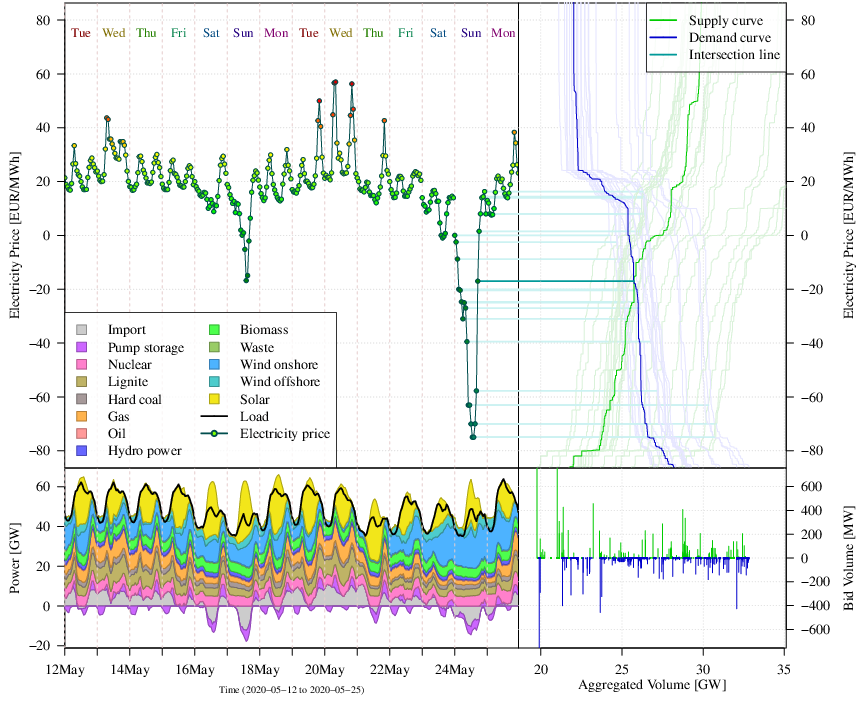
``` 


The key challenge in electricity price forecasting is to address all
potential characteristics of the considered market, most notably (some
of them visible in Figure
\@ref(fig:figepfziel):

1.  (time-varying) autoregressive effects and (in)stationarity,

2.  calendar effects (daily, weekly and annual seasonality, holiday
    effects, clock-change),

3.  (time-varying) volatility and higher moment effects,

4.  price spikes (positive and negative), and

5.  price clustering.

Some of those impacts can be explained by external inputs, that
partially have to be predicted in advance:

1.  load/demand/consumption (see
    §[3.4.3](#Load_forecasting){reference-type="ref"
    reference="Load_forecasting"}),

2.  power generation, especially from the renewable energy sources (RES)
    of wind and solar (see
    §[3.4.6](#Wind_Power_orecasting){reference-type="ref"
    reference="Wind_Power_orecasting"} and
    §[3.4.8](#Solar_power_forecasting){reference-type="ref"
    reference="Solar_power_forecasting"}),

3.  relevant fuel prices (especially oil, coal, natural gas; see also
    §[3.4.4](#Crude_oil_price_forecasting){reference-type="ref"
    reference="Crude_oil_price_forecasting"}),

4.  prices of emission allowances ($CO_2e$ costs),

5.  related power market prices (future, balancing and neighboring
    markets),

6.  availabilities of power plants and interconnectors,

7.  import/export flow related data, and

8.  weather effects (e.g. temperature due to cooling and heating and
    combined heat and power (CHP) effects; see also
    §[3.5.2](#Weather_Forecasting){reference-type="ref"
    reference="Weather_Forecasting"}).

Note that other weather effects might be relevant as well, but should be
covered from the fundamental point of view by the listed external
inputs. Obvious examples are wind speed for the wind power prediction,
cloud cover for the solar power production and illumination effects in
the electricity consumption.

Many of those external effects may be explained by standard economic
theory from fundamental electricity price models
[@cludius2014merit; @kulakov2021impact]. Even the simple supply stack
model (merit order model), see Figure
\@ref(fig:figsupplystackmodel), explains many features and
should be kept in mind when designing an appropriate electricity price
forecasting model.


<!-- 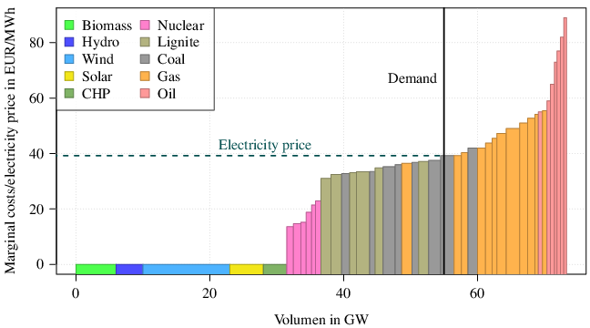 -->

```{r figsupplystackmodel, echo=FALSE, fig.cap="Illustrative example of a supply stack model with inelastic demand for different power plant types, roughly covering the situation in Germany 2020."}

``` 
 
In recent years, statistical and machine learning methods gained a lot
of attraction in day-ahead electricity price forecasting. Even though
the majority of effects is linear there are specific non-linear
dependencies that can be explored by using non-linear models, especially
neural networks
[@dudek2016multilayer_FZ; @lago2018forecasting_FZ; @ugurlu2018electricity_FZ; @marcjasz2019importance_FZ].
Of course this comes along with higher computational costs compared to
linear models. @fezzi2020size_FZ illustrate that even simple linear
models can give highly accurate forecasts, if correctly calibrated.
However, there seems to be consensus that forecast combination is
appropriate, particularly for models that have different structures or
different calibration window length
[@gaillard2016additive_FZ; @mirakyan2017composite_FZ; @hubicka2018note_FZ].

Another increasing stream of electricity price forecasting models do not
focus on the electricity price itself, but the bid/sale/sell/supply and
ask/sell/purchase/demand curves of the underlying auctions [see Figure
\@ref(fig:figepfziel), but also
@ziel2016electricity_FZ; @kulakov2020x; @shah2020forecasting_FZ; @mestre2020forecasting_FZ].
This sophisticated forecasting problem allows more insights for trading
applications and the capturing of price clusters.

In forecasting intraday markets the literature just started to grow
quickly. As the aforementioned market characteristics get less distinct
if information from day-ahead markets is taken into account
appropriately. However, intraday prices are usually more volatile and
exhibit more stronger price spikes. Thus, probabilistic forecasting is
even more relevant
[@janke2019forecasting_FZ; @narajewski2020ensemble_FZ]. Recent studies
showed that European markets are close to weak-form efficiency. Thus
naive point forecasting benchmarks perform remarkably well
[@oksuz2019neural_FZ; @narajewski2020econometric_FZ; @marcjasz2020beating_FZ].

As pointed out above, predicting price spikes is particularly important
in practice, due to the high impact in decision making problems which
occur usually in extreme situations, see Figure
\@ref(fig:figsupplystackmodel). Very high electricity prices
are usually observed in connection to high demand and low renewable
energy generation, sometimes together with sudden power plant failures.
In contrast, negative price spikes occur in oversupply situation, when
there is low demand but high penetration from wind and solar power. The
presence of spikes is explored in two main streams in literature: spike
forecasting and prediction of prices under normal regime through robust
estimators.

Within the first set of papers, spikes are often modelled as one regime
of non-linear models for time series. This approach is followed by
@Mount2006-fw_LG focusing on regime-switching models with parameters
driven by time-varying variables and by @Becker2008-wu_LG who adopt
Markov switching models for spikes prediction.
@Christensen2009-rz_LG [@Christensen2012-mv_LG] suggest treating and
forecasting price spikes through Poisson autoregressive and
discrete-time processes, respectively. @Herrera2014-di_LG use a Hawkes
model combined with extreme events theory. Interregional links among
different electricity markets are used by @Clements2015-tt_LG and
@Manner2016-yu_LG to forecast electricity price spikes. A new procedure
for the simulation of electricity spikes has been recently proposed by
@Muniain2020-dz utilising bivariate jump components in a mean reverting
jump diffusion model in the residuals.

The second stream of literature includes papers developing outlier
detection methods or robust estimators to improve the forecasting
performance of the models. @MartinezAlvarez2011-ug_LG tackle the issue
of outlier detection and prediction defining "motifs", that is patches
of units preceding observations marked as anomalous in a training set.
@Janczura2013-ny_LG focus on the detection and treatment of outliers in
electricity prices. A very similar approach, based on seasonal
autoregressive models and outlier filtering, is followed by
@Afanasyev2019-cr_LG. @Grossi2019-pg_LG introduced a procedure for the
robust statistical prediction of electricity prices. The econometric
framework is represented by the robust estimation of non-linear SETAR
processes. A similar approach has been followed by @Wang2020-mk_LG using
an outlier-robust machine learning algorithm.

### Load forecasting[^125] {#Load_forecasting}

Load forecasting forms the basis where power system operation and
planning builds upon. Based on the time horizon of the forecasts, load
forecasting can be classified into very short-term (VSTLF), that refers
to horizon from several minutes ahead up to 1 hour, short-term (STLF),
that spans from 1 hour to 168 hours ahead, medium-term (MTLF), that
spans from 168 hours to 1 year ahead and finally, and long-term (LTLF)
that concerns predictions from 1 year to several years ahead. In VSTLF
and STLF applications, the focus is on the sub-hourly or hourly load. In
MTLF and LTLF, the variables of interest can be either monthly
electricity peak load and total demand for energy.

Inputs differ in the various horizons. In VSTLF and STLF, apart from
meteorological data, day type identification codes are used. In LTLF,
macroeconomic data are used since total demand of energy is influenced
by the long-term modifications of the social and economic environments.
Among the horizons, special attention is placed at STLF. This is
reflected by the research momentum that have been placed in the load
forecasting related literature by other researchers [@Hong2016-yf_IP].
Processes like unit commitment and optimal power flow rely on STLF
[@Saksornchai2005-cz_IP; @Bo2012-sw_IP]. Additionally, since competitive
energy markets continually evolve, STLF becomes vital for new market
entities such as retailers, aggregators, and prosumers for applications
such as strategic bidding, portfolio optimisation, and tariff design
[@Danti2017-zf_IP; @Ahmad2019-mi_IP].

The models that can be found in the load forecasting related literature
can in general categorised into three types: time-series, machine
learning, and hybrid. Time-series models historically precede the
others. Typical examples of this family are ARMA, ARIMA, and others (see
also
§[2.3.4](#autoregressive_integrated_moving_average_models){reference-type="ref"
reference="autoregressive_integrated_moving_average_models"}). In
the machine learning models, the structure is usually determined via the
training process. NNs are commonly used. Once a NN is sufficiently
trained, it can provide forecasts for all types of forecasting horizons
[@Hippert2001-lw]. The third category of models refers to the
integration of two or more individual forecasting approaches (see also
see §[2.7.13](#Hybrid_methods){reference-type="ref"
reference="Hybrid_methods"}). For instance, a NN can be combined
with time series methods, with unsupervised machine learning algorithms,
data transformation, and with meta-heuristics algorithms
[@Bozkurt2017-mv_IP; @Lopez2017-ni_IP; @Lu2019-sm_IP; @El-Hendawi2020-mf_IP].

Hybrid systems has been tested on validation data (through forecasting
competitions), power system aggregated load, and application oriented
tasks. @Ma2021-la_IP proposed an ensemble method based on a
combination of various single forecasters on GEFCom2012 forecasting
competition data that outperformed benchmark forecasters such as Theta
method, NN, ARIMA, and others (see
§[2.12.7](#Forecasting_competitions){reference-type="ref"
reference="Forecasting_competitions"} for further discussions on
forecasting competitions). For aggregated load cases, researchers focus
on different countries and energy markets. @Zhang2018-zd_IP combined
empirical mode decomposition (EMD), ARIMA, and wavelet neural networks
(WNN) optimised by the fruit fly algorithm on Australian Market data and
New York City data. Their approach was to separate the linear and
nonlinear components from original electricity load; ARIMA is used for
linear part while the WNN for the non-linear one.

@Sideratos2020-wc_IP proposed that a radial basis network that performs
the initial forecasting could serve as input to a convolutional neural
network that performs the final forecasting. The proposed model led to
lower error compared to the persistence model, NN, and SVM.
@Semero2020-yj_IP focused on the energy management of a microgrid
located in China using EMD to decompose the load, adaptive neuro-fuzzy
inference system (ANFIS) for forecasting and particle swarm intelligence
(PSO) to optimize ANFIS parameters. The results show that the proposed
approach yielded superior performance over four other methods.
@Faraji2020-sv_IP proposed a hybrid system for the scheduling of a
prosumer microgrid in Iran. Various machine learning algorithms provided
load and weather forecasts. Through an optimisation routine, the best
individual forecast is selected. The hybrid system displayed better
accuracy from the sole application of the individual forecasters.

### Crude oil price forecasting[^126] {#Crude_oil_price_forecasting}

Crude oil, one of the leading energy resources, has contributed to over
one-third of the world's energy consumption [@alvarez2003symmetry_XW].
The fluctuations of the crude oil price have a significant impact on
industries, governments as well as individuals, with substantial
up-and-downs of the crude oil price bringing dramatic uncertainty for
the economic and political development
[@kaboudan2001compumetric_XW; @cunado2005oil_XW]. Thus, it is critical
to develop reliable methods to accurately forecast crude oil price
movement, so as to guard against the crude oil market extreme risks and
improve macroeconomic policy responses. However, the crude oil price
movement suffers from complex features such as nonlinearity,
irregularities, dynamics and high volatility
[@kang2009forecasting_XW; @alquist2013forecasting_XW; @herrera2018forecasting_XW
and also §[2.3.11](#arch_garch_models){reference-type="ref"
reference="arch_garch_models"}], making the crude oil price
forecasting still one of the most challenging forecasting problems.

Some prior studies have suggested that the crude oil price movement is
inherently unpredictable, and it would be pointless and futile to
attempt to forecast future prices, see @miao2017influential_XW for a
detailed summary. These agnostics consider the naive no-change forecast
as the best available forecast value of future prices. In recent years,
however, numerous studies result in forecasts that are more accurate
than naive no-change forecasts, making the forecasting activities of
crude oil prices promising
[@alquist2013forecasting_XW; @baumeister2015high_XW].

Extensive research on crude oil price forecasting has focused
predominantly on the econometric models, such as VAR, ARCH-type, ARIMA,
and Markov models [see, for example,
@mirmirani2004comparison_XW; @agnolucci2009volatility_XW; @mohammadi2010international_XW; @e2010forecasting_XW
and §[2.3](#Statistical_and_econometric_models){reference-type="ref"
reference="Statistical_and_econometric_models"}]. In the forecasting
literature, unit root tests (see
§[2.3.4](#autoregressive_integrated_moving_average_models){reference-type="ref"
reference="autoregressive_integrated_moving_average_models"}) are
commonly applied to examine the stationarity of crude oil prices prior
to econometric modelling
[@silvapulle1999relationship_XW; @serletis2004testing_XW; @rahman2012oil_XW].
It is well-documented that crude oil prices are driven by a large set of
external components, which are themselves hard to predict, including
supply and demand forces, stock market activities, oil-related events
(e.g., war, weather conditions), political factors, etc. In this
context, researchers have frequently considered structural models (see
§[2.3.9](#Forecasting_with_many_variables){reference-type="ref"
reference="Forecasting_with_many_variables"}), which relate the oil
price movements to a set of economic factors. With so many econometric
models, is there an optimal one? Recently, @de2018forecasting_XW
proposed a SETAR model, allowing for predictive regimes changing after a
detected threshold, and achieved performance improvements over six
widely used econometric models. Despite their high computational
efficiency, the econometric models are generally limited in the ability
to nonlinear time series modelling.

On the other hand, artificial intelligence and machine learning
techniques, such as belief networks, support vector machines (SVMs),
recurrent neural networks (RNNs), and extreme gradient boosting
(XGBoost), provided powerful solutions to recognise the nonlinear and
irregular patterns of the crude oil price movement with high automation
[see, for example,
@abramson1991using_XW; @xie2006new_XW; @mingming2012multiple_XW; @gumus2017crude_XW].
However, challenges also exist in these techniques, such as
computational cost and overfitting. In addition, a large number of
studies have increasingly focused on the hybrid forecasting models (see
also §[2.7.13](#Hybrid_methods){reference-type="ref"
reference="Hybrid_methods"}) based on econometrics models and
machine learning techniques
[@jammazi2012crude_XW; @he2012crude_XW; @baumeister2015forecasting_XW; @chiroma2015evolutionary_XW],
achieving improved performance. Notably, the vast majority of the
literature has focused primarily on the deterministic prediction, with
much less attention paid to the probabilistic prediction and uncertainty
analysis. However, the high volatility of crude oil prices makes
probabilistic prediction more crucial to reduce the risk in
decision-making [@abramson1995probabilistic_XW; @sun2018interval_XW].

### Forecasting renewable energy technologies[^127] {#Forecasting_renewable_energy_technologies}

The widespread adoption of renewable energy technologies, RETs, plays a
driving role in the transition to low-carbon energy systems, a key
challenge to face climate change and energy security problems.
Forecasting the diffusion of RETs is critical for planning a suitable
energy agenda and setting achievable targets in terms of electricity
generation, although the available time series are often very short and
pose difficulties in modelling. According to @rao:10_MG, renewables'
typical characteristics such as low load factor, need for energy
storage, small size, high upfront costs create a competitive
disadvantage, while @Meade2015-lh-MG suggested that renewable
technologies are different from other industrial technological
innovations because, in the absence of focused support, they are not
convenient from a financial point of view. In this sense, policy
measures and incentive mechanisms, such as feed-in tariffs, have been
used to stimulate the market. As highlighted in @Lee2017-py-MGa,
forecasting RETs requires to capture different socio-economic aspects,
such as policy choices by governments, carbon emissions, macroeconomic
factors, economic and financial development of a country, competitive
strength of traditional energy technologies.

The complex and uncertain environment concerning RETs deployment has
been faced in literature in several ways, in order to account for
various determinants of the transition process. A first stream of
research employed a bottom-up approach, where forecasts at a lower level
are aggregated to higher levels within the forecasting hierarchy. For
instance @Park2016-ii-MG realised a bottom-up analysis to study the
optimum renewable energy portfolio, while @Lee2017-am-MGb performed a
three-step forecasting analysis, to reflect the specificities of
renewable sources, by using different forecasting methods for each of
the sources considered. A similar bottom-up perspective was adopted in
@Zhang2020-ar-MG, by conducting a multi-region study, to understand how
multi-level learning may affect RETs dynamics, with the regionalised
model of investment and technological development, a general equilibrium
model linking a macro-economic growth with a bottom-up engineering-based
energy system model.

The relative newness of RETs has posed the challenge of forecasting with
a limited amount of data: in this perspective, several contributions
applied the 'Grey System' theory, a popular methodology for dealing with
systems with partially unknown parameters [@Kayacan2010-tc-MG]. Grey
prediction models for RETs forecasting were proposed in @Tsai2017-jn-MG,
@Lu2019-oz-MG, @Wu2019-kv-MG, @Moonchai2020-vt-MG, and @Liu2021-il-MG.

Other studies developed forecasting procedures based on growth curves
and innovation diffusion models (see
§[2.3.18](#Innovation_diffusion_models){reference-type="ref"
reference="Innovation_diffusion_models"},
§[2.3.19](#The_natural_law){reference-type="ref"
reference="The_natural_law of growth_in_competition_Logistic_growth"},
and
§[2.3.20](#Synchronic_and_diachronic_competition){reference-type="ref"
reference="Synchronic_and_diachronic_competition"}): from the
seminal work by @marchetti:79_MG, contributions on the diffusion of RETs
were proposed by @guidolinmortarino:10_MG, @Dalla_Valle2011-fz-MG,
@Meade2015-lh-MG, @Lee2017-py-MGa, and @bunea2020adoption_MG.
Forecasting the diffusion of renewable energy technologies was also
considered within a competitive environment in @Huh2014-ma-MG,
@guidolin2016german_MG, @furlan2018forecasting_MG, and
@guidolin2019transition_MG.

### Wind power forecasting[^128] {#Wind_Power_orecasting}

Wind energy is a leading source of renewable energy, meeting 4.8% of
global electricity demand in 2018, more than twice that of solar energy
[@IEA_windshare_2018_JB]. Kinetic energy in the wind is converted into
electrical energy by wind turbines according to a characteristic 'power
curve'. Power production is proportion to the cube of the wind speed at
low-to-moderate speeds, and above this is constant at the turbine's
rated power. At very high or low wind speeds no power is generated.
Furthermore, the power curve is influenced by additional factors
including air density, icing, and degradation of the turbine's blades.

Forecasts of wind energy production are required from minutes to
days-ahead to inform the operation of wind farms, participation in
energy markets and power systems operations. However, the limited
predictability of the weather (see also
§[3.5.2](#Weather_Forecasting){reference-type="ref"
reference="Weather_Forecasting"}) and the complexity of the power
curve make this challenging. For this reason, probabilistic forecasts
are increasing used in practice [@Bessa2017_JB]. Their value for energy
trading is clear [@Pinson2007_JB], but quantifying value for power
system operation is extremely complex. Wind power forecasting may be
considered a mature technology as many competing commercial offerings
exist, but research and development efforts to produce novel and
enhanced products is ongoing (see also
§[3.4.5](#Forecasting_renewable_energy_technologies){reference-type="ref"
reference="Forecasting_renewable_energy_technologies"}).

Short-term forecasts (hours to days ahead) of wind power production are
generally produced by combining numerical weather predictions (NWP) with
a model of the wind turbine, farm or even regional power curve,
depending on the objective. The power curve may be modelled using
physical information, e.g. provided by the turbine manufacturer, in
which case it is also necessary to post-process NWP wind speeds to match
the same height-above-ground as the turbine's rotor. More accurate
forecasts can be produced by learning the NWP-to-energy relationship
from historic data when it is available. State-of-the-art methods for
producing wind power forecasts leverage large quantities of NWP data to
produce a single forecast [@Andrade2017_JB] and detailed information
about the target wind farm [@Gilbert_2020_JB]. A number of practical
aspects may also need to be considered by users, such as maintenance
outages and requirements to reduce output for other reasons, such as
noise control or electricity network issues.

Very short-term forecast (minutes to a few hours ahead) are also of
value, and on these time scales recent observations are the most
significant input to forecasting models and more relevant than NWP.
Classical time series methods perform well (see
§[2.3](#Statistical_and_econometric_models){reference-type="ref"
reference="Statistical_and_econometric_models"}), and those which
are able to capture spatial dependency between multiple wind farms are
state-of-the-art, notably vector autoregressive models and variants
[@Cavalcante2016_JB; @Messner2018_JB]. Care must be taken when
implementing these models as wind power time series are bounded by zero
and the wind farm's rated power meaning that errors may not be assumed
to be normally distributed. The use of transformations is recommended
(see also §[2.2.1](#BoxCox_Transformations){reference-type="ref"
reference="BoxCox_Transformations"}), though the choice of
transformation depends on the nature of individual time series
[@Pinson2012c_JB].

Wind power forecasting is reviewed in detail in @Zhang2014_JB,
@Giebel2017_JB, @Hong2020_JB and research is ongoing in a range of
directions including: improving accuracy and reducing uncertainty in
short-term forecasting, extending forecast horizons to weeks and months
ahead, and improving very short-term forecast with remote sensing and
data sharing [@Sweeney2019_JB and
§[3.4.10](#Collaborative_forecasting_in_the_energy_sector){reference-type="ref"
reference="Collaborative_forecasting_in_the_energy_sector"}].

### Wave forecasting[^129] {#Wave_forecasting}

Ocean waves are primarily generated by persistent winds in one
direction. The energy thus propagated by the wind is referred to as wave
energy flux and follows a linear function of wave height squared and
wave period. Wave height is typically measured as significant wave
height, the average height of the highest third of the waves. The mean
wave period, typically measured in seconds, is the average time between
the arrival of consecutive crests, whereas the peak wave period is the
wave period at which the highest energy occurs at a specific point.

The benefit of wave energy is that it requires significantly less
reserve compared to those from wind (see
§[3.4.6](#Wind_Power_orecasting){reference-type="ref"
reference="Wind_Power_orecasting"}) and solar (see
§[3.4.8](#Solar_power_forecasting){reference-type="ref"
reference="Solar_power_forecasting"}) renewable energy sources
[@hong2016probabilistic_FZ]. For example, the forecast error at one hour
ahead for the simulated wave farms is typically in the range of 5--7%,
while the forecast errors for solar and wind are 17 and 22% respectively
[@Reikard2011_JJ]. Solar power is dominated by diurnal and annual cycles
but also exhibits nonlinear variability due to factors such as cloud
cover, temperature and precipitation. Wind power is dominated by large
ramp events such as irregular transitions between states of high and low
power. Wave energy exhibits annual cycles and is generally smoother
although there are still some large transitions, particularly during the
winter months. In the first few hours of forecasting wave energy, time
series models are known to be more accurate than numerical wave
prediction. Beyond these forecast horizons, numerical wave prediction
models such as SWAN [Simulating WAves Nearshore, @Booij1999] and
WAVEWATCH III [@Tolman2008] are widely used. As there is as yet no
consensus on the most efficient model for harnessing wave energy,
potential wave energy is primarily measured with energy flux, but the
wave energy harnessed typically follows non-linear functions of wave
height and wave period in the observations of the six different types of
wave energy converters [@Reikard2015_JJ].

To model the dependencies of wind speed, wave height, wave period and
their lags, @Reikard2011_JJ uses linear regressions, which were then
converted to forecasts of energy flux. @Pinson2012_JJ uses
@Reikard2011_JJ's regression model and log-normal
distribution assumptions to produce probabilistic forecasts.
@Lopez-Ruiz2016_JJ model the temporal dependencies of significant wave
heights, peak wave periods and mean wave direction using a vector
autoregressive model, and used them to produce medium to long term wave
energy forecasts. @Jeon2016_JJ model the temporal dependencies of
significant wave heights and peak wave periods using a bivariate
VARMA-GARCH (see also
§[2.3.11](#arch_garch_models){reference-type="ref"
reference="arch_garch_models"}) to convert the two probabilistic
forecasts into a probabilistic forecast of wave energy flux, finding
this approach worked better than either univariate modelling of wave
energy flux or bivariate modelling of wave energy flux and wind speed.
@Taylor2018_JJ produce probabilistic forecasts for wave heights using a
bivariate VARMA-GARCH model of wave heights and wind speeds, and using
forecasts so as to optimise decision making for scheduling offshore wind
farm maintenance vessels dispatched under stochastic uncertainty. On the
same subject, @Gilbert2020_JJ use statistical post-processing of
numerical wave predictions to produce probabilistic forecasts of wave
heights, wave periods and wave direction and a logistic regression to
determine the regime of the variables. They further applied the Gaussian
copula to model temporal dependency but this did not improve their
probabilistic forecasts of wave heights and periods.

### Solar power forecasting[^130] {#Solar_power_forecasting}

Over the past few years, a number of forecasting techniques for
photovoltaic (PV) power systems has been developed and presented in the
literature. In general, the quantitative comparison among different
forecast techniques is challenging, as the factors influencing the
performance are numerous: the historical data, the weather forecast, the
temporal horizon and resolution, and the installation conditions. A
recent review by @Sobri2018-qa_SL presents a comparative analysis of
previous works, also including statistical errors. However, since the
conditions and metrics used in each work were different, the comparison
is not very meaningful. @Dolara2018-vh_SL present relevant evaluation
metrics for PV forecasting accuracy, while @Leva2019-fs_SL compare their
effectiveness and immediate comprehension. In term of forecast horizon
for PV power systems, intraday [@Nespoli2019-vg_SL] and the 24 hours of
the next day [@Mellit2020-eb_SL] are considered the most important.

@Nespoli2019-vg_SL compared two of the most widely used and effective
methods for the forecasting of the PV production: a method based on
Multi-Layer Perceptron (MLP) and a hybrid method using artificial neural
network combined with clear sky solar radiation (see also
§[2.7.8](#neural_networks){reference-type="ref"
reference="neural_networks"} and
§[2.7.13](#Hybrid_methods){reference-type="ref"
reference="Hybrid_methods"}). In the second case, the simulations
are based on a feed-forward neural network (FFNN) but, among the inputs,
the irradiation in clear sky conditions is provided. This method is
called Physical Hybrid Artificial Neural Network (PHANN) and is
graphically depicted in Figure [7](#fig:figSL1){reference-type="ref"
reference="fig:figSL1"} [@Dolara2015-vn_SL]. PHANN method demonstrates
better performance than classical NN methods. Figure
[8](#fig:figSL2){reference-type="ref" reference="fig:figSL2"} shows a
comparison between the measured and forecasted hourly output power of
the PV plant for both sunny and cloudy days. The PHANN method shows good
forecasting performance, especially for sunny days.

<!--  -->

```{r figSL1, echo=FALSE, fig.cap="Physical Hybrid Artificial Neural Network (PHANN) for PV power forecasting."}
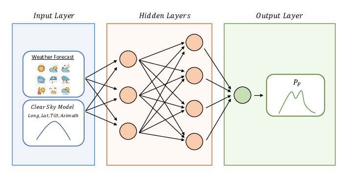
``` 

<!--  -->

```{r figSL2, echo=FALSE, fig.cap="Measured versus forecasted output power by MLP and PHANN methods."}
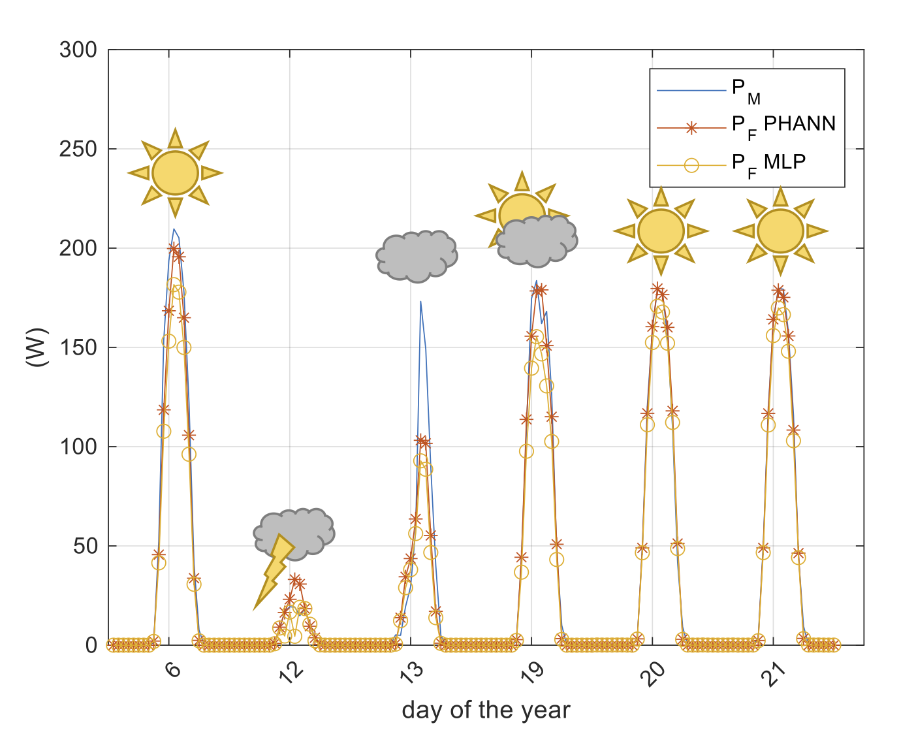
```

@Ogliari2017-mm_SL compared the PV output power day-ahead forecasts
performed by deterministic (based on three and five parameters electric
equivalent circuit) and stochastic hybrid (based on artificial neural
network models) methods aiming to find the best performance conditions.
In general, there is no significant difference between the two
deterministic models, with the three-parameter approach being slightly
more accurate. Figure [10](#fig:figSL3){reference-type="ref"
reference="fig:figSL3"} shows the daily value of normalised mean
absolute error (NMAE%) for 216 days evaluated by using PHANN and three
parameters electric circuit. The PHANN hybrid method achieves the best
forecasting results, and only a few days of training can provide
accurate forecasts.


<!--  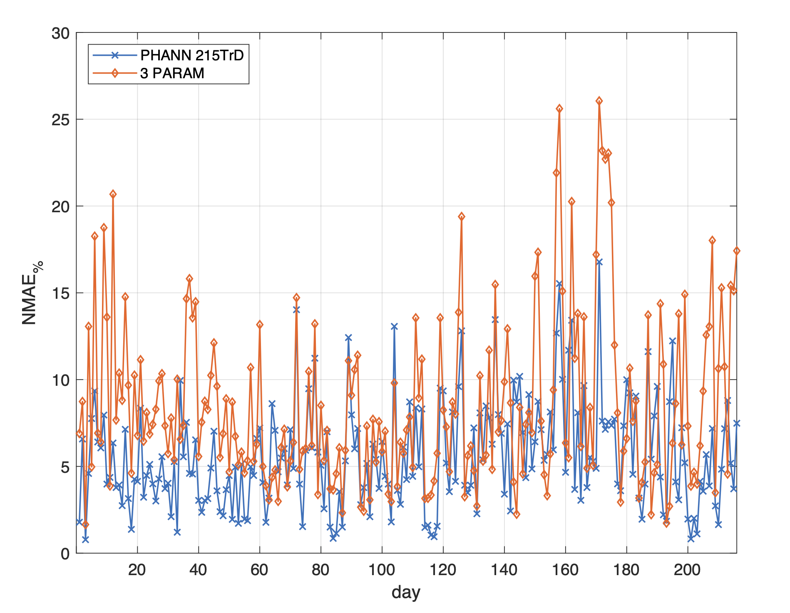 -->


```{r figSL3, echo=FALSE,  fig.show = "hold", out.width="49%", fig.cap='Daily NMAE% of the PHANN method trained with 10 days (left) and with 215 days (right) compared with the three-parameters model.'}
knitr::include_graphics(c("figures/NMAE_PHANN_10_TrD_vs_PHYSICAL.png","figures/NMAE_PHANN_215_TrD_vs_PHYSICAL_3P.png"))
``` 

@Dolara2018-vh_SL analysed the effect of different approaches in the
composition of a training data-set for the day-ahead forecasting of PV
power production based on NN. In particular, the influence of different
data-set compositions on the forecast outcome has been investigated by
increasing the size of the training set size and by varying the lengths
of the training and validation sets, in order to assess the most
effective training method of this machine learning approach. As a
general comment on the reported results, it can be stated that a method
that employs the same chronologically consecutive samples for training
is best suited when the availability of historical data is limited (for
example, in newly deployed PV plant), while training based on randomly
mixed samples method, appears to be most effective in the case of a
greater data availability. Generally speaking, ensembles composed of
independent trials are most effective.

### Long-term simulation for large electrical power systems[^131] {#Long-term_simulation_for_large_electrical_power_systems}

In large electrical power systems with renewable energy dependence, the
power generators need to be scheduled to supply the system demand
[@De_Queiroz2016-pc]. In general, for modelling long-term renewables
future behaviour, such as hydro, wind and solar photovoltaics (PV),
stochastic scenarios should be included in the scheduling, usually in a
dispatch optimisation problem under uncertainty -- like described, for
small systems, in
§[3.4.1](#Building_energy_consumption_forecasting){reference-type="ref"
reference="Building_energy_consumption_forecasting"} and, for wave
forecasting, in §[3.4.7](#Wave_forecasting){reference-type="ref"
reference="Wave_forecasting"}. Due to the complexity and uncertainly
associated, this problem is, in general, modelled with time series
scenarios and multi-stage stochastic approaches. @De_Queiroz2016-pc
presented a review for hydrothermal systems, with a focus on the
optimisation algorithms.
§[3.4.6](#Wind_Power_orecasting){reference-type="ref"
reference="Wind_Power_orecasting"} and
§[3.4.8](#Solar_power_forecasting){reference-type="ref"
reference="Solar_power_forecasting"} explore the up-to-date methods
for wind and PV solar power forecasting.

Here, we emphasise the importance of forecasting with simulation in the
long-term renewable energy planning, especially in hydroelectric
systems. In this context, due to the data spatial and temporal
dependence structure, time series models are useful for future scenarios
generation. Although the proposal could be forecasting for short-term
planning and scheduling (as described in
§[3.4.6](#Wind_Power_orecasting){reference-type="ref"
reference="Wind_Power_orecasting"},
[3.4.7](#Wave_forecasting){reference-type="ref"
reference="Wave_forecasting"}, and
§[3.4.8](#Solar_power_forecasting){reference-type="ref"
reference="Solar_power_forecasting"}), simulation strategies are
explored for considering and estimating uncertainty in medium and/or
long-term horizons.

According to @Hipel1994-oz, stochastic processes of natural phenomena,
such as the renewables ones, are, in general, stationary. One of the
main features of hydroelectric generation systems is the strong
dependence on hydrological regimes. To deal with this task, the
literature focuses on two main classes for forecasting/simulation
streamflow data: physical and data-driven models [@Zhang2015-ql]. Water
resources management for hydropower generation and energy planning is
one of the main challenges for decision-makers. At large, the
hydrological data are transformed into the so-called affluent natural
energy, that is used for scenarios simulation and serve as input for the
optimisation algorithms [@Oliveira2015-cb]. The current state-of-the-art
models for this proposal are the periodic ones. @Hipel1994-oz
presented a wide range of possibilities, but the univariate periodic
autoregressive (PAR, a periodic extension version of the ones presented
in
§[2.3.4](#autoregressive_integrated_moving_average_models){reference-type="ref"
reference="autoregressive_integrated_moving_average_models"}) is
still the benchmark, with several enhanced versions. The approach fits a
model to each period of the historical data and the residuals are
simulated to generate new future versions of the time series, considered
stationary. Among many others, important variations and alternative
proposals to PAR with bootstrap procedures (see bootstrap details in
§[2.7.5](#Forecasting_with_bootstrap){reference-type="ref"
reference="Forecasting_with_bootstrap"}), Bayesian dynamic linear
models, spatial information and copulas versions (for copulas
references, see
§[2.4.3](#bayesian_forecasting_with_copulas){reference-type="ref"
reference="bayesian_forecasting_with_copulas"}) are detailed in
@Souza2012-rq, @Lima2014-eo, @Lohmann2016-bm and
@De_Almeida_Pereira2019-eh, respectively.

It is worth considering the need for renewables portfolio simulation.
This led @Pinheiro_Neto2017-ut to propose a model to integrate hydro,
wind and solar power scenarios for Brazilian data. For the Eastern
United States, @Shahriari2018-hl add to the literature on the wind,
solar and blended portfolios over several spatial and temporal scales.
For China, @Liu2020-lb proposed a multi-variable model, with a unified
framework, to simulate wind and PV scenarios to compensate hydropower
generation. However, in light of the aforementioned, one of the key
challenges and trends for renewable electrical power systems portfolio
simulation are still related to the inclusion of exogenous variables,
such as climate, meteorological, calendar and economic ones, as
mentioned in
§[3.4.2](#Electricity_price_forecasting){reference-type="ref"
reference="Electricity_price_forecasting"}.

### Collaborative forecasting in the energy sector[^132] {#Collaborative_forecasting_in_the_energy_sector}

As mentioned in
§[3.4.6](#Wind_Power_orecasting){reference-type="ref"
reference="Wind_Power_orecasting"}, the combination of
geographically distributed time series data, in a collaborative
forecasting (or data sharing) framework, can deliver significant
improvements in the forecasting accuracy of each individual renewable
energy power plant. The same is valid for hierarchical load
forecasting [@Hong2019] and energy price forecasting (see
§[3.4.2](#Electricity_price_forecasting){reference-type="ref"
reference="Electricity_price_forecasting"}). A review of
multivariate time series forecasting methods can be found in
§[2.3.9](#Forecasting_with_many_variables){reference-type="ref"
reference="Forecasting_with_many_variables"} 2.3.11 and
§[2.4.3](#bayesian_forecasting_with_copulas){reference-type="ref"
reference="bayesian_forecasting_with_copulas"}. However, this data
might have different owners, which are unwilling to share their data due
to the following reasons: (*i*) personal or business sensitive
information, (*ii*) lack of understanding about which data can and
cannot be shared, and (*iii*) lack of information about economic (and
technical) benefits from data sharing.

In order to tackle these limitations, recent research in energy time
series forecasting is exploring two alternative (and potentially
complementary) pathways: (*i*) privacy-preserving analytics, and (*ii*)
data markets.

The role of privacy-preserving techniques applied collaborative
forecasting is to combine time series data from multiple data owners in
order to improve forecasting accuracy and keep data private at the same
time. For solar energy forecasting, @Berdugo2011 described a method
based on local and global analog-search that uses solar power time
series from neighbouring sites, where only the timestamps and normalised
weights (based on similarity) are exchanged and not the time series
data. @Zhang2018 proposed, for wind energy forecasting with
spatia-temporal data, a combination of ridge linear quantile regression
and Alternating Direction Method of Multipliers (ADMM) that enables each
data owner to autonomously solve its forecasting problem, while
collaborating with the others to improve forecasting accuracy. However,
as demonstrated by @Goncalves2020, the mathematical properties of these
algorithms should be carefully analysed in order to avoid privacy
breaches (i.e., when a third party recovers the original data without
consent).

An alternative approach is to design a market (or auction) mechanism for
time series or forecasting data where the data owners are willing to
sell their private (or confidential) data in exchange for an economic
compensation [@Agarwal2018]. The basic concept consists in pricing data
as a function of privacy loss, but it can be also pricing data as a
function of tangible benefits such as electricity market profit
maximization. @Goncalves2020a adapted for renewable energy forecasting
the model described in @Agarwal2018, by considering the temporal nature
of the data and relating data price with the extra revenue obtained in
the electricity market due to forecasting accuracy improvement. The
results showed a benefit in terms of higher revenue resulting from the
combination of electricity and data markets. With the advent of
peer-to-peer energy markets at the domestic consumer level [@Parag2016],
smart meter data exchange between peers is also expected to increase and
enable collaborative forecasting schemes. For this
scenario, @Yassine2015 proposed a game theory mechanism where a energy
consumer maximizes its reward by sharing consumption data and a data
aggregator can this data with a data analyst (which seeks data with the
lowest possible price).

Finally, promoting data sharing via privacy-preserving or data
monetisation can also solve data scarcity problems in some use cases of
the energy sector, such as forecasting the condition of electrical grid
assets [@Fan2020]. Moreover, combination of heterogeneous data sources
(e.g., numerical, textual, categorical) is a challenging and promising
avenue of future research in collaborative forecasting [@Obst2019].

Environmental applications {#Environmental_applications}
--------------------------

### Forecasting two aspects of climate change[^133] {#Climate_Forecasting}

First into the Industrial Revolution, the UK is one of the first out: in
2013 its per capita CO$_2$ emissions dropped below their 1860 level,
despite per capita real incomes being around 7-fold higher
[@DFH_HendUKCO2FIFO]. The model for forecasting UK CO$_2$ emissions was
selected from annual data 1860-2011 on CO$_2$ emissions, coal and oil
usage, capital and GDP, their lags and non-linearities (see
§[3.5.2](#Weather_Forecasting){reference-type="ref"
reference="Weather_Forecasting"} for higher frequency weather
forecasts). Figures [11](#fig:hendryUKCO2Figure1){reference-type="ref"
reference="fig:hendryUKCO2Figure1"}(a) to
[11](#fig:hendryUKCO2Figure1){reference-type="ref"
reference="fig:hendryUKCO2Figure1"}(c) show the non-stationary time
series with strong upward then downward trends, punctuated by large
outliers from world wars, miners strikes plus shifts from legislation
and technological change: @DFH_CastleFTECE20. Saturation estimation at
0.1% using *Autometrics* [@JLC_Door07Auto] retaining all other
regressors, detected 4 step shifts coinciding with major policy
interventions like the 2008 Climate Change Act, plus numerous outliers,
revealing a cointegrated relation. The multi-step forecasts over
2012---2017 from a VAR in panel (d) of Figure
[11](#fig:hendryUKCO2Figure1){reference-type="ref"
reference="fig:hendryUKCO2Figure1"} show the advantage of using
step-indicator saturation (SIS: @JLC_CDHPSIS15).

<!--  -->

```{r hendryUKCO2Figure1, echo=FALSE, fig.cap="(a) UK emissions, (b) energy sources in megatonnes (Mt) and megatonnes of oil equivalent (Mtoe), (c) economic variables, and (d) multi-step forecasts of CO2 emissions in Mt."}
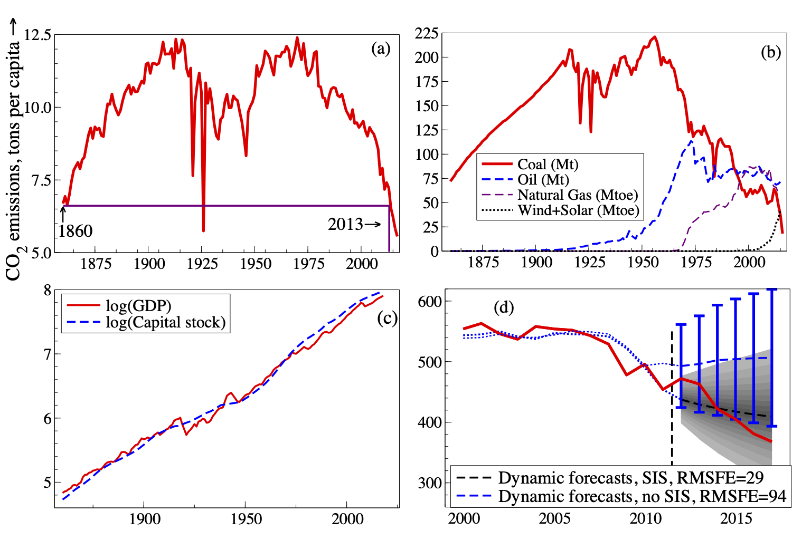
```


We formulated a 3-equation simultaneous model of atmospheric CO$_2$ and
Antarctic Temperature and Ice volume over 800,000 years of Ice Ages in
1000-year frequency [@DFH_Paillard01; @DFH_KaufJuse2013]. Driven by
non-linear functions of eccentricity, obliquity, and precession (see
panels (a), (b), and (c) of Figure
[12](#fig:hendryIJFIceAge1){reference-type="ref"
reference="fig:hendryIJFIceAge1"} respectively), the model was selected
with saturation estimation. Earth's orbital path is calculable into the
future ([@DFH_CrollJames] and [@DFH_Milankovitch41]), allowing 100,000
years of multi-step forecasts at endogenous emissions. Humanity has
affected climate since 10 thousand years ago (kya: @DFH_Ruddiman05),
so we commence forecasts there. Forecasts over $-10$ to 100 with time
series from 400kya in panels (d) to (f) of Figure
[12](#fig:hendryIJFIceAge1){reference-type="ref"
reference="fig:hendryIJFIceAge1"} show paths within the ranges of past
data $\pm$2.2SE [@DFH_PretisKauf18].

<!--  -->

```{r hendryIJFIceAge1, echo=FALSE, fig.cap="Ice-Age data, model fits, and forecasts with endogenous CO~2~."}
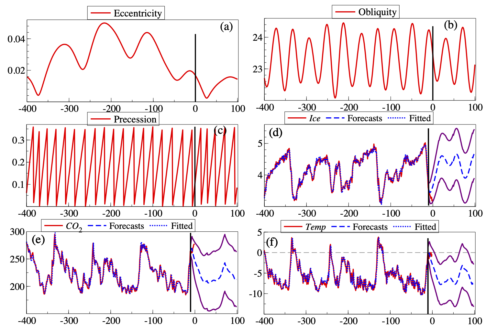
```

Atmospheric CO$_2$ already exceeds 400ppm (parts per million),
dramatically outside the Ice-Age range [@DFH_SundKeel09]. Consequently,
we conditionally forecast the next 100,000 years, simulating the
potential climate for anthropogenic CO$_2$ [@DFH_CHIceAgeCO2] noting the
'greenhouse' temperature is proportional to the logarithm of CO$_2$
([@DFH_Arrhen96]). The orbital drivers will continue to influence all
three variables but that relation is switched off in the scenario for
'exogenised' CO$_2$. The 110 dynamic forecasts conditional on 400ppm and
560ppm with ±2SE bands are shown in Figure
[13](#fig:hendryIcAgeFigure2){reference-type="ref"
reference="fig:hendryIcAgeFigure2"}, panels (a) and (b) for Ice and
Temperature respectively. The resulting global temperature rises
inferred from these Antarctic temperatures would be dangerous, at more
than 5$^{\circ}$C, with Antarctic temperatures positive for thousands of
years [@DFH_VaksHender19; @DFH_PretisKauf20].

<!-- 
 -->
```{r hendryIcAgeFigure2, echo=FALSE, fig.cap="Ice-Age simulations with exogenous CO~2~."}
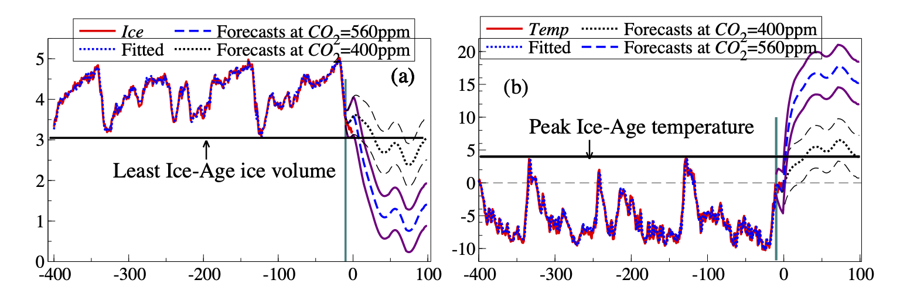
```

### Weather forecasting[^134] {#Weather_Forecasting}

The weather has a huge impact on our lives, affecting health, transport,
agriculture (see also
§[3.8.10](#The_Forecastability_of_agricultural_time_series){reference-type="ref"
reference="The_Forecastability_of_agricultural_time_series"}),
energy use (see also §[3.4](#Energy){reference-type="ref"
reference="Energy"}), and leisure. Since @Bjerknes1904_TT introduced
hydrodynamics and thermodynamics into meteorology, weather prediction
has been based on merging physical principles and observational
information. Modern weather forecasting is based on numerical weather
prediction (NWP) models that rely on accurate estimates of the current
state of the climate system, including ocean, atmosphere and land
surface. Uncertainty in these estimates is propagated through the NWP
model by running the model for an ensemble of perturbed initial states,
creating a weather forecast ensemble
[@Buizza2018_TT; @TothBuizza2019_TT].

One principal concern in NWP modelling is that small-scale phenomena
such as clouds and convective precipitation are on too small a scale to
be represented directly in the models and must, instead, be represented
by approximations known as parameterisations. Current NWP model
development aims at improving both the grid resolution and the
observational information that enters the models
[@Bannister&2020_TT; @Leuenberger&2020_TT]. However, for fixed
computational resources, there is a trade-off between grid resolution
and ensemble size, with a larger ensemble generally providing a better
estimate of the prediction uncertainty. Recent advances furthermore
include machine learning approaches (see
§[2.7.10](#machine_Learning){reference-type="ref"
reference="machine_Learning"}) to directly model the small-scale
processes, in particular cloud processes [see, for example,
@Gentine&2018_TT; @Rasp&2018_TT].

Despite rapid progress in NWP modelling, the raw ensemble forecasts
exhibit systematic errors in both magnitude and spread [@Buizza2018_TT].
Statistical post-processing is thus routinely used to correct systematic
errors in calibration and accuracy before a weather forecast is issued;
see @Vannitsem&2018_TT for a recent review but also
§[2.12.4](#evaluating_probabilistic_forecasts){reference-type="ref"
reference="evaluating_probabilistic_forecasts"} and
§[2.12.5](#assessing_the_reliability_of_probabilistic_forecats){reference-type="ref"
reference="assessing_the_reliability_of_probabilistic_forecats"}. A
fundamental challenge here is to preserve physical consistency across
space, time and variables [see, for example,
@Moeller&2013_TT; @Schefzik&2013_TT; @Heinrich&2020_TT]. This is
particularly important when the weather forecast is used as input for
further prediction modelling, e.g., in hydrometeorology
[@Hemri&2015_TT; @Hemri2018_TT].

At time scales beyond two weeks, the weather noise that arises from the
growth of the initial uncertainty, becomes large [@Royer1993_TT].
Sources of long-range predictability are usually associated with the
existence of slowly evolving components of the earth system, including
the El Niño Southern Oscillation (ENSO), monsoon rains, the Madden
Julian Oscillation (MJO), the Indian Ocean dipole, and the North
Atlantic Oscillation (NAO), spanning a wide range of time scales from
months to decades [@Vitart&2012_TT; @Hoskins2013_TT]. It is expected
that, if a forecasting system is capable of reproducing these slowly
evolving components, they may also be able to forecast them
[@vanSchaeybroeckVannitsem2018_TT]. The next step is then to find
relationships between modes of low-frequency variability and the
information needed by forecast users such as predictions of surface
temperature and precipitation [@RoulinVannitsem2019_TT; @Smith&2020_TT].

### Air quality forecasting[^135] {#Air_quality_forecasting}

To preserve human health, European Commission stated in the Directive
(2008/50/EC) that member states have to promptly inform the population
when the particulate matter (PM) daily mean value exceeds (or is
expected to exceed) the threshold of $50 \mu g/m^3$. Therefore, systems
have been designed in order to produce forecasts for up to three days in
advance using as input the measured value of concentration and
meteorological conditions. These systems can be classified in (*i*)
data-driven models [@CARNEVALE2016_CC; @STADLOBER2018_CC; @CORANI2005_CC
and §[2.7](#data_driven_approaches){reference-type="ref"
reference="data_driven_approaches"}], and (*ii*) deterministic
chemical and transport models [@HONORE2007_CC; @MANDERS2009_CC]. In this
section, a brief overview of the application of these systems to the
high polluted area of Lombardy region, in Italy, will be presented.

@CARNEVALE2018_CC compared the results of three different forecasting
systems based on neural networks, lazy learning models, and regression
trees respectively. A single model has been identified for each
monitoring station. In the initial configuration, only the last three PM
measurements available were used to produce the forecast. In this
configuration, the systems offered reasonable performance, with
correlation coefficients ranging from 0.6 (lazy learning method) to 0.75
(neural network). The work also demonstrated that the performance of the
ensemble of the three systems was better than the best model for each
monitoring station (see also
§[2.6](#combining_forecasts){reference-type="ref"
reference="combining_forecasts"} for further discussions on forecast
combinations).

Starting from the results of this work, a second configuration was
implemented, using as input also the wind speed measured in the
meteorological monitoring station closest to the measurement point of
PM. The researchers observed an improvement in all performance indices,
with the median of the correlation for the best model (neural networks)
increasing from 0.75 to 0.82 and the RMSE dropping from $15 \mu g/m^3$
to $7 \mu g/m^3$.

One of the main drawbacks of data-driven models for air quality is that
they provide information only in the point where the measurements are
available. To overcome this limitation, recent literature has presented
mixed deterministic and data-driven approaches [see, for example,
@CARNEVALE2020_CC] which use the data assimilation procedure and offer
promising forecasting performance.

From a practical point of view, critical issues regarding forecasting
air quality include:

-   Information collection and data access: even if regional authorities
    have to publicly provide data and information related to air quality
    and meteorology, the measured data are not usually available in
    real-time and the interfaces are sometimes not automated;

-   Data quantity: the amount of information required by air quality
    forecasting systems is usually large, in particular towards the
    definition of the training and validation sets;

-   Non-linear relationships: the phenomenon of accumulation of
    pollutants in atmosphere is usually affected by strong
    nonlinearities, which significantly impact the selection of the
    models and their performance;

-   Unknown factors: it is a matter of fact that the dynamic of
    pollutants in atmosphere is affected by a large number of
    non-measurable variables (such as meteorological variables or the
    interaction with other non-measurable pollutants), largely affecting
    the capability of the models to reproduce the state of the
    atmosphere.

### Forecasting and decision making for floods and water resources management[^136] {#Forecasting_and_decision_making_for_floods}

In Water Resources and Flood Risk Management, decision makers are
frequently confronted with the need of taking the most appropriate
decisions not knowing what will occur in the future. To support their
decision-making under uncertainty, decision theory
[@Berger1985-sm_ET; @Bernardo1994-is_ET; @DeGroot2004-xh_ET] invokes
Bayesian informed decision approaches, which find the most appropriate
decision by maximising (or minimising) the expected value of a "utility
function", thus requiring its definition, together with the estimation
of a "predictive probability" density [@Berger1985-sm_ET] due to the
fact that utility functions are rarely linear or continuous.
Consequently, their expected value does not coincide with the value
assumed on the predicted "deterministic" expected value. Accordingly,
overcoming the classical 18^th^ century "mechanistic" view by resorting
into probabilistic forecasting approaches becomes essential (see also
§[2.6.2](#Density_forecast_combinations){reference-type="ref"
reference="Density_forecast_combinations"}).

The failure of decision-making based on deterministic forecasts in the
case of Flood Risk Management is easily shown through a simple example.
At a river section, the future water level provided by a forecast is
uncertain and can be described by a Normal distribution with mean 10
meters and standard deviation of 5 meters. Given a dike elevation of
10.5 meters, damages may be expected as zero if water level falls below
the dike elevation and linearly growing when level exceeds it with a
factor of $10^6$ dollars. If one assumes the expect value of forecast as
the deterministic prediction to compute the damage the latter will
result equal to zero, while if one correctly integrates the damage
function times the predictive density the estimated expected damage will
results into 6.59 millions of dollars and educated decisions on alerting
or not the population or evacuating or not a flood-prone area can be
appropriately taken (see also
§[3.6](#Social_good){reference-type="ref"
reference="Social_good"}).

Water resources management, and in particular reservoirs management, aim
at deriving appropriate operating rules via long term expected benefits
maximisation. Nonetheless, during flood events decision makers must
decide how much to preventively release from multi-purpose reservoirs in
order to reduce dam failure and downstream flooding risks the optimal
choice descending from trading-off between loosing future water resource
vs the reduction of short term expected losses.

This is obtained by setting up an objective function based on the linear
combination of long and short term "expected losses", once again based
on the available probabilistic forecast. This Bayesian adaptive
reservoir management approach incorporating into the decision mechanism
the forecasting information described by the short-term predictive
probability density, was implemented on the lake Como since 1997
[@Todini1999-xc_ET; @Todini2017-jm_ET] as an extension of an earlier
original idea [@Todini1991-vu_ET]. This resulted into:

-   a reduction of over 30% of of the city of Como frequency;

-   an average reduction of 12% of the water deficit;

-   an increase of 3% in the electricity production.

Lake Como example clearly shows that instead of basing decisions on the
deterministic prediction, the use of a Bayesian decision scheme, in
which model forecasts describe the predictive probability density,
increases the reliability of the management scheme by essentially
reducing the probability of wrong decisions
[@Todini2017-jm_ET; @Todini2018-dj_ET].

Social good and demographic forecasting {#Social_good}
---------------------------------------

### Healthcare[^137] {#Heathcare}

There are many decisions that depend on the quality of forecasts in the
health care system, from capacity planning to layout decisions to the
daily schedules. In general, the role of forecasting in health care is
to inform both clinical and non-clinical decisions. While the former
concerns decisions related to patients and their treatments
[@makridakis2019forecasting_BRT], the latter involves policy/management,
and supply chain decisions that support the delivery of high-quality
care for patients.

A number of studies refer to the use of forecasting methods to inform
clinical decision making. These methods are used to screen high risk
patients for preventative health care
[@chen2015predicting_BRT; @van2014predicting_BRT; @santos2015new_BRT; @uematsu2014development_BRT],
to predict mental health issues
[@shen2017depression_BRT; @tran2013integrated_BRT], to assist diagnosis
and disease progression
[@ghassemi2015multivariate_BRT; @ma2017dipole_BRT; @pierce2010chest_BRT; @qiao2019mnn_BRT],
to determine prognosis
[@dietzel2010application_BRT; @ng2007comparison_BRT], and to recommend
treatments for patients
[@kedia2003predictors_BRT; @scerri2006intermed_BRT; @shang2019pre_BRT].
Common forecasting methods to inform clinical decisions include time
series (see
§[2.3.1](#exponential_smoothing_models){reference-type="ref"
reference="exponential_smoothing_models"},
§[2.3.4](#autoregressive_integrated_moving_average_models){reference-type="ref"
reference="autoregressive_integrated_moving_average_models"}, and
§[2.3.5](#forecasting_for_multiple_seasonal_cycles){reference-type="ref"
reference="forecasting_for_multiple_seasonal_cycles"}), regression
(see §[2.3.2](#time_series_regression_models){reference-type="ref"
reference="time_series_regression_models"}), classification tree
(see §[2.7.12](#clustering_based_forecasting){reference-type="ref"
reference="clustering_based_forecasting"}), neural networks (see
§[2.7.8](#neural_networks){reference-type="ref"
reference="neural_networks"}), Markov models (see
§[2.3.12](#Markov_switching_models){reference-type="ref"
reference="Markov_switching_models"}) and Bayesian networks. These
models utilise structured and unstructured data including clinician
notes [@austin2016application_BRT; @labarere2014derive_BRT] which makes
the data pre-processing a crucial part of the forecasting process in
clinical health care.

One of the aspects of the non-clinical forecasting that has received the
most attention in both research and application is the policy and
management. Demand forecasting is regularly used in Emergency
Departments
[@arora2020probabilistic_BRT; @choudhury2020forecasting_BRT; @khaldi2019forecasting_BRT; @rostami2020anticipating_BRT],
ambulance services
[@al2020empirical_BRT; @setzler2009ems_BRT; @Vile2011_BRT; @zhou2016predicting_BRT]
and hospitals with several different specialities
[@mccoy2018assessment_BRT; @ordu2019comprehensive_BRT; @zhou2018time_BRT]
to inform operational, tactical and strategic planning. The common
methods used for this purpose include classical ARIMA and exponential
smoothing methods, regression, singular spectrum analysis, Prophet,
Double-Seasonal Holt-Winter, TBATS and Neural Networks. In public
health, forecasting can guide policy and planning. Although it has a
wider definition, the most attention is given to Epidemic forecasting
(see also §[3.6.2](#Pandemics){reference-type="ref"
reference="Pandemics"}).

Forecasting is also used in both national and global health care supply
chains, not only to ensure the availability of medical products for the
population but also to avoid excessive inventory. Additionally, the lack
of accurate demand forecast in a health supply chain may cost lives
[@baicker2012saving_BRT] and has exacerbated risks for suppliers
[@levine2008demand_BRT]. Classical exponential smoothing, ARIMA,
regression and Neural Network models have been applied to estimate the
drug utilisation and expenditures
[@dolgin2010better_BRT; @linner2020forecasting_BRT], blood demand
[@fortsch2016reducing_BRT], hospital supplies
[@gebicki2014evaluation_BRT; @riahi2013three_BRT] and demand for global
medical items
[@amarasinghe2010forecasting_BRT; @hecht2008demand_BRT; @van2016demand_BRT].
It is important to note that, while the demand in a health care supply
chain has often grouped and hierarchical structures [@Mircetica2020_BRT
see also
§[2.10.1](#Cross_sectional_hierarchical_forecasting){reference-type="ref"
reference="Cross_sectional_hierarchical_forecasting"}], this has not
been well investigated and needs more attention.

### Epidemics and pandemics[^138] {#Pandemics}

Pandemics and epidemics both refer to disease outbreaks. An epidemic is
a disease outbreak that spreads across a particular region. A pandemic
is defined as spread of a disease worldwide. Forecasting the evolution
of a pandemic or an epidemic, the growth of cases and fatalities for
various horizons and levels of granularity, is a complex task with raw
and limited data -- as each disease outbreak type has unique features
with several factors affecting the severity and the contagiousness. Be
that as it may, forecasting becomes an paramount task for the countries
to prepare and plan their response [@Nikolopoulos2020_YK], both in
healthcare and the supply chains [@Belien2012-sp_KN see also
§[3.6.1](#Heathcare){reference-type="ref" reference="Heathcare"}
and §[3.2.2](#Forecasting_in_the_supply_chain){reference-type="ref"
reference="Forecasting_in_the_supply_chain"}].

Successful forecasting methods for the task include time-series methods
(see
§[2.3](#Statistical_and_econometric_models){reference-type="ref"
reference="Statistical_and_econometric_models"}), epidemiological
and agent-based models (see
§[2.7.3](#Agent_based_models){reference-type="ref"
reference="Agent_based_models"}), metapopulation models, approaches
in metrology [@Nsoesie2013-sj_KN], machine and deep learning methods
[@Yang2020-ll_KN]. @Andersson2008-yc_KN used regression models for the
prediction of the peak time and volume of cases for a pandemic with
evidence from seven outbreaks in Sweden. @Yaffee2011-pi_KN forecasted
the evolution of the Hantavirus epidemic in USA and compared causal and
machine-learning methods with time-series methods and found that
univariate methods quite successful. @Soebiyanto2010-rh_KN used ARIMA
models for successfully short-term forecasting of influenza weekly
cases. @shaman2012forecasting_BRT used Kalman filter based SIR
epidemiological models to forecast the peak time of influenza 6-7 weeks
ahead.

For COVID-19, @Petropoulos2020-qm_KN applied a multiplicative
exponential smoothing model (see also
§[2.3.1](#exponential_smoothing_models){reference-type="ref"
reference="exponential_smoothing_models"}) for predicting global
number of confirmed cases, with very successful results both for point
forecasts and prediction intervals. This article got serious traction
with 100,000 views and 300 citations in the first twelve months since
its publication, thus evidencing the importance of such empirical
investigations. There has been a series of studies focusing on
predicting deaths in the USA and European countries for the first wave
of the COVID-19 pandemic [@IHME_COVID-19-yz_KN; @IHME_COVID-19-nx_KN].
Furthermore, @Petropoulos2020covidIJF_KN expanded their investigation to
capture the continuation of both cases and deaths as well as their
uncertainty, achieving high levels of forecasting accuracy for
ten-days-ahead forecasts over a period of four months. Along the same
lines, @Doornik2020-es_KN have been publishing real-time accurate
forecasts of confirmed cases and deaths from mid-March 2020 onwards.
Their approach is based on extraction of trends from the data using
machine learning.

@Pinson2020-va_KN organised a debate between Taleb and Ioannidis on
forecasting pandemics. @Ioannidis2020-wk_KN claim that forecasting for
COVID-19 has by and large failed. However they give recommendations of
how this can be averted. They suggest that the focus should be on
predictive distributions and models should be continuously evaluated.
Moreover, they emphasise the importance of multiple dimensions of the
problem (and its impact). @Taleb2020-ki_PC discuss the dangers of using
naive, empirical approaches for fat-tailed variables and tail risk
management. They also reiterate the inefficiency of point forecasts for
such phenomena.

Finally, @Nikolopoulos2020-ua_KN focused on forecast-driven planning,
predicting the growth of COVID-19 cases and the respective disruptions
across the supply chain at country level with data from the USA, India,
UK, Germany, and Singapore. Their findings confirmed the excess demand
for groceries and electronics, and reduced demand for automotive -- but
the model also proved that the earlier a lock-down is imposed, the
higher the excess demand will be for groceries. Therefore, governments
would need to secure high volumes of key products before imposing
lock-downs; and, when this is not possible, seriously consider more
radical interventions such as rationing.

Dengue is one of the most common epidemic diseases in tropical and
sub-tropical regions of the world. Estimates of World Health
Organisation reveals that about half of the world's population is now at
risk for Dengue infection [@romero2019applying_Thiyanga]. *Aedes
aegypti* and *Aedes albopictus* are the principal vectors of dengue
transmission and they are highly domesticated mosquitoes. Rainfall,
temperature and relative humidity are thought of as important factors
attributing towards the growth and dispersion of mosquito vectors and
potential of dengue outbreaks [@banu2011dengue_Thiyanga].

In reviewing the existing literature, two data types have been used to
forecast dengue incidence: (*i*) spatio-temporal data: incidence of
laboratory-confirmed dengue cases among the clinically suspected
patients [@naish2014climate_Thiyanga], (*ii*) web-based data: Google
trends, tweets associated with Dengue cases [@de2017dengue_Thiyanga].

SARIMA models (see also
§[2.3.4](#autoregressive_integrated_moving_average_models){reference-type="ref"
reference="autoregressive_integrated_moving_average_models"}) have
been quite popular in forecasting laboratory-confirmed dengue cases
[@martinez2011predicting_Thiyanga; @gharbi2011time_Thiyanga; @promprou2006forecasting_Thiyanga].
@chakraborty2019forecasting_Thiyanga used a hybrid model combining ARIMA
and neural network autoregressive (NNAR) to forecast dengue cases. In
light of biological relationships between climate and transmission of
*Aedes* mosquitoes, several studies have used additional covariates such
as, rainfall, temperature, wind speed, and humidity to forecasts dengue
incidence
[@banu2011dengue_Thiyanga; @naish2014climate_Thiyanga; @talagala2015distributed_Thiyanga].
Poisson regression model has been widely used to forecast dengue
incidence using climatic factors and lagged time between dengue
incidence and weather variables
[@hii2012forecast_Thiyanga; @koh2018model_Thiyanga]. Several researchers
looked at the use of Quasi‐Poisson and negative binomial regression
models to accommodate over dispersion in the counts
[@lowe2011spatio_Thiyanga; @wang2014study_Thiyanga].
@cazelles2005nonstationary_Thiyanga used wavelet analysis to explore the
dynamic of dengue incidence and wavelet coherence analyses was used to
identify time and frequency specific association with climatic
variables. @de2017dengue_Thiyanga took a different perspective and look
at weekly tweets to forecast Dengue cases.
@rangarajan2019forecasting_Thiyanga used Google trend data to forecast
Dengue cases. Authors hypothesised that web query search related to
dengue disease correlated with the current level of dengue cases and
thus may be helpful in forecasting dengue cases.

A direction for future research in this field is to explore the use of
spatio-temporal hierarchical forecasting (see
§[2.10](#forecasting_by_aggregation){reference-type="ref"
reference="forecasting_by_aggregation"}).

### Forecasting mortality [^139] {#Forecasting_mortality_data}

Actuarial, Demographic, and Health studies are some examples where
mortality data are commonly used. A valuable source of mortality
information is the Human Mortality Database (HMD), a database that
provides mortality and population data for 41 mainly developed
countries. Additionally, at least five country-specific databases are
devoted to subnational data series: Australian, Canadian, and French
Human Mortality Databases, United States and Japan Mortality Databases.
In some situations, the lack of reliable mortality data can be a
problem, especially in developing countries, due to delays in
registering or miscounting deaths [@checchi2005interpreting_CC].
Analysis of National Causes of Death for Action (ANACONDA) is a valuable
tool that assesses the accuracy and completeness of data for mortality
and cause of death by checking for potential errors and inconsistencies
[@mikkelsen2020anaconda_CC].

The analysis of mortality data is fundamental to public health
authorities and policymakers to make decisions or evaluate the
effectiveness of prevention and response strategies. When facing a new
pandemic, mortality surveillance is essential for monitoring the overall
impact on public health in terms of disease severity and mortality
[@setel2020mortality_CC; @vestergaard2020excess_CC]. A useful metric is
excess mortality and is the difference between the observed number of
deaths and the expected number of deaths under "normal" conditions
[@checchi2005interpreting_CC; @aron2020measuring_CC]. Thus, it can only
be estimated with accurate and high-quality data from previous years.
Excess mortality has been used to measure the impact of heat events
[@matte2016excess_CC; @limaye2018climate_CC], pandemic influenza
[@nunes2011excess_CC; @nielsen2013pooling_CC], and nowadays COVID-19
[@nogueira2020excess_CC; @sinnathamby2020all_CC; @owidcoronavirus_CC; @SX21_HLS
and §[3.6.2](#Pandemics){reference-type="ref"
reference="Pandemics"}], among others. Excess mortality data have
been making available by the media publications *The Economist*, *The
New York Times* and *The Financial Times*. Moreover, a monitoring system
of the weekly excess mortality in Europe has been performed by the
EuroMOMO project [@vestergaard2020excess_CC].

An essential use of mortality data for those individuals at age over 60
is in the pension and insurance industries, whose profitability and
solvency crucially rely on accurate mortality forecasts to adequately
hedge longevity risks [see, e.g., @SH20; @SH20b]. Longevity risk is a
potential systematic risk attached to the increasing life expectancy of
annuitants, and it is an important factor to be considered when
determining a sustainable government pension age [see, e.g., @HZS21_HLS
for Australia]. The price of a fixed-term or lifelong annuity is a
random variable, as it depends on the value of zero-coupon bond price
and mortality forecasts. The zero-coupon bond price is a function of
interest rate (see
§[3.3.6](#Interest_rate_prediction){reference-type="ref"
reference="Interest_rate_prediction"}) and is comparably more stable
than the retirees' mortality forecasts.

Several methodologies were developed for mortality modelling and
forecasting [@booth2008mortality_CC; @janssen2018advances_CC]. These
methods can be grouped into three categories: expectation, explanation,
and extrapolation [@booth2008mortality_CC].

The expectation approach is based on the subjective opinion of experts
(see also §[2.11.4](#panels_of_experts){reference-type="ref"
reference="panels_of_experts"}), who set a long-run mortality
target. Methods based on expectation make use of experts' opinions
concerning future mortality or life expectancy with a specified path and
speed of progression towards the assumed value [@CMI20]. The advantage
of this approach is that demographic, epidemiological, medical, and
other relevant information may be incorporated into the forecasts. The
disadvantages are that such information is subjective and biased towards
experts' opinions, and it only produces scenario-based (see
§[2.11.5](#scenarios_forecasting){reference-type="ref"
reference="scenarios_forecasting"}) deterministic forecasts
[@AV90; @WH04].

The explanation approach captures the correlation between mortality and
the underlying cause of death. Methods based on the explanation approach
incorporate medical, social, environmental, and behavioural factors into
mortality modelling. Example include smoking and disease-related
mortality models. The benefit of this approach is that mortality change
can be understood from changes in related explanatory variables; thus,
it is attractive in terms of interpretability [@GV98].

The extrapolative approach is considered more objective, easy to use and
more likely to obtain better forecast accuracy than the other two
approaches [@janssen2018advances_CC]. The extrapolation approach
identifies age patterns and trends in time which can be then forecasted
via univariate and multivariate time series models (see
§[2.3](#Statistical_and_econometric_models){reference-type="ref"
reference="Statistical_and_econometric_models"}). In the
extrapolation approach, many parametric and nonparametric methods have
been proposed [see, e.g., @AS05; @HU07; @SBH11]. Among the parametric
methods, the method of @HP80 is well-known. Among the nonparametric
methods, the Lee-Carter model [@lee1992modeling_CC], Cairns-Blake-Dowd
model [@CDB+09; @DCB+10], and functional data model [@HU07 and
§[2.3.10](#Functional_time_series_models){reference-type="ref"
reference="Functional_time_series_models"}], as well as their
extensions and generalisations are dominant. The time-series
extrapolation approach has the advantage of obtaining a forecast
probability distribution rather than a deterministic point forecast and,
also, enable the determination of forecast intervals
[@booth2008mortality_CC].

@janssen2018advances_CC presents a review of the advances in mortality
forecasting and possible future research challenges.

### Forecasting fertility[^140] {#Forecasting_fertility}

Aside from being a driver of population forecasts (see
§[2.3.7](#Models_for_population_processes){reference-type="ref"
reference="Models_for_population_processes"}), fertility forecasts
are vital for planning maternity services and anticipating demand for
school places. The key challenge relates to the existence of, and
interaction between, the quantum (how many?) and tempo (when?)
components [@Booth2006-zp_JE]. This intrinsic dependence on human
decisions means that childbearing behaviour is influenced by numerous
factors acting at different levels, from individual characteristics to
societal change [@Balbo2013-jh_JE]. An important methodological
challenge for many low- and middle-income countries is fertility
estimation, due to deficiencies in vital statistics caused by inadequate
birth registration systems
[@Moultrie2013-ce_JE; @AbouZahr2015-az_JE; @Phillips2018-eo_JE]. Such
countries are often also in the process of transitioning from high to
low fertility, which induces greater forecast uncertainty compared to
low-fertility countries
[@United_Nations_Development_Programme2019-kb_JE].

A range of statistical models have been proposed to forecast fertility
-- see @Booth2006-zp_JE, @Bohk-Ewald2018-vb_JE, and @Shang2020-jr_JE for
reviews. The Lee-Carter model [@lee1992modeling_CC] originally developed
for mortality forecasting (see
§[3.6.3](#Forecasting_mortality_data){reference-type="ref"
reference="Forecasting_mortality_data"}) has been applied to
fertility [@Lee1993-pg_JE], with extensions in functional data [@HU07]
and Bayesian [@Wisniowski2015-bp_JE] contexts. Other notable
extrapolative methods include the cohort-ARIMA model of
@De_Beer1985-ia_JE [@De_Beer1990-rz_JE] -- see
§[2.3.4](#autoregressive_integrated_moving_average_models){reference-type="ref"
reference="autoregressive_integrated_moving_average_models"} -- and
the linear extrapolation method of @Myrskyla2013-ds_JE. Many parametric
models have been specified to describe the shapes of fertility curves
[@Brass1974-zf_JE; @Hoem1981-fk_JE; @Evans1986-hf_JE; @Schmertmann2003-tl_JE],
with forecasts obtained through time series extrapolations of the
parameters [@Congdon1990-fy_JE; @Knudsen1993-eh_JE; @De_Iaco2016-uw_JE].
Bayesian methods have been used to borrow strength across countries [for
example, @Alkema2011-zd_JE; @Schmertmann2014-fk_JE], with
@Ellison2020-hb_JE developing a hierarchical model in the spirit of the
latter. The top-down approach (see
§[2.10.1](#Cross_sectional_hierarchical_forecasting){reference-type="ref"
reference="Cross_sectional_hierarchical_forecasting"}) of the
former, which is used by the United Nations, projects the aggregate
Total Fertility Rate (TFR) measure probabilistically [also see
@Tuljapurkar1999-ij_JE] before decomposing it by age. @Hyppola1949-uy_JE
provide one of the earliest known examples of probabilistic fertility
forecasting [@AS05].

Little work has been done to compare forecast performance across this
broad spectrum of approaches. The study of @Bohk-Ewald2018-vb_JE is the
most comprehensive to date. Most striking is their finding that few
methods can better the naive freezing of age-specific rates, and those
that can differ greatly in method complexity (see also
§[2.5.2](#Model_complexity){reference-type="ref"
reference="Model_complexity"}). A recent survey of fertility
forecasting practice in European statistical offices
[@Gleditsch2020-nf_JE] found that forecasts tend to be deterministic and
make use of expert panels (see
§[2.11.4](#panels_of_experts){reference-type="ref"
reference="panels_of_experts"}). Expert elicitation techniques are
gaining in sophistication, highlighted by the protocol of Statistics
Canada [@Dion2020-kq_JE] which requests a full probability distribution
of the TFR.

A promising avenue is the development of forecasting methods that
incorporate birth order (parity) information, supported by evidence from
individual-level analyses [for example, @Fiori2014-ax_JE]. Another
underexplored area is the integration of survey data into fertility
forecasting models, which tend to use vital statistics alone when they
are of sufficient quality [see @Rendall2009-ci_JE; @Zhang2019-vn_JE for
Bayesian fertility estimation with imperfect census data]. Alternative
data sources also have great potential. For example, @Wilde2020-sd_JE
use Google data to predict the effect of COVID-19 on US fertility in the
absence of vital statistics. Lastly, investigation of the possible
long-term impacts of delayed motherhood in high-income countries,
alongside developments in assisted reproduction technology such as egg
freezing, is required [see, for example, @Sobotka2018-ii_JE].

### Forecasting migration[^141] {#Forecasting_migration}

Migration forecasts are needed both as crucial input into population
projections (see
§[2.3.7](#Models_for_population_processes){reference-type="ref"
reference="Models_for_population_processes"}), as well as standalone
predictions, made for a range of users, chiefly in the areas of policy
and planning. At the same time, migration processes are highly uncertain
and complex, with many underlying and interacting drivers, which evade
precise conceptualisation, definitions, measurement, and theoretical
description [@Bijak2020-tr_JB]. Given the high level of the predictive
uncertainty, and the non-stationary character of many migration
processes [@Bijak2010-cn_JB], the current state of the art of
forward-looking migration studies reflects therefore a shift from
prediction to the use of forecasts as contingency planning tools (idem).

Reviews of migration forecasting methods are available in
@Bijak2010-dd_JB and @Sohst2020-le_JB. The applications in official
statistics, with a few exceptions, are typically based on various forms
scenario-based forecasting with judgment (see
§[2.11.5](#scenarios_forecasting){reference-type="ref"
reference="scenarios_forecasting"}), based on pre-set assumptions
[for an example, see @Abel2018-fb_JB]. Such methods are particularly
used for longer time horizons, of a decade or more, so typically in the
context of applications in population projections, although even for
such long time horizons calibrated probabilistic methods have been used
as well [@Azose2016-kt_JB].

The mainstream developments in migration forecasting methodology,
however, include statistical and econometric methods discussed in
§[2.3](#Statistical_and_econometric_models){reference-type="ref"
reference="Statistical_and_econometric_models"}, such as time series
models, both uni- and multivariate [for example,
@Gorbey1999-hy_JB; @Bijak2010-dd_JB; @Bijak2019-fm_JB], econometric
models [for example, @Brucker2006-ex_JB; @Cappelen2015-uc_JB], Bayesian
hierarchical models [@Azose2015-nn_JB], and dedicated methods, for
example for forecasting data structured by age [@Raymer2018-ca_JB]. In
some cases, the methods additionally involve selection and combining
forecasts through Bayesian model selection and averaging
[@Bijak2010-dd_JB see also
§[2.5](#Variable_and_model_selection){reference-type="ref"
reference="Variable_and_model_selection"} and
§[2.6](#combining_forecasts){reference-type="ref"
reference="combining_forecasts"}]. Such models can be expected to
produce reasonable forecasts (and errors) for up to a decade ahead
[@Bijak2010-cn_JB], although this depends on the migration flows being
forecast, with some processes (e.g., family migration) more predictable
than other (e.g., asylum). Another recognised problem with models using
covariates is that those can be endogenous to migration (e.g.,
population) and also need predicting, which necessitates applying
structured models to prevent uncertainty from exploding.

The methodological gaps and current work in migration forecasting
concentrate in a few key areas, notably including causal (mechanistic)
forecasting based on the process of migrant decision making
[@Willekens2018-mg_JB]; as well as early warnings and 'nowcasting' of
rapidly changing trends, for example in asylum migration
[@Napierala2021-pq_JB]. In the context of early warnings, forays into
data-driven methods for changepoint detection, possibly coupled with the
digital trace and other high-frequency 'Big data', bear particular
promise. At the same time, coherent uncertainty description across a
range of time horizons, especially in the long range [@Azose2015-nn_JB],
remains a challenge, which needs addressing for the sake of proper
calibration of errors in the population forecasts, to which these
migration components contribute.

### Forecasting risk for violence and wars[^142] {#Forecasting_risk_for_violence_and_wars}

Can we predict the occurrence of WW3 in the next 20 years? Is there any
trend in the severity of wars?

The study of armed conflicts and atrocities, both in terms of frequency
over time and the number of casualties, has received quite some
attention in the scientific literature and the media [e.g.,
@Cederman2003-vl_PC; @Friedman2015-sb_PC; @Hayes2002-iv_PC; @Norton-Taylor2015-aq_PC; @Richardson1948-pq_PC; @Richardson1960-hg_PC],
falling within the broader discussion about violence
[@Berlinski2009-vd_PC; @Goldstein2011-il_PC; @Spagat2009-xk_PC], with
the final goal of understanding whether humanity is becoming less
belligerent [@Pinker2011-eb_PC], or not [@Braumoeller2019-ip_PC].

Regarding wars and atrocities, the public debate has focused its
attention on the so-called *Long Peace Theory* [@Gaddis1989-pd_PC],
according to which, after WW2, humanity has experienced the most
peaceful period in history, with a decline in the number and in the
severity of bloody events. Scholars like @Mueller2009-gf_PC
[@Mueller2009-gs_PC] and @Pinker2011-eb_PC [@Pinker2018-gg_PC] claim
that sociological arguments and all statistics suggest we live in better
times, while others like @Gray2015-ed_PC [@Gray2015-px_PC] and
@Mann2018-my_PC maintain that those statistics are often partial and
misused, the derived theories weak, and that war and violence are not
declining but only being transformed. For Mann, the Long Peace proves to
be ad-hoc, as it only deals with Western Europe and North America,
neglecting the rest of the world, and the fact that countries like the
US have been involved in many conflicts out of their territories after
WW2.

Recent statistical analyses confirm Gray's and Mann's views: empirical
data do not support the idea of a decline in human belligerence (no
clear trend appears), and in its severity. Armed conflicts show long
inter-arrival times, therefore a relative peace of a few decades means
nothing statistically [@Cirillo2016-nd_PC]. Moreover, the distribution
of war casualties is extremely fat-tailed
[@Clauset2018-wd_PC; @Clauset2018-xh_PC], often with a tail exponent
$\xi=\frac{1}
{\alpha}>1$ [@Cirillo2016-nd_PC], indicating a possibly infinite mean,
i.e., a tremendously erratic and unforeseeable phenomenon (see
§[2.3.22](#Forecasting_under_fat_tails){reference-type="ref"
reference="Forecasting_under_fat_tails"}). An only apparently
infinite-mean phenomenon though [@Cirillo2019-tv_PC], because no single
war can kill more than the entire world population, therefore a finite
upper bound exists, and all moments are necessarily finite, even if
difficult to estimate. Extreme value theory [@Embrechts2013-ne_PC] can
thus be used to correctly model tail risk and make prudential forecasts
[with many caveats like in @Scharpf2014-aj_PC], while avoiding naive
extrapolations [@Taleb2020-ki_PC].

As history teaches [@Nye1990-oh_PC], humanity has already experienced
periods of relative regional peace, like the famous Paces Romana and
Sinica. The present Pax Americana is not enough to claim that we are
structurally living in a more peaceful era. The Long Peace risks to be
another apophenia, another example of Texan sharpshooter fallacy
[@Carroll2011-em_PC].

Similar mistakes have been made in the past. @buckle_2011_PC wrote:
"that [war] is, in the progress of society, steadily declining, must
be evident, even to the most hasty reader of European history. If we
compare one country with another, we shall find that for a very long
period wars have been becoming less frequent; and now so clearly is the
movement marked, that, until the late commencement of hostilities, we
had remained at peace for nearly forty years: a circumstance
unparalleled [...] in the affairs of the world". Sadly, Buckle was
victim of the illusion coming from the Pax Britannica
[@Johnston2008-qv_PC]: the century following his prose turned out to be
the most murderous in human history.

Systems and humans {#Systems_and_humans}
------------------

### Support systems[^143] {#Suport_systems}

Forecasting in businesses is a complicated procedure, especially when
predicting numerous, diverse series (see
§[2.7.4](#Feature_based_time_series_forecasting){reference-type="ref"
reference="Feature_based_time_series_forecasting"}), dealing with
unstructured data of multiple sources (see
§[2.7.1](#Forecasting_with_Big_Data){reference-type="ref"
reference="Forecasting_with_Big_Data"}), and incorporating human
judgment [@LIM1996339 but also
§[2.11](#forecasting_with_judgment){reference-type="ref"
reference="forecasting_with_judgment"}]. In this respect, since the
early 80's, various Forecasting Support Systems (FSSs) have been
developed to facilitate forecasting and support decision making
[@Kusters2006599]. @RYCROFT1993531 provides an early comparative review
of such systems, while many studies strongly support their utilisation
over other forecasting alternatives [@TASHMAN1991209; @NadaSander2003].

In a typical use-case scenario, the FSSs will retrieve the data required
for producing the forecasts, will provide some visualisations and
summary statistics to the user, allow for data pre-processing, and then
produce forecasts that may be adjusted according to the preferences of
the user. However, according to @FildesOrd2013, effective FSS should be
able to produce forecasts by combining relevant information, analytical
models, judgment, visualisations, and feedback. To that end, FSSs must
(*i*) elaborate accurate, efficient, and automatic statistical
forecasting methods, (*ii*) enable users to effectively incorporate
their judgment, (*iii*) allow the users to track and interact with the
whole forecasting procedure, and (*iv*) be easily customised based on
the context of the company.

Indeed, nowadays, most off-the-self solutions, such as SAP, SAS,
JDEdwards, and ForecastPro, offer a variety of both standard and
advanced statistical forecasting methods (see
§[2.3](#Statistical_and_econometric_models){reference-type="ref"
reference="Statistical_and_econometric_models"}), as well as data
pre-processing (see
§[2.2](#Preprocessing_time_series_data){reference-type="ref"
reference="Preprocessing_time_series_data"}) and performance
evaluation algorithms (see
§[2.12](#evaluation_and_validation){reference-type="ref"
reference="evaluation_and_validation"}). On the other hand, many of
them still struggle to incorporate state-of-the-art methods that can
further improve forecasting accuracy, such as automatic model selection
algorithms and temporal aggregation (see also
§[2.10.2](#temporal_aggregation){reference-type="ref"
reference="temporal_aggregation"}), thus limiting the options of the
users [@PetropoulosFSS]. Similarly, although many FSSs support
judgmental forecasts (see
§[2.11.1](#judgmental_forecasting){reference-type="ref"
reference="judgmental_forecasting"}) and judgmental adjustments of
statistical forecasts (see
§[2.11.2](#judgmental_adjustments_of_computer_based_forecasts){reference-type="ref"
reference="judgmental_adjustments_of_computer_based_forecasts"}),
this is not done as suggested by the literature, i.e., in a guided way
under a well-organised framework. As a result, the capabilities of the
users are restrained and methods that could be used to mitigate biases,
overshooting, anchoring, and unreasonable or insignificant changes that
do not rationalise the time wasted, are largely ignored
[@Fildes2013290; @Fildes2006-km].

Other practical issues of FSSs are related with their engine and
interfaces which are typically designed so that they are generic and
capable to serve different companies and organisations of diverse needs
[@Kusters2006599]. From a developing and economic perspective, this is a
reasonable choice. However, the lack of flexibility and customisability
can lead to interfaces with needless options, models, tools, and
features that may confuse inexperienced users and undermine their
performance [@Fildes2006-km]. Thus, simple, yet exhaustive interfaces
should be designed in the future to better serve the needs of each
company and fit its particular requirements [@SpiliotisForward].
Ideally, the interfaces should be adapted to the strengths and
weaknesses of the user, providing useful feedback when possible
[@Goodwin2007391]. Finally, web-based FSSs could replace windows-based
ones that are locally installed and therefore of limited accessibility,
availability, and compatibility [@Asimakopoulos2013322]. Cloud computing
and web-services could be exploited in that direction.

### Cloud resource capacity forecasting[^144] {#Cloud_resource_capacity_forecasting}

One of the central promises in cloud computing is that of elasticity.
Customers of cloud computing services can add compute resources in
real-time to meet and satisfy increasing demand and, when demand for a
cloud-hosted application goes down, it is possible for cloud computing
customers to down-scale. The benefit of the latter is particularly
economically interesting during the current pandemic. Popular recent
cloud computing offerings take this elasticity concept one step further.
They abstract away the computational resources completely from
developers, so that developers can build serverless applications. In
order for this to work, the cloud provider handles the addition and
removal of compute resources "behind the scenes".

To keep the promise of elasticity, a cloud provider must address a
number of forecasting problems at varying scales along the operational,
tactical and strategic problem dimensions [@janusch18_TJ]. As an example
for a strategic forecasting problems: where should data centres be
placed? In what region of a country and in what geographic region? As an
example for tactical forecasting problems, these must take into account
energy prices (see
§[3.4.2](#Electricity_price_forecasting){reference-type="ref"
reference="Electricity_price_forecasting"}) and also, classic supply
chain problems [@simchi2001_TJ]. After all, physical servers and data
centres are what enables the cloud and these must be ordered and have a
lead-time. The careful incorporation of life cycles of compute types is
important (e.g., both the popularity of certain machine types and the
duration of a hard disk). Analogous to the retail sector, cloud resource
providers have tactical cold-start forecasting problems. For example,
while GPU or TPU instances are still relatively recent but already well
estabilished, the demand for quantum computing is still to be decided.
In the class of operational forecasting problems, cloud provider can
choose to address short-term resource forecasting problems for
applications such as adding resources to applications predictively and
make this available to customers [@Barr2018-lz_TJWEB]. The forecasting
of the customer's spend for cloud computing is another example. For
serverless infrastructure, a number of servers is often maintained in a
ready state [@gias2020cocoa_TJ] and the forecasting of the size of this
'warmpool' is another example. We note that cloud computing customers
have forecasting problems that mirror the forecasting challenges of the
cloud providers. Interestingly, forecasting itself has become a software
service that cloud computing companies offer
[@Januschowski2018-fw_TJWEB; @Poccia2019-ty_TJWEB; @Liberty2020_TJ]

Many challenges in this application area are not unique to cloud
computing. Cold start problems exist elsewhere for example. What
potentially stands out in cloud computing forecasting problems may be
the scale (e.g., there are a lot of physical servers available), the
demands on the response time and granularity of a forecast and the
degree of automation. Consider the operational forecasting problem of
predictive scaling. Unlike in retail demand forecasting, no human
operator will be able to control this and response times to forecasts
are in seconds. It will be interesting to see whether approaches based
on reinforcement learning [@Gamble2018-fd_TJWEB; @Dempster2001] can
partially replace the need to have forecasting models
[@januschowski18_TJ].

### Judgmental forecasting in practice[^145] {#Judgmental_forecasting_in_practice}

Surveys of forecasting practice [@De_Baets2019-ir_NG] have shown that
the use of pure judgmental forecasting by practitioners has become less
common. About 40 years ago, @Sparkes1984-ay_NG found that company action
was more likely to be influenced by judgmental forecasts than by any
other type of forecast. In contrast, @Fildes2015-ug_NG found that only
15.6% of forecasts in the surveyed companies were made by judgment
alone. The majority of forecasts (55.6%) were made using a combination
of statistical and judgmental methods. In this section, we discuss
forecasting using unaided judgment (pure judgmental forecasting; see
also §[2.11.1](#judgmental_forecasting){reference-type="ref"
reference="judgmental_forecasting"}), judgmental adjustments
(judgment in combination with statistical models; see also
§[2.11.2](#judgmental_adjustments_of_computer_based_forecasts){reference-type="ref"
reference="judgmental_adjustments_of_computer_based_forecasts"}),
and the role of judgment in forecasting support systems.

On the first theme, the survey results discussed above beg the question
of whether pure judgmental forecasting is still relevant and reliable.
Answers here depend on the type of information on which the judgmental
forecasts are based [@Harvey2007-xo_NG see also
§[2.11.1](#judgmental_forecasting){reference-type="ref"
reference="judgmental_forecasting"}]. For instance, people have
difficulty making cross-series forecasts, as they have difficulty
learning the correlation between variables and using it to make their
forecasts [@Harvey1994-gg_NG; @Lim1996-ck_NG; @Lim1996-yk_NG].
Additionally, they appear to take account of the noise as well as the
pattern when learning the relation between variables; hence, when later
using one of the variables to forecast the other, they add noise to
their forecasts [@Gray1965-fv_NG]. Judgmental extrapolation from a
single time series is subject to various effects. First, people are
influenced by optimism. For example, they over-forecast time series
labelled as 'profits' but under-forecast the same series labelled as
'losses' [@Harvey2013-sa_NG]. Second, they add noise to their forecasts
so that a sequence of forecasts looks similar to ('represents') the data
series [@Harvey1995-sx_NG]. Third, they damp trends in the data
[@Eggleton1982-oi_NG; @Harvey2013-sa_NG; @Lawrence1989-tg_NG]. Fourth,
forecasts from un-trended independent series do not lie on the series
mean but between the last data point and the mean; this is what we would
expect if people perceived a positive autocorrelation in the series
[@Reimers2011-qn_NG]. These last two effects can be explained in terms
of the under-adjustment that characterises use of the anchor-and-adjust
heuristic: forecasters anchor on the last data point and adjust towards
the trend line or mean -- but do so insufficiently. However, in
practice, this under-adjustment may be appropriate because real linear
trends do become damped and real series are more likely to contain a
modest autocorrelation than be independent [@Harvey2011-ku_NG]. We
should therefore be reluctant to characterise these last two effects as
biases.

Given these inherent flaws in people's decision making, practitioners
might be hesitant to base their predictions on judgment. However, the
reality is that companies persist in incorporating judgment into their
forecasting. Assertions that they are wrong to do so represent an
over-simplified view of the reality in which businesses operate.
Statistical models are generally not able to account for external
events, events with low frequency, or a patchy and insufficient data
history [@Armstrong1998-gh; @Goodwin2002-eg; @Hughes2001-my]. Hence, a
balance may be found in the combination of statistical models and
judgment (see
§[2.11.2](#judgmental_adjustments_of_computer_based_forecasts){reference-type="ref"
reference="judgmental_adjustments_of_computer_based_forecasts"}).

In this respect, judgmental adjustments to statistical model outputs are
the most frequent form of judgmental forecasting in practice
[@Arvan2019-xy_SG; @Eksoz2019-mh_PG; @Lawrence2006-ey_SG; @Petropoulos2016-uk_PG].
Judgmental adjustments give practitioners a quick and convenient way to
incorporate their insights, their experience and the additional
information that they possess into a set of statistical baseline
forecasts. Interestingly, @Fildes2009-tc examined the judgmental
adjustment applications in four large supply-chain companies and found
evidence that the adjustments in a 'negative' direction improved the
accuracy more than the adjustments in a 'positive' direction. This
effect may be attributable to wishful thinking or optimism that may
underlie positive adjustments. Adjustments that were 'larger' in
magnitude were also more beneficial in terms of the final forecast
accuracy than 'smaller' adjustments [@Fildes2009-tc]. This may simply be
because smaller adjustments are merely a sign of tweaking the numbers,
but large adjustments are carried out when there is a highly valid
reason to make them. These findings have been confirmed in other studies
[see, for example, @Franses2009-ul_SG; @Syntetos2009-dr_SG].

What are the main reasons behind judgmental adjustments?
@Onkal2005-nr_PG conducted a series of interviews and a survey on
forecasting practitioners [@Gonul2009-pl_DILEK] to explore these. The
main reasons given were (*i*) to incorporate the practitioners'
intuition and experience about the predictions generated externally,
(*ii*) to accommodate sporadic events and exceptional occasions, (*iii*)
to integrate confidential/insider information that may have not been
captured in the forecasts, (*iv*) to hold responsibility and to gain
control of the forecasting process, (*v*) to incorporate the
expectations and viewpoints of the practitioners, and (*vi*) to
compensate for various judgmental biases that are believed to exist in
the predictions. These studies also revealed that forecasting
practitioners are very fond of judgmental adjustments and perceive them
as a prominent way of 'completing' and 'owning' the predictions that are
generated by others.

While the first three reasons represent the integration of an
un-modelled component into the forecast, potentially improving accuracy,
the other reasons tend to harm accuracy rather than improve it. In such
cases, the forecast would be better off if left unadjusted.
@Onkal2005-nr_PG and @Gonul2009-pl_DILEK report that the occasions when
forecasters refrain from adjustments are (*i*) when the practitioners
are adequately informed and knowledgeable about the forecasting
method(s) that are used to generate the baseline forecasts, (*ii*) when
there are accompanying explanations and convincing communications that
provide the rationale behind forecast method selection, (*iii*) when
baseline predictions are supplemented by additional supportive materials
such as scenarios and alternative forecasts, (*iv*) when the forecasting
source is believed to be trustworthy and reliable, and (*v*) when
organisational policy or culture prohibits judgmental adjustments. In
these circumstances, the baseline forecasts are more easily accepted by
practitioners and their adjustments tend to be less frequent.

Ideally, a Forecast Support System (FSS; see
§[3.7.1](#Suport_systems){reference-type="ref"
reference="Suport_systems"}) should be designed to ensure that it
encourages adjustment or non-adjustment whichever is appropriate
[@Fildes2006-km]. But how can this be achieved? The perceived quality
and accessibility of a FSS can be influenced by its design. More on this
can be found in the literature on the Technology Acceptance Model
[@Davis1989-uo] and decision making [for instance, by means of framing,
visual presentation or nudging; e.g.,
@Gigerenzer1996-jw; @Kahneman1996-it; @Payne1982-hq; @Thaler2009-bb]. A
number of studies have investigated the design aspects of FSS, with
varying success. One of the more straightforward approaches is to change
the look and feel of the FSS as well as its presentation style.
@Harvey1996-ll found that trends were more easily discernible when the
data was displayed in graphical rather than tabular format.
Additionally, simple variations in presentation such as line graphs
versus point graphs can alter accuracy [@Theocharis2018-xb]. The
functionalities of the FSS can also be modified (see
§[2.11.2](#judgmental_adjustments_of_computer_based_forecasts){reference-type="ref"
reference="judgmental_adjustments_of_computer_based_forecasts"}).
@Goodwin2000-xp investigated three ways of improving judgmental
adjustment via changes in the FSS: a 'no adjustment' default, requesting
forecasters specify the size of an adjustment rather than give a revised
forecast, and requiring a mandatory explanation for the adjustment. Only
the default option and the explanation feature were successful in
increasing the acceptance of the statistical forecast and so improving
forecast accuracy.

@Goodwin2011-mx reported an experiment that investigated the effects of
(*i*) 'guidance' in the form of providing information about when to make
adjustments and (*ii*) 'restriction' of what the forecaster could do
(e.g., prohibiting small adjustments). They found that neither
restrictiveness nor guidance was successful in improving accuracy, and
both were met with resistance by the forecasters. While these studies
focused on voluntary integration, @Goodwin2000-qo [@Goodwin2002-eg]
examined the effectiveness of various methods of mechanical integration
and concluded that automatic correction for judgmental biases by the FSS
was more effective than combining judgmental and statistical inputs
automatically with equal or varying weights. Another approach to
mechanical integration was investigated by @Baecke2017-wj. They compared
ordinary judgmental adjustment with what they termed "integrative
judgment". This takes the judgmental information into account as a
predictive variable in the forecasting model and generates a new
forecast. This approach improved accuracy. It also had the advantage
that forecasters still had their input into the forecasting process and
so the resistance found by @Goodwin2011-mx should not occur. Finally, it
is worth emphasising that an effective FSS should not only improve
forecast accuracy but should also be easy to use, understandable, and
acceptable [@Fildes2006-km see also
§[2.11.6](#Trusting_model_and_expert_forecasts){reference-type="ref"
reference="Trusting_model_and_expert_forecasts"} and
§[3.7.1](#Suport_systems){reference-type="ref"
reference="Suport_systems"}].

### Trust in forecasts[^146] {#Trust_in_forecasts}

Regardless of how much effort is poured into training forecasters and
developing elaborate forecast support systems, decision-makers will
either modify or discard the predictions if they do not trust them (see
also
§[2.11.2](#judgmental_adjustments_of_computer_based_forecasts){reference-type="ref"
reference="judgmental_adjustments_of_computer_based_forecasts"},
§[2.11.6](#Trusting_model_and_expert_forecasts){reference-type="ref"
reference="Trusting_model_and_expert_forecasts"},
§[3.7.1](#Suport_systems){reference-type="ref"
reference="Suport_systems"}, and
§[3.7.3](#Judgmental_forecasting_in_practice){reference-type="ref"
reference="Judgmental_forecasting_in_practice"}). Hence, trust is
essential for forecasts to be actually used in making decisions
[@Alvarado-Valencia2014-eb_DILEK; @Onkal2019-uq_DILEK].

Given that trust appears to be the most important attribute that
promotes a forecast, what does it mean to practitioners? Past work
suggests that trusting a forecast is often equated with trusting the
forecaster, their expertise and skills so that predictions could be used
without adjustment to make decisions [@Onkal2019-uq_DILEK]. It is argued
that trust entails relying on credible forecasters that make the best
use of available information while using correctly applied methods and
realistic assumptions [@Gonul2009-pl_DILEK] with no hidden agendas
[@Gonul2012-ku_DILEK]. Research suggests that trust is not only about
trusting forecaster's competence; users also need to be convinced that
no manipulations are made for personal gains and/or to mislead decisions
[@Twyman_undated-zw_DILEK].

Surveys with practitioners show that key determinants of trust revolve
around (*i*) forecast support features and tools (e.g., graphical
illustrations, rationale for forecasts), (*ii*) forecaster
competence/credibility, (*iii*) forecast combinations (from multiple
forecasters/methods), and (*iv*) forecast user's knowledge of
forecasting methods [@Onkal2019-uq_DILEK].

What can be done to enhance trust? If trust translates into accepting
guidance for the future while acknowledging and tolerating potential
forecast errors, then both the providers and users of forecasts need to
work as partners towards shared goals and expectations. Important
pathways to accomplish this include (*i*) honest communication of
forecaster's track record and relevant accuracy targets
[@Onkal2019-uq_DILEK], (*ii*) knowledge sharing
[@Ozer2011-jx_DILEK; @Renzl2008-lc_DILEK] and transparency of
forecasting methods, assumptions and data [@Onkal2019-uq_DILEK], (*iii*)
communicating forecasts in the correct tone and jargon-free language to
appeal to the user audience [@Taylor1982-xz_DILEK], (*iv*) users to be
supported with forecasting training [@Merrick2006-se_DILEK], (*v*)
providing explanations/rationale behind forecasts
[@Gonul2006-ia_DILEK; @Onkal2008-ys_DILEK], (*vi*) presenting
alternative forecasts under different scenarios (see
§[2.11.5](#scenarios_forecasting){reference-type="ref"
reference="scenarios_forecasting"}), and (*vii*) giving combined
forecasts as benchmarks [@Onkal2019-uq_DILEK].

Trust must be earned and deserved [@Maister2012-qb_DILEK] and is based
on building a relationship that benefits both the providers and users of
forecasts. Take-aways for those who make forecasts and those who use
them converge around clarity of communication as well as perceptions of
competence and integrity. Key challenges for forecasters are to
successfully engage with users throughout the forecasting process
(rather than relying on a forecast statement at the end) and to convince
them of their objectivity and expertise. In parallel, forecast users
face challenges in openly communicating their expectations from
forecasts [@Gonul2009-pl_DILEK], as well as their needs for explanations
and other informational addendum to gauge the uncertainties surrounding
the forecasts. Organisational challenges include investing in forecast
management and designing resilient systems for collaborative
forecasting.

### Communicating forecast uncertainty[^147] {#Communicating_forecast_uncertainty}

Communicating forecast uncertainty is a critical issue in forecasting
practice. Effective communication allows forecasters to influence
end-users to respond appropriately to forecasted uncertainties. Some
frameworks for effective communication have been proposed by decomposing
the communication process into its elements: the communicator, object of
uncertainty, expression format, audience, and its effect
[@NRC2006_VRRJ; @vanderbles2019_VRRJ].

Forecasters have long studied part of this problem focusing mostly in
the manner by which we express forecast uncertainties.
@gneiting2014_VRRJ provides a review of recent probabilistic forecasting
methods (see also
§[2.12.4](#evaluating_probabilistic_forecasts){reference-type="ref"
reference="evaluating_probabilistic_forecasts"} and
§[2.12.5](#assessing_the_reliability_of_probabilistic_forecats){reference-type="ref"
reference="assessing_the_reliability_of_probabilistic_forecats"}).
Forecasting practice however revealed that numeracy skills and cognitive
load can often inhibit end-users from correctly interpreting these
uncertainties [@joslyn2009b_VRRJ; @raftery2016_VRRJ]. Attempts to
improve understanding through the use of less technical vocabulary also
creates new challenges. Research in psychology show that wording and
verbal representation play important roles in disseminating uncertainty
[@joslyn2009_VRRJ]. Generally forecasters are found to be consistent in
their use of terminology, but forecast end-users often have inconsistent
interpretation of these terms even those commonly used
[@budescu1985_VRRJ; @clark1990_VRRJ; @ulkumen2016_VRRJ]. Pretesting
verbal expressions and avoiding commonly misinterpreted terms are some
easy ways to significantly reduce biases and improve comprehension.

Visualisations can also be powerful in communicating uncertainty.
@johnson1995_VRRJ and @spiegelhalter2011_VRRJ propose several
suggestions for effective communication (e.g., multiple-format use,
avoiding framing bias, and acknowledging limitations), but also
recognise the limited amount of existing empirical evidence. Some
domain-specific studies do exist. For example, @riveiro2014_VRRJ showed
uncertainty visualisation helped forecast comprehension in a homeland
security context.

With respect to the forecaster and her audience, issues such as
competence, trust, respect, and optimism have been recently examined as
a means to improve uncertainty communication. @fiske2014_VRRJ discusses
how forecast recipients often infer apparent intent and competence from
the uncertainty provided and use these to judge trust and respect (see
also
§[2.11.6](#Trusting_model_and_expert_forecasts){reference-type="ref"
reference="Trusting_model_and_expert_forecasts"} and
§[3.7.4](#Trust_in_forecasts){reference-type="ref"
reference="Trust_in_forecasts"} for discussion on trust and
forecasting). This suggests that the amount of uncertainty information
provided should be audience dependent [@politi2007_VRRJ; @han2009_VRRJ].
@raftery2016_VRRJ acknowledges this by using strategies depending on the
audience type (e.g., low-stakes user, risk avoider, etc.).
@fischhoff2014_VRRJ suggests a similar approach by examining how people
are likely to use the information (e.g., finding a signal, generating
new options, etc.)

When dealing with the public, experts assert that communicating
uncertainty helps users understand forecasts better and avoid a false
sense of certainty [@morss2008_VRRJ]. Research however shows that
hesitation to include forecast uncertainty exists among experts because
it provides an opening for criticism and the possibility of
misinterpration by the public [@fischhoff2012_VRRJ]. This is more
challenging when the public has prior beliefs on a topic or trust has
not been established. Uncertainty can be used by individuals to
reinforce a motivated-reasoning bias that allows them to "see what they
want to see" [@dieckmann2017_VRRJ]. Recent work however suggests that
increasing transparency for uncertainty does not necessarily affect
trust in some settings. @vanderbles2020_VRRJ recently showed in a series
of experiments that people recognise greater uncertainty with more
information but expressed only a small decrease in trust in the report
and trustworthiness of the source.

Other applications {#Other_applications}
------------------

### Tourism demand forecasting[^148] {#Tourism_demand_forecasting}

As seen throughout 2020, (leisure) tourism demand is very sensitive to
external shocks such as natural and human-made disasters, making tourism
products and services extremely perishable [@Frechtling2001-ea_UG]. As
the majority of business decisions in the tourism industry require
reliable demand forecasts [@Song2008-lg_UG], improving their accuracy
has continuously been on the agenda of tourism researchers and
practitioners alike. This continuous interest has resulted in two
tourism demand forecasting competitions to date
[@Athanasopoulos2011-lw; @Song2021-ha_UG], the current one with a
particular focus on tourism demand forecasting during the COVID-19
pandemic (for forecasting competitions, see
§[2.12.7](#Forecasting_competitions){reference-type="ref"
reference="Forecasting_competitions"}). Depending on data
availability, as well as on geographical aggregation level, tourism
demand is typically measured in terms of arrivals, bed-nights, visitors,
exports receipts, import expenditures, etc.

Since there are no specific tourism demand forecast models, standard
univariate and multivariate statistical models, including common
aggregation and combination techniques, etc., have been used in
quantitative tourism demand forecasting [see, for example,
@Song2019-pc_UG; @Jiao2019-hu_UG for recent reviews]. Machine learning
and other artificial intelligence methods, as well as hybrids of
statistical and machine learning models, have recently been employed
more frequently.

Traditionally, typical micro-economic demand drivers (own price,
competitors' prices, and income) and some more tourism-specific demand
drivers (source-market population, marketing expenditures, consumer
tastes, habit persistence, and dummy variables capturing one-off events
or qualitative characteristics) have been employed as predictors in
tourism demand forecasting [@Song2008-lg_UG]. One caveat of some of
these economic demand drivers is their publication lag and their low
frequency, for instance, when real GDP (per capita) is employed as a
proxy for travellers' income.

The use of leading indicators, such as industrial production as a
leading indicator for real GDP (see also
§[3.3.2](#Forecasting_GDP_and_Inflation){reference-type="ref"
reference="Forecasting_GDP_and_Inflation"}), has been proposed for
short-term tourism demand forecasting and nowcasting
[@Chatziantoniou2016-ec_UG]. During the past couple of years, web-based
leading indicators have also been employed in tourism demand forecasting
and have, in general, shown improvement in terms of forecast accuracy.
However, this has not happened in each and every case, thereby
confirming the traded wisdom that there is no single best tourism demand
forecasting approach [@Li2005-bp_UG]. Examples of those web-based
leading indicators include Google Trends indices
[@Bangwayo-Skeete2015-yk_UG], Google Analytics indicators
[@Gunter2016-wm_UG], as well as Facebook 'likes' [@Gunter2019-kp_UG].

The reason why these expressions of interaction of users with the
Internet have proven worthwhile as predictors in a large number of cases
is that it is sensible to assume potential travellers gather information
about their destination of interest prior to the actual trip, with the
Internet being characterised by comparably low search costs, ergo
allowing potential travellers to forage information [@Pirolli1999-sl_UG]
with only little effort [@Zipf2016-wq_UG]. A forecaster should include
this information in their own set of relevant information at the
forecast origin [@Lutkepohl2005-xj_UG], if taking it into account
results in an improved forecast accuracy, with web-based leading
indicators thus effectively Granger-causing [@Granger1969-uk_UG] actual
tourism demand (see
§[2.5.1](#Leading_indicators_and_Granger_causality){reference-type="ref"
reference="Leading_indicators_and_Granger_causality"}).

Naturally, tourism demand forecasting is closely related to aviation
forecasting (see
§[3.8.2](#Forecasting_for_airports){reference-type="ref"
reference="Forecasting_for_airports"}), as well as traffic flow
forecasting (see
§[3.8.3](#Traffic_flow_forecasting){reference-type="ref"
reference="Traffic_flow_forecasting"}). A sub-discipline of tourism
demand forecasting can be found with hotel room demand forecasting. The
aforementioned perishability of tourism products and services is
particularly evident for hotels as a hotel room not sold is lost revenue
that cannot be regenerated. Accurate hotel room demand forecasts are
crucial for successful hotel revenue management [@Pereira2016-df_UG] and
are relevant for planning purposes such as adequate staffing during MICE
(i.e., Meetings, Incentives, Conventions, and Exhibitions/Events) times,
scheduling of renovation periods during low seasons, or balancing out
overbookings and "no shows" given constrained hotel room supply
[@Ivanov2012_UG].

Particularly since the onset of the COVID-19 pandemic in 2020, which has
been characterised by global travel restrictions and tourism businesses
being locked down to varying extents, scenario forecasting and other
forms of hybrid and judgmental forecasting played an important role
[@Zhang2021-rl see
§[2.11.5](#scenarios_forecasting){reference-type="ref"
reference="scenarios_forecasting"}], thereby highlighting an
important limitation of quantitative tourism demand forecasting as
currently practised. Based on the rapid development of information
technology and artificial intelligence, @Li2020-rj_UG, however, envisage
a "super-smart tourism forecasting system" [@Li2020-rj_UG p. 264] for
the upcoming 75 years of tourism demand forecasting. According to these
authors, this system will be able to automatically produce forecasts at
the micro level (i.e., for the individual traveller and tourism
business) in real time while drawing on a multitude of data sources and
integrating multiple (self-developing) forecast models.

### Forecasting for aviation[^149] {#Forecasting_for_airports}

Airports and airlines have long invested in forecasting arrivals and
departures of aircrafts. These forecasts are important in measuring
airspace and airport congestions, designing flight schedules, and
planning for the assignment of stands and gates
[@barnhart2004airline_XG]. Various techniques have been applied to
forecast aircrafts' arrivals and departures. For instance,
@rebollo2014characterization_XG apply random forests to predict air
traffic delays of the National Airspace System using both temporal and
network delay states as covariates. @manna2017statistical_XG develop a
statistical model based on a gradient boosting decision tree to predict
arrival and departure delays, using the data taken from the United
States Department of Transportation [@ustransportation2020_XG].
@rodriguez2019assessment_XG develop a Bayesian Network model to predict
flight arrivals and delays using the radar data, aircraft historical
performance and local environmental data. There are also a few studies
that have focused on generating probabilistic forecasts of arrivals and
departures, moving beyond point estimates. For example,
@tu2008estimating_XG develop a predictive system for estimating flight
departure delay distributions using flight data from Denver
International Airport. The system employs the smoothing spline method to
model seasonal trends and daily propagation patterns. It also uses
mixture distributions to estimate the residual errors for predicting the
entire distribution.

In the airline industry, accurate forecasts on demand and booking
cancellations are crucial to revenue management, a concept that was
mainly inspired by the airline and hotel industries
[@lee1990airline_XG; @mcgill1999revenue_XG see also
§[3.8.1](#Tourism_demand_forecasting){reference-type="ref"
reference="Tourism_demand_forecasting"} for a discussion on hotel
occupancy forecasting]. The proposals of forecasting models for flight
demand can be traced back to @beckmann1958airline_XG, where these
authors demonstrate that Poisson and Gamma models can be applied to fit
airline data. Then, the use of similar flights' short-term booking
information in forecasting potential future bookings has been discussed
by airline practitioners such as @adams1987short_XG at Quantas as well
as @smith1992yield_XG at American Airlines. Regressions models (see
§[2.3.2](#time_series_regression_models){reference-type="ref"
reference="time_series_regression_models"}) and time series models
such as exponential smoothing (see
§[2.3.1](#exponential_smoothing_models){reference-type="ref"
reference="exponential_smoothing_models"}) and ARIMA (see
§[2.3.4](#autoregressive_integrated_moving_average_models){reference-type="ref"
reference="autoregressive_integrated_moving_average_models"}) have
been discussed in @sa1987reservations_XG, @wickham1995evaluation_XG, and
@botimer1997select_XG. There are also studies focusing on disaggregate
airline demand forecasting. For example, @martinez1970automatic_XG apply
empirical probability distributions to predict bookings and
cancellations of individual passengers travelling with Iberia Airlines.
@carson2011forecasting_XG show that aggregating the forecasts of
individual airports using airport-specific data could provide better
forecasts at a national level. More recently, machine learning methods
have also been introduced to generate forecasts for airlines. This can
be seen in @weatherford2003neural_XG where they apply neural networks to
forecast the time series of the number of reservations. Moreover,
@hopman2021machine_XG show that an extreme gradient boosting model which
forecasts itinerary-based bookings using ticket price, social media
posts and airline reviews outperforms traditional time series forecasts.

Forecasting passenger arrivals and delays in the airports have received
also some attention in the literature, particularly in the past decade.
@wei2006aggregate_XG build an aggregate demand model for air passenger
traffic in a hub-and-spoke network. The model is a log-linear regression
that uses airline service variables such as aircraft size and flight
distance as predictors. @barnhart2014modeling_XG develop a multinomial
logit regression model, designed to predict delays of US domestic
passengers. Their study also uses data from the US Department of
Transportation [@ustransportation2020_XG]. @guo2020forecasting_XG
recently develop a predictive system that generates distributional
forecasts of connection times for transfer passengers at an airport, as
well as passenger flows at the immigration and security areas. Their
approach is based on the application of regression trees combined with
copula-based simulations. This predictive system has been implemented at
Heathrow airport since 2017.

With an increasing amount of available data that is associated with
activities in the aviation industry, predictive analyses and forecasting
methods face new challenges as well as opportunities, especially in
regard to updating forecasts in real time. The predictive system
developed by @guo2020forecasting_XG is able to generate accurate
forecasts using real-time flight and passenger information on a rolling
basis. The parameters of their model, however, do not update over time.
Therefore, a key challenge in this area is for future studies to
identify an efficient way to dynamically update model parameters in real
time.


### Traffic flow forecasting[^150] {#Traffic_flow_forecasting}

Traffic flow forecasting is an important task for traffic management
bodies to reduce traffic congestion, perform planning and allocation
tasks, as well as for travelling individuals to plan their trips.
Traffic flow is complex spatial and time-series data exhibiting multiple
seasonalities and affected by spatial exogenous influences such as
social and economic activities and events, various government
regulations, planned road works, weather, traffic accidents, etc.
[@polson2017deep_ad].

Methods to solve traffic flow forecasting problems vaguely fall into
three categories. The first uses parametric statistical methods such as
ARIMA, seasonal ARIMA, space-time ARIMA, Kalman filters, etc. [see, for
example,
@whittaker1997tracking_ad; @vlahogianni2004short_ad; @kamarianakis2005space_ad; @vlahogianni2014short_ad].
The second set of approaches uses purely of neural networks
[@mena2020comprehensive_ad]. The third group of methods uses various
machine learning, statistical non-parametric techniques or mixture of
them [see, for example,
@hong2011traffic_ad; @zhang2016short_ad; @zhang2017vehicle_ad but also
§[2.7.8](#neural_networks){reference-type="ref"
reference="neural_networks"} and
§[2.7.10](#machine_Learning){reference-type="ref"
reference="machine_Learning"} for an overview of NN and ML methods].

Although neural networks are probably the most promising technique for
traffic flow forecasting [see, for example,
@polson2017deep_ad; @do2019effective_ad], statistical techniques, such
as Seasonal-Trend decomposition based on Regression (STR, see
§[2.2.2](#time_series_decomposition){reference-type="ref"
reference="time_series_decomposition"}), can outperform when little
data is available or they can be used for imputation, de-noising, and
other pre-processing before feeding data into neural networks which
often become less powerful when working with missing or very noisy data.

Traffic flow forecasting is illustrated below using vehicle flow rate
data from road camera A1.GT.24538 on A1 highway in Luxembourg
[@luxkaggledataset_ad] from 2019-11-19 06:44:00 UTC to 2019-12-23
06:44:00 UTC. Most of the data points are separated by 5 minutes
intervals. Discarding points which do not follow this schedule leads to
a data set where all data points are separated by 5 minutes intervals,
although values at some points are missing. The data is split into
training and test sets by setting aside last 7 days of data. As
@hou2014traffic_ad and @polson2017deep_ad suggest, spatial factors
are less important for long term traffic flow forecasting, and therefore
they are not taken into account and only temporal data is used.
Application of STR [@ad_dokumentov_2017] as a forecasting technique to
the log transformed data leads to a forecast with Mean Squared Error
102.4, Mean Absolute Error 62.8, and Mean Absolute Percentage Error
(MAPE) 14.3% over the test set, outperforming Double-Seasonal
Holt-Winters by 44% in terms of MAPE. The decomposition and the forecast
obtained by STR are shown on Figure
[14](#fig:fig1dokumentov){reference-type="ref"
reference="fig:fig1dokumentov"} and the magnified forecast and the
forecasting errors are on Figure
[16](#fig:fig2dokumentov){reference-type="ref"
reference="fig:fig2dokumentov"}.

<!--  -->

```{r fig1dokumentov, echo=FALSE, fig.cap="STR decomposition of the log transformed training data and the forecasts for the traffic flow data."}
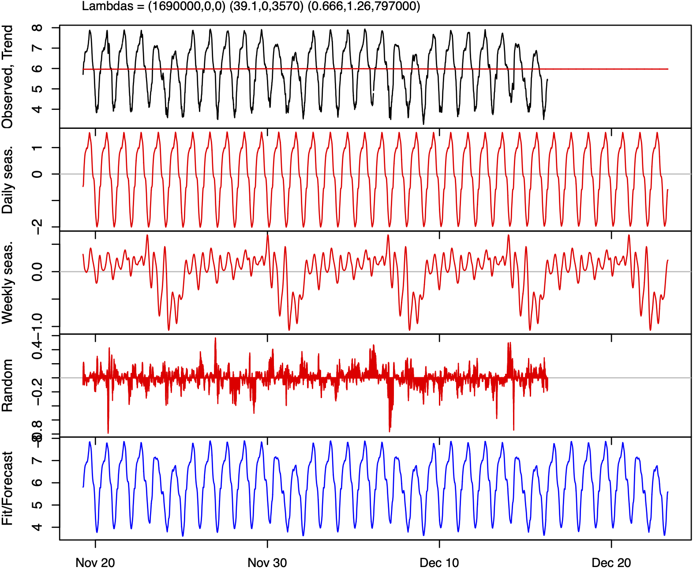
```


```{r fig2dokumentov, echo=FALSE, fig.show = "hold", out.width="49%", fig.cap='Left: forecast (red) and the test data (black); Right: the prediction error over time for the traffic flow data.'}
knitr::include_graphics(c("figures/forecast2_dokumentov.png","figures/MAPE_dokumentov.png"))
``` 


### Call arrival forecasting[^151] {#Call_arrival_forecasting}

Forecasting of inbound call arrivals for call centres supports a number
of key decisions primarily around staffing [@aksin2007modern_DKB]. This
typically involves matching staffing level requirements to service
demand as summarised in Figure
[17](#fig:staffdevon){reference-type="ref"
reference="fig:staffdevon"}. To achieve service level objectives, an
understanding of the call load is required in terms of the call arrivals
[@gans2003telephone_DKB]. As such, forecasting of future call volume or
call arrival rates is an important part of call centre management.

<!--  -->

```{r staffdevon, echo=FALSE, fig.cap="The staffing decision process in call centres."}
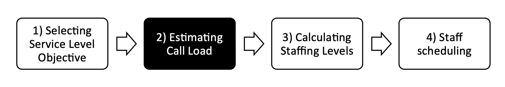
```


There are several properties to call arrival data. Depending on the
level of aggregation and the frequency with which data is collected,
e.g., hourly, call arrival data may exhibit intraday (within-day),
intraweek, and intrayear multiple seasonal patterns
[@avramidis2004modeling_DKB; @brown2005statistical_DKB and
§[2.3.5](#forecasting_for_multiple_seasonal_cycles){reference-type="ref"
reference="forecasting_for_multiple_seasonal_cycles"}]. In addition,
arrival data may also exhibit interday and intraday dependencies, with
different time periods within the same day, or across days within the
same week, showing strong levels of autocorrelation
[@tanir1999call_DKB; @brown2005statistical_DKB; @shen2005analysis_DKB].
Call arrivals may also be heteroscedastic with variance at least
proportional to arrival counts [@taylor2008comparison_DKB], and
overdispersed under a Poisson assumption having variance per time period
typically much larger than its expected value
[@jongbloed2001managing_DKB; @avramidis2004modeling_DKB; @steckley2005performance_DKB].
These properties have implications for various approaches to modelling
and forecasting call arrivals.

The first family of methods are time series methods requiring no
distributional assumptions. Early studies employed auto regressive
moving average (ARMA; see
§[2.3.4](#autoregressive_integrated_moving_average_models){reference-type="ref"
reference="autoregressive_integrated_moving_average_models"}) models
[@andrews1995ll_DKB; @tandberg1995time_DKB; @xu1999long_DKB; @antipov2002forecasting_DKB],
exponential smoothing
[@bianchi1993forecasting_DKB; @bianchi1998improving_DKB see
§[2.3.1](#exponential_smoothing_models){reference-type="ref"
reference="exponential_smoothing_models"}], fast Fourier transforms
[@lewis2003application_DKB], and regression [@tych2002unobserved_DKB see
§[2.3.2](#time_series_regression_models){reference-type="ref"
reference="time_series_regression_models"}]. The first methods
capable of capturing multiple seasonality were evaluated by
[@taylor2008comparison_DKB] and included double seasonal exponential
smoothing [@taylor2003short_BRT] and multiplicative double seasonal ARMA
(SARMA). Since then several advanced time series methods have been
developed and evaluated
[@taylor2010exponentially_DKB; @de2011forecasting_DKB; @taylor2012forecasting_BRT],
including artificial neural networks
[@millan2013forecasting_DKB; @pacheco2009neural_DKB; @li2011research_DKB]
and models for density forecasting [@taylor2012density_DKB].

Another family of models relies on the assumption of a
time-inhomogeneous Poisson process adopting fixed
[@jongbloed2001managing_DKB; @brown2005statistical_DKB; @shen2008forecasting_DKB; @taylor2012density_DKB]
and mixed modelling
[@avramidis2004modeling_DKB; @aldor2009workload_DKB; @ibrahim2013forecasting_DKB]
approaches to account for the overdispersed nature of the data, and in
some cases, interday and intraday dependence.

The works by @weinberg2007bayesian_DKB and @soyer2008modeling_DKB model
call volumes from a Bayesian point of view. Other Bayesian inspired
approaches have been adopted mainly for estimating various model
parameters, but also allowing for intraday updates of forecasts
[@landon2010modeling_DKB; @aktekin2011call_DKB].

A further class of approach addresses the dimensionality challenge
related to high frequency call data using Singular Value Decomposition
(SVD). @shen2005analysis_DKB and @shen2008forecasting_DKB use the same
technique to achieve dimensionality reduction of arrival data, and to
create a forecasting model that provides both interday forecasts of call
volume, and an intraday updating mechanism. Several further studies have
extended the basic SVD approach to realise further modelling
innovations, for example, to forecast call arrival rate profiles and
generate smooth arrival rate curves
[@shen2007forecasting_DKB; @shen2008interday_DKB; @shen2009modeling_DKB].
A more comprehensive coverage of different forecasting approaches for
call arrival rate and volume can be found in a recent review paper by
@ibrahim2016modeling_DKB.

### Elections forecasting[^152] {#Elections_forecasting}

With the exception of weather forecasts, there are few forecasts which
have as much public exposure as election forecasts. They are frequently
published by mass media, with their number and disclosure reaching a
frenzy as the Election Day approaches. This explains the significant
amount of methods, approaches and procedures proposed and the paramount
role these forecasts play in shaping people's confidence in
(soft/social) methods of forecasting.

The problem escalates because, regardless whether the goal of the
election forecast is an attempt to ascertain the winner in two-choice
elections (e.g., a referendum or a Presidential election) or to reach
estimates within the margins of error in Parliamentary systems, the
knowledge of the forecasts influences electors' choices
[@Pavia2019-bx_JMP]. Election forecasts not only affect voters but also
political parties, campaign organizations and (international) investors,
who are also watchful of their evolution.

Scientific approaches to election forecasting include polls, information
(stock) markets and statistical models. They can also be sorted by when
they are performed; and new methods, such as social media surveillance
(see also §[2.9.3](#Text_based_forecasting){reference-type="ref"
reference="Text_based_forecasting"}), are also emerging
[@Huberty2015-ug_JMP; @Ceron2016-gq_JMP]. Probabilistic (representative)
polls are the most commonly used instrument to gauge public opinions.
The progressive higher impact of non-sampling errors [coverage issues,
non-response bias, measurement error: @Biemer2010-ks_JMP] is, however,
severely testing this approach. Despite this, as @Kennedy2017-la_JMP
show in a recent study covering 86 countries and more than 500
elections, polls are still powerful and robust predictors of election
outcomes after adjustments [see also @Jennings2020-yh_JMP]. The
increasing need of post-sampling adjustments of probabilistic samples
has led to a resurgence of interest in non-probabilistic polls
[@Pavia2012-lt_JMP; @Wang2015-xx_JMP; @Elliott2017-ej_JMP], abandoned in
favour of probabilistic sampling in 1936, when Gallup forecasted
Roosevelt's triumph over Landon using a small representative sample
despite Literacy Digest failing to do so with a sample of near 2.5
million responses [@Squire1988-lw_JMP].

A person knows far more than just her/his voting intention
[@Rothschild2009-um_JMP] and when s/he makes a bet, the rationality of
her/his prediction is reinforced because s/he wants to win. Expectation
polls try to exloit the first issue [@Graefe2014-on_JMP], while
prediction markets, as efficient aggregators of information, exploit
both these issues to yield election forecasts (see also
§[2.6.4](#Wisdom_of_crowds){reference-type="ref"
reference="Wisdom_of_crowds"} and
§[2.11.4](#panels_of_experts){reference-type="ref"
reference="panels_of_experts"}). Several studies have proven the
performance of these approaches
[@Wolfers2004-mq_JMP; @Berg2008-um_JMP; @Erikson2012-zb_JMP; @Williams2016-xa_JMP],
even studying their links with opinion polls [@Brown2019-jf_JMP].
Practice has also developed econometric models [@Fair1978-bd_JMP] that
exploit structural information available months before the election
(e.g., the evolution of the economy or the incumbent popularity).
Lewis-Beck has had great success in publishing dozens of papers using
this approach [see, e.g., @Lewis-Beck2005-oa_JMP].

Special mention also goes to Election-Day forecasting strategies, which
have been systematically commissioned since the 1950s
[@Mitofsky1991-np_JMP]. Exit (and entrance) polls
[@Pavia2010-ae_JMP; @Klofstad2012-uz_JMP], quick-counts
[@Pavia-Miralles2008-dt_JMP], and statistical models
[@Moshman1964-bb_JMP; @Bernardo1984-zg_JMP; @Pavia-Miralles2005-pj_JMP]
have been used to anticipate outcomes on Election Day. Some of these
strategies (mainly random quick-counts) can be also employed as auditing
tools to disclose manipulation and fraud in weak democracies
[@Scheuren2008-fw_JMP].

### Sports forecasting[^153] {#Sports_forecasting}

Forecasting is inherent to sport. Strategies employed by participants in
sporting contests rely on forecasts, and the decision by promoters to
promote, and consumers to attend such events are conditioned on
forecasts: predictions of how interesting the event will be. First in
this section, we look at forecast competitions in sport, and following
this we consider the role forecasts play in sporting outcomes.

Forecast competitions are common; see
§[2.12.7](#Forecasting_competitions){reference-type="ref"
reference="Forecasting_competitions"}. Sport provides a range of
forecast competitions, perhaps most notably the competition between
bookmakers and their customers -- betting. A bet is a contingent
contract, a contract whose payout is conditional on specified future
events occurring. Bets occur fundamentally because two agents disagree
about the likelihood of that event occurring, and hence it is a
forecast.

Bookmakers have been extensively analysed as forecasters;
@forrest2005oddssetters_JJR evaluated biases in the forecasts implied by
bookmaker odds over a period where the betting industry became more
competitive, and found that relative to expert forecasts, bookmaker
forecasts improved.

With the internet age, prediction markets have emerged, financial
exchanges where willing participants can buy and sell contingent
contracts. In theory, such decentralised market structures ought to
provide the most efficient prices and hence efficient forecasts
[@nordhaus1987forecasting_JJR]. A range of papers have tested this in
the sporting context
[@Gil2007-ao_JJR; @Croxson2014-hh_JJR; @Angelini2019-kg_JJR], with
conclusions tending towards a lack of efficiency.

judgmental forecasts by experts are commonplace too (see also
§[2.11](#forecasting_with_judgment){reference-type="ref"
reference="forecasting_with_judgment"}); traditionally in
newspapers, but more recently on television and online.
@reade2020strange_JJR evaluate forecasts of scorelines from two such
experts against bookmaker prices, a statistical model, and the forecasts
from users of an online forecasting competition. @singleton2019going_JJR
find that when forecasters in the same competition revise their
forecasts, their forecast performance worsens. This forecasting
competition is also analysed by @butler2020expert_JJR and
@reade2020strange_JJR.

Sport is a spectacle, and its commercial success is conditioned on this
fact. Hundreds of millions of people globally watch events like the
Olympics and the FIFA World Cup -- but such interest is conditioned on
anticipation, a forecast that something interesting will happen. A
superstar is going to be performing, the match will be a close
encounter, or it will matter a lot for a bigger outcome (the
championship, say). These are the central tenets of sport economics back
to @neale1964peculiar_JJR and @rottenberg1956_JJR, most fundamentally
the 'uncertainty of outcome hypothesis'. A multitude of sport attendance
prediction studies investigate this [see, for example,
@hart1975statistical_JJR; @simmons2006new_JJR; @sacheti2014uncertainty_JJR; @coates2010week_JJR; @vanours2021common_JJR],
and @VANREETH2019810 considers this for forecasting TV audiences for the
Tour de France.

Cities and countries bid to host large events like the World Cup based
on forecasts regarding the impact of hosting such events. Forecasts that
are often inflated for political reasons [@baade2016going_JJR]. Equally,
franchise-based sports like many North American sports attract forecasts
regarding the impact of a team locating in a city, usually resulting in
public subsidies for the construction of venues for teams to play at
[@coates1999growth_JJR]. Governments invest in sporting development,
primarily to achieve better performances at global events, most notably
the Olympics [@bernard2004wins_JJR].

Many sporting events themselves rely on forecasts to function; high
jumpers predict what height they will be able to jump over, and free
diving contestants must state the depth they will dive to. Less
formally, teams will set themselves goals: to win matches, to win
competitions, to avoid the 'wooden spoon'. Here, forecast outcomes are
influenced by the teams, and competitors, taking part in competitions
and, as such, are perhaps less commonly thought of as genuine forecasts.
Important works predicting outcomes range from @dixon1997modelling_JRR
in soccer, to @kovalchik2019calibration_JRR for tennis, while the
increasing abundance of data means that machine learning and deep
learning methods are beginning to dominate the landscape. See, for
example, @maymin2019wage_JRR and @hubavcek2019exploiting_JRR for
basketball, and @mulholland2019optimizing_JRR for NFL.

### Forecasting for megaprojects[^154] {#Forecasting_for_megaprojects}

Megaprojects are significant activities characterised by a
multi-organisation structure, which produces highly visible
infrastructure or asset with very crucial social impacts
[@Aaltonen2011-fj_Litsiou]. Megaprojects are complex, require huge
capital investment, several stakeholders are identified and, usually a
vast number of communities and the public are the receivers of the
project's benefits. There is a need megaprojects especially those that
deliver social and economic goods and create economic growth
[@Flyvbjerg2003-wi_Litsiou]. Typical features of megaprojects include
some or all the following: (*i*) delivering a substantial piece of
physical infrastructure with a life expectancy that spans across
decades, (*ii*) main contractor or group of contractors are privately
owned and financed, and (*iii*) the contractor could retain an ownership
stake in the project and the client is often a government or public
sector organisation [@Sanderson2012-mz_Litsiou].

However, megaprojects are heavily laced with extreme human and technical
complexities making their delivery and implementation difficult and
often unsuccessful
[@The_RFE_Working_Group_Report2015-ww_Litsiou; @Merrow1988-ux_Litsiou].
This is largely due to the challenge of managing megaprojects including
extreme complexity, increased risk, tight budget and deadlines, lofty
ideals [@Fiori_Christine_undated-ft_Litsiou]. Due to the possibility and
consequences of megaproject failure [@Misic2015-bk_Litsiou], forecasting
the outcomes of megaprojects is becoming of growing importance. In
particular, it is crucial to identify and assess the risks and
uncertainties as well as other factors that contribute to disappointing
outcomes of megaprojects in order to mitigate them
[@Flyvbjerg2003-wi_Litsiou; @Miller2007-gz_Litsiou].

Literature review in forecasting in megaprojects are scarce. However,
there are a few themes that have emerged in the extant literature as
characteristics of megaprojects that should be skilfully managed to
provide a guideline for the successful planning and construction of
megaprojects
[@Fiori_Christine_undated-ft_Litsiou; @Flyvbjerg2007-vy_Litsiou; @Sanderson2012-mz_Litsiou].
@Turner2012-iy_Litsiou even claim that we cannot even properly define
what success is. They argue that we need to reliable scales in order to
predict multiple perspectives by multiple stakeholders over multiple
time frames --- so definitely a very difficult long term problem. This
could be done via a set of leading performance indicators that will
enable managers of Megaprojects to forecast during project execution how
various stakeholders will perceive success months or even years into the
operation. At the very early stages of a project's lifecycle, a number
of decisions must been taken and are of a great importance for the
performance and successful deliverables/outcomes.
@Flyvbjerg2007-vy_Litsiou stress the importance of the front-end
considerations particularly for Megaprojects Failure to account for
unforeseen events frequently lead to cost overruns.

@Litsiou2019-gy_Litsiou suggest that forecasting the success of
megaprojects is particularly a challenging and critical task due to the
characteristics of such projects. Megaproject stakeholders typically
implement impact assessments and/or cost benefit Analysis tools
[@Litsiou2019-gy_Litsiou]. As @Makridakis2010-pj_Litsiou suggested,
judgmental forecasting is suitable where quantitative data is limited,
and the level of uncertainty is very high; elements that we find in
megaprojects. By comparing the performance of three judgmental methods,
unaided judgment, semi-structured analogies (sSA), and interaction
groups (IG), used by a group of 69 semi-experts, @Litsiou2019-gy_Litsiou
found that, the use of sSA outperforms unaided judgment in forecasting
performance (see also
§[2.11.4](#panels_of_experts){reference-type="ref"
reference="panels_of_experts"}). The difference is amplified further
when pooling of analogies through IG is introduced.

### Competing products[^155] {#Competing_products}

Competition among products or technologies affects prediction due to
local systematic deviations and saturating effects related to policies,
and evolving interactions. The corresponding sales time series must be
jointly modelled including the time varying reciprocal influence.
Following the guidelines in subsection
§[2.3.20](#Synchronic_and_diachronic_competition){reference-type="ref"
reference="Synchronic_and_diachronic_competition"}, some examples
are reported below.

Based on IMS-Health quarterly number of cimetidine and ranitidine
packages sold in Italy, the CRCD model [@guseomortarino:12_RGuseo] was
tested to evaluate a diachronic competition that produced substitution.
Cimetidine is a histamine antagonist that inhibits the production of
stomach acid and was introduced by Smith, Kline & French in 1976.
Ranitidine is an alternative active principle introduced by Glaxo in
1981 and was found to have far-improved tolerability and a
longer-lasting action. The main effect in delayed competition is that
the first compound spread fast but was suddenly outperformed by the new
one principle that modified its stand-alone regime.
@guseomortarino:12_RGuseo give some statistical and forecasting
comparisons with the restricted Krishnan-Bass-Kummar Diachronic model
(KBKD) by @krishnanbasskumar:00_RGuseo. Previous results were improved
with the UCRCD model in @guseomortarino:14_RGuseo by considering a
decomposition of word-of-mouth (WOM) effects in two parts: within-brand
and cross-brand contributions. The new active compound exploited a large
cross-brand WOM and a positive within-brand effect. After the start of
competition, cimetidine experienced a negative WOM effect from its own
adopters and benefited from the increase of the category's market
potential driven by the antagonist. Forecasting is more realistic with
the UCRCD approach and it avoids mistakes in long-term prediction.

Restricted and unrestricted UCRCD models were applied in Germany by
@guidolin2016german_MG to the competition between nuclear power
technologies and renewable energy technologies (wind and solar; see also
§[3.4.5](#Forecasting_renewable_energy_technologies){reference-type="ref"
reference="Forecasting_renewable_energy_technologies"},
§[3.4.6](#Wind_Power_orecasting){reference-type="ref"
reference="Wind_Power_orecasting"} and
§[3.4.8](#Solar_power_forecasting){reference-type="ref"
reference="Solar_power_forecasting"}) in electricity production. Due
to the 'Energiewende' policy started around 2000, the substitution
effect, induced by competition, is confirmed by the electricity
production data provided by BP[^156]. An advance is proposed in
@furlanmz:20_RGuseo with three competitors (nuclear power, wind, and
solar technologies) and exogenous control functions obtaining direct
inferences that provide a deeper analysis and forecasting improvements
in energy transition context.

Previous mentioned intersections between Lotka-Volterra approach and
diffusion of innovations competition models suggested a more modulated
access to the residual carrying capacity. The Lotka-Volterra with churn
model (LVch) by @guidolinguseo:15_RGuseo represents 'churn effects'
preserving within and cross-brand effects in a synchronic context.

An application of LVch model is discussed with reference to the
competition/substitution between compact cassettes and compact discs for
pre-recorded music in the US market. Obtained results of LVch outperform
restricted and unrestricted UCRCD analyses. In this context the residual
market is not perfectly accessible to both competitors and this fact,
combined with WOM components, allows for better interpretation and
forecasting especially in medium and long-term horizons.

A further application of the LVch model, Lotka-Volterra with asymmetric
churn (LVac), is proposed in @guidolinguseo:20_RGuseo. It is based on a
statistical reduction: The late entrant behaves as a standard
@bass:69_RGuseo model that modifies the dynamics and the evolution of
the first entrant in a partially overlapped market. The case study is
offered by a special form of competition where the iPhone produced an
inverse cannibalisation of the iPad. The former suffered a local
negative interaction with some benefits: A long-lasting life cycle and a
larger market size induced by the iPad.

A limitation in models for diachronic competition relates to high number
of rivals, implying complex parametric representations with respect to
the observed information. A second limitation, but also an opportunity,
is the conditional nature of forecasting if the processes partially
depend upon exogenous control functions (new policy regulations, new
radical innovations, regular and promotional prices, etc.). These tools
may be used to simulate the effect of strategic interventions, but a
lack of knowledge of such future policies may affect prediction.

### Forecasting under data integrity attacks[^157] {#Safety_and_security}

Data integrity attacks, where unauthorized parties access protected or
confidential data and inject false information using various attack
templates such as ramping, scaling, random attacks, pulse and
smooth-curve, has become a major concern in data integrity control in
forecasting
[@giani2013smart_PDT; @sridhar2014model_PDT; @yue2017integrated_PDT; @singer2014cybersecurity_PDT].

Several previous studies have given attention in anomaly detection
pre-processing step in forecasting workflow with varying degree of
emphasis. However, according to @yue2017integrated_PDT, the detection of
data integrity attacks is very challenging as such attacks are done by
highly skilled adversaries in a coordinated manner without notable
variations in the historical data patterns [@liang2019poisoning_PDT].
These attacks can cause over-forecasts that demand unnecessary expenses
for the upgrade and maintenance, and can eventually lead to poor
planning and business decisions
[@luo2018benchmarking_PDT; @luo2018robust_PDT; @wu2020data_PDT].

Short-term load forecasting (see
§[3.4.3](#Load_forecasting){reference-type="ref"
reference="Load_forecasting"}) is one major field that are
vulnerable to malicious data integrity attacks as many power industry
functions such as economic dispatch, unit commitment and automatic
generation control heavily depend on accurate load forecasts
[@liang2019poisoning_PDT]. The cyberattack on U.S. power grid in 2018 is
one such major incident related to the topic. According to the study
conducted by @luo2018benchmarking_PDT, the widely used load forecasting
models fail to produce reliable load forecast in the presence of such
large malicious data integrity attacks. A submission to the Global
Energy Forecasting Competition 2014 (GEFCom2014) incorporated an anomaly
detection pre-processing step with a fixed anomalous threshold to their
load forecasting framework [@xie2016gefcom2014_PDT]. The method was
later improved by @luo2018real_PDT by replacing the fixed threshold with
a data driven anomalous threshold. @sridhar2014model_PDT also proposed a
general framework to detect scaling and ramp attacks in power systems.
@akouemo2016probabilistic_PDT investigated the impact towards the gas
load forecasting using hybrid approach based on Bayesian maximum
likelihood classifier and a forecasting model. In contrast to the
previous model based attempts, @yue2019descriptive_PDT proposed a
descriptive analytic-based approach to detect cyberattacks including
long anomalous sub-sequences (see
§[2.2.3](#Anomaly_detection_and_time_series_forecasting){reference-type="ref"
reference="Anomaly_detection_and_time_series_forecasting"}), that
are difficult to detect by the conventional anomaly detection methods.

The problem of data integrity attacks is not limited to load
forecasting. Forecasting fields such as elections forecasting (see
§[3.8.5](#Elections_forecasting){reference-type="ref"
reference="Elections_forecasting"}), retail forecasting (see
§[3.2.4](#Retail_sales_forecasting){reference-type="ref"
reference="Retail_sales_forecasting"}), airline flight demand
forecasting (see
§[3.8.2](#Forecasting_for_airports){reference-type="ref"
reference="Forecasting_for_airports"}) and stock price forecasting
§[3.3.13](#Forecasting_stock_returns){reference-type="ref"
reference="Forecasting_stock_returns"}) are also vulnerable to data
integrity attacks [@SEAMAN2018822; @luo2018benchmarking_PDT]. For
instant, @wu2020data_PDT explored the vulnerability of traffic modelling
and forecasting in the presence of data integrity attacks with the aim
of providing useful guidance for constrained network resource planning
and scheduling.

However, despite of the increasing attention toward the topic,
advancements in cyberattacks on critical infrastructure raise further
data challenges. Fooling existing anomaly detection algorithms via novel
cyberattack templates is one such major concern. In response to the
above concern, @liang2019poisoning_PDT proposed a data poisoning
algorithm that can fool existing load forecasting approaches with
anomaly detection component while demanding further investigation into
advanced anomaly detection methods. Further, adversaries can also
manipulate other related input data without damaging the target data
series. Therefore, further research similar to
[@sobhani2020temperature_PDT] are required to handle such data
challenges.

### The forecastability of agricultural time series[^158] {#The_Forecastability_of_agricultural_time_series}

The forecasting of agricultural time series falls under the broader
group of forecasting commodities, of which agricultural and related
products are a critical subset. While there has been considerable work
in the econometrics and forecasting literature on common factor models
in general there is surprisingly little work so far on the application
of such models for commodities and agricultural time series -- and this
is so given that there is considerable literature in the linkage between
energy and commodities, including agricultural products, their prices
and futures prices, their returns and volatilities. Furthermore, a
significant number of papers is fairly recent which indicates that there
are many open avenues of future research on these topics, and in
particular for applied forecasting. The literature on the latter
connection can consider many different aspects in modelling as we
illustrate below. We can identify two literature strands, a much larger
one on the various connections of energy with commodities and the
agricultural sector (and in this strand we include forecasting
agricultural series) and a smaller one that explores the issue of common
factors.

An early reference of the impact of energy on the agricultural sector is
@Tewari1990-wz_DT and then after a decade we find @Gohin2010-wy_DT on
the long-run impact of energy prices on global agricultural markets.
@Byrne2013-me_DT is an early reference for co-movement of commodity
prices followed by @Daskalaki2014-az_DT on common factors of commodity
future returns and then a very recent paper from @Alquist2020-mb_DT who
link global economic activity with commodity price co-movement. The
impact of energy shocks on US agricultural productivity was investigated
by @Wang2014-yw_DT while @Koirala2015-ke_DT explore the non-linear
correlations of energy and agricultural prices with @Albulescu2020-zq_DT
exploring the latter issue further, the last two papers using copulas.
@Xiong2015-of_DT is an early reference of forecasting agricultural
commodity prices while @Kyriazi2019-md_DT, @Wang2019-mm_DT, and
@Li2020-el_DT consider three novel and completely different approaches
on forecasting agricultural prices and agricultural futures returns.
@Lopez_Cabrera2016-kj_DT explore volatility linkages between energy and
agricultural commodity prices and then @Tian2017-ck_DT start a
mini-stream on volatility forecasting on agricultural series followed
among others by the work of @Luo2019-jh_DT and of
@Degiannakis2020-ya_DT. @Nicola2016-tu_DT examine the co-movement of
energy and agricultural returns while @Kagraoka2016-je_DT and
@Lubbers2016-gx_DT examine common factors in commodity prices.
@Wei_Su2019-gv_DT and @Pal2019-rt_DT both investigate the linkages of
crude oil and agricultural prices. Finally, @Tiwari2020-ru_DT examine
the time-frequency causality between various commodities, including
agricultural and metals.

There is clearly room for a number of applications in the context of
this recent research, such along the lines of further identifying and
then using common factors in constructing forecasting models, exploring
the impact of the COVID-19 crisis in agricultural production or that of
climate changes on agricultural prices.

### Forecasting in the food and beverage industry[^159] {#Forecasting_food_beverage}

Reducing the ecological impact and waste, and increasing the efficiency
of the food and beverage industry are currently major worldwide issues.
To this direction, efficient and sustainable management of perishable
food and the control of the beverage quality is of paramount importance.
A particular focus on this topic is placed on supply chain forecasting
(see §[3.2.2](#Forecasting_in_the_supply_chain){reference-type="ref"
reference="Forecasting_in_the_supply_chain"}), with advanced
monitoring technologies able to track the events impacting and affecting
the food and beverage processes [@elsevier2019reducing_DA]. Such
technologies are typically deployed inside manufacturing plants,
yielding to Industry 4.0 solutions [@ieee2018industry4] that are
enabled by state-of-the-art forecasting applications in smart factories.
The transition from plain agriculture techniques to smart solutions for
food processing is a trend that fosters emerging forecasting data-driven
solutions in many parts of the world, with special attention to the
sustainability aspects [@malaysia2012sustainable_DA].

Various forecasting approaches have been successfully applied in the
context of the food and beverage industry, from Monte Carlo simulations
based on a shelf-life model [@elsevier2019reducing_DA], to association
rule mining (see
§[2.9.2](#Association_rule_mining){reference-type="ref"
reference="Association_rule_mining"}) applied to sensor-based
equipment monitoring measurements [@ap2020correlating_DA],
multi-objective mathematical models for perishable supply chain
configurations, forecasting costs, delivery time, and emissions
[@mdpi2021multi_DA], and intelligent agent technologies for network
optimisation in the food and beverage logistics management
[@elsevier2005foodBeverage_DA].

We now focus on the case of forecasting the quality of beverages, and
particularly coffee. Espresso coffee is among the most popular
beverages, and its quality is one of the most discussed and investigated
issues. Besides human-expert panels, electronic noses, and chemical
techniques, forecasting the quality of espresso by means of data-driven
approaches, such as association rule mining, is an emerging research
topic
[@ap2020correlating_DA; @sustain2021coffee_DA; @ap2020timeseries_DA].

The forecasting model of the espresso quality is built from a real-world
dataset of espresso brewing by professional coffee-making machines.
Coffee ground size, coffee ground amount, and water pressure have been
selected among the most influential external variables. The ground-truth
quality evaluation has been performed for each shot of coffee based on
three well-known quality variables selected by domain experts and
measured by specific sensors: the extraction time, the average flow
rate, and the espresso volume. An exhaustive set of more than a thousand
coffees has been produced to train a model able to forecast the effect
of non-optimal values on the espresso quality.

For each variable considered, different categorical values are
considered: ground size can be coarse, optimal, or fine; ground amount
can be high, optimal, or low; brewing water pressure can be high,
optimal, or low. The experimental setting of categorical variables
enables the application of association rule mining (see
§[2.9.2](#Association_rule_mining){reference-type="ref"
reference="Association_rule_mining"}), a powerful data-driven
exhaustive and explainable approach [@han2011data_DA; @KumarDMBook_DA],
successfully exploited in different application contexts
[@acquaviva2015enhancing_DA; @di2018metatech_DA].

Several interesting findings emerged. If the water pressure is low, the
amount of coffee ground is too high, and the grinding is fine, then we
can forecast with confidence a low-quality coffee due to excessive
percolation time. If the amount of coffee ground is low, the ground is
coarse, and the pressure is high, then we can forecast a low-quality
coffee due to excessive flow rate. Furthermore, the coarseness of coffee
ground generates an excessive flow rate forecast, despite the optimal
values of dosage and pressure, with very high confidence.

### Dealing with logistic forecasts in practice[^160] {#Dealing_with_logistic_forecasts_in_practice}

The forecaster faces three major difficulties when using the logistic
equation (S curve); see also
§[2.3.19](#The_natural_law){reference-type="ref"
reference="The_natural_law of growth_in_competition_Logistic_growth"}.
A first dilemma is whether he or she should fit an S curve to the
cumulative number or to the number per unit of time. Here the forecaster
must exercise wise judgment. What is the "species" and what is the niche
that is being filled? To the frustration of business people there is no
universal answer. When forecasting the sales of a new product it is
often clear that one should fit the cumulative sales because the
product's market niche is expected to eventually fill up. But if we are
dealing with something that is going to stay with us for a long time
(for example, the Internet or a smoking habit), then one should not fit
cumulative numbers. At times this distinction may not be so obvious. For
example, when COVID-19 first appeared many people (often amateurs) began
fitting S curves to the cumulative number of infections (for other
attempts on forecasting COVID-19, see
§[3.6.2](#Pandemics){reference-type="ref"
reference="Pandemics"}). Some of them were rewarded because indeed
the diffusion of the virus in some countries behaved accordingly
[@Debecker1994-zf]. But many were frustrated and tried to "fix" the
logistic equation by introducing more parameters, or simply gave up on
trying to use logistics with COVID 19. And yet, many cases (e.g., the
US) can be illuminated by logistic fits but on the daily number of
infections, not on the cumulative number. As of August 1, 2020, leaving
out the three eastern states that had gotten things under control, the
rest of the US displayed two classic S curve steps followed by plateaus
(see Figure [18](#fig:modispractice){reference-type="ref"
reference="fig:modis_practice"}). The two plateaus reflect the number of
infections that American society was willing to tolerate at the time, as
the price to pay for not applying measures to restrict the virus
diffusion.

<!--  -->

```{r modispractice, echo=FALSE, fig.cap="Two logistic-growth steps during the early diffusion of COVID-19 in America (March to July, 2020)."}
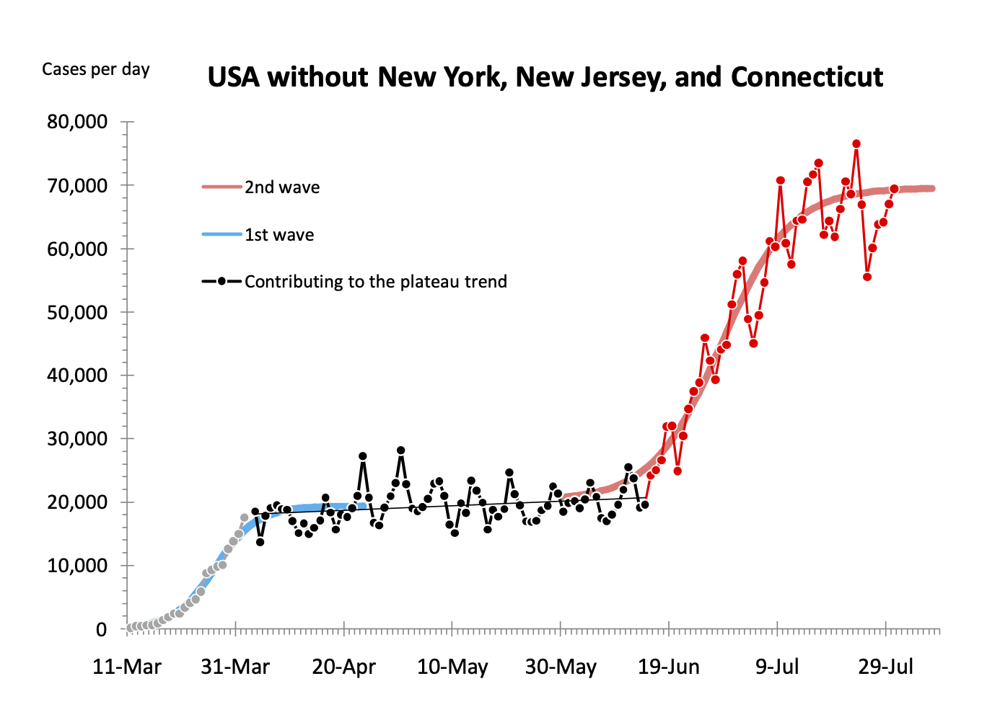
```

The second difficulty in using the logistic equation has to do with its
ability to predict from relatively early measurements the final ceiling.
The crucial question is how early can the final ceiling be determined
and with what accuracy. Some people claim that before the midpoint no
determination of a final level is trustworthy [@Marinakis2021wp].
Forecasters usually abstain from assigning quantitative uncertainties on
the parameters of their S curve forecasts mostly because there is no
theory behind it. However, there is a unique study by @Debecker2020wp
that quantifies the uncertainties on the parameters determined by
logistic fits. The study was based on 35,000 S curve fits on simulated
data, smeared by random noise and covering a variety of conditions. The
fits were carried out via a $\chi^2$ minimisation technique. The study
produced lookup tables and graphs for determining the uncertainties
expected on the three parameters of the logistic equation as a function
of the range of the S curve populated by data, the error per data point,
and the confidence level required.

The third difficulty using the logistic equation comes from the fact
that no matter what fitting program one uses, the fitted S curve will
flatten toward a ceiling *as early and as low* as it is allowed by the
constraints of the procedure. As a consequence fitting programs may
yield logistic fits that are often biased toward a low ceiling. Bigger
errors on the data points accentuate this bias by permitting larger
margins for the determination of the S curve parameters. To compensate
for this bias the user must explore several fits with different weights
on the data points during the calculation of the $\chi^2$. He or she
should then favour the answer that gives the highest ceiling for the S
curve (most often obtained by weighting more heavily the recent
historical data points). Of course, this must be done with good
justification; here again the forecaster must exercise wise judgment.

The future of forecasting practice[^161] {#The_practice_of_forecasting_the_future}
----------------------------------------

>Plus ça change, plus c'est la même chose.
<br>
Jean-Baptiste Karr (1849)


It would be a more straightforward task to make predictions about the
future of forecasting practice if we had a better grasp of the present
state of forecasting practice. For that matter, we lack even a common
definition of forecasting practice. In a recent article,
@Makridakis2020foresight lamented the failure of truly notable advances
in forecasting methodologies, systems, and processes during the past
decades to convince many businesses to adopt systematic forecasting
procedures, leaving a wide swath of commerce under the guidance of ad
hoc judgment and intuition. At the other extreme, we see companies with
implementations that combine state-of-the-art methodology with
sophisticated accommodations of computing time and costs, as well as
consideration of the requirements and capabilities of a diverse group of
stakeholders [@Yelland2019-mx-foresight]. So, it is not hyperbole to
state that business forecasting practices are all over the place. What
surely is hyperbole, however, are the ubiquitous claims of software
providers about their products accurately forecasting sales, reducing
costs, integrating functions, and elevating the bottom line
[@Makridakis2020foresight; @Sorensen2020-pq-foresight]. For this
section, we grilled a dozen practitioners and thought leaders ("the
Group") about developments playing out in the next decade of forecasting
practice, and have categorised their responses:

-   Nature of forecasting challenges;

-   Changes in the forecasting toolbox;

-   Evolution in forecasting processes such as integration of planning
    functions;

-   Expectations of forecasters; and

-   Scepticism about real change.

*Forecasting Challenges*: Focusing on operations, the Group sees demand
forecasting becoming ever more difficult due to product/channel
proliferation, shorter lead times, shorter product histories, and spikes
in major disruptions.

-   Operational forecasts will have shorter forecast horizons to
    increase strategic agility required by business to compete, sustain,
    and survive.

-   New models will need to incorporate supply-chain disruption. Demand
    chains will need to be restarted, shortening historical data sets
    and making traditional models less viable due to limited history.

-   Lead times will decrease as companies see the problems in having
    distant suppliers. Longer lead times make accurate forecasting more
    difficult.

*Forecasting Tool Box*: Unsurprisingly, this category received most of
the Group's attention. All predict greater reliance on AI/ML for
automating supply-and-demand planning tasks and for reconciling
discrepancies in hierarchical forecasting. Longer-horizon causal
forecasting models will be facilitated by big data, social media, and
algorithmic improvements by quantum computing. Post-COVID, we will see a
greater focus on risk management/mitigation. The Cloud will end the era
of desktop solutions.

-   Quantum computers will improve algorithms used in areas like
    financial forecasting (e.g., Monte Carlo simulations), and will
    change our thinking about forecasting and uncertainty.

-   Although social media is a tool for "what's trending now", new
    models will be developed to use social-media data to predict
    longer-term behaviour. Step aside Brown (exponential smoothing) and
    Bass (diffusion).

-   Greater automation of routine tasks (data loading, scrubbing,
    forecast generation and tuning, etc.) through AI/ML-powered
    workflow, configurable limits, and active alerts. More black box
    under the hood, but more clarity on the dashboard.

-   Greater focus on risk management/mitigation through what-if
    scenarios, simulations, and probabilistic forecasting.

*Forecasting Processes and Functional Integration*: Systems will become
more integrated, promoting greater collaboration across functional areas
and coordination between forecast teams and those who rely upon them.
Achieving supply-chain resilience will become as important as production
efficiency, and new technology such as Alert and Root Cause Analysis
systems will mitigate disruptions.

-   S&OP will expand from its home in operations to more fully integrate
    with other functions such as finance and performance management,
    especially in larger multinationals.

-   The pandemic has forced firms to consider upping supply-chain
    resilience. Firms are building in capacity, inventory, redundancy
    into operations---somewhat antithetical to the efficiency plays that
    forecasting brings to the table.

-   Forecasting will be more closely tied to Alert and Root Cause
    Analysis systems, which identify breakdowns in processes/systems
    contributing to adverse events, and prevent their recurrence.

*Expectations of Forecasters*: Agreement was universal that the
forecaster's job description will broaden and become more demanding, but
that technology will allow some redirection of effort from producing
forecasts to communicating forecasting insights.

-   The interest around disease models increases our awareness of the
    strengths and weaknesses of mathematical models. Forecasters may
    need to become more measured in their claims, or do more to resist
    their models being exploited.

-   We will see a transformation from demand planner to demand analyst,
    requiring additional skill sets including advanced decision making,
    data and risk analysis, communication, and negotiation.

-   Professional forecasters will be rare except in companies where this
    expertise is valued. Fewer students are now educated or interested
    in statistical modelling, and time is not generally available for
    training.

-   Forecasters will learn the same lesson as optimisation folks in the
    1990s and 2000s: the importance of understanding the application
    area---community intelligence.

*Scepticism*: Many were sceptical about the current enthusiasm for AI/ML
methods; disappointed about the slow adoption of promising new methods
into software systems and, in turn, by companies that use these systems;
and pessimistic about the respect given to and influence of forecasters
in the company's decision making.

-   While AI/ML are important additions to the forecaster's toolbox,
    they will not automatically solve forecasting issues. Problems
    include data hunger, capacity brittleness, dubious input data,
    fickle trust by users [@Kolassa2020-he-foresight], and model bias.

-   Practices in the next decade will look very similar to the present.
    Not that much has changed in the last decade, and academic
    developments are slow to be translated into practice.

-   Politics, gaming, and the low priority given to forecasting are the
    prime drivers of practice, thus limiting interest in adopting new
    methodologies.

-   None of the topical items (AI/ML, big data, demand sensing, new
    forecasting applications) will have much of an impact on forecasting
    practice. Forecasting departments hop from one trend to the other
    without making much progress towards better forecasting accuracy.

-   Software companies will struggle, despite good offerings. Most
    companies do not want to invest in excellent forecasting engines;
    whatever came with their ERP system is "good enough".

-   Forecasting will continue to suffer from neglect by higher levels of
    management, particularly when forecasts are inconveniently contrary
    to the messages management hopes to convey.

Note finally that the COVID-19 pandemic has elevated practitioner
concerns about disruptions to normal patterns as well as the fear of an
increasingly volatile environment in which forecasts must be made. There
are indications that companies will place more stress on judgmental
scenarios, likely in conjunction with statistical/ML methods.