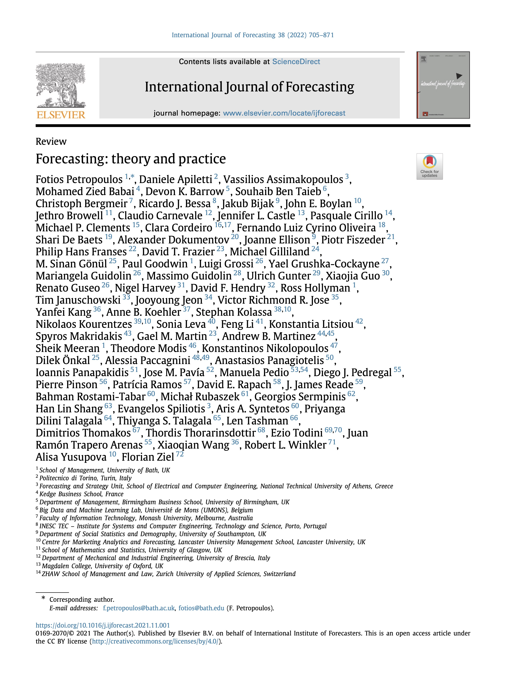

# Foreword {#Foreword .unnumbered}

<!-- 
 -->
<!--    -->
<!-- 
 -->

Welcome to our online version of the review paper [ "Forecasting: theory and practice"](https://doi.org/10.1016/j.ijforecast.2021.11.001), which was last updated on `r format(Sys.time(), "%e %B %Y")`.

This review paper was written by 80 academics and practitioners across 22 countries and offers an encyclopedic overview of the current state of the forecasting field. This paper was originally published at the International Journal of Forecasting and is available under a Creative Commons license. 

This is a live project and, where appropriate, we aim to update and enhance existing entries but also add new entries. If you would like to contribute, either by adding a new entry or by updating an existing entry, please contact [Fotios Petropoulos](mailto:fotios@bath.edu). 

 
 
[Fotios Petropoulos](http://fpetropoulos.eu/) - Editor  
[Yanfei Kang](https://yanfei.site/) - Managing Editor  
[Feng Li](https://feng.li/) - Deputy Managing Editor  
 
`r format(Sys.time(), "%B %Y")`

***

To cite the online version of the review paper, please use the following:

> Fotios Petropoulos, Daniele Apiletti, Vassilios Assimakopoulos, Mohamed Zied Babai, Devon K. Barrow, Souhaib Ben Taieb, Christoph Bergmeir, Ricardo J. Bessa, Jakub Bijak, John E. Boylan, Jethro Browell, Claudio Carnevale, Jennifer L. Castle, Pasquale Cirillo, Michael P. Clements, Clara Cordeiro, Fernando Luiz Cyrino Oliveira, Shari De Baets, Alexander Dokumentov, Joanne Ellison, Piotr Fiszeder, Philip Hans Franses, David T. Frazier, Michael Gilliland, M. Sinan Gönül, Paul Goodwin, Luigi Grossi, Yael Grushka-Cockayne, Mariangela Guidolin, Massimo Guidolin, Ulrich Gunter, Xiaojia Guo, Renato Guseo, Nigel Harvey, David F. Hendry, Ross Hollyman, Tim Januschowski, Jooyoung Jeon, Victor Richmond R. Jose, Yanfei Kang, Anne B. Koehler, Stephan Kolassa, Nikolaos Kourentzes, Sonia Leva, Feng Li, Konstantia Litsiou, Spyros Makridakis, Gael M. Martin, Andrew B. Martinez, Sheik Meeran, Theodore Modis, Konstantinos Nikolopoulos, Dilek Önkal, Alessia Paccagnini, Anastasios Panagiotelis, Ioannis Panapakidis, Jose M.Pavía, Manuela Pedio, Diego J. Pedregal, Pierre Pinson, Patrícia Ramos, David E. Rapach, J. James Reade, Bahman Rostami-Tabar, Michał Rubaszek, Georgios Sermpinis, Han Lin Shang, Evangelos Spiliotis, Aris A. Syntetos, Priyanga Dilini Talagala, Thiyanga S. Talagala, Len Tashman, Dimitrios Thomakos, Thordis Thorarinsdottir, Ezio Todini, Juan Ramón Trapero Arenas, Xiaoqian Wang, Robert L. Winkler, Alisa Yusupova, Florian Ziel (2022), Forecasting: theory and practice, *International Journal of Forecasting*, 38(3): 705-871.

***

# Abstract {#Abstract .unnumbered}

> In theory, there is no difference between theory and practice. But, in
practice, there is.
 Benjamin Brewster (1882)

Forecasting has always been at the forefront of decision making and planning. The uncertainty that surrounds the future is both exciting and challenging, with individuals and organisations seeking to minimise risks and maximise utilities. The large number of forecasting applications calls for a diverse set of forecasting methods to tackle real-life challenges. This article provides a non-systematic review of the theory and the practice of forecasting. We provide an overview of a wide range of theoretical, state-of-the-art models, methods, principles, and approaches to prepare, produce, organise, and evaluate forecasts. We then demonstrate how such theoretical concepts are applied in a variety of real-life contexts.

We do not claim that this review is an exhaustive list of methods and applications. However, we wish that our encyclopedic presentation will offer a point of reference for the rich work that has been undertaken over the last decades, with some key insights for the future of forecasting theory and practice. Given its encyclopedic nature, the intended mode of reading is non-linear. We offer cross-references to allow the readers to navigate through the various topics. We complement the theoretical concepts and applications covered by large lists of free or open-source software implementations and publicly-available databases.

